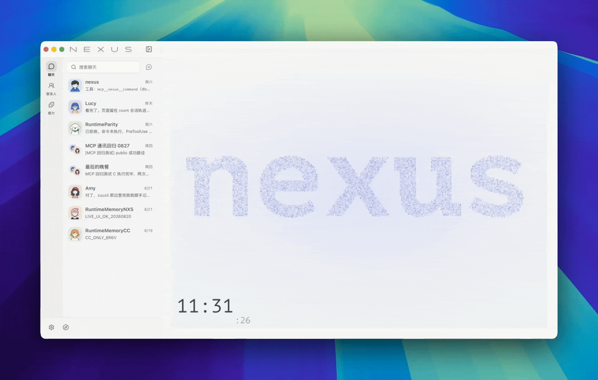

<div align="center">

# Nexus

[](https://go.dev/)
[](https://nodejs.org/)
[](https://www.apache.org/licenses/LICENSE-2.0)

<p align="center">
  <a href="./README_zh.md">中文</a> | <strong>English</strong>
</p>

</div>

---

<div align="center">

</div>

---

## Overview

Nexus is a multi-agent collaboration platform for enterprises, research teams, and developers. Agents can be named independently, own their own workspaces, and keep runtime-managed, file-based memory, so task context and knowledge can continue across sessions. Rooms can organize multiple agents to discuss, divide work, and synthesize results around complex tasks, while DMs support focused work with a single agent.

Compared with traditional single-agent AI office tools, Nexus provides:

- Multi-agent collaboration: multiple agents can participate in the same task and produce results together
- Persistent memory and knowledge accumulation: the bundled `nxs` runtime maintains a `MEMORY.md` index and topic files under `memory/` in each Agent workspace
- Proactive execution: Echo follow-ups, scheduled tasks, and environment awareness help agents move work forward
- Flexible extensibility: bundled Skills read, create, edit, render, and verify Word, PDF, PowerPoint, and Excel files, while Connectors integrate Feishu Docs, DingTalk AI Tables, Tencent Docs, Yuque, and custom MCP services

Nexus brings agent management, task collaboration, and external service connections into one unified platform for a modern AI collaboration ecosystem.

---

## Architecture

<div align="center">

</div>

<p align="center">
  <a href="./docs/nexus-architecture-blueprint.md">Architecture guide</a> ·
  <a href="./docs/README.md">Documentation index</a>
</p>

---

## Features

| **Category** | **Capabilities** | **Benefit** |
|--------------|------------------|-------------|
| **Agent Management** | Independent identity, workspace, skill configuration, and runtime-managed file memory | Continuous workflows with less repeated context |
| **Room Collaboration** | Multi-agent collaboration with @mentions, targeted replies, and multi-threaded progress | Clear division of work for team-style collaboration |
| **Proactive Execution** | Echo follow-ups, scheduled tasks, and environment awareness | Agents can move work forward instead of only responding |
| **Skills & Connectors** | Skill extensions and Connector integrations with external services | Extensible business logic and integration with existing systems |
| **Deployment Flexibility** | Web UI, Docker/source server deployment, and native macOS/Windows desktop apps | Fits multiple platforms and deployment scenarios |

---

## Quick Start

### Choose an Agent runtime backend

Nexus supports two Agent runtime backends: `nxs` and `claude`. Official Nexus
releases bundle `nxs` as the default closed-source runtime executable; its Go
implementation is not part of this repository. The product treats it as a
replaceable subprocess behind the open-source Agent SDK Bridge contract.

`nxs` supports Anthropic Messages, OpenAI Chat Completions, and OpenAI
Responses. Responses Providers are available only to `nxs`; see the
[OpenAI Responses runtime guide](./docs/specs/openai-responses-runtime-spec.md)
for the public integration boundary.

The `claude` backend runs agents through Claude Code. Install Claude Code
separately, select the `claude` runtime, and make sure the executable is
available on the backend machine.

```bash
# macOS / Linux / WSL
curl -fsSL https://claude.ai/install.sh | bash

# Alternative npm install
npm install -g @anthropic-ai/claude-code
```

On Windows PowerShell:

```powershell
irm https://claude.ai/install.ps1 | iex
```

Or install with WinGet:

```powershell
winget install Anthropic.ClaudeCode
```

### Desktop Apps

- macOS Apple Silicon: `Nexus-macos-arm64-<version>-<build>.dmg`
- macOS Intel: `Nexus-macos-intel-<version>-<build>.dmg`
- Windows: `NexusSetup-<version>-<build>.exe`

Verify the matching `.sha256` file before installing. Desktop app data is stored under `~/.nexus`.

### Server Deployment

#### Docker Deployment

Docker Compose is recommended for server deployment:

```bash
cat > .env <<'EOF'
AUTH_INIT_OWNER_PASSWORD=your-password
CONTROL_SERVICE_TOKEN=replace-with-openssl-rand-hex-32
HTTP_PORT=80
HOST_DATA_DIR=./data
# Optional: source deployments must set this manually; Docker generates and persists one when empty.
CONNECTOR_CREDENTIALS_KEY=
# Optional: allow authenticated users to add these private Skill registry hosts.
SKILLS_PRIVATE_SOURCE_ALLOWED_HOSTS=skills.example.com
# Optional: server-side outbound proxy for backend IM/OAuth HTTP and WebSocket requests.
HTTPS_PROXY=
NO_PROXY=localhost,127.0.0.1,::1,control,nexus,nginx
EOF

make start
```

Keep the `nexus` and `nexus-control` repositories in the same parent directory, then open `http://localhost`. The same Nexus Web app owns login and member administration; it sends those same-origin requests to Control. Control uses SQLite by default and supports PostgreSQL through `CONTROL_DATABASE_DRIVER=postgres` plus `CONTROL_DATABASE_URL`. To create the first owner interactively, leave `AUTH_INIT_OWNER_PASSWORD` empty, set a 32+ character `CONTROL_SETUP_TOKEN`, and open `/setup`. The default compose stack only exposes HTTP; terminate production TLS at an outer gateway or load balancer and forward to this HTTP entrypoint. Existing Web users must complete the [Control migration](./docs/operations/control-migration.md) before switching.

Configure IM channel credentials in the web app under Capability / Channels. The container reloads saved channel configs from the database on startup; `DISCORD_BOT_TOKEN` and `TELEGRAM_BOT_TOKEN` in `.env` are only legacy system-level fallbacks.

When reusing a local host proxy for Docker, `127.0.0.1` / `localhost` proxy hosts are rewritten to `host.docker.internal` by default. Use `NEXUS_DOCKER_HTTPS_PROXY`, `NEXUS_DOCKER_HTTP_PROXY`, or `NEXUS_DOCKER_DATABASE_URL` when the container needs values that differ from the desktop app `.env`.

For non-Docker deployments, generate the connector credentials encryption key yourself:

```bash
openssl rand -base64 32
```

#### Source Deployment

```bash
make install
cd web && pnpm build && cd ..
AUTH_INIT_OWNER_PASSWORD=your-password make run-control
# In another terminal, after Control is healthy:
make run-backend
```

### Local Development

```bash
make install
make dev
```

`make dev` starts the sibling `nexus-control`, backend, and frontend. The backend starts at `http://localhost:8010`, Control at `http://localhost:8020`, and the frontend dev server at `http://localhost:3000`.

---

## nxs Runtime Settings and Memory Maintenance

Nexus projects each Agent's non-secret runtime defaults into `<workspace>/.nexus/settings.json`. Provider credentials remain in Nexus and are injected only when the runtime subprocess starts; they are never persisted in the Agent workspace.

AutoDream is not a user automation. Nexus owns the clock, process lifecycle, concurrency, retries, and provider resolution; the bridge carries a cancellable `TryAutoDream` control request; nxs remains the final owner of settings, eligibility checks, cross-process locking, model execution, and memory writes. The control result exposes written paths, while ordinary background writes return as durable `system/memory_saved` events on the next main query. Agent settings enable Summary, AutoMemory, and AutoDream by default; all three reuse the active Agent provider with its configured background model.

---

## Core Concepts

| Concept | Description |
|---------|-------------|
| **Agent** | A workspace member with identity, workspace, skills, and runtime-managed memory files |
| **Room** | A collaboration space where agents and humans work in a shared context |
| **DM** | A persistent conversation with a single agent, preserving full runtime state |
| **Goal** | A durable objective that can continue across rounds without requiring a WorkGraph |
| **WorkGraph** | A managed, persisted responsibility graph built from an Execution and a materialized Plan |
| **Runtime Graph** | Internal evidence of Agent, Subagent, Tool, Gate, and retry activity; it is not itself a WorkGraph |
| **Workspace** | An isolated file directory where each agent stores its work output |
| **Skill** | A capability extension installed on an agent — built-in or custom |
| **Connector** | Manages OAuth app configurations and external service account connections |
| **Main Agent** | A reserved system agent responsible for default entry and platform-level orchestration |

Goal-only work, Goal-free WorkGraphs, and Goal-bound WorkGraphs are distinct modes. A Goal is not proof that a managed graph exists, and ordinary runtime activity is not promoted to the WorkGraph canvas. See the current [Execution orchestration specification](./docs/specs/execution-orchestration-spec.md) and [Execution graph projection specification](./docs/specs/execution-graph-spec.md).

---

## License

Apache License 2.0 · [LICENSE](./LICENSE)
