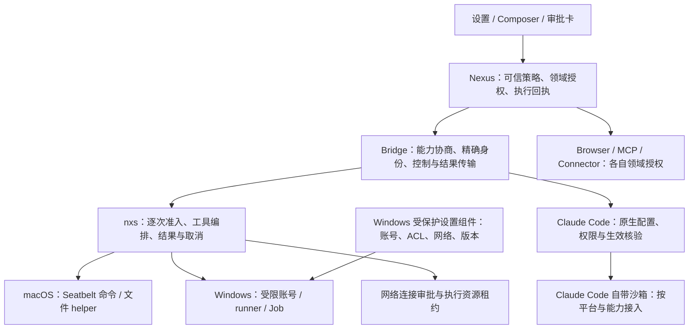

# 桌面沙箱完整改造与开发计划

状态：**non-normative / 待分阶段实现与验收，2026-09-28**。
本文件是剩余工作的唯一开发计划与状态入口；不是当前协议。已经实现的行为只写入 [当前规范](../../specs/desktop-sandbox-spec.md)。
背景与证据见 [现状评估](current-assessment-2026-09-15.md)，逐项测试见 [验收矩阵](../../testing/desktop-sandbox-acceptance.md)。

当前开发位置（2026-09-28）：三个独立 worktree 位于 Windows 本机 `E:\Code\nexus\worktrees\desktop-sandbox\` 下的 `nexus`、`nexus-agent-sdk-go`、`nexus-agent-sdk-bridge`，都使用本地与 origin 的 `codex/desktop-sandbox-approvals`。用户已要求 Windows 全面检查、补全并阶段性本地提交和推送；历史“仅本地”限制不适用于本轮。原 macOS checkout 和归档草稿保持历史用途，Nexus main 未参与本轮修改。

当前 Windows 固定基线：SDK `2148b4b1833b2324a4f41f6e42235aa9a73424e5`，Bridge
`c018b4973dc3`（Go 模块 `v0.1.34-0.20260927154842-c018b4973dc3`）。Windows 11 amd64
本机已通过 53 个指定原生检查和 Windows amd64/arm64 构建。SDK 修复普通 settings
写入与进程崩溃恢复；Bridge 挂起创建后绑定 Job 再恢复，修复入口立即派生的清理窗口，
预检取消和输出管道等待有界。原生 junction 拒绝及宿主崩溃/unknown 对账也有实测。
详见[本机证据](../../testing/evidence/desktop-sandbox/2026-09-28-windows-native/README.md)。
P3 兼容与控制隔离的完整组合矩阵仍在进行；P4 原生执行/文件/网络后端未完成。
原生 Windows `PrepareExecution` 及文件能力继续 fail closed，`releaseAccepted=false`。

2026-09-28 本机 P3 已跑固定十项 LogonW 比较：reference 为 9 通过/1 越界写入失败，
capability-only 为 8 通过/2 兼容失败，capability＋logon 为 9 通过/1 CLR 失败。定向
跟踪定位到 CLR 自建全局 IPC section 的显式 DACL。结果、证据边界及下一轮唯一假设
见 [Windows P3 本机决策](windows-p3-native-decision.md)；没有一组已获完整验收。

此前 macOS 已验证的运行时代码基线为 SDK `9956def130da33af47accf799a9c27c16a551104`、Bridge
`37434c2d38b129b6bbde67ac81afee673f39816d`，Nexus 使用精确模块
`v0.1.34-0.20260921030131-37434c2d38b1`（checksum
`h1:fsWKV+3leBriS6RiQ2U1Nks4R0UzBY5HiCVIN4uCLqM=`）。2026-09-21 固定 SDK
归档构建的 nxs SHA-256 为
`0f91b17fc0ed6976e01a76363f466640a1cddfa63bc32338cb7647153e014270`。
Bridge 在正式 Claude 进程前校验生成的原生 `sandbox` settings，并以精确 CLI 的
`--settings <json> --help` 检查该参数入口；这不是实际 OS 隔离回执。最终进程环境
过滤继承的常见 Provider、代理和秘密变量，typed `Options.Env` 保留宿主凭据投影。
38 项 macOS 开发基线通过；2026-09-27 又补齐 nxs/Claude 的真实第三方模型命令、
文件、显式拒绝与普通取消清理冒烟验证。完整凭据/辅助 IO/后代隔离、产品端到端及
正式安装包验收仍未闭合；官方 Claude 账号/OAuth 按用户要求暂不纳入本阶段。
历史基线见[固定记录](../../testing/evidence/desktop-sandbox/2026-09-20-macos-baseline-latest/)，
当前外部 Provider 证据见[真实模型验收](../../testing/evidence/desktop-sandbox/2026-09-27-live-provider/README.md)。
历史记录中的“仅本地/未推送”描述当时状态；当前远程续开发入口如下。源码同步不改变
`releaseAccepted=false`；Windows 当前原生证据以上述新基线为准，不代表正式发布验收。

## Windows 续开发交接历史（2026-09-27）

三个仓库统一使用 `codex/desktop-sandbox-approvals`，不要继续使用已替换的临时分支。
SDK 交接提交为 `ad1ad9f5fd5a8e34c7d1537ca61fc9bd216160c9`，Bridge 为
`6febf1b18a635edb383ff3f98bdab1d1ee5596fe`；它们只在上述运行时代码基线之上补充
历史草稿归档与说明。交接时门禁固定 SDK 交接提交，Bridge 模块固定 `37434c2d38b1`；
本轮 Windows 修复后的固定版本见本文顶部。

原 SDK checkout 的 12 个修改/未跟踪文件及原 Bridge checkout 的 2 个未跟踪文件分别
保存在各自仓库的 `docs/history/desktop-sandbox-drafts-2026-09-27/`，包含压缩 patch、
原始 base commit 和逐文件 SHA-256；已从原基线回放并逐字节核对。SDK 草稿由后续正式
Skill 边界实现取代；Bridge settings receipt store 是未接入且未完成的实验，不编译为
公开 API。完整保留草稿不代表把未验证实现重新加入生产路径。

换机验证发现：旧本地 Bridge ZIP 多含 19 个目录条目，导致其校验和与 Go 从远程生成的
ZIP 不同。两包的 145 个文件和固定 Git 提交逐字节一致。本次修正 `go.sum` 的当前
Bridge 条目，保持模块版本与源码不变；历史证据仍保留当时本地归档的校验和。

Windows 11 使用有权访问三个仓库的 GitHub 账号，在本机 NTFS 开发目录打开 PowerShell，
先安装 Git、Node.js 22 和 Go 1.26.2；构建桌面外壳时还需要 .NET 8。初次接续可执行：

```powershell
git clone --branch codex/desktop-sandbox-approvals https://github.com/nexus-research-lab/nexus.git
git clone --branch codex/desktop-sandbox-approvals https://github.com/nexus-research-lab/nexus-agent-sdk-go.git
git clone --branch codex/desktop-sandbox-approvals https://github.com/nexus-research-lab/nexus-agent-sdk-bridge.git

Set-Location nexus
$env:NEXUS_SANDBOX_SDK_SOURCE = (Resolve-Path ..\nexus-agent-sdk-go).Path
$env:NEXUS_SANDBOX_REPORT_DIRECTORY = Join-Path $env:TEMP 'nexus-windows-sandbox-evidence'
node scripts/desktop/check-windows-sandbox.mjs --native
```

该门禁自行使用 `GOWORK=off`，要求 SDK 精确提交与干净工作树。先保留这次原生基线报告，
再开始 SDK 修改；后续推进 SDK 版本时同步更新门禁与 workflow 的固定提交，并重新验证。
下一开发阶段仍是 Windows P3 兼容性/隔离组合矩阵，再接入 SDK → Bridge → Nexus 的
原生受限执行链；必测失败或 skip 不能通过放宽能力声明或切换 Full Access 掩盖。

## macOS 当前剩余工作（2026-09-28）

2026-09-28 补充基线：SDK `593b1fa6`、远程规范 Bridge `b0402649d44b`，40 项原生检查/527 个必测名称及 nxs/Claude 真实第三方 Provider 10 项基础检查通过。当前 Nexus 已包含 Windows 机器的 `bc74365dd`；Windows 的独立固定测试版本和证据保持。

已完成的本机基线包括 nxs 原生文件/命令与配置能力、持久资源状态和策略回执、
arm64 App/DMG 与原生 UI smoke，以及当前固定 nxs、Claude CLI 2.1.273 通过真实
第三方 Anthropic-compatible Provider 的 10 项基础检查。后者经过 Nexus clientopts
→ Bridge → runtime，使用新建测试状态与宿主明确设置的禁止目录/域名；不借用真人会话。

| 剩余项 | 性质与具体出口 |
| --- | --- |
| 完整取消与异常恢复 | 仍需实现可部署的脱离 session 后代监督与终态证明；基于该事实收口 `cleanup_unknown` 与 unknown 回执，再决定自动回收。普通 sleep 进程中断通过不能代替这一项；SDK 多文件掉电事务/持久执行回执也未完成 |
| 其余执行边界 | HTTP 图片/远程 URL 已补逐请求网络准入、受控物化和权限代次取消；HTTP/SSE MCP 与认证 helper 已接入独立受控执行；其余 SDK 辅助 IO、stdio MCP、秘密文件/进程句柄和 Provider 自身网络出口仍需分别收口；当前命令网络限制不覆盖模型 transport，环境清理也不等于完整秘密隔离 |
| 产品端到端 | 在真实 App 的 DM、Room、后台任务中串起批准/拒绝、允许域名、取消、重启与两个方向的 Full Access/后端切换；本轮调用产品 options builder，但没有经过聊天 UI、宿主 Session manager 或持久审批界面 |
| 老用户兼容 | Nexus/nxs 配套发布；发布前握手自检及已发布 nxs v0.1.34 会话升级/回退通过；干净 arm64 ad-hoc App/DMG smoke 通过，继续补完整 App 数据库与安装升级证据。HTTP/SSE 和认证 helper 已接入各自受限执行合同；stdio 及完整功能迁移仍待验收 |
| 正式 macOS 分发 | 从干净固定提交构建 Developer ID 签名/公证包，在启用正常 Gatekeeper 的干净机器验证 quarantine、安装、版本升级与回退；若支持 Intel，另补 Intel 证据 |

Windows 由另一台 Windows 机器继续核验，不作为本机重复执行项。官方 Claude 账号/OAuth
继续暂缓。真实第三方基础调用已通过；只有目标网关要求额外自定义认证 Header 时，才需要
再补当前产品尚未声明的 Header 配置能力，不能把所有第三方调用继续记为未验证。

## 1. 最终交付目标

完善 SDK 执行任务的受控运行环境。沙箱是这个环境内建的安全边界，用户选择 nxs 或 Claude Code 后，由对应后端落实当前资源与权限策略，产品不提供独立的“开启/关闭沙箱”开关。自主沙箱核心仍在 nxs 建设，完成 macOS 和原生 Windows 的安装、运行、诊断、恢复与升级；Claude Code 复用其原生实现，由 Nexus/Bridge 补齐接入和验收。用户能明确知道本任务的文件、命令与网络边界；边界内正常工作无需重复批准，新增权限按精确操作审批；结果不明时先对账；Full Access 转换有明确的旧进程清理结果。领域权限、人工专属审批、Linux owner 隔离和现有工作流持续成立。

历史上默认关闭的 rollout 开关已从桌面产品入口移除；当前桌面模式直接进入受控运行环境，且没有用户可见的沙箱开关。完成发布门禁后，默认资源策略直接生效，不能把“用户另行打开一个设置”作为最终交付。用户显式选择 Full Access 只扩大管理策略允许的资源/权限范围；nxs 的运行时、能力协商、进程生命周期和领域授权仍然存在。后端无法落实所选策略时，不能静默改用更宽松的策略。

完成条件不是“某个平台单测变绿”，也不是“设置页出现支持按钮”。须完成跨仓版本集成、支持平台原生隔离、安装包实机、取消/恢复与旧功能回归，并留存可复现证据。

## 2. 完整目标架构

### 2.1 职责分层



- **Nexus** 持有 owner/session/round、用户选择、强制边界、审批与持久回执。app 只装配，handler 只适配，业务服务拥有事务和恢复规则。
- **Bridge（可切换 runtime 的公开 SDK 接口）** 补齐 nxs 的版本化能力、策略、请求和终态传输，以及 Claude Code 原生配置与控制的适配。不导入 SDK 内部包，不猜 OS 状态，不决定业务风险。
- **nxs / nexus-agent-sdk-go** 持有自主 runtime 的工具执行准入、OS 沙箱引擎和底层资源生命周期；复用已有 shell、文件接口、reviewer、proxy 与 Windows 组件，不为沙箱重建通用工具框架。它不是 Claude Code 的实现内核。
- **Claude Code 接入** 复用其原生沙箱与工具权限，负责固定版本、设置优先级、缺依赖时拒绝、批准与取消的实际行为验证；不重写 Claude Code 引擎，也不伪造 nxs 扩展协议。
- **平台执行器** 执行已经核验的描述；不能改变批准范围，不能把不可用强制后端变为裸执行。
- **原生宿主** 管理可选设置组件、签名与升级。系统提权只用于受保护的资源设置；不把模型命令作为管理员运行。
- **UI** 展示能由宿主证明的能力、当前边界、待批准资源与下一步；不暴露内部 token、SID 或实现错误堆栈作为用户流程。

Windows provisioning 与逐命令执行是两种职责。优先验证固定 Codex 参考组合；额外的高权限命令 broker 仍是有条件候选，选择前必须说明参考方案具体未满足哪条目标。

#### “SDK 运行环境”的实现边界

本计划中的运行环境包含可信 SDK 协调进程、命令与文件执行器、辅助进程、网络代理、资源授权和清理生命周期。它不等于声称整个 SDK 主进程已被同一个 OS 沙箱包住：当前 nxs 的命令和文件 helper 是已经开始隔离的执行路径，启动读取、Skill、配置、记忆和其他直接 IO 仍需逐项审计与收口。目标是让每条执行/IO 路径都有真实可验证的边界；是否需要进一步隔离 SDK 主进程，必须根据资源清单和信任边界决定，不能由一个“已开启”标志推断。

Nexus 提供工作区、允许资源和用户授权，Bridge 传输并核验后端合同，SDK 负责在运行环境中落实它们。权限策略可以变化，执行身份、准入、结果和资源回收始终由宿主管理。这是完善现有执行底座，不是额外安装一个供用户自行启停的通用沙箱产品。

#### Runtime 范围

2026-09-15 用户明确沙箱属于 SDK 执行任务的运行环境：**选择哪个后端，就由该后端提供对应的受控环境，默认资源策略直接生效**。因此，自主引擎开发聚焦 nxs，产品接入覆盖 nxs 与 Claude Code；仅做好 nxs 而让 Claude Code 默认裸执行，不满足最终目标。

Claude Code 自带 Bash/子进程沙箱，Read/Edit/Write 使用工具权限系统，原生 Windows 不受支持，见 [官方范围说明](https://code.claude.com/docs/en/sandboxing#scope)。其原生适配不能宣称与 nxs 文件 helper 相同的 OS 覆盖。Windows 上若使用 Claude Code，必须有经过验证的受限执行环境（例如 WSL2）；尚无可用环境时，受限任务不能启动，并提供配置环境或切换受支持后端的入口。不能静默降级，也不把实现外部 VM/容器纳入本轮默认方案。

当前 nxs 的独立能力准入仍是保护边界；Claude 已接入独立的原生 sandbox settings 合同，但真实命令生效、网络/凭据边界、取消清理和平台验收仍须按自身证据闭环；不能给 Claude Code 声称 required_sandbox_v1。

### 2.2 两条独立的控制轴

1. **资源边界**：只读、工作区写入、明确附加资源、完全访问；文件读写和网络分别表达。具体 wire 名称在协议实施时确定。
2. **审批方式**：继续 default / auto / bypassPermissions 的兼容入口；auto 仅切换审核者，不扩大文件或网络范围。

现有代码将 bypassPermissions 表达为更宽的资源策略；nxs 仍安装运行时、能力协商和进程生命周期边界。它不能被设计成关闭整个环境或绕过执行生命周期的开关。新的只读资源 profile 不能借 /plan 或 prompt 约束模拟。强制组织/宿主限制拥有更高优先级；领域 deny、人类专属操作和 OS 权限持续生效。

默认入口将这两条轴组合为可理解的权限模式：

| 用户选择 | 资源边界 | 越界请求 |
| --- | --- | --- |
| 请求批准（默认） | 当前后端的受控运行环境，默认工作区写入 | 用户批准 |
| 自动审核 | 保持同一受限边界 | 后端支持且满足合同的审核流程；人工专属请求仍交用户 |
| 完全访问 | 在管理策略允许范围内扩大资源；nxs 运行时边界仍保留 | 按既有领域和人工专属规则处理 |

后端切换保留用户明确选择的权限策略，默认策略始终受限，且没有独立的沙箱关闭入口。宿主先为目标后端解析资源与能力，按生命周期规则收口旧实例，再让新实例安装并确认要求；不能在未确认时发送模型任务。统一的是用户授权含义，底层能力与验证证据按后端分别记录。Codex 的参考是 [默认权限自动应用沙箱、通过权限选择器切换范围](https://learn.chatgpt.com/docs/sandboxing)：可配置的是资源、依赖和批准方式，不是移除执行边界。

### 2.3 可信策略快照与能力

以下是待实现合同的设计字段，**不是当前 API 已支持字段**：

- 身份：owner、session、round、tool-use、独立 execution identity。
- 策略：revision、资源集合、资源来源、禁止项、审批方式、选用 backend。
- 能力：命令隔离、原生文件隔离、辅助程序隔离、网络强制、进程树收口、结果恢复，分别协商。
- 有效状态：请求的策略、当前进程实际安装的策略、待退休的旧策略分别投影。

复用现有 required_sandbox_v1，新增能力须 versioned 且 fail closed。旧 nxs 能握手只能证明其已有合同；不能推断文件 helper、Windows 或持久恢复存在。新增能力只属于完成协议确认的 nxs，不投影给其他 runtime。诊断报告描述支持情况，执行准入仍核验当次有效策略。

Claude Code 使用独立的原生适配合同：配置透传只是输入，固定版本的受限执行、设置合并、不可用时拒绝及批准/取消回归才是接入证据。原生接口无法保证的资源约束或批准范围必须明确拒绝，不能为了统一菜单而放宽要求。

#### Bridge 的 Claude 原生命令沙箱合同（设置接线已实现；真实生效与平台验收未完成）

已归档的 Claude CLI `2.1.273` 帮助明确 `--restricted` 会移除代码执行工具；它
不能作为“保留 Bash/构建命令并由 OS 沙箱限制命令”的实现。Bridge 现在独立安装
Claude Code 的原生 `sandbox` settings，并在正式进程前严格校验生成的 `--settings`
对象：`sandbox.enabled=true`、`sandbox.failIfUnavailable=true`、
`sandbox.allowUnsandboxedCommands=false`。重复参数、非法 JSON、尾随 JSON、
`ExtraArgs` 覆盖、bypass 权限和 `--restricted` 混用均失败关闭。

这条合同独立于 nxs 的 `required_sandbox_v1`，不能让 Nexus 把 nxs 能力名投影给
Claude。Bridge 的 typed options 表达 `RequireClaudeNativeSandbox` 与
`CapabilityClaudeNativeSandbox`；它只表示 Bridge 已安装并校验配置，不是 Claude
wire 能力或实际 OS 隔离回执。Full Access 是显式例外，不安装该要求；切换状态
必须退休旧进程后重建，不能热改正在运行的 Claude 进程。

当前 Nexus 仅在受限 macOS Claude 会话安装该合同；原生 Windows Claude 受限路径
直接拒绝，不能用 WSL2 或交叉编译冒充原生通过。仍须用固定 CLI 和真实会话验证
正常命令允许、越界命令拒绝、网络批准/拒绝、取消/后代清理、Provider 凭据与
辅助 IO 边界，并分别记录 macOS、Windows、Linux 和安装包证据；在这些证据完成
前不能关闭 P1/P2/P6/P7。

Nexus 只在选择 Claude 且权限模式不是 Full Access 时设置这条 Bridge 要求；
选择 Full Access 保留用户明确的例外语义，但仍受宿主生命周期、领域权限和
其他强制策略约束。Bridge 合同、Nexus 接线和固定依赖未全部完成前，受限 Claude
仍必须拒绝启动，不能静默裸执行。

执行描述固定可执行文件/参数、cwd、受信任环境、请求资源和批准摘要。审批后输入变化、scope 失效、策略变化、路径身份不再匹配，都须拒绝旧批准。环境、项目配置、hook 或工具 allow 不得覆盖强制边界。

#### 基础工具包与项目依赖（待实现方案）

受控运行环境同时需要“有工具可运行”和“工具受什么限制”。Python、Node.js、Git 属于工具供应；venv、node_modules 和项目版本属于项目依赖；文件/网络/进程限制由执行后端实施。三者分别验收，安装了解释器不能作为沙箱已生效的证据。

2026-09-15 本机 Codex 桌面运行时接口返回了随附 Python 路径，实测为 Python 3.12.14；这只说明该桌面安装提供工具包，不表示所有 Codex 客户端或版本都有相同依赖。[Codex 云端文档](https://learn.chatgpt.com/docs/environments/cloud-environment) 另外明确说明默认镜像预装 Python 等语言。Nexus 当前 macOS/Windows 打包清单显式记录 nxs，Windows 另记录 .NET/WebView2；这些清单尚未形成通用 Python/Node 工具包合同。

后续按以下职责建设，不把依赖安装逻辑放入 OS 沙箱执行器：

- **Nexus 桌面工具包管理**：盘点现有依赖后，固定基础 Python/Node/Git 等工具的版本、平台、来源、校验和、安装目录与修复/升级方式；向 SDK 提供可信绝对路径。包目录默认只读，不能借任务 PATH 替换系统安全后端。
- **项目环境**：优先保留项目明确选择的解释器、venv 与依赖版本；基础工具包补充通用能力。项目安装写入已授权目录，联网下载仍经过当前网络授权，不能为安装依赖扩大整个用户目录权限。
- **nxs/Claude adapter**：选择已确认的可执行文件，在对应后端的文件/网络/进程边界内运行；从工具发现、启动到缺依赖报错均有真实回归。SDK 切换不能使工具获得更宽资源范围。
- **交付门禁**：P1 固定资源来源和选择规则，P2/P4 验证解释器及子进程限制，P6 展示缺依赖与修复动作，P7 验证干净机器安装、离线可用范围与升级回退。最终打包清单以实际平台验收为准。

### 2.4 文件与宿主控制面

- 完整盘点 Bash/PowerShell、Read/Write/Edit/Glob/Grep、PDF、Git、Notebook、图片/附件读取、AGENTS 导入、Skill、设置、插件启动与后台记忆维护的 IO 所有者。每条路径标明 OS 隔离、宿主 confinedfs 或独立外部授权，不能有未归属的“顺便读一下”。
- SDK 文件接口继续由受限 helper 执行，避免先检查绝对路径再由宿主 os.ReadFile/os.WriteFile 打开。动态辅助读取、mtime、新鲜度校验和导入也须沿相同边界。
- 明确默认读取范围；是否保护敏感路径不能由 AllowRead 字面名称推断。deny 优先级、工作区写根、挂载目录、系统运行库、缓存与临时目录需有可执行规则与反例测试。
- 保护会影响后续执行的 settings、hooks、Git/Skill 配置。区分用户主动编辑 Skill 与让模型自改权限；经批准的资源管理仍走现有领域入口。
- 覆盖 symlink、reparse point、路径大小写、网络路径、硬链接、worktree、目录改名与并发替换；根据平台可以提供的边界如实记录，无法保证时拒绝或收紧。
- 大文件、流式读写、取消、错误分类、文件状态和辅助进程不能因 helper 化而破坏原工具语义。

#### 目标资源矩阵（提议，尚未改变当前产品）

默认选择“工作区写入”：保留普通文件读取的兼容性，并显式拒绝敏感控制材料。它不是“只能读取工作区”的保密模式。另提供可选择的“限定读取”规则，将读取收紧到工作区、明确读授权和运行库；P1 用同一策略模型表达，不再新增一套审批系统。

优先级分两层：**宿主/组织强制限制**在 Full Access 下也不能撤销；若该模式不能保留这些限制，就拒绝切换。Full Access 只扩大用户选择的资源策略；nxs 的运行时、能力协商和生命周期边界仍然存在。下表 Full Access 的“原 OS 权限”均受前一层约束，不代表撤销管理策略或关闭沙箱运行时。

| 资源 | 只读 profile | 默认工作区写入 | 限定读取规则 | Full Access |
| --- | --- | --- | --- | --- |
| 系统运行库与已选工具链 | 只读 | 只读 | 显式运行库读根 | 原 OS 权限 |
| 当前工作区普通文件 | 只读 | 读写 | 依所选 profile 读或读写 | 原 OS 权限 |
| 明确挂载的普通目录 | 可授予读；写会违反此 profile | 按读/写授权，未授予写则不可写 | 仅已授予的读/写范围 | 原 OS 权限 |
| 其他普通用户文档 | OS 原本可读的范围 | OS 原本可读的范围 | 不可读；需要新的精确目录授权 | 原 OS 权限 |
| 私钥/云凭据及宿主控制秘密 | 受限模式默认拒绝模型数据面读写 | 同左 | 同左 | 按扩大后的资源策略处理；强制管理禁止仍保留，不能承诺其他超出 OS 的文件保护 |
| settings、hooks、Git 配置、Skill 可执行配置 | 非敏感内容可读，不可直接写 | 非敏感内容可读，不可直接写 | 在显式读根内可读，不可直接写 | 命令遵循 OS；产品管理入口仍校验领域权限 |
| 任务私有 scratch | 可写，生命周期结束回收；不能借此改项目 | 可写 | 可写 | 原 OS 权限 |
| 共享临时/缓存兼容根 | 先盘点后明确列举；不能借 TMPDIR 注入扩大 | 同左 | 只接受显式兼容根 | 原 OS 权限 |
| 其他 owner 与机器权威 | 不授予；保留 OS 身份和宿主 confinedfs 边界 | 同左 | 同左 | 不撤销 OS 隔离或领域授权 |

敏感控制材料至少涵盖 SSH/云凭据目录、Provider/Connector 秘密、服务配置与机器执行账号凭据；具体平台路径与例外由 P1 的资源清单固定。任务代码中的普通配置文件不因同名就成为机器权威。访问外部服务通过受权 Connector 或精确网络授权，不把凭据文件读权限作为默认解法。

用户主动管理 Skill/设置继续走已授权的领域入口；模型文件工具不得自行改写控制策略。宿主/组织强制禁止项不能被任何 profile、普通目录 allow、越界审批或 Full Access 资源选择覆盖；这些选择也不能关闭 nxs 的运行时和生命周期边界。宿主注入执行环境时必须移除命令不需要的 Provider/控制凭据，不能只保护磁盘文件却把同一秘密放入子进程环境。

只读 profile 不能靠空 `allowWrite`、审批模式或 `/plan` 表达。SDK/Bridge 的 `sandbox_resources_v1` 子批次已实现独立宿主对象，固定 `read-only`/`workspace-write` 和已准备的 scratch；命令、原生文件及默认 PDF/Git 执行器复用此配置，移除旧合同的隐式工作区、缓存与环境推导写根。原合同未提供 Resources 时仍保留旧行为。该版本只落实已覆盖执行器的写范围；限定读取、完整资源清单、实际生效回执和全部 SDK IO 仍待完成。

资源合同只属于 nxs。Nexus 在带有 host resource lease 时强制 `allowUnsandboxedCommands=false`，并拒绝只读资源同时携带显式写目录；Claude 原生 sandbox 不接收 nxs lease，误混后在 clientopts 入口 fail closed。这样避免 Bridge 的资源合同准入在真实 DM/Room runtime 启动时被自身的 unsandboxed-command 选项阻断。
同一 owner/session 的活动资源保持写入范围不变，后续 round 不能借复用 scratch 路径悄悄扩大或收紧策略；每次 Acquire 都返回独立持有句柄，准备失败只释放自己的引用，不能删除仍由 runtime 使用的资源。

scratch 的创建、marker 读写、扫描和回收现以 `internal/infra/confinedfs` 固定目录句柄执行。父目录在检查后被替换为 symlink、lease 叶子被替换为链接或 marker 不是普通文件时，宿主保留租约并返回清理错误，不把路径缺失误判成已回收。Bridge close 或 scratch 删除失败会把 `cleanup_unknown`、有界错误摘要和更新时间原子写回 marker，重启后的 discovery 能看到这条状态；未知状态仍只能由明确的 inspect/reconcile/sweep 收口。

Nexus runtime 生命周期拥有者现在在 DM、Room 和 AutoDream 启动前准备并占用私有 scratch，固定策略版本与后端身份后传入 Bridge；runtime client 绑定 exact lease handle，旧代关闭不会按路径误删新代资源。纯 clientopts 装配仍不得顺便创建目录。Bridge 关闭成功才回收，失败保留 runtime fence 和 lease，并阻止同一 scope 的新 Acquire。Connect 在安装 runtime generation 前再次核对 required/acknowledged capabilities，并生成带 session、策略摘要、lease/round identity 的 effective-policy receipt；该回执现按 owner/session/generation 持久保存，生命周期阶段明确记录 confirmed、retiring、retired 或 unknown，重启后可 owner-scoped 读取。启动配置或生命周期换代时，旧 generation 只回收其捕获的 exact lease，不能释放当前 generation 的 lease。该回执只证明当前 Bridge 合同已确认，不替代 OS/全 SDK 隔离证明。恢复 inspect/reconcile API、运行设置页和跨进程崩溃恢复 harness 已接入；崩溃后的自动 sweep、后代终态证明和跨平台发布验收仍未完成。

Owner 级进程 reaper 也是关闭边界的一部分：即使 Bridge 已确认退出，只要 reaper 返回错误，宿主就把该 generation 从 `retired` 保守降级为 `unknown`，记录限长原因并保留审计事实，不能把单个 Bridge ACK 当作全部后代已收口。

清理前置修复已落地：Bridge 把后代清理失败保留到 Wait、主动终止和重复 Close；Nexus 的重连、旧配置启动重试、替换及批量关闭保留失败会话，文件能力和资源要求显式进入进程策略指纹。当前只是内存中的失败栅栏；原 Unix session 扫描无法证明另建 session 的后代已退出，宿主信号回调返回成功也不是独立终态回执。

因此 scratch 接入继续按以下顺序验收：先固定平台后代监督与精确进程身份，覆盖另建 session、父进程先退出、观察失败和宿主崩溃；再实现持久资源租约、取消/重启对账和隔离保留状态；只有该执行及其后代终态已被证明，才能回收对应 scratch。最后传入默认资源策略并返回实际生效回执。未证明清理的资源保留待处理，不能通过重新启动或删除目录消除不确定性。

原生实验已确认后代监督缺口：父进程退出后，另建 session 的测试子进程仍存活，向原进程组发信号不能清理它；macOS 的 kqueue `NOTE_TRACK` 返回 `ENOTSUP`。本机 macOS 27 SDK 提供的 `es_new_descendants_client` 要求 Endpoint Security entitlement，本次无 entitlement 探测被拒绝，未订阅事件或改变系统授权。这条新 API 仅作为平台候选，不能据此提高产品最低系统版本或宣称已实现监督。固定 Codex 源码中看到的进程组清理也不是任意脱离后代的终态证明。完整过程和来源见[验收矩阵](../../testing/desktop-sandbox-acceptance.md#macos-后代监督实验)。

后代监督继续要求可部署的系统版本/授权路径、精确后代身份、事件缺失时拒绝确认、宿主崩溃后的事实恢复和真实清理验证。当前不接入依赖此证明的 scratch 自动回收；独立 IO 工作继续推进。搜索子批次已将 Glob/Grep 的前置路径、rg 和结果元数据纳入文件执行边界，并以独立搜索能力拒绝旧 SDK。

媒体子批次已将 ViewImage 与主模型图片预处理的本地读取纳入同一边界，覆盖普通路径、file URL、符号链接、惰性附件引用和嵌套工具图片；读取先于分析缓存，普通路径先物化再发给 Provider。SDK/Bridge/Nexus 通过独立媒体文件能力拒绝旧版本。HTTP 图片下载和远程 URL 直传的网络策略仍单独待实现。Notebook 文件批次现在独立要求 `required_sandbox_notebook_files` 与 `sandbox_notebook_files_v1`，Notebook 内容和 cell output 先经受限文件执行器读取再解析，旧命令/文件能力不能暗含覆盖；该批次不包含 Notebook 执行、远程网络或整个 SDK IO。下一项继续沿清单收口启动/Skill/配置和后台访问，不能从媒体或 Notebook 读取覆盖推断整个 SDK 已受限。

### 2.5 网络

OS 先阻断未授权直连，proxy 再实施目标规则与审批。测试 IPv4/IPv6、TCP/UDP、DNS/DoT、loopback/private 地址、原始 IP、域名重解析、端口复用及子孙进程。

批准只恢复原命令的待连接，不重新跑命令。deny 始终优先；host/port、execution、policy revision 与连接生命周期绑定。取消/切换/崩溃后，旧代理不能继续授予新连接。Windows 配置必须证明规则实际生效，规则存在不能替代网络行为。

### 2.6 执行回执、恢复与取消

分别记录“进程运行到哪一步”和“副作用已知到什么程度”，不把二者合成 success/failure：

| 阶段 | 必须建立的事实 | 故障处理 |
| --- | --- | --- |
| 准入前 | 参数、能力、策略和领域权限校验 | 尚未 dispatch 的失败可证明未开始 |
| 已批准/待创建 | exact request、摘要和批准范围持久化；禁止同 ID 换内容 | 重连查询原操作，不能重新领取另一份授权 |
| 创建/准备恢复 | 原子进程/Job 绑定，记录可能开始的边界 | 缺乏后续 ACK 时按 unknown，不能按未记录 resumed 猜未执行 |
| 运行中 | 精确进程/Job、代理、资源租约 | 取消绑定原实例；不由当前最新会话猜目标 |
| 终态 | 退出、结果和可证明的副作用状态 | 不假设非零退出意味着没有写入 |
| 清理 | 后代/Job 空、连接关闭、租约回收 | 未证明完成时保留待清理状态，不提前宣布受限切换完成 |

Nexus 业务服务拥有可恢复回执和查询/取消语义；SDK 报告执行事实，Bridge 无损传输。避免存储完整命令环境和秘密：持久字段以身份、摘要、阶段、结果类别与必要的脱敏资源为主。schema、migration、保留期与 cleanup tombstone 在该阶段实现前一并定义。

只有可证明未开始、未产生副作用的请求才可能在现有授权范围内重新发起。其余必须先对账，必要时产生新的明确决定。重连、前端重载、自动化续跑和审核超时都不能触发副作用重放。

#### unknown 的收口依据

| 可取得的证据 | 有权记录的组件 | 可作出的结论 |
| --- | --- | --- |
| SDK/runner 证明目标尚未创建或恢复，且没有前序副作用 | SDK 提供事实，Nexus 回执服务核验并落库 | 可以标记未开始/未应用 |
| 精确进程/Job 终态与空确认 | SDK/平台报告，宿主对账 | 只能证明执行已停止，不能证明文件或外部服务没有变化 |
| 受限文件 worker 的成功回执、文件 revision/内容核对，或既有领域事务/远端回执 | 该资源的权威服务 | 只收口证据覆盖的资源效果；无法证明其他效果时继续 unknown |
| 用户核对目标系统后作出决定 | 现有人类交互入口记录，回执服务保存关联 | 记录“人工核对/接受未决结果”；不伪造成功或未应用 |
| 没有可查询权威的任意 shell 外部副作用 | 无组件可以猜测 | 保留历史 unknown；允许显式放弃该执行的恢复，但不能删除原请求防重事实 |

若用户在核对后明确要求再次执行，创建新的 execution/request identity，关联旧结果和新批准。旧 unknown 不转成 not_applied，也不复活原批准。模型自述“已经检查”或 UI dismiss 均不是收口证据；持久回执应区分事实结论和人工接受未决结果。

### 2.7 Windows 平台决策与部署

先建立固定实验矩阵：启动 API × 登录/profile × window station/private desktop × token flags/SID/default DACL。每次只改变明确维度，保存原始基线、stdout/退出码和安全断言。

优先验证 LogonW 专用账号 runner 路径。若仍无法同时满足正常 PowerShell/后代与 runner 控制隔离，形成 ADR 后选择加固 runner 或身份分离执行服务；不能继续累积没有假设和停止条件的试验。

P3 首轮仅保留四组对照：A 当前完整限制 token 基线；B 当前 LogonW＋参考 token 基线；C 在 B 上对齐宿主预建 desktop/登录环境；D 仅在 C 的具体失败解释成立后检验所需的 runner 加固或身份分离。每组固定 PowerShell、普通后代、Job 继承、host/runner process/thread/token 拒绝、句柄排除断言。环境性失败可原样重跑一次；稳定失败转入证据和 ADR，不通过关闭断言扩展试验。任何生产候选都必须在同一次组合回归中同时通过兼容与隔离。

保留当前普通用户安装。可选资源设置组件需要受保护安装位置、签名、版本协商、真实客户端身份、管理员代输入时的原 owner 关联、凭据加密与 ACL、修复、升级、卸载和失败恢复。机器权威不进入可搬迁用户状态根；真正落地时更新唯一状态根规范和 L1。

Windows 11 是首个完整验收平台；Windows 10 1809+ 的支持范围以真实兼容矩阵确定。amd64/arm64 交叉编译分别标注；没有对应实机证据的架构不能列为已验收。弱 same-user 后端不在默认交付承诺中；若后续需要，必须显式命名、展示弱项并受管理策略约束。

### 2.8 产品体验

- 设置：承载后端选择、资源设置/修复及按需诊断；受控运行环境内建于后端，默认资源策略直接生效，不增加沙箱开关。
- Composer：用请求批准、自动审核和完全访问表达权限；切换后端不隐式降低用户要求，缺少受限环境时给出明确的配置/切换入口。
- 会话：显示当前真实边界和仍在退出的旧执行；DM/Room/后台来源按 exact identity 隔离。
- 批准：显示这次动作、目录/目标连接、原因、一次性范围与审核理由；取消/过期不可点击恢复旧动作。
- 故障：一句影响说明和一个可执行下一步；未知结果先核对，缺组件可设置/修复，不引导切换 Full Access 掩盖失败。
- 文件越界：在知道目标资源时尽量执行前提出精确授权；不能要求先破坏一次才弹框。

## 3. 分阶段开发及依赖

状态取值：待开始、进行中、实现待验收、已验收。下表是唯一进度记录；历史报告不追加新的状态真相。

| 阶段 | 工作包与交付物 | 依赖 | 验收出口 | 状态 |
| --- | --- | --- | --- | --- |
| P0 基线与可重复验证 | 整理文档；固定三仓 SHA；建立 GOWORK=off + 真实 nxs 的验证入口；记录 Windows 失败 | 无 | 本次所有结论可定位到代码/原生记录，未执行项不会显示通过 | 已验收 |
| P1 统一能力与资源合同 | 分项能力协商、有效策略投影、资源清单、读/写/网络和只读 profile；明确新旧 nxs 与 Claude 原生适配合同；Bridge 已完成原生 `sandbox` settings 的 typed 接线与失败关闭校验，仍须完成真实命令生效、网络/凭据边界和 Full Access 例外验收 | P0 | 旧/新/缺失/谎报能力均有真实握手测试；Claude 真实命令在受限边界内可用且越界被拒绝；模型输入不能扩大资源；两后端不混用能力声明 | 进行中 |
| P2 macOS 全工具链 | 收口文件 helper、动态指令/Skill/设置、PDF/Git/附件与后台 IO；系统后端路径信任与完整资源策略 | P1；复用已有 SDK 文件实现 | 真实工具允许/拒绝、符号链接、特殊文件、大文件、取消、敏感元数据与网络测试 | 进行中 |
| P3 Windows 架构验证 | 固定参考启动组合、正常开发工具、host/runner 控制拒绝、原子 Job；形成最终 ADR；已增加 Nexus Windows amd64/arm64 构建门禁与 Windows marker 进程创建时间核验 | P0，可与 P1/P2 独立推进 | 同一候选同时通过兼容性和隔离；失败证据保留，决策有具体依据 | 进行中 |
| P4 Windows 可部署后端 | 设置/修复/卸载、受保护发布、身份、文件/网络、IPC、Job、清理；接入 SDK/Bridge | P1、P3 | 原生全链路＋安装/升级故障注入；不支持时拒绝，没有静默弱化 | 待开始 |
| P5 审批与执行恢复 | exact execution 回执、策略代次、取消与后代终态、unknown 对账、自动审核/人工覆盖边界 | P1；平台事实接入依赖 P2/P4 | 各崩溃窗口、重复/乱序/断连/晚到批准均不多执行一次，跨源状态不互相清除 | 进行中 |
| P6 UI 与端到端 | 内建受控环境、后端与权限策略切换、设置/Composer/批准卡/诊断、目录/连接授权，DM/Room/后台完整路径；默认入口和部分设置交互已有实现，恢复 UI 与完整端到端仍未完成 | P1、P2、P4、P5 | 无独立沙箱开关；两后端实际边界与失败路径明确；浏览器与安装包交互验收 | 进行中 |
| P7 版本与发布验收 | 发布可取得的 SDK/Bridge；固定 Nexus 与 Claude 支持版本；签名包/升级/回退、Linux owner 与各后端默认权限验收 | P2–P6 | 平台矩阵和发布清单全有证据，SDK 内建运行环境落实默认资源策略 | 待开始 |

### 2026-09-24：Windows 进程身份与跨架构门禁推进

Nexus scratch marker 在平台能提供安全查询时记录 `process_start_time_unix_nano`。
Windows 恢复通过 `OpenProcess(PROCESS_QUERY_LIMITED_INFORMATION)` 和
`GetProcessTimes` 同时核验 PID 与创建时间：进程不存在可以作为已停止事实，PID 仍存活但
创建时间不一致可以作为 PID 重用事实；访问被拒绝、时间不可读或 `cleanup_unknown` 仍保留
为 active/unknown，不能因为 PID 数字变化而删除资源。旧 marker 没有该字段时继续使用原来的
保守存活探测。

新增 `make check-desktop-sandbox-windows` / `scripts/desktop/check-windows-sandbox.mjs`：
固定检查 Windows installer 的单实例与 per-user 合同，交叉编译
`internal/runtime`、`clientopts`、`confinedfs` 测试以及 `nexus-server`、`nexusctl`、
`nexuscfg` 的 amd64 和 arm64 产物；在 Windows 主机上额外运行当前进程创建时间回归。CI
在这些 runtime、协议、confinedfs 和脚本变更时触发该入口，并把报告固定标为
`releaseAccepted=false`。

本批次补充 `make check-desktop-sandbox-windows-native`。该入口只接受 Windows 主机，
通过 `NEXUS_SANDBOX_SDK_SOURCE` 接入干净的 SDK checkout，并校验固定提交
`9956def130da33af47accf799a9c27c16a551104`；它在同一门禁中保留 Nexus 双架构交叉构建，
再运行 SDK `internal/tool/builtin/bash/sandboxexec` 的 25 个指定原生组件测试。测试事件
按名字逐项核对，skip、缺失或失败均失败关闭。Windows workflow 已切换到该原生入口，
并上传 report 与原始命令日志，
但它只增加 token/Job/private desktop/pipe/runner 等组件证据，不改变 SDK 当前
`PrepareExecution`/`InspectBackend` 在 Windows 上 fail closed 的产品策略，也不把组件
通过升级为 Nexus→Bridge→nxs 完整命令链或发布验收。

| 验证 | 结果与边界 |
| --- | --- |
| 本机门禁 | `make check-desktop-sandbox-windows` 通过；installer contract、Nexus 三个目标包和三个 Windows 命令的 amd64/arm64 构建均 exit 0；报告 `scope=windows-cross-build`、`releaseAccepted=false` |
| 原生组件入口 | 已新增 `make check-desktop-sandbox-windows-native` 与固定 SDK/Windows workflow；当前开发机不是 Windows，未生成原生运行报告，`releaseAccepted=false` 仍保持 |
| Windows 原生身份 | Windows 专用测试已加入并通过交叉编译；当前环境不是 Windows，尚无 `GetProcessTimes` 实机日志，需在 Windows 11 amd64/arm64 主机运行 |
| 原生 nxs runner | SDK 当前 `PrepareExecution`/`InspectBackend` 仍对原生 Windows fail closed；现有 token/Job/private desktop/pipe 组件测试属于 SDK 组件证据，尚未形成 Nexus→Bridge→nxs 的完整 Windows 产品执行后端 |
| 仍未闭合 | Windows P3 组合实验（兼容 PowerShell/后代与 host/runner 控制拒绝）、ACL/网络/账号 provisioning、真实取消和后代终态、安装/升级/签名/clean-host 与发布验收 |

本批次把 Windows 从“只有交叉编译”推进到“宿主身份安全基元 + 固定双架构门禁”，
但不把它表述成原生沙箱已完成。下一步必须在真实 Windows 11 主机重放 SDK P3 组合矩阵，
再决定是否接入原生执行后端；在此之前 Nexus 对 Windows 受限执行保持失败关闭。

同一批次还收口了 Nexus 侧的两个恢复细节：共享 owner/session scratch resource
保留每个活动 lease handle，`cleanup_unknown` 的首个观察者提前释放时把栅栏转移到仍存活
的 sibling；同一 generation 的 effective-policy receipt 保留首次 payload 与
`confirmed_at`，重复观察只更新 `updated_at`，终态拒绝迟到回写。这些事实加强了恢复边界，
但不改变 Windows 原生 runner 仍需实机组合验收的结论。

P3 的原生 Windows 环境或签名条件不可用时，继续 P1/P2/P5 的独立实现，不把平台缺口删出目标。实际并行安排不能让跨仓代码共享一份未冻结的 dirty 工作区。

### P0 后的执行顺序

1. 完成可重复验证入口，固定 SDK 提交导出与真实进程测试；记录新文件数据面的覆盖。
2. 在不包含他人未提交改动的工作区补齐分项能力合同，优先解决“旧 nxs 握手成功却没有文件隔离”的问题；同步 Bridge，再由 Nexus 消费。
3. 收口已有 macOS 文件/动态读取实现；验证系统 sandbox-exec 与 helper 的可信路径及 helper 版本。仅允许授权资源进入执行环境。
4. Windows 以 P3 的固定矩阵继续，先消除控制隔离与兼容性的冲突，再实施资源设置和安装。
5. 执行回执与恢复从 SDK 事实开始到宿主事务和 UI 完整打通；Claude Code 原生适配按独立合同接入和验收；完成安装包及发布门禁后交付默认受限体验。

## 4. 仓库和模块交付边界

| 仓库 | 修改归属 | 模块边界要求 |
| --- | --- | --- |
| nexus-agent-sdk-go | sandboxexec 平台执行、file/sandboxfs 与 filesystem/worker、executor 权限与 IO、协议/cmd 入口 | 将 Windows 设置、执行、IPC、资源策略与诊断分目录/模块收口；避免继续把所有生命周期混在 sandboxexec 大文件里 |
| nexus-agent-sdk-bridge | capability、initialize、permission/result transport、runtime inspector | 公开 typed 合同；旧 runtime 拒绝；保持只传输与进程适配 |
| nexus/internal | clientopts/runtime 生命周期、permission、nxsruntime、业务回执服务与 storage | app/handler 薄装配；领域与事务在 service；遵守既有 L2/L3 |
| nexus/desktop 与 scripts/desktop | 受保护设置组件、签名、包内 runtime 清单、升级/迁移 | 不提升普通 App，不依赖用户可写目录作为机器权威 |
| nexus/web | runtime 设置、现有 Composer 状态栈、现有审批卡与 exact-source store | 复用现有状态通路；不新建通用 mutation journal，不自动重发工具 |

每个阶段按业务意义提交英文 emoji commit；提交只包含本阶段文件。SDK → Bridge → Nexus 按依赖顺序集成。发布前必须消除仅本机可用的 module pin；未经验证的依赖或其他任务的改动不能混入交付。

2026-09-15 用户明确要求**仅保留本地提交，不推送**。当前 Bridge 从固定本地提交生成标准 Go module archive，通过本机 `file://` proxy 取得并由 Go 计算 checksum；Nexus 的 `GOWORK=off` 回归验证这份固定模块。它仍是未发布版本，不能作为其他机器可在线取得依赖或 P7 发布完成的证据。SDK 独立工作区保留本地提交，原 SDK 工作区中的其他改动不合并；Bridge 已在干净的本地分支快进集成。后续继续本地实现，发布动作等待用户另行指示。

## 5. 测试与发布门禁

1. 日常只运行目标包、相关 UI 测试和架构检查；不默认运行全仓 Go 测试。
2. 共享协议/基础设施变更按影响扩大检查；到 P7 才运行发布级全仓检查和构建。
3. 必须显式设置原生测试所需 binary/环境；测试被 skip 不算隔离通过。
4. 记录 commit、binary checksum、OS/架构、工作区覆盖、测试命令、退出码、结果范围与局限。
5. Windows hosted runner、Windows 10/11 桌面安装、macOS 真机、Linux 多用户与 Claude Code 原生适配回归分别记录；WSL2 证据不替代原生 Windows。
6. 新默认启用须有可取得的版本组合、签名/安装验收、诊断/修复和用户数据迁移结果；不得仅凭环境变量可用开启。

具体场景见 [验收矩阵](../../testing/desktop-sandbox-acceptance.md)，不在多份文档复制测试状态。

## 6. Goal 与持续推进规则

目标：完善 SDK 的受控运行环境，完成 nxs 自主沙箱全链路与 Claude Code 原生沙箱接入，使每个后端直接落实默认资源策略，保留现有权限/领域约束，交付可复现的 SDK、Bridge、Nexus、平台和安装包验收证据。该用户澄清覆盖此前“Claude 适配不在本轮范围”的表述；沙箱属于执行底座，不作为用户启停功能，P0–P7 完成条件继续成立。

2026-09-15 用户已明确恢复实施，并要求清除旧 Goal 后按本目标重设。继续以 Codex 的当前公开合同和固定源码为参考，核验其适用范围后推进 Nexus 自身的运行环境。先验证独立工作区中的 P1 改动，再完成三仓集成；不能把未运行测试的能力草稿当作已交付。

2026-09-17 用户再次要求重设目标并继续；已核验当前 Goal 为空并成功创建覆盖完整 P0–P7 的新 Goal，状态 active、无额外 token 预算。执行顺序固定为：收口 settings-writes 三仓本地提交与精确依赖，然后完成 Provider 凭据与任务环境隔离，再继续其余 IO、资源、生命周期和平台门禁。nxs 与 Claude Code 的引擎所有权仍按 2.1 节分别落实。

### 重设 Goal 的目标文本

以 Codex 的受限执行、权限策略和跨平台实现为参考，按 P0–P7 完成 SDK 受控运行环境改造。沙箱内建于执行底座，不提供独立用户启停开关；选择后端后直接落实默认资源策略，权限模式改变资源与审批范围，执行身份、领域权限、回执和清理持续成立。自主引擎在 nxs 完成命令、文件、辅助程序、启动/动态读取、Skill/配置/后台 IO、网络和跨平台进程生命周期；Nexus/Bridge 完成可信策略、分项能力与生效确认、精确批准、unknown 对账、后端切换和端到端。Claude Code 复用原生实现并单独验收，不重写引擎、不冒用 nxs 能力或平台证据。Windows 先通过固定参考实验同时证明兼容与隔离，再交付后端及安装/修复/升级/卸载。完成无沙箱开关的产品体验、可取得版本组合、原生与安装包及 Linux/Claude 回归。保留 deny、人类专属审批、owner 隔离、不自动重放及无关改动边界；完成需全部适用 P0–P7 证据闭合，不能以局部测试或开发开关代替最终默认受控环境。

- 当前会话先设定该完整 Goal，再按 P0 → P1/P2 与 P3 → P4/P5 → P6/P7 推进。
- 每次续跑先核对三仓 HEAD、dirty 范围、依赖与进行中工作，避免覆盖并行修改。
- 把阻碍写成具体的失败场景、平台条件或缺少的输入；有独立工作可做就继续。
- 不因文档完成、局部测试通过或暂时缺 Windows 条件而把整个 Goal 标记完成。
- 完成需 P0–P7 验收闭合；外部条件阻塞必须保留其门禁和已经完成的证据。

## 7. 决策与实施记录

| 日期 | 决策/结果 | 后续 |
| --- | --- | --- |
| 2026-09-15 | 保留默认关闭；将高权限命令 broker 退回候选；纳入最新 macOS 文件 helper 进展；冻结历史流水 | 先完成基线验证入口，再实现分项能力合同 |
| 2026-09-15 | 已在当前任务创建覆盖 P0–P7 的完整 Goal；独立读者检查后补齐资源矩阵、unknown 收口依据与 Windows 实验停止条件 | Goal 保持 active，按计划继续实施 |
| 2026-09-15 | P0 完成：文档整理、独立读者复核、基线脚本及证据归档；固定提交构建后 14 个宿主与 7 个 macOS 顶层用例通过，6 个门禁负例/正例与架构检查通过 | P1 下一项：SDK/Bridge/Nexus 分项能力协商；这不代表完整工具或安装包已验收 |
| 2026-09-15 | P1 已开始分项能力草稿，随后按用户要求暂停；用户澄清最终体验为各后端默认受限，核心引擎在 nxs、Claude Code 复用原生能力接入；已同步计划与验收清单 | 代码仍暂停；恢复后验证 P1 草稿，分开命令/原生文件能力，并补齐 Claude 原生适配合同 |
| 2026-09-15 | 明确改造对象是 SDK 的受控运行环境；权限选择改变资源和审批策略，沙箱不是独立启停功能；当前主进程与各工具/IO 路径的隔离证据分别核验 | 保持实现暂停；后续按环境边界、完整覆盖和生命周期验收 |
| 2026-09-15 | 用户恢复开发，要求继续以 Codex 为参考并重设 Goal；新目标文本已固定为完善 SDK 内建运行环境 | 验证 P1 能力草稿并集成；Goal 清除/重设结果以应用实际状态为准 |
| 2026-09-15 | 已核验旧 Goal 清除，并通过 create_goal 成功创建新 Goal，状态 active、无额外 token 预算；P1 定向协议测试已开始通过 | 继续真实新旧 nxs 进程验证、macOS 隔离复测和三仓集成；P1 尚未完整验收 |
| 2026-09-15 | P1 分项文件能力子批次完成：SDK c8580cf4、Bridge a4fef0a 本地提交；Nexus 固定新模块，旧 nxs 缺少文件能力时在任务发送前拒绝。新旧真实进程、14 个宿主与 7 个 macOS 基线通过，必测项无 skip；完整记录见验收矩阵 | 用户要求只保留本地提交，模块尚未发布；P1 的资源清单、profile 与实际策略回执继续开发；先收口 macOS 系统后端路径 |
| 2026-09-15 | P2 系统后端路径子批次完成：复现任务 PATH 选择伪造 sandbox-exec；SDK 12ea63b8 固定 `/usr/bin/sandbox-exec`，执行与诊断共用。固定提交基线的 14 个宿主、7 个原生隔离、2 个后端路径顶层用例通过，两个路径子场景无 skip；109 个目标包测试通过 | P1/P2 整体仍进行中；下一步固定资源清单与解释器/辅助程序来源，再收口策略 profile、生效回执和剩余 IO；保留 Windows/Claude/安装包门禁 |
| 2026-09-15 | 回答 Codex Python 问题并核验本机随附解释器；计划新增基础工具包、项目依赖与执行限制的职责和阶段验收 | 工具包管理属于待实现方案，不把随附 Python 等同于已完成沙箱；继续只保留本地提交 |
| 2026-09-15 | P1/P2 强制禁止优先子批次完成：SDK d9687a3e 修复普通读根覆盖 macOS 宿主禁止读取；6 个原生反例先失败，修复后重叠目录及符号链接的 Bash/Read、目录移动控制均通过。固定 SDK 基线 25 个顶层用例及全部必测子场景通过；目标包 109 个测试通过 | P1/P2 整体仍进行中；只读 profile 尚未接入。下一步实施独立宿主资源合同，消除默认写根对只读语义的覆盖，并接入私有 scratch 与生效确认；继续本地提交 |
| 2026-09-15 | P1/P2 写入范围子批次完成：SDK 67975b90、Bridge 1fc3dca 本地提交；新增独立资源版本握手，命令与文件工具共用 read-only/workspace-write 和宿主 scratch。环境/设置、链接与显式旁路不能扩大范围；新旧真实进程准入、26 个基线顶层用例与 16 个具名子场景、目标包和 Bridge race 检查通过。另修复连接前拒绝后等待未启动读取循环的关闭问题 | Nexus 已固定新 Bridge，本批次仍未传 Resources。下一步接入 runtime 所有的 scratch 准备/租约/收口与有效策略回执，再推进剩余 IO 和默认策略；资源清单、其他平台/Claude/安装包门禁继续保留；全部仅本地 |
| 2026-09-15 | P1/P2 清理前置修复完成：先复现 Bridge 的清理失败丢失、Nexus 的失败后重连/旧配置重试，再修复并补齐主动终止、重复与批量关闭、超时后失败和策略指纹回归。Bridge 034c449 本地提交，Nexus 固定对应模块；32 个基线顶层用例与 21 个指定子场景、runtime 子包、竞态、真实新旧 nxs、架构与 Windows/Linux 交叉编译通过，证据见验收矩阵 | 未完成完整进程树监督、持久清理回执、scratch 租约/回收及默认资源接入；下一步先验证另建 session 等后代边界与崩溃恢复依据。原生其他平台、Claude、全 SDK IO 和安装包门禁保留，Goal 继续 active；全部仅本地 |
| 2026-09-16 | P1/P2 搜索子批次完成：SDK 19c80fb2、Bridge f6e456d 本地提交；Nexus 固定模块并单独要求搜索能力。修复 Glob/Grep 路径、rg 与元数据旁路，真实新旧二进制、38 个顶层/46 个指定基线场景、目标包和竞态验证通过；另以原生实验确认 session 清理与 NOTE_TRACK 不能提供完整后代监督，ES 后代 API 尚无授权 | 搜索范围已覆盖，下一项按 IO 清单核验 Notebook 与启动/Skill/配置/后台访问。完整监督、持久清理与 scratch 接入继续保留为前置要求；跨平台、Claude、默认策略与安装包均未完成，Goal 保持 active；全部仅本地 |
| 2026-09-16 | P1/P2 媒体文件子批次完成：SDK 143e987c、Bridge eeaff7d 本地提交；Nexus 固定模块并独立要求媒体文件能力。修复 ViewImage 和主模型图片预处理的本地读取旁路，以及普通本地路径未物化问题；固定基线 44 个顶层/72 个指定子场景、真实新旧进程 5 个顶层/8 个子场景和目标包竞态通过，Windows/Linux 交叉编译通过 | 远程图片网络、启动/Skill/配置/后台 IO、生效回执、完整后代监督、scratch、默认策略、其他平台原生/Claude/安装包仍未完成。下一项收口剩余 SDK IO；完整 P0–P7 与 Goal 保持，所有提交仅本地 |
| 2026-09-16 | P1/P2 Skill 文件子批次完成：SDK 3d7938cd、Bridge f903386 本地提交；Nexus 在独立 worktree 固定模块并要求 Skill 独立能力。修复目录/正文、Slash/工具/动态发现、Git 忽略及 remember 设置读取旁路，保留允许来源和相对设置语义。固定基线 52 个顶层/128 个指定子场景、真实新旧进程 6 个顶层/10 个子场景及目标包竞态通过，必测项无 skip；证据见验收矩阵 | P1/P2 整体仍进行中。下一项从 assembly.go、hooks.go 与 environment.go 复现启动/compact 重载指令和全局设置边界；Skill hook、后台 IO、远程网络、回执/后代/scratch、默认策略及跨平台/Claude/安装包继续保留。完整 P0–P7 不变，Goal active；不推送 |
| 2026-09-16 | P1/P2 指令与 compact 上下文子批次完成：SDK d3695455、Bridge 318c791 本地提交，Nexus 在独立 worktree 固定模块并要求独立上下文文件能力。先复现 9 个越界子场景，收口启动/动态指令、排除设置与 compact 近期文件读取；重载失败清除旧缓存并阻止后续模型请求。固定基线 58 个顶层/171 个指定子场景与真实新旧进程 7 个顶层/12 个子场景全部通过，race/vet/架构和 Windows/Linux 编译通过；证据见验收矩阵 | P1/P2 整体继续进行中。下一项处理 environment.go、permission.go 的全局设置读取及权限持久化，以及 environment/workspace 的 Agent/命令定义发现：先区分可信策略/凭据输入与任务文件，再用真实拒绝用例验证失败不会删除强制规则。hook/后台 IO、网络、回执/后代/scratch、默认策略及 P3–P7 平台/Claude/包验收全部保留。Goal active，不推送 |
| 2026-09-16 | P1/P2 项目定义文件子批次完成：SDK f9bddb5f、Bridge aa46520 本地提交；Nexus 固定模块并独立要求项目定义文件能力。复现后修复启动发现旁路，hook 设置未知时拒绝完整快照，刷新故障阻止 query/compact，Agent/hook 变更须重建 runtime。固定基线 62 个顶层/201 个指定子场景、新旧真实进程 8 个顶层/14 个子场景通过，无必测 skip；竞态/vet/架构与跨平台编译通过，证据见验收矩阵 | 下一项按下面的输入所有权划分完成全局配置读取和权限持久化。P1/P2 整体及 P3–P7 保留，Goal active；原目录现场不动，所有提交仅本地 |
| 2026-09-16 | P1/P2 托管策略完整性子批次完成：SDK 80310913、Bridge 796ab55 本地提交。先复现损坏/删除/放宽后的文件范围旁路，再固定来源与不可变快照，执行前错误阻断，读取前排除非可信设置，补齐独立能力与进程指纹。固定基线 72 个顶层/225 个指定子场景，真实新旧进程 9 个顶层/16 个子场景通过，无必测 skip；race/vet/架构和 SDK/Bridge 跨平台编译通过，见验收矩阵 | 下一项继续普通配置/Provider 凭据可信加载和权限持久化，完整快照、原子更新、版本/批准绑定与未知结果对账不能省略。P1/P2 整体及 P3–P7 保留，Goal active；原目录现场不动，仅本地提交 |
| 2026-09-16 | P1/P2 普通配置输入与快照子批次完成：SDK c90c7f7c、Bridge 0f906d1 本地提交。固定根目录和来源，受限读取完整快照，外部变化阻断执行；动态设置只确认实际应用值，get_settings 复用绑定快照。独立能力进入 Nexus 准入和进程指纹。固定基线 85 个顶层/256 个指定子场景、真实进程 10 个顶层/18 个子场景通过，无必测 skip；race/vet/架构及跨平台编译通过 | 下一项先处理 Config 工具与权限文件读写：目录身份、原子替换、批准/版本与 unknown 对账；随后拆分 Provider 凭据和任务环境。完整 P1/P2 与 P3–P7 保留，Goal active；仅本地，原目录现场不动 |
| 2026-09-16 | main 同步子批次完成：Nexus 合并 `050079978` 纳入 main `0e18e6aa7`；合并后复现 Bridge 工具身份丢失，Bridge `6325d2a` 合并 main 所需 `c7ecea2` 后固定新模块，保留全部沙箱能力。当前真实进程十项能力与旧配置能力拒绝通过；Nexus 受影响包及两处审批测试夹具修正后的竞态验证通过，设置页 19 例与类型检查通过 | 配置持久化继续为下一实施项：四个链接/目录身份反例已复现并归档，尚未修复。完整 P1–P7 与 Goal 保持；仅本地，不推送。证据见验收矩阵的 main 同步记录 |
| 2026-09-17 | 新 Goal 已创建并保持 active。配置受控写入子批次完成：SDK `65e65b86`、`00b72d22` 与 Bridge `a2316d7` 本地提交，Nexus 固定 canonical Go 模块。Config/权限写入统一目录身份与同目录替换，部分结果共享 unknown 栅栏；有效 Config 修改阻止后续主/辅助请求，初始化成功前不创建 Session。固定基线 128 个顶层/285 个指定子场景通过，无必测 skip；真实当前十一项能力、旧写能力拒绝、工具身份回归、SDK 全包与目标竞态检查通过 | 下一项拆分 Provider 凭据与任务环境，先覆盖项目/flag 重路由和子进程环境泄漏反例。当前写入仅保证进程内边界，持久批准/revision/receipt、跨进程事务和重启对账仍待实现；P1/P2 整体与 P3–P7 保留，原目录不动，仅本地。证据见验收矩阵 |
| 2026-09-17 | Provider 环境所有权子批次完成：SDK `101f34fa`、`460c0f1c` 本地提交；Nexus 最终固定宿主管理/唤醒标记，所有权或 scrub 声明变化时替换进程。已复现并修复任务 settings 重路由、请求正文替换、命令/hook 环境泄漏、HTTP hook/MCP 插值借用凭据，以及旧进程继续复用。固定 SDK 基线 143 个顶层/309 个指定子场景通过，后补最终宿主进程策略 2 个顶层/4 个子场景通过，均无必测 skip；目标包、竞态和跨平台编译通过 | 下一项收口 MCP 配置加载与认证 helper 的来源/执行边界，以及后台 summary/长期记忆 IO；环境过滤不能代替秘密文件、进程/句柄和网络隔离。持久回执/跨进程事务、完整后代监督、scratch、默认策略与 P3–P7 保留。Goal 已恢复 active；原目录不动，仅本地提交。证据见验收矩阵 |
| 2026-09-18 | MCP helper 与后台记忆根子批次完成：SDK `81104dd9` 让 `headersHelper` 使用 runtime-owned 环境，托管模式过滤已知 Provider 凭据及 memory/remote 根，且环境热更新同步到 MCP registry；`runtimeSettingsProfile` 让 Summary/AutoMemory/AutoDream 只消费宿主 workspace。Nexus `064ccb7fa` 在 `ConfigurationEnv` 后再次固定 nxs memory 根并将三项 memory 所有权纳入进程指纹。固定提交基线通过，SDK client/env/MCP/runtime 目标包与 race/vet、Windows/Linux amd64 交叉编译、Nexus 增量门禁和架构检查通过 | 外部 MCP server/认证 helper 的 OS 执行边界、秘密文件/进程/句柄、完整后台 IO 约束、网络、持久恢复、后代监督、scratch、默认策略与 P3–P7 继续保留；全部仅本地、不推送。证据见验收矩阵 |
| 2026-09-18 | Nexus MCP 准入补齐未受信任 `headersHelper` 失败关闭：桌面 nxs 在受限与 Full Access 两种权限模式都拒绝任意持久 helper 路径，避免把外部认证进程误计入运行时边界；Claude、非桌面与 stdio 语义保持独立。新增 clientopts 回归通过，提交 `codex/desktop-sandbox-isolated` 本地 `aaf36cdc0` | 受信 helper 的宿主签发、OS 进程/文件/句柄边界和网络准入仍未实现；本批次只关闭未证明的外部 helper 入口，不宣称 MCP 完整隔离或发布验收 |
| 2026-09-18 | 桌面默认策略收口：`NEXUS_APP_MODE=desktop` 自动启用沙箱合同，旧 `NEXUS_DESKTOP_SANDBOX_ENABLED` 环境变量不再提供关闭入口；builder 在生产路径从 AppMode 派生强制标记，平台/后端能力缺失继续失败关闭。配置、clientopts 目标测试及增量 Go 门禁通过，提交 `codex/desktop-sandbox-isolated` 本地 `dfe31b8a9` | 这只关闭了 rollout 开关偏差；Claude 原生合同、Windows/Linux/macOS 实机、有效策略回执、持久恢复、后代监督、scratch、安装包与 P3–P7 仍未闭合 |
| 2026-09-18 | 宿主资源合同入口补齐：Nexus `5af222fbb` 复制并校验 host-prepared `SandboxResourcePolicy`，受限模式才可携带 read-only/workspace-write 与 scratch 根；Full Access 携带受限资源合同时失败关闭。Bridge `6bb7b495`、`162cc79` 在 Windows 为每个 runtime 绑定 Job Object，清理继续执行并合并 SignalProcess 错误 | 入口与 Windows Bridge 修复均已本地验证，但 Nexus 尚未把 scratch 创建、租约、后代监督和回收接入 DM/Room/后台 runtime；Bridge 最新提交尚未发布，Windows/macOS/Linux clean-host、持久回执、Claude、网络、安装包与 P3–P7 仍未闭合 |
| 2026-09-18 | 资源与恢复接线继续完成：Nexus `3fb64260c`、`53a6be247`、`1e04e87ad`、`2c4c2ff61`、`ab2377744`、`a7be59f53` 在 DM、Room 和 AutoDream 启动前创建 owner/runtime-scoped scratch lease，注入独立资源合同；Bridge close 成功后才回收，失败保留会话栅栏与 scratch，并覆盖默认 nxs、释放竞态、旧状态根归一化、`~` 展开与 L2 文档。Nexus `46229c723` 将超过租约窗口的 settings `applying` receipt 持久收口为 `reconcile_required`/`applied: unknown`，跨数据库重启测试通过；Nexus `go.mod` 精确 pin Bridge `v0.1.34-0.20260918033416-162cc7951ae1`，本地 file proxy checksum `h1:nmfmKMRBJKzpA+A8j0v8cYixnv9x+9ljUxrUcPTRtQI=` | scratch 崩溃后的 stale sweep、后台恢复调度、设置页恢复 UI、跨进程 all-or-nothing/CAS/fsync、完整后代/句柄/秘密文件/网络隔离、Claude、原生平台和 P3–P7 发布证据仍未闭合；owner-scoped inspect/reconcile HTTP API 已接入但不等于设置页交付，本地 Bridge 模块尚未发布 |
| 2026-09-18 | 网络/Provider 准入子批次：`DesktopSandboxNetworkAdmission` 仅接受宿主准备的精确 HTTPS 域名，nil/空 grant 序列化为显式 deny-all；受限桌面 nxs 的 HTTP/SSE MCP 只有获宿主域名批准才可挂载，`headersHelper` 仍需独立受信 helper。Provider、视觉与 WebSearch 凭据在 ExtraEnv/ConfigurationEnv 合并后再次由解析配置覆盖，任务环境不能改写请求凭据；桌面 WebSearch 的 private-network 输入失败关闭。 | 仅完成 Nexus 输入准入和进程内环境所有权；没有把 env scrub 当作 OS 进程、秘密文件、句柄或网络出口隔离，也未证明域名 DNS/代理/IPv4/IPv6 与真实 Provider 可达性。Bridge/native Windows/macOS/Linux、辅助进程、持久批准/回执、Claude、安装包和 P3–P7 仍保留，`releaseAccepted=false`，提交只在本地 |
| 2026-09-18 | 根据用户澄清补齐 Claude 接入的 Bridge 任务边界并完成 typed launch 批次：Bridge `35fbf72b` 增加 `RequireClaudeRestricted`、`CapabilityClaudeRestricted`、唯一 `--restricted` 参数注入/防伪造、快照/重启指纹、连接前失败关闭和 Full Access 例外；Nexus 已更新精确本地 pin，并在 Claude 受限模式只设置该合同、不再要求 nxs 能力。 | Bridge capability 只证明本次 argv 合同已安装，不是 Claude wire/OS 隔离回执；仍需固定 CLI 版本与 `--help`/真实受限行为、取消清理、macOS/Windows/Linux 与安装包证据。当前仍 `releaseAccepted=false` |
| 2026-09-18 | 在 macOS 27.0/arm64 使用 `scripts/desktop/check-claude-restricted.mjs` 探测本机 `/Users/berhand/.local/bin/claude`：固定版本 `2.1.273`，`--help` 含 `--restricted`；`--restricted --dangerously-skip-permissions` 和 `--restricted --permission-mode bypassPermissions` 均在参数预检阶段 exit 1 并返回 `bypassPermissions not supported in restricted mode`。探测无 prompt、无 Provider 凭据且不发模型请求。 | 仅证明当前 CLI 的版本与原生参数语义；取消/清理、真实已认证会话、Provider/网络/文件/进程隔离、Windows/Linux/安装包仍未验收，不能移除 Claude P1/P6/P7 门禁，`releaseAccepted=false` |
| 2026-09-18 | Notebook 文件能力子批次：SDK `7bc597ea3c9db479b561d6203fb2a8d03698c982` 增加 `sandbox_notebook_files_v1`，Bridge `8a4576ba97ece60e0485f2bfbb0bce53e5b89502` 发送和验证独立 Notebook 要求；Nexus `2fa81e09f` 将其纳入默认能力合同和进程指纹。固定模块为 `v0.1.34-0.20260918053632-8a4576ba97ec`（`h1:nYthJgS+xL7KZayRvMhy086O/xXtJ2KcqGjB/xMPwyo=`），nxs SHA-256 为 `b1aebef92731ab9a1397136b2e1656407d8c2b59818b71d9ca4c71025f0c52b5`；SDK/Bridge 目标、Bridge race、Bridge→真实 nxs 和 Nexus runtime 目标测试通过，无模型请求 | 当前仅证明 macOS 本地 Notebook 内容/cell output 读取的能力准入；Notebook 执行、远程网络、完整 SDK IO、Provider/秘密文件/句柄、崩溃恢复、Windows/Linux、Claude 和安装包仍未验收，`releaseAccepted=false`，提交仅本地 |
| 2026-09-18 | settings-writes 跨进程锁批次：SDK `ce136cfe` 为每个物理 settings 根增加稳定 `.nexus-settings.lock`，按根路径排序获取锁、支持 context 取消、锁后重新核验快照，并在原子替换后同步打开的父目录；Bridge 仍为 `8a4576ba`，Nexus 为 `223dd495a`。从该 SDK 构建 nxs SHA-256 为 `3ec4aeb09208733c74a135f923f04fc0e89269f94b49530f1dc85d0779671afb`；目标测试、race 测试和 Nexus→Bridge→真实 nxs 桌面门禁通过 | 该批次只证明跨进程写窗口的互斥和本机 macOS 集成；多文件断电 all-or-nothing、持久 request/approval/revision receipt、重启 inspect/reconcile UI、Provider/辅助进程/网络/后代隔离及原生平台/Claude/安装包仍未验收，`releaseAccepted=false`，提交仅本地 |
| 2026-09-18 | settings-writes 回滚增量：SDK `9d60e166` 在跨进程锁窗口内对已证明写入的文档执行逆序回滚；新建文档删除、已有文档恢复均再次核验物理目录和目标内容，无法证明时仍保留 unknown。固定 Bridge `8a4576ba`，Nexus `223dd495a`；从新 SDK 构建 nxs SHA-256 为 `374a022e84a1dd081c2c9e2b56474dcc61dbfd4868b70f9fbeaf05de8ff49330`；目标/race 测试和最新真实 Nexus→Bridge→nxs 桌面门禁通过 | 只闭合可证明运行期失败的回滚，不等同于掉电跨文件事务；持久 request/approval/revision receipt、重启 inspect/reconcile UI、Provider/辅助进程/网络/后代隔离及原生平台/Claude/安装包仍未验收，`releaseAccepted=false`，提交仅本地 |
| 2026-09-18 | settings receipt review/reconcile 控制面完成：Nexus `b8bd5d74c` 本地提交。`ReviewChange` 按 owner/scope 重新读取脱敏 receipt 与当前 revision；`ReconcileChange` 只允许人工确认 `applied|not_applied`，拒绝 stale revision、Agent round 和重复收口，且不重放配置写入。目标测试、race、CLI/app runtime 包和架构门禁 exit 0；证据见 [settings receipt evidence](../../testing/evidence/desktop-sandbox/2026-09-18-settings-receipt/) | revision 跨完整性密钥重启、多进程事务、设置页 UI、Provider/辅助进程/网络、Claude 真实会话、原生平台与安装包仍未验收，`releaseAccepted=false`，仅本地未推送 |

### 2026-09-18：scratch durable marker 与显式恢复 primitive

`internal/runtime` 为每个 owner/runtime/session scratch 目录写入版本化 `.nexus-sandbox-lease.json` marker。marker 记录 lease ID、owner/session/round、canonical runtime root、创建进程 PID、UTC 创建时间，以及 `active`/`cleanup_unknown` 状态、有限错误摘要和更新时间；文件以独占创建和 `Sync` 持久化，不能作为另一个进程的采用或授权凭据。宿主正常释放时连同 scratch 一起删除，Bridge/宿主关闭失败仍保留原目录和 marker。

新增只读 `DiscoverSandboxResources` 与显式 `SweepStaleSandboxResources`。恢复请求必须指定 owner、正的 `OlderThan`，且 `Apply=false` 默认只返回 dry-run candidates；只有用户驱动的 `Apply=true` 才尝试删除。当前进程 registry、`cleanup_unknown` marker、Unix 可证明存活的 PID、无法确定存活状态的平台、年龄不足、owner/root 不匹配和损坏 marker 均保留；旧 PID 已退出不能单独收口未知清理，不在启动或 scheduler 中自动 sweep。Windows/未知进程存活平台故意 fail closed，原生清理能力仍需平台验收。

目标包验证覆盖 marker 持久与正常释放、cleanup_unknown 跨 marker 读取与 discovery、模拟崩溃后的过期 dead-PID dry-run/apply、活动 lease 与 malformed marker 保留；Windows/Linux 测试二进制交叉编译通过。该 primitive 解决了“可发现、可列举、用户明确批准后可回收”的本地恢复边界；当前已通过 owner-scoped settings HTTP API 和运行设置页提供 inspect/reconcile，但尚未接入启动调度或跨平台安装恢复，且不能证明任意后代已停止、句柄/秘密/网络已清理；`releaseAccepted=false`。

### 2026-09-18：settings unknown 启动与周期恢复接入

配置控制面新增进程级恢复入口 `RecoverStaleApplyingChangesForAllOwners`。它只扫描超过租约窗口仍处于 `applying` 的 owner，按全局批次上限委托已有的 owner-scoped 条件更新，将回执收口为 `reconcile_required` 与 `applied: "unknown"`；恢复逻辑不猜测底层写入是否已提交，也不自动重放。HTTP server 启动在其他后台调度器之前先执行一次有界扫描；之后每分钟再执行同一批次，数据库故障在启动首扫时阻止服务呈现健康状态，周期故障保留 durable receipt 并记录告警等待下一次扫描。

| 验证 | 结果与边界 |
| --- | --- |
| owner-scoped recovery | `GOWORK=off go test ./internal/service/configuration -run 'TestRecoverStaleApplyingChanges'` 通过；跨 owner 扫描全局限量，后续调用继续收口剩余 owner |
| server startup/scheduler | `startBackgroundServices` 先接入配置恢复首扫，再启动每分钟周期；停止时等待恢复 goroutine 退出 |
| 安全边界 | 只更新 stale `applying` 且使用 owner/request 条件；未知写入保持 `reconcile_required`，不执行隐式 inspect、replay 或跨 owner 合并 |
| 当前边界 | 已连接配置服务与 nexuscfg 的 review/reconcile 控制面，但设置页原生 UI 尚未接入；多进程 CAS、全文件原子提交、父目录 fsync、崩溃后的 scratch lease sweep、Provider/辅助进程/网络和原生平台验收仍未完成 |

本批次只把 durable unknown recovery 接入明确的 server 启动与周期调度路径；`releaseAccepted=false`，提交仅本地未推送。

### 2026-09-18：settings receipt review/reconcile 入口接入

配置服务新增 owner/scope 绑定的 `ReviewChange` 与 `ReconcileChange`。`review` 只把
旧 request 的脱敏 receipt、当前真相源快照、revision 关系和 checks 返回给有权 Actor；
它不会改变状态。`reconcile` 必须携带 review 返回的当前 revision、`applied` 或
`not_applied` 的人工决定和显式确认，只能由当前 owner 的人工配置入口提交；它把
`reconcile_required` 收口为 `reconciled`，记录 `human_confirmation` 和是否填写备注，
不保存备注正文、不执行原始请求，也不允许 Agent round capability 代替真人批准。
`nexuscfg review/reconcile` 和 loopback broker 的 Agent review/人工 reconcile 拒绝路径
已接入，集成测试证明收口不会再次推进 Preferences 版本。

| 验证 | 结果与边界 |
| --- | --- |
| durable receipt review | owner/scope/domain 重新授权，当前快照和 revision 关系可读取；越权与不存在 request 拒绝 |
| human reconcile | stale observed revision、缺确认、Agent round、重复收口均拒绝；成功只更新 receipt，不重放配置写入 |
| 当前边界 | revision 关系仍受当前配置服务的完整性密钥生命周期影响；设置页原生 UI、跨进程 all-or-nothing/CAS/fsync、Provider/辅助进程/网络和原生平台验收仍未完成 |

本批次只补齐 durable unknown 的显式 review/reconcile 控制面，不宣称未知写入已被宿主自动判定；原始日志和
版本清单见[证据目录](../../testing/evidence/desktop-sandbox/2026-09-18-settings-receipt/)；
`releaseAccepted=false`，提交仅本地未推送。


### 2026-09-20：配置 revision 跨重启恢复与 Claude 范围纠正

旧实现的数据库关闭重开反例已复现：配置未变化但 HMAC revision 因随机进程密钥而改变。
Nexus 现以 migration 142 的宿主私有单例保存独立 revision 密钥，初始 CAS 防止并发宿主
采用各自候选值；计划批准摘要继续随进程失效。旧格式 receipt 返回 `incomparable`，
缺失/损坏/未知密钥版本拒绝，人工对账不重放配置写入。SQLite 独立进程、数据库重开、
升级保留 receipt、目标包、race/vet、应用装配与真实 nxs host gate 通过；新增必测组
`host-settings-recovery`。细节与精确版本由[本批次证据](../../testing/evidence/desktop-sandbox/2026-09-20-settings-revision/)
记录，不把这一批次视为 P5 整体完成。

Claude `--restricted` 移除代码执行工具的事实已从启动合同中单独说明。Bridge 原生命令
沙箱接入仍须保留正常开发命令并证明其受限；P1/P2/P6/P7 的这一项继续未完成。
P6 因已有默认入口和部分设置交互修正为“进行中”，完整端到端与恢复 UI 仍未验收。
其余未完成项包括完整资源/网络/凭据与辅助进程隔离、后代监督与 scratch 崩溃恢复、
SDK 持久执行回执、多文件掉电一致性、跨进程 reconcile 原子性、Windows 架构与部署、
macOS/Linux/Claude/安装包实机验收。`releaseAccepted=false`；仅本地提交，不修改 main。

### 2026-09-20：Provider 与辅助请求继承环境清理

Nexus 本地提交 `a1eaa106f` 扩展 `scrubInheritedRuntimeEnv`。runtime
transport 继承宿主环境前，现在会显式清理 SDK bootstrap API/OAuth 描述符与
fallback、Anthropic/OpenAI/Azure/AWS/Google 等 Provider 输入、WebSearch/WebFetch
辅助请求密钥、TLS client key/passphrase、OTEL headers、SSH agent/命令入口和
Connector client secret。之后仍由宿主解析的当前 Provider 配置再次投影，避免把
环境清理误当成凭据解析或授权本身。

| 验证 | 结果与边界 |
| --- | --- |
| 目标测试 | `GOWORK=off GOPROXY=off go test ./internal/runtime/clientopts -count=1` 通过，覆盖清理、显式 Provider 投影和 host ownership 回归 |
| 竞态测试 | `GOWORK=off GOPROXY=off go test -race ./internal/runtime/clientopts -count=1` 通过 |
| 关联 runtime | `GOWORK=off GOPROXY=off go test ./internal/runtime -count=1` 与 `go vet ./internal/runtime/clientopts ./internal/runtime` 通过 |
| 当前边界 | 只证明已知环境输入不会从 Nexus 宿主继承；任意秘密文件、已打开句柄、外部 MCP/helper 进程、后代环境、真实 Provider 网络出口和跨平台原生隔离仍未完成 |

证据见[继承环境清理记录](../../testing/evidence/desktop-sandbox/2026-09-20-runtime-env-scrub/)。提交仅本地，未推送，`releaseAccepted=false`。

### 2026-09-20：Bridge 原生 Claude settings 探测与最新固定基线

Bridge `8e90ff5e35e3` 已固定到 Nexus
`v0.1.34-0.20260920071621-8e90ff5e35e3`（checksum
`h1:Craz/NDn5xxVYC9uTP29wm4FEUdPZiOHopbS7kY+qTM=`）。Bridge 启动 Claude
受限会话前使用唯一 host-owned `--settings` JSON，并要求
`sandbox.enabled=true`、`sandbox.failIfUnavailable=true`、
`sandbox.allowUnsandboxedCommands=false`；Nexus 的脚本现在对同一 JSON 做
`--settings ... --help` 无模型探测，CLI 不接受或不声明该入口即失败关闭。

本机 Claude Code `2.1.273` 探测通过；`--restricted` 下两个 bypass 参数仍被
CLI 拒绝。固定 SDK `9956def1` 归档构建的 nxs SHA-256 为
`9896f72b69797b180d24274f861ed5fca77f153f9c54e6a0796d700251d894ac`；跨仓
macOS 基线 38 项全部通过，settings writers 47 个通过事件。

这批证据仍只覆盖 Bridge/CLI 配置入口和 nxs macOS 开发回归；不把
`--restricted` 的工具裁剪误报成原生命令 OS 隔离。已认证 Claude 的允许命令与越界
拒绝、网络批准、Provider/秘密文件/句柄、取消与完整 descendant cleanup，以及
Windows/Linux/clean-host/签名安装包仍是 P1/P2/P6/P7 的必测项。证据见
[macOS 固定基线](../../testing/evidence/desktop-sandbox/2026-09-20-macos-baseline-latest/)
和 [Claude settings 探测](../../testing/evidence/desktop-sandbox/2026-09-20-claude-native-probe.json)。
`releaseAccepted=false`；三个仓库仍只保留本地提交。

### 2026-09-20：固定 SDK + macOS 无模型基线重验

在当前 Nexus 提交 `29ba7eef9`、SDK `9d60e166` 和 Bridge
`02fbc0e5f6a699fad7106e202d119c272ef4e170` 上运行固定归档构建的 macOS arm64
基线。`scripts/desktop/check-sandbox-baseline.mjs --sdk-source ... --sdk-ref 9d60e166`
exit 0，38 个检查全部通过，包含 host policy/lifecycle、settings recovery、Provider
environment、settings-writes 和 macOS 文件/搜索/媒体/Skill/上下文/项目/托管策略/原生
路径；无模型请求。生成 nxs SHA-256 为
`45525bf29672249dc2a99eb4cb88ccd7e8fa6b9d5fb7623005546c34d34d1ce8`。

这次重验确认新环境清理没有破坏既有 macOS 开发基线，但仍只是固定本地依赖的开发
证据；Windows/Linux 原生、签名包、clean-host、已认证 Claude、任意秘密文件/句柄、
外部 MCP/helper 和生产发布仍未闭合，`releaseAccepted=false`。

证据见[2026-09-20-macos-baseline](../../testing/evidence/desktop-sandbox/2026-09-20-macos-baseline/)。

### 2026-09-20：SDK durable settings transaction journal

SDK 本地提交 `431966dd8862429f80a0bb555aef048d02dedf23` 在 settings writer 首个
文档替换前，为每个物理 settings 根写入只含 canonical SHA-256 摘要的
`.nexus-settings-transaction.json`。配置可能包含 Provider 密钥，因此 journal 不保存
旧/新正文。新进程在加载快照前持有同一跨进程锁并核对 journal：所有文档仍为旧摘要或
均为新摘要时安全清除；混合、损坏、路径身份变化或无法核对时保留 journal 并失败关闭，
等待显式人工恢复，不自动回滚猜测或重放原请求。运行期可证明失败仍按既有逆序回滚，
成功或可证明回滚后清除 journal。

| 验证 | 结果与边界 |
| --- | --- |
| SDK settings target | `GOWORK=off GOPROXY=off go test ./internal/config/settings -count=1` 通过 |
| SDK settings race/vet | `go test -race ./internal/config/settings -count=1` 与 `go vet ./internal/config/settings` 通过 |
| 固定跨仓门禁 | `check-sandbox-baseline.mjs` 使用 SDK `431966dd...`、Bridge `02fbc0e5...` exit 0；38 个检查无必测 skip；`settings-writers` 46 个通过事件 |
| journal 反例 | 成功清理、全旧恢复、全新恢复、混合失败关闭并保留 journal、正文不落 journal 五组通过 |
| nxs binary | 固定 SDK archive 构建 SHA-256 `96da0c6022a7eda42ffe5a3fb3a2df59a1dea80c0d38a67be6a6dbf98b36f4cd`；无模型请求 |
| 当前边界 | journal 只提供崩溃分类与失败关闭；跨根多文档掉电 all-or-nothing、exact request/approval/revision receipt、领域 reconcile、Provider 秘密文件/句柄/网络、Windows/Linux/Claude/安装包仍未验收 |

证据见 [2026-09-20-settings-journal-baseline](../../testing/evidence/desktop-sandbox/2026-09-20-settings-journal-baseline/)。本批次提交仅本地，未推送，`releaseAccepted=false`。

### 2026-09-20：跨物理根 settings journal 恢复基线

SDK `9956def130da33af47accf799a9c27c16a551104` 将 journal 恢复从单根判断收口为跨根
判断：启动时同时锁定参与的 user/project 物理根，按 transaction ID 检查全部 marker；
所有文档都是旧值或新值时一起清除，任何跨根混合、损坏或无法核对的状态都保留全部
journal 并失败关闭。Nexus 门禁脚本已把 `TestSettingsJournalCrossRootMixedStateFailsClosed`
列为必测，固定归档 nxs SHA-256 为
`e004c631ec555df466c14e13fc091e53f29a0ca4e113e1cd81031c0a2bab0f84`。

| 验证 | 结果与边界 |
| --- | --- |
| SDK target/race/vet | `go test ./internal/config/settings`、`go test -race ./internal/config/settings`、`go vet ./internal/config/settings` 通过 |
| 固定跨仓门禁 | `check-sandbox-baseline.mjs --sdk-ref 9956def1` exit 0；38 个检查无必测 skip；settings-writers 47 个通过事件 |
| 新跨根反例 | 用户根旧值、项目根新值时两份 journal 都保留，Binding 拒绝启动；没有自动重放或单根清理 |
| 当前边界 | 仍不提供跨根掉电 all-or-nothing、exact request/approval/revision receipt 或领域 reconcile；Provider 秘密文件/句柄/网络、Claude、Windows/Linux、签名包继续未验收 |

证据见 [2026-09-20-settings-journal-cross-root](../../testing/evidence/desktop-sandbox/2026-09-20-settings-journal-cross-root/)。提交仅本地，未推送，`releaseAccepted=false`。

### 2026-09-20：Bridge 最终进程入口的继承凭据过滤

Bridge 本地提交 `436346420c2905907375cc63b8fee9b88bc07287` 在
`buildEnvironmentForPlatform` 的宿主继承环境阶段过滤常见 Provider/API key、bearer
token、secret/password/private key、cookie、SSH agent 和代理认证变量；随后才合并
typed `Options.Env`。因此 Nexus 或其他可信宿主仍能显式投影当前已解析的 Provider
凭据，但 Claude/nxs 不会因为启动 Bridge 的 shell 恰好带有另一套凭据而继承它们。
Windows 使用不区分大小写的同一规则，普通 PATH、HOME、runtime identity 保留。

| 验证 | 结果与边界 |
| --- | --- |
| Bridge target/race/vet | `go test ./client ./internal/transport`、`go test -race ./internal/transport`、`go vet ./client ./internal/transport` 通过 |
| 反例 | Unix 继承 `OPENAI_API_KEY`/Anthropic token/AWS secret/GitHub token/HTTPS proxy 被清除；typed Provider override 保留；Windows 大小写变体只保留显式 override |
| 跨平台 | Bridge `client`/`internal/transport` Windows amd64 与 Linux amd64 交叉编译通过；SDK settings package 同步交叉编译通过 |
| Nexus 接入 | go.mod 固定 Bridge `v0.1.34-0.20260920062457-436346420c29`；`internal/runtime/clientopts` 与 `internal/runtime` 定向测试、vet 通过 |
| 当前边界 | 这是进程环境输入边界，不证明任意秘密文件、继承句柄、外部 MCP helper、Provider 网络出口、Claude OS 沙箱或后代清理；`releaseAccepted=false` |

证据见 [2026-09-20-provider-env-boundary](../../testing/evidence/desktop-sandbox/2026-09-20-provider-env-boundary/)。本批次提交仅本地，未推送。

### 配置读取与权限持久化（non-normative，分阶段实施）

项目定义读取已有独立边界，但以下入口仍不能据此视为安全。后续按输入所有权实施，不把所有设置文件直接套用同一种任务读写授权：

1. **执行底座输入（托管策略子批次已实现，见验收证据）**：managed 来源在任务 settings 环境投影前固定为不可变快照；启动、query/compact、工具、文件上下文和权限更新前读取/解析或完整性失败均阻断。`executor.PrepareInitialContextFiles` 继承此快照，`sandboxexec.sandboxSettingsSources` 在读取前排除非可信来源。独立 `sandbox_managed_policy_v1` 要求进入 Bridge/Nexus 准入与进程指纹。资源生命周期、有效策略回执和其他平台执行身份仍按 P1–P7 保留。
2. **Provider 与凭据输入（环境所有权子批次已实现，完整隔离待验收）**：`client.Options.applySettingsProfile` 已使用固定来源、受限读取和完整快照，任务 settings 不能改写配置根。SDK `101f34fa` 在 settings 合并前固定托管所有权，排除任务 Provider/模型、认证、请求正文、代理和证书输入；命令/hook 环境合并后清理已知凭据，独立 CLI 保留原配置语义。Nexus 在最终环境固定托管标记。SDK `460c0f1c` 进一步收口 HTTP hook 与 MCP 变量插值，保留专用认证变量。项目/flag 重路由、请求正文替换、子进程环境、宿主标记覆盖及插值泄漏均有反例；固定提交集成证据见验收矩阵。宿主秘密文件、进程/句柄、外部 MCP 认证与网络出口尚未闭合，不能据此认定完整凭据隔离。
   - SDK `81104dd9` 为 `headersHelper` 增加 runtime-owned 环境入口，并在 Registry 热更新时替换 helper 环境；托管模式的 memory/remote 根同样不进入辅助进程。`runtimeSettingsProfile` 在后台记忆消费者前清除任务根覆盖，standalone 保留原行为。Nexus `064ccb7fa` 在配置 capability 合并后固定 nxs workspace memory 根，并让 memory 所有权参与进程复用指纹。该批仍只证明输入来源和根目录所有权，外部 MCP、秘密文件、进程/句柄和 OS 网络边界仍未闭合。
3. **运行配置输入（快照子批次已实现）**：`runtimeSettingsSnapshot`、shell、memory 和权限消费者使用 Binding；user/project/local/flag/policy 顺序和显式 Options 优先保留，来源过滤在 IO 前完成。动态设置拒绝静态执行字段，get_settings 查询同一快照。所有读取端口采用统一的 16 MiB 单文件上限。
4. **经批准的配置写入（进程内安全子批次已实现，持久事务仍未完成）**：`Config` 和 `ApplyPermissionUpdates` 已统一进入 Binding 持有的 document store；固定物理根和目录身份，拒绝祖先/叶子链接切换、目录换代、特殊文件和只读目标，并以同目录临时文件替换，避免硬链接原地改写。任务沙箱同时禁止 settings 的字面和物理别名及临时文件模式。多文件按确定顺序提交，部分提交后把所有 clone 共用的 store 标记为 unknown；Config 有效修改触发 recreate 栅栏，query 在每次 provider 请求前核验，WebFetch 的环境端点与宿主摘要 adapter 也单独核验。独立 `sandbox_settings_writes_v1` 已进入 Bridge/Nexus 的准入和进程指纹；当前只声明 macOS。初始化进行中会缓冲有界普通消息，初始化失败不创建后续 Session。
   - 已固定 SDK `c90c7f7c` 复现 `file_symlink`、`directory_symlink`、`directory_replaced`、`hardlink` 四种身份失效，修复后的 writer 拒绝前三类，硬链接只替换授权目录项；[测试夹具与日志](../../testing/evidence/desktop-sandbox/2026-09-16-main-sync/report.json) 保留修复前事实。终审另复现 Seatbelt 只禁止字面链接路径时仍可写物理目标，当前实现把两类路径都加入强制禁止。上述是当前进程内文件边界，不是 durable 事务或整个 SDK OS 隔离的验收。
   - Nexus 配置控制面的 exact request/批准/revision receipt、启动/周期 unknown 收口、人工 review/reconcile 与跨重启稳定 revision 已接入。固定 SDK 已有跨进程锁、父目录同步和可证明运行期失败的回滚；SDK 持久执行回执、多文件掉电 all-or-nothing、所有领域写入与人工 reconcile 的跨进程原子性及设置页原生入口仍未完成。不得自动重放未知写入。
5. **验证**：原生拒绝、malformed managed/drop-in、项目/flag 链接、取消、来源禁用、并发更新、部分写入故障、符号链接物理别名和 Config 后续 provider 栅栏均须有正反例；确认默认模式、强制 deny、hook 限制和凭据边界保持。独立写能力不能扩张已发布读取能力的含义。

该批次不替代 P3–P7，也不删除 hook 执行、后台 IO、网络、生效回执、完整后代监督、scratch 生命周期、默认产品策略、Windows/Linux/Claude 与安装包门禁。所有工作继续在独立 worktree，仅保留本地提交。

### 2026-09-21：scratch 目录句柄收口

复审资源租约时发现，原实现虽然在创建前检查了 canonical root 和 scratch
parent，但实际创建、marker 读取和回收仍有路径重新解析窗口。现在由
`internal/infra/confinedfs` 固定 runtime root 与 scratch parent 的目录句柄，
以 no-symlink root 创建确定性或 stale replacement leaf，并通过同一类句柄写入、
读取 marker 与扫描目录；回收时父目录被替换为 symlink 会返回错误并保留 lease。

| 验证 | 结果与边界 |
| --- | --- |
| 目标测试 | `GOWORK=off GOPROXY=off go test ./internal/runtime -run 'SandboxResource|Cleanup' -count=1` 通过；包含父目录替换竞态和 marker/扫描路径 |
| 当前边界 | 该修复只收口 Nexus scratch 的本地路径竞态；不替代 nxs/Claude 的 OS 命令、网络、秘密文件、句柄、完整后代监督、Windows/macOS clean-host 或签名发布验收，`releaseAccepted=false` |

### 2026-09-22：lease 失败转移与 Windows marker 身份加固

复审资源句柄生命周期后补齐三个宿主层错误窗口：`ClientStartup.BindSandboxLease`
在 binder 拒绝时现在明确返回未消费，调用方仍会释放原句柄；`Lease.Release` 在句柄锁
内完成整段引用扣减，重复并发调用不会提前删除仍由其他 runtime 持有的资源；尚未安装
Bridge session 的 unclean discard 也会启动 cleanup fence 排空已绑定 lease。`agentClient`
按 runtime kind 拒绝把 Nexus lease 交给 Claude；`confinedfs` 在 Windows 通过打开文件句柄
查询硬链接数量，marker 无法确认文件身份时拒绝读取。

| 验证 | 结果与边界 |
| --- | --- |
| 本地回归 | runtime、confinedfs、clientopts、DM、Room realtime、AutoDream race 与目标 vet 通过；新增未消费转移和并发重复释放回归 |
| 跨平台编译 | Windows amd64 与 macOS arm64 runtime/confinedfs 通过；仍不是原生平台行为证据 |
| 固定 nxs 门禁 | 固定 SDK/Bridge 与 nxs resource-backed handshake、架构检查、桌面 host gate exit 0；报告保持 `host-integration-only` |
| 证据 | `docs/testing/evidence/desktop-sandbox/2026-09-22-lease-hardening/` |
| 交付边界 | `releaseAccepted=false`；原生 Windows/macOS clean-host 与签名包、Claude 真实认证命令、完整 nxs SDK IO/网络/秘密/句柄、后代监督、跨重启恢复、有效策略回执仍是发布前工作 |

### 2026-09-24：effective-policy receipt 持久化与崩溃恢复 harness

Connect 成功后的 effective-policy receipt 现在写入 `sandbox_policy_receipts`，按
owner、session key 和 runtime generation 绑定，保存策略摘要、Bridge 能力确认、资源
策略、lease/round identity 与确认时间，不保存命令正文或秘密。关闭路径先写
`retiring`，完成且可证明时写 `retired`；Bridge、round、后台任务或回收事实不明时写
`unknown` 并保留原因。重启后的 owner-scoped receipt 读取只提供审计投影，不把已退出
的 runtime 当成已连接或已授权；失败的数据库写入不会让 Connect 继续暴露 runtime。
receipt 生命周期更新带单调栅栏，迟到的旧代关闭回调不能把 `retired` 或 `unknown`
重新打开为 `retiring`。当前没有自动或浏览器触发的 receipt `reconciled` 入口；未知回执
继续保留，直到未来控制面能够证明完整 runtime 边界。

如果 owner 级 reaper 在 Bridge 已关闭后失败，关闭路径会把同一 generation 的 `retired`
保守改回 `unknown`，不会因为 transport 已返回成功而隐藏未证明收口的后代。

新增 `sandbox_crash_recovery_test.go` 跨进程 harness：子进程取得 lease 后直接退出，
重启侧发现 marker，dry-run 不删除；Unix 只有显式 `apply=true` 才能回收已确认过期且
PID 已退出的普通 marker，`cleanup_unknown` 即使 PID 已死亡仍保留。该 harness 证明
marker 的可发现性和显式回收边界，不证明后代、句柄、秘密或网络已经收口，也不接入
启动自动 sweep。

| 验证 | 结果与边界 |
| --- | --- |
| receipt storage | `GOWORK=off go test ./internal/storage/sandbox ./internal/runtime -count=1` 通过；覆盖 SQLite migration、重开读取、owner/session/generation 栅栏、unknown reason 与连接失败收口 |
| lifecycle race | `GOWORK=off go test -race ./internal/runtime ./internal/storage/sandbox -count=1` 通过；覆盖 retiring/retired/unknown、关闭竞态与跨重启 marker harness |
| reaper failure | `GOWORK=off go test ./internal/runtime -run 'TestManagerOwnerReaperFailureDowngradesRetiredReceiptToUnknown' -count=1` 通过；覆盖 owner reaper 失败后的 exact generation 保守降级 |
| durable HTTP read | receipt endpoint 优先返回 connected generation；重启后按认证 owner/session 读取最新 durable receipt，跨 owner 与损坏回执 fail closed |
| 当前边界 | `releaseAccepted=false`；Windows 原生与 clean-host、macOS 签名/公证安装包、真实 Claude 认证和全 SDK IO/网络/句柄/后代隔离、生产发布仍未验收 |

### 2026-09-24：nxs 第三方 Anthropic-compatible API-key 投影

Nexus 的 nxs runtime 对第三方 Anthropic-compatible Provider 改用
`ANTHROPIC_API_KEY` 投影。固定 SDK 会在兼容 endpoint 上发送 `x-api-key`，并在
没有显式 Authorization 时保留 Bearer fallback；Claude runtime 仍使用
`ANTHROPIC_AUTH_TOKEN`，不把 nxs 的兼容实现冒用成 Claude 原生认证证据。

| 验证 | 结果与边界 |
| --- | --- |
| Nexus 目标测试 | `GOWORK=off go test ./internal/runtime/clientopts -run TestAnthropicRuntimeEnvRoutesCredentialsByBaseURL -count=1` 通过；覆盖两种 runtime 的第三方投影 |
| SDK 对应语义 | 固定 SDK `9956def1` 的 Anthropic client 对 `ANTHROPIC_API_KEY` 发送 `x-api-key` 并生成兼容 endpoint 的 Bearer fallback |
| 当前边界 | 自定义 header、真实外部 Provider、Provider 进程网络出口、Claude 账号/OAuth、原生安装包和生产发布仍未验收；`releaseAccepted=false` |

### 2026-09-24：macOS arm64 App/DMG 本机交付基线

本机 macOS 27.0 arm64 已把当前工作树构建成捆绑 nxs/rg 的 ad-hoc App，并完成
DMG 打包、只读挂载和从挂载产物启动。App smoke 覆盖 Web/Swift/Go 装配、凭据文件
存储、主窗口与 Launcher 路由、URL/通知回退、退出和 sidecar 清理；native UI
harness 覆盖 12 个主题/语言/窗口尺寸组合、真实 WKWebView 输入、缩放、resize 和
resume。证据目录为
`docs/testing/evidence/desktop-sandbox/2026-09-24-macos-app-acceptance/`。

| 验证 | 结果与边界 |
| --- | --- |
| 捆绑 App | `GOWORK=off ... make app-check` exit 0；固定 nxs 输入 SHA-256 `0f91b17f…14270`，bundled nxs/rg 存在并通过启动 smoke |
| DMG | ad-hoc arm64 DMG、metadata、SHA-256、`codesign --verify --deep --strict` 和 DMG 内直接 smoke 均 exit 0 |
| native UI | `GOWORK=off make app-check-ui-app` exit 0；12/12 通过；fixture 同时覆盖 `/nexus/v1/auth/status` 与 `/auth/v1/status` 只读路径 |
| 当前边界 | dirty-tree 的单机 arm64 开发证据；Developer ID/公证、clean-host/quarantine、Intel、升级回退、真实 Provider、完整 SDK IO/网络/秘密/句柄/后代隔离和生产发布仍未闭合，`releaseAccepted=false` |

### 2026-09-28：配套发布口径与远端 MCP

Nexus 和内置 nxs 作为整包正式发布，普通升级不以混用新 App/旧内核为前提。包内自检用于确认组装内容；兼容性重点为历史数据、配置、会话及原有功能延续。macOS 远端 HTTP/SSE MCP 改走独立端点网络合同，修复默认 deny-all 让整台 Agent 启动失败的问题；普通工具网络范围不扩张。连接生命周期、权限撤销、迟到发现及真实工具 round-trip 有独立门禁。正式包、App UI、helper/stdio、Provider 和完整后代监督继续按各自范围验收。
