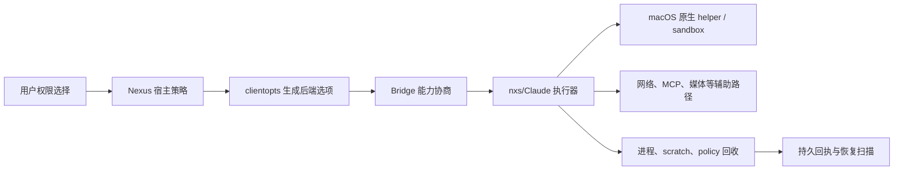

# 把 Agent 关进一条可证明的边界：Nexus macOS 沙箱的工程化旅程

> 记录性质：non-normative engineering note。当前产品合同仍以 [`docs/specs/desktop-sandbox-spec.md`](../../specs/desktop-sandbox-spec.md) 为准；本文解释设计逻辑、代码边界和证据边界，不新增协议字段。
>
> 记录时间：2026-09-30。

一个普通的下午，用户把仓库交给 Nexus，说：“把这个问题修好，跑一下测试，再把结果写进项目目录。”这句话听起来很简单，却隐含了很多系统动作：Agent 要读源码，可能要改文件，可能要运行构建脚本，可能要下载依赖，还可能要启动一个 MCP helper。任务完成后，用户还期待那个进程真的停了，临时目录真的收干净了，下一次任务不会继承这一次的权限。

沙箱工程真正要解决的，就是这句话背后的边界问题。我们不是在给 Bash 加一个拒绝列表，而是在设计一条从用户意图、宿主策略、runtime 执行到进程回收的完整证据链。本文先讲为什么要做、为什么在 macOS 选择这条路线，再回到代码、状态机和测试，最后说明哪些结论仍然不能提前宣布。

## 1. 为什么必须做 macOS 沙箱

Nexus 不是只显示模型回答的客户端。Agent 会在用户电脑上读取工作区、修改文件、执行命令、启动子进程、访问网络、连接 MCP，并维护 transcript、Skill、memory 和交付物。只要其中一个动作可以直接继承宿主进程的全部权限，模型的一次错误判断、恶意提示注入、被污染的仓库脚本或第三方工具，就可能把“帮用户完成任务”变成“替用户操作整台 Mac”。

我们做 macOS 沙箱，首先是为了建立一个**可证明的最小执行边界**：

* Agent 默认只能使用宿主为当前 owner、workspace、session 和 runtime generation 准备的资源。
* 工作区外的写入、沙箱外命令和未批准网络目标必须成为显式的一次性决策，而不是模型或任务配置可以自行扩大的权限。
* App 私有状态、其他 owner 数据、密钥、Keychain、状态根和受保护目录不能因为 Agent 拥有一个普通 workspace 就被顺手读写。
* 取消、崩溃、断线和重启不能让一个未收口的旧进程继续持有旧策略，也不能因不确定而自动重放副作用。
* 用户选择 Full Access 时，得到的是明确的资源范围变化；它不能抹掉 runtime 身份、业务授权、进程回收和审计责任。

这不是为了让所有操作都失败，也不是为了给产品增加一个“安全模式”设置。目标是让普通工作区任务保持顺畅，同时把真正越界的动作变成可解释、可拒绝、可追溯的边界事件。没有这层边界，Nexus 无法向用户说明“Agent 能碰哪些文件、为什么这次需要批准、关闭后是否真的停止”。

## 2. 在 macOS 里应该怎么做

macOS 的正确做法不是在 prompt 里提醒模型“不要访问敏感文件”，也不是只在 UI 里显示一个沙箱图标，而是把策略落实到**宿主、Bridge、runtime、受限 helper 和操作系统原生执行器**的链路中：

1. **由宿主决定边界**：Nexus 根据 App mode、owner、workspace、权限模式和用户挂载目录生成 typed policy；任务正文、ExtraEnv 和 MCP 参数不能提高权限。
2. **由 Bridge 做能力准入**：把命令、文件、搜索、媒体、网络、MCP、Skill、Context、Project 和 Settings 等要求作为独立 capability 发送；旧 binary 缺能力时，在收到任务前失败。
3. **由选定后端执行**：macOS nxs 使用自己的受限 file/search/media executor 和命令 sandbox；Claude 使用其原生 sandbox settings。Nexus 统一产品语义，不伪造两个后端拥有相同的底层能力。
4. **由系统边界阻止旁路**：执行路径使用 macOS 原生 sandbox/Seatbelt 能力、受限 helper、固定目录句柄和受保护路径；宿主不能在 file executor 失败后偷偷用普通 `os.*` 读取完成任务。
5. **由宿主管理生命周期**：启动前准备 lease 和 process identity，确认 exact generation 后才交付任务；关闭先停止准入，再回收进程、隧道、scratch 和 policy，无法证明的部分进入 `unknown`。
6. **由证据而不是标志宣布成功**：capability ACK 只证明协商成功；还需要 host integration、macOS native、App/包和 clean-host 证据，才能谈发布验收。

这套实现把 macOS 沙箱看成一个“受监督的执行环境”，而不是一个孤立的文件权限模块。原因是模型动作会跨越文件、命令、网络、MCP、媒体和后台任务；只封一个入口，其他入口就会成为旁路。

## 3. 为什么选择现在这套方案

### 3.1 选择 macOS 原生能力，而不是只依赖应用层规则

应用层规则擅长表达工作区、owner、审批和产品语义，但无法可靠阻止一个已经启动的子进程通过系统调用访问其他目录。macOS 原生 sandbox/Seatbelt 和受限 helper 更接近真实执行点，能够对命令、文件和部分网络行为施加 OS 级约束。因此产品策略由 Nexus 持有，实际执行由 nxs/Claude 和 macOS 原生路径落实，两者各司其职。

### 3.2 选择宿主策略 + Bridge + 后端执行器，而不是把所有逻辑塞进 App

App 适合管理状态根、sidecar、窗口和签名资源，不适合重复实现每一种 Agent 工具。Bridge 是切换 nxs/Claude 的稳定协议边界，负责能力和结果传输；后端负责工具调度和 native sandbox；宿主负责 owner、审批、回执和恢复。这样既能复用 SDK 已有的 file executor、reviewer、proxy 和取消机制，也能避免 App 通过猜测 runtime 内部状态承担不可靠的安全责任。

### 3.3 选择“能力逐项声明”，而不是一个总开关

不同工具的风险和实现路径不同：Read/Edit、Glob/Grep、ViewImage、HTTP 图片、MCP stdio、认证 helper 和 Bash 并不共享同一个 IO 入口。用一个 `sandbox=true` 无法知道哪些路径真的被保护。独立 capability 允许旧 runtime 在缺少某条能力时拒绝启动，也让测试能精确回答“文件已受限，但媒体网络仍未覆盖”这类问题。

### 3.4 选择 runtime replacement，而不是热更新权限

macOS 进程启动后可能已经持有目录句柄、子进程、网络连接和缓存的策略状态。权限模式或资源租约变化时，热更新很难证明旧能力已经撤销。用 process-policy fingerprint 发现边界变化，退休旧 generation，再建立新 generation，代价是切换有延迟，但能避免新旧策略在同一进程中重叠。

### 3.5 选择精确进程身份和持久恢复，而不是 PID + 临时目录

PID 会复用，路径会被替换，App 可能在清理中崩溃。sidecar 的 boot session/audit token、固定目录句柄、lease 和 durable receipt 能把“这是不是原来的进程/资源”变成可验证问题。清理不确定时保留 `unknown` 并阻断重建，比删除记录后猜测已经安全更符合 macOS 桌面产品的风险边界。

### 3.6 为什么不把 Docker、VM 或独立 App Sandbox 当作本轮默认答案

Docker/VM 能提供更强的隔离，但会改变本地 workspace、GUI、Keychain、MCP、文件选择和安装升级的产品模型，也无法直接解决宿主审批与 runtime 回执。macOS App Sandbox entitlement 主要保护 App 自身容器，不能自动把由 sidecar 启动的 Agent 工具、用户显式选择的 workspace 和后端网络策略表达完整。当前方案先利用 macOS 原生执行能力收口真正需要的本地路径，并保留明确的能力、身份和恢复证据；若未来威胁模型要求整套 SDK 主进程或第三方 Provider 也进入更强隔离，再单独评估 VM/容器，而不是把它们当成现有合同的隐式替代。

### 3.7 为什么 Full Access 仍保留 runtime 和生命周期边界

Full Access 是用户对资源范围的主动选择，不是“关闭所有安全工程”。如果切换后删除 runtime、回执、进程监督和审批身份，系统将无法知道谁在执行、如何取消、如何收口和如何解释失败。因此当前方案只扩大管理策略允许的资源，仍保留 owner/session/generation、进程回收、审计和业务授权。

后文的策略装配、原生宿主、恢复状态和测试分层，都是围绕这三个前置决策展开的：**为什么做、在哪里落实、为什么选择可证明而非看似简单的方案**。

## 4. 先定义“整体”

走到这里，问题已经从“要不要加沙箱”变成了“这条链上哪些地方必须同时成立”。如果只看某一个工具，答案会显得很简单；把一次任务从开始追到结束，才会看到真正的整体边界。

Nexus 的 macOS 沙箱不是一个布尔开关，也不是只给 Bash 加一层拒绝规则。它是从用户请求到进程退出的一条受控运行链：



“整体”包含五个互相独立、必须一起审计的边界：

1. **策略边界**：谁能读、写、搜索、访问网络、使用 MCP、读取 Skill/上下文/设置。
2. **身份边界**：策略属于哪个 owner、session、round、runtime generation 和进程。
3. **执行边界**：每一类工具实际由哪个受限 helper 或原生沙箱执行。
4. **生命周期边界**：启动、热切换、取消、崩溃、关闭和重启如何收口资源。
5. **证据边界**：什么只能证明“已协商/已确认”，什么才足以证明原生隔离和发布可用。

其中任何一层缺失，都会出现“看起来开启了沙箱、实际有旁路”的假安全感。例如 capability ACK 只能说明 Bridge 认识某能力，不能证明所有 SDK IO、后代进程、Provider 网络出口或签名 App 都已隔离。

## 5. 策略从哪里来

有了这个整体视角，再回头看代码里的 `SandboxSettings` 就不会把它误读成一串配置项。每个字段都对应链路中的一个责任：谁能进入、谁能读写、谁能联网，以及缺少能力时由谁拒绝任务。

桌面模式由宿主事实 `AppMode=desktop` 推导，不能由任务环境变量关闭。`BuildAgentClientOptionsWithConfig` 会把桌面模式强制进入选定后端的受限合同，再由 `applyDesktopSandboxForPlatform` 做平台和后端分流。

### nxs 路径

macOS nxs 一次安装命令、文件、搜索、媒体、媒体网络、MCP 网络/helper/stdio、Notebook、Skill、Context、Project、Managed Policy、Settings 和 Settings Writes 等多个独立要求，并设置 `FailIfUnavailable=true`。这些字段是能力准入条件，不是 UI 展示用标签。缺少任一宿主要求的旧 runtime 必须在接收任务前失败。

普通受限模式的 `AllowRead` 来自宿主投影的 Skill 目录，`AllowWrite` 来自用户明确挂载的附加目录；工作区和兼容目录由 SDK 的强制策略另行加入。网络默认没有允许域名，具体一次连接再走精确审批和权限代次。

Full Access 只改变资源策略：nxs 仍然保留 runtime、能力握手、进程监督和生命周期回执。它不能携带一个互相矛盾的只读资源租约；有 host resource contract 时，显式无沙箱命令逃逸也会被关闭。

### Claude 路径

Claude 使用自己的原生命令沙箱设置。宿主要求 `enabled=true`、`failIfUnavailable=true`、`allowUnsandboxedCommands=false`，但不会把 nxs 的 `RequireFileTools`、资源租约或 capability 字段伪装成 Claude 能力。已有 nxs-only 字段或 `--restricted` 工具模式混入时，构造阶段直接拒绝。

这条分流很重要：统一的是用户对“受控执行”的产品语义，底层隔离实现和验收证据按后端分别成立。当前 Windows 桌面 rollout 不宣称同一合同，代码会保留既有 Windows runtime 选项并等待原生边界验收。

## 6. 从策略到真实执行

策略写进 options 只是故事的中段。真正困难的部分发生在模型已经开始工作以后：一个文件读取失败会不会偷偷走宿主旁路，一次网络批准会不会影响下一次连接，或者后台任务结束时谁能证明所有子进程都已退出。

宿主选项经过 Bridge 传到 runtime 后，执行不是一次性“启动成功”就结束：

* Bridge 先检查固定版本和能力集合；缺少受限命令、文件、搜索或媒体能力时 fail closed。
* macOS nxs 的文件、搜索和媒体路径使用受限 file executor；准备、执行、取消或输出限制失败时，不回退到宿主 `os.*` 读取。
* Bash/PowerShell 越界、外部 Write/Edit 和网络连接分别拥有独立的一次性审批边界。批准绑定精确 tool-use、输入、工作目录、目标和 permission epoch，不会写成永久白名单。
* MCP 的 remote/HTTP、认证 helper、stdio 和网络连接是额外执行路径，不能因为主命令已受限就自动视为安全。
* Skill、上下文、项目文件、设置、记忆和 transcript 也必须使用对应受限接口；“命令和 Read/Edit 已通过”不能推导整个 SDK 已隔离。

因此工程实现采用“能力逐项声明 + 每条 IO 路径逐项收口”，而不是试图用一个总开关覆盖所有文件、网络和子进程行为。

## 7. macOS 原生宿主的职责

这些问题不能靠模型自律解决，也不能让 Web UI 自己猜测。macOS App 和 sidecar 必须掌握那些模型永远不应该拥有的事实：状态根是否还是原来的目录、正在运行的到底是不是原来的进程、清理是否真的完成。

App/sidecar 负责管理不能交给模型的宿主事实：

* `runtimebootstrap` 从 sidecar 的固定 App bundle 位置读取 manifest，校验 Bridge 版本、架构、原生 cgo 构建身份、helper 摘要和 inode 未被替换。它证明“随包 helper 是预期构建产物”，不替代代码签名、公证或真实 Seatbelt 生效证明。
* `confinedfs` 以固定目录句柄和 `os.Root` 风格边界访问状态、scratch、marker 和回收记录，拒绝被替换的父目录、符号链接和硬链接 marker。
* sidecar supervisor 保留 host ownership、process identity 和受保护的 `app/processes` 根。macOS 进程清理必须绑定 boot session/audit token 等精确身份，不能因为 PID 看起来已死亡就向复用的 PID 发信号。
* runtime 启动前读取同 owner/session 的持久回执和 scratch 状态；存在 `confirmed`、`retiring`、`unknown` 或 `cleanup_unknown` 等未收口边界时，阻断新建，避免换一个目录绕过失败清理。

这套设计把“启动一个命令”变成“获得一份可恢复的资源租约并由同一宿主负责关闭”。关闭失败时保存未知状态，后续扫描只能在重新证明完整边界后推进，不能按超时猜测成功。

## 8. 策略变化为何要换 runtime

这也是为什么权限切换不是一个下拉框事件，而是一段生命周期操作。旧 runtime 已经拿到的句柄和连接不会因为 UI 颜色改变就自动消失。

进程级策略包括 sandbox settings、资源租约、CWD、环境隔离、工具集合、MCP 严格配置和 host-owned provider 输入。`managedRuntimeProcessPolicyFingerprint` 对这些字段做稳定摘要；摘要变化意味着旧进程的启动边界已不再代表新策略。

所以 permission mode 在受限与 Full Access 之间切换时，不做热更新，而是先退休旧 runtime，再按新策略建立新 generation。这样可以避免：

* 旧连接仍持有更宽的文件或网络能力；
* pending approval 跨 permission epoch 生效；
* 新一轮复用旧 scratch 或旧 process identity；
* ACK 丢失后误以为同一进程已经应用新策略。

用户动作可以继续，副作用命令不能自动重放；未知结果先进入对账和恢复流程。

## 9. 工程化逻辑：把安全边界变成可维护系统

前面讲的是“系统应该长什么样”，这一节转向“怎样让它在多年维护和不断升级中仍然成立”。工程化的难点通常不在第一次启动，而在失败、并发、升级和证据不足的时候不做错误的乐观判断。

### 9.1 先画威胁模型，再决定隔离点

工程上先问“谁可能绕过哪一层”，再决定应该由谁执行检查：

| 风险 | 典型旁路 | 应由哪一层阻断 |
| --- | --- | --- |
| 任务输入扩大权限 | prompt、ExtraEnv、MCP 参数要求更宽目录 | Nexus 宿主策略和输入校验 |
| 旧 runtime 继续使用旧策略 | Full Access 切换后复用旧进程 | process-policy 摘要和 generation replacement |
| 路径被替换 | scratch/marker 父目录被 symlink 或 hard link 替换 | `confinedfs` 固定目录句柄和 inode 检查 |
| PID 被复用 | 旧记录按 PID 误杀新进程 | boot session/audit token 精确身份 |
| 受限 IO 失败后走旁路 | file executor 出错后宿主直接 `os.ReadFile` | SDK file/search/media contract，禁止 fallback |
| 一次性批准变永久权限 | 把本次审批写入 Agent settings | exact operation/epoch 的临时 capability |
| 崩溃后换目录重启 | `cleanup_unknown` 被忽略并新建 scratch | durable receipt、recovery fence、显式 reconcile |

这个表体现一个核心原则：**模型可控输入不能决定安全边界，宿主事实必须在更靠近执行的位置再次核验**。UI 可以展示选择，SDK 可以执行工具，但 owner、scope、generation 和恢复状态只能由宿主确认。

### 9.2 分层策略，而不是一条“大而全”的策略

策略被拆成四层，每层都有自己的输入、输出和失败语义：

1. **产品层**：权限模式、工作区、附加目录、是否 Full Access。输出是用户意图，不直接等同于 OS 权限。
2. **宿主层**：owner/session/round、强制保护路径、资源 lease、provider 所有权和 permission epoch。输出是可信 typed contract。
3. **Bridge/SDK 层**：能力 required flags、sandbox settings、file/search/media/MCP 执行接口。输出是能力 ACK、工具结果和取消事件。
4. **macOS 层**：Seatbelt/native sandbox、受限 helper、目录句柄、进程身份和内核信号。输出是可验证的 OS 事实或未知状态。

上层不能跳过下层：宿主写入 `RequireFileTools=true` 不代表文件已经隔离；macOS helper 成功启动也不代表网络和 Provider transport 自动受限。每一层必须把自己的结果交给下一层，并保留失败原因。

### 9.3 生命周期是状态机，不是几个 defer

一个 desktop runtime 至少经过以下阶段：

```text
prepared → admitted → connected → confirmed
   │          │          │          │
   └──────────┴──────────┴──────→ retiring
                                      │
                         ┌────────────┴────────────┐
                         ↓                         ↓
                      retired                 unknown
                                                    │
                                      explicit reconcile → retired
```

* `prepared`：host 已准备 workspace、scratch、lease 和启动参数。
* `admitted`：Bridge/SDK 能力和固定 binary 通过准入，尚未把任务交给模型。
* `connected`：进程存在并完成传输连接，但仍可能缺少最终 session identity 或 policy receipt。
* `confirmed`：收到与 exact generation、policy digest、lease 和进程身份匹配的确认。
* `retiring`：拒绝新任务，取消 pending approvals，等待工具、子进程、隧道和文件写入收口。
* `retired`：宿主已经有足够证据证明该 generation 的资源边界关闭。
* `unknown`：关闭、信号、查询或持久化有任何无法证明的部分；该状态保留并阻断重建。

状态迁移必须单调。迟到的 close callback 不能把 `retired` 重新打开成 `retiring`；发现 PID 已死也不能把 `unknown` 猜成 `retired`。这种严格性牺牲了部分自动恢复速度，但防止了重复执行和证据丢失。

### 9.4 每条副作用都要有提交点

文件写入、网络连接、进程启动、审批允许和 runtime 关闭都应区分“请求已发出”和“结果已被宿主证明”。实现上需要：

* 在启动前持久化 lease、process intent 和 policy digest；
* 在收到匹配 ACK 后再推进 `confirmed`；
* 在关闭时先停止新 admission，再记录清理阶段，最后推进 `retired`；
* 任何中断或超时都进入 `unknown`，由后续 reconcile 读取原记录继续；
* 只有 exact request/generation 的 ACK 才能清理对应故障，不能用“最近一次成功”覆盖旧请求。

这也是为什么系统不做通用 mutation journal 的自动重放：对副作用来说，重复一次可能比失败更危险。未知结果应该让用户或恢复流程对账，而不是让后台猜测。

### 9.5 资源租约解决“谁负责清理”

scratch 不是普通临时目录。它属于 owner/session/runtime generation，并由 lease 记录 scope、父目录身份、写范围和清理阶段。多个 runtime handle 可以引用同一资源，但释放一个 handle 不能释放兄弟仍在使用的资源；第一个发现 `cleanup_unknown` 的 handle 失效后，栅栏必须转移给仍存活的兄弟。

这样做解决两个工程问题：

* **并发问题**：同一 owner 的 Room、DM、AutoDream 不会互相删除 scratch。
* **崩溃问题**：App 重启后可从 durable record 找回原 lease，而不是按目录名猜测它是否属于当前进程。

### 9.6 配置变更的正确代价是替换

如果变更会影响进程启动边界，就必须付出 runtime replacement 的代价。典型字段包括资源写范围、受保护路径、required capability、MCP 网络、CWD、Provider ownership 和受控环境。

热更新只适合不改变隔离边界的状态，例如 UI 文案或不影响执行身份的观察信息。把资源策略、审批 epoch 或进程身份热写入旧 runtime，会产生“宿主认为已收紧、旧进程仍持有旧能力”的时间窗口。

## 10. 工程化原则

### 10.1 权限和执行身份分离

权限模式表达“允许什么”，runtime generation/process identity 表达“谁在执行”。两者都要进入回执和审计，但不能互相替代。Full Access 不是删除 runtime 身份；capability ACK 也不是 owner 授权。

### 10.2 所有权单向流动

用户选择 → Nexus 宿主策略 → Bridge 合同 → SDK/原生执行器。任务 prompt、ExtraEnv、Agent 设置和普通 MCP 配置不能反向提高宿主权限，也不能改变 owner、memory root 或 provider 所有权。

### 10.3 失败安全，状态可恢复

启动、协商、策略准备、文件执行、网络审批、关闭和回收都区分 `rejected`、`cancelled`、`failed` 与 `unknown`。未知不等于失败，也不等于成功；持久记录必须留下足够身份让后续对账，不得自动重放副作用。

### 10.4 记录与代码同构

L1 只写项目宪法，规范写当前合同，本文解释工程思路，代码顶部的 INPUT/OUTPUT/POS 说明局部契约，测试记录实际证据。未来设计必须放在 exploration 并标注 non-normative，不能把未实现能力写进当前规范。

## 11. 测试和交付如何分层

如果把所有绿色测试都叫作“沙箱通过”，很快就会失去判断力。我们更愿意把测试看成逐层加重的证据：每一层回答一个更具体的问题，也明确告诉下一层还缺什么。

测试不是一条总开关，而是一组从便宜到昂贵的证据：

1. **纯函数和单元测试**：策略分流、深拷贝、非法组合、指纹变化和状态迁移。
2. **host integration**：真实 Bridge/SDK capability handshake、resource contract、取消与 receipt 持久化。
3. **macOS native**：真实 helper、目录替换、符号链接、进程精确身份、受限文件/命令路径。
4. **App smoke**：状态根迁移、sidecar 启动/关闭、WebSocket/窗口路径和多次重启。
5. **发布验收**：固定签名和公证包、Gatekeeper、clean-host、升级/回退、支持的 macOS 版本和硬件。

低层测试通过只能解锁下一层，不能向上推导。特别是 capability ACK、开发机 App smoke 和真实 Provider 调用，都不足以单独证明正式分发安全。

每个门禁还要记录四个维度：固定的 Nexus/SDK/Bridge 版本、实际运行平台、是否使用隔离状态根、覆盖了哪些路径以及明确没覆盖哪些路径。这样失败时知道是代码问题、环境问题还是尚未实现的证据。

## 12. 这套方案的亮点

回头看这次设计，亮点不在于增加了多少字段，而在于把过去容易混在一起的几种“安全”拆开了：策略是策略，执行是执行，身份是身份，恢复是恢复，证据也有自己的边界。

### 12.1 把“沙箱已开启”拆成可验证的能力集合

命令、文件、搜索、媒体、网络、MCP、Skill、上下文和设置写入分别声明和握手。这样旧 runtime 缺少某一能力时会在任务开始前失败，不会出现命令被保护、但 ViewImage、Glob、MCP 或 settings 走了旧旁路的情况。能力字段还进入 process-policy 指纹，变更会触发新 generation。

### 12.2 把安全策略和用户体验解耦

默认、自动审核和 Full Access 仍然是用户熟悉的权限入口；后台实现却保持 runtime、identity、receipt 和 shutdown 边界。用户选择 Full Access 后不会误以为整个 App 进程获得了更高的 macOS 身份，也不会因 UI 切换而遗留一个继续使用旧策略的进程。

### 12.3 用精确身份替代 PID 猜测

sidecar 记录 boot session、audit token、可执行路径和 PID，并在观察、信号和回收前重新核验。PID 重用、安装路径变化、旧格式记录和查询失败都进入保守分支。这个设计把“我看到一个数字”提升成“我能证明这是同一个内核进程”。

### 12.4 把恢复当作正常产品能力

scratch、process、policy 和 receipt 都是持久对象，关闭失败不会被 `defer` 或进程退出吞掉。App 重启后可以沿原 owner/session/generation 对账，失败记录继续阻断新启动。恢复因此不依赖一次性内存状态，也不依赖目录名或最近一次成功时间。

### 12.5 目录句柄和路径策略同时使用

路径规则适合表达“工作区外禁止写入”“保护 App 私有目录”等产品语义，固定目录句柄适合阻断 symlink/hardlink/rename 造成的 TOCTOU。两者结合后，既能解释给用户，也能抵抗运行期间的路径替换。

### 12.6 代码、规范、测试和发布证据保持分层

当前规范描述已实现合同，探索文档记录设计和历史，代码顶部保留局部 INPUT/OUTPUT/POS，测试记录行为，发布门禁再验证固定包。这样不会因为一份实验记录或一次开发机冒烟就扩大产品承诺。

## 13. 最难的工程问题

真正消耗时间的地方，往往是那些在正常路径上看不见的瞬间：一个旧进程晚了一拍返回，一个目录在检查后被替换，一个系统 API 在某个 macOS 版本上不存在。下面这些难点决定了方案最终是否可靠。

### 13.1 “能力确认”与“真正生效”不是一件事

Bridge 可以确认字段格式正确、runtime 支持某 capability，但 OS 仍可能缺少接口、helper 未随包、配置未被选中或执行路径绕过 helper。因此每个能力都要有三层证据：声明被正确构造、Bridge 确认并绑定 generation、原生路径实际拒绝/允许符合预期。少一层都只能叫集成证据。

### 13.2 取消和崩溃时结果天然可能未知

进程被杀、socket 断开或 App 崩溃时，宿主可能不知道网络连接是否已建立、文件是否已原子替换、子进程是否仍在运行。最难的不是写一个 timeout，而是禁止 timeout 被误读为终态：必须保留 exact request、process identity、lease 和 cleanup phase，等后续扫描证明结果。

### 13.3 多个边界的关闭顺序必须一致

runtime、MCP tunnel、approval callback、scratch、policy receipt、sidecar 和数据库之间有依赖关系。先删 scratch 会让仍在写入的 helper 失去可追踪路径；先关数据库会让未落盘的 unknown 消失；先放开新 admission 会让旧 generation 与新策略并存。因此关闭顺序本身是安全协议，而不是普通资源释放细节。

### 13.4 macOS 版本和原生 API 不稳定

精确进程信号接口、Seatbelt 行为和系统权限不是纯 Go 测试可以模拟的。某个 SDK 或 App 在当前 Apple Silicon 开发机可用，不代表 macOS 14.0、Intel、干净主机或正式签名环境都可用。遇到 API 缺失必须显式失败，不能退回裸 PID 或普通宿主 IO。

### 13.5 “整个 SDK”边界很容易被过度宣称

命令 helper 和 Read/Edit 受限，不代表启动配置、Skill、memory、transcript、Notebook、Provider transport、秘密文件、任意 descendant 或第三方 MCP 都自动受限。每一条直接或间接 IO 都要列清楚 owner、执行器、策略、取消和证据；未覆盖的路径必须继续标为未完成。

### 13.6 热切换会制造隐蔽的代次竞态

用户可能在连接等待、网络审批、后台任务或 Room 执行期间切换权限。旧请求的 ACK、迟到的 callback、旧 WebSocket 和新 runtime 可能交错到达。generation、permission epoch、tool-use identity 和 exact session binding 必须一起核对，不能只按“当前连接”或“最近一次请求”处理。

## 14. 关键取舍与代价

每一个可靠的边界都会带来一点摩擦：启动慢一点、切换多一步、失败时需要人工对账。这里不把这些摩擦藏起来，因为它们正是安全性换来的真实成本。

| 取舍 | 得到的安全性 | 付出的代价 |
| --- | --- | --- |
| 策略变化替换 runtime | 旧进程不会保留旧边界 | 切换有启动延迟，不能做到无缝热更新 |
| unknown 保留并阻断重建 | 不会重复副作用或绕过失败清理 | 用户可能需要显式恢复，故障不能自动消失 |
| 一次性精确审批 | 不会意外形成永久白名单 | 同类后续操作仍可能再次询问 |
| 受限 IO 失败不回退 | 不会偷偷越过沙箱完成任务 | 某些旧 runtime 会直接不可用 |
| 宿主固定 owner/provider/memory | 防止任务输入重定向秘密和长期记忆 | 测试和后台调用必须显式提供正确上下文 |
| nxs 与 Claude 分开验收 | 不把一个后端证据冒充另一个后端能力 | 需要维护两套 settings、测试和发布矩阵 |
| 固定随包 helper 并核验摘要 | 防止运行时替换配套组件 | 构建、升级和签名流程更复杂 |

这些代价是有意的。沙箱设计优先保证边界可证明，再优化切换速度、自动恢复和兼容旧 binary。

## 15. 最容易产生的误判

* `NEXUS_DESKTOP_SANDBOX_POLICY=1` 只是 host marker，不是 OS 隔离回执。
* `FailIfUnavailable=true` 只能保证缺能力时拒绝，不说明能力覆盖了所有 SDK IO。
* `AllowUnsandboxedCommands=true` 代表存在独立审批入口，不代表默认允许越界命令。
* Full Access 扩大资源策略，不等于移除 runtime 生命周期、业务授权或 macOS 账户权限。
* `cleanup_unknown` 中的死 PID 不等于整个资源边界已经释放。
* 本机 Go 测试通过不等于签名、公证、Gatekeeper、clean-host 或发布包通过。
* 真实 Provider 能返回模型结果不等于 Provider 网络、密钥和后代进程已经被 Nexus 完整隔离。

## 16. 后续风险和推进顺序

这套设计已经把主链路搭起来，但“主链路可用”不等于“所有边界都闭合”。接下来的顺序不是按代码文件多少决定，而是按哪一类未知状态最可能影响用户数据和发布承诺决定。

后续工作应按边界闭合顺序推进：

1. 先补 macOS 版本/API 差异和精确身份的原生证据，再扩大支持范围。
2. 再逐项收口辅助 IO、MCP、secret、handle、Provider egress 和任意 descendant。
3. 然后补完整崩溃、取消、升级、回退和 clean-host 安装证据。
4. 最后用固定签名/公证包做发布验收，并把每个未覆盖项写入 release checklist。

在这些证据完成前，产品可以继续使用已验证的受限路径，但不能把“当前开发基线通过”升级成“macOS 整体沙箱已完成发布验收”。

## 17. 当前证据边界

最后要把文章里的判断和仓库里的证据放在一起看。我们可以很有把握地解释设计，也可以报告已经通过的测试，但不能用解释替代尚未完成的原生或发布验证。

仓库已有 macOS host/integration/native 测试、真实 runtime 冒烟、App 状态根与恢复测试，但这些结果需要按层阅读：

* Go 单测和 host integration 证明装配、拒绝条件和协议行为。
* 原生 macOS 测试证明固定 helper、目录身份、进程回收和部分 Seatbelt/file executor 行为。
* App/DMG smoke 证明某个固定构建的产品路径，不自动证明签名、公证、clean-host、升级回退或所有 UI 路径。
* 真实 Provider 调用证明链路可工作，不证明 Provider 自身网络、秘密文件、任意后代进程或整个 SDK 主进程已被同一 OS 策略包住。

当前记录必须保留这些限制，直到对应平台、版本、签名和干净主机证据补齐。

## 18. 阅读入口

* 产品合同：[`docs/specs/desktop-sandbox-spec.md`](../../specs/desktop-sandbox-spec.md)
* 用户与运行边界：[`docs/guides/desktop-sandbox.md`](../../guides/desktop-sandbox.md)
* 验收矩阵：[`docs/testing/desktop-sandbox-acceptance.md`](../../testing/desktop-sandbox-acceptance.md)
* 代码解读：[`macos-sandbox-code-reading.md`](macos-sandbox-code-reading.md)
