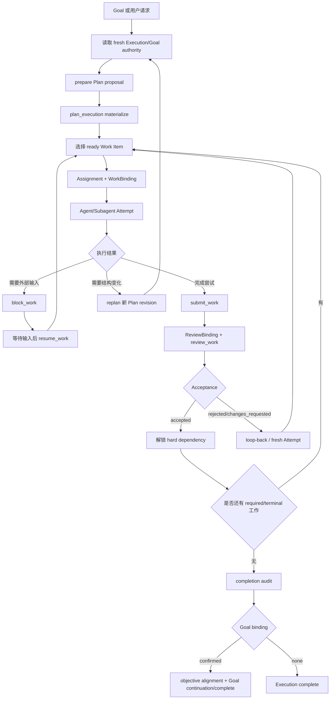

# Nexus WorkGraph：设计理念与问题定义

> 回答“为什么这样设计 WorkGraph”：长程任务为何失稳、WorkGraph 与普通任务图的区别，以及 Goal、Task、Subagent 如何协作。
>
> 代码结论以 `internal/`、`db/migrations/`、`skills/execution-orchestrator/` 和 `docs/specs/` 为准；规范合同见 [Execution Orchestration 规范](../specs/execution-orchestration-spec.md) 与 [Execution Graph 规范](../specs/execution-graph-spec.md)。设计目标、评估方法和未验收部分单独标出。

## 摘要

- WorkGraph 把长期任务拆成两条线：责任图保存责任和验收，Runtime Graph 记录实际运行。
- 与普通 planner 的区别：节点还记录谁负责、做过哪次尝试、提交了什么、是否通过验收。
- 与 runtime trace 的区别：责任图决定哪些工作可以解锁、哪些结果还不能算完成。
- 对象链（同 §4.2）：`Goal → Execution → Plan revision → Work Item → Assignment → Attempt → Submission → Review / Acceptance`。Draft/Workflow 保存可复用的责任结构。
- 稳定性来自持久责任、明确身份、追加历史、有限重试、投递对账和 Goal continuation。
- 分工：Agent 负责理解问题、选择工具、拆分工作和决定返工；宿主负责身份、权限、状态转换、幂等、验收和恢复。

## 1. 基础问题：长程任务最先丢失的三个事实

“做偏了”“中途忘了”“压缩后质量下降”“Subagent 结果找不到”“重启后不知从哪继续”可归并为三个基础问题：

1. **目标偏移（goal drift）**：行动逐步偏离用户真正的目标、完成标准或当前目标版本。
2. **中间过程丢失（process loss）**：丢失已完成什么、谁负责什么、哪些结果有效、哪些依赖未解除。
3. **上下文压缩导致的信息损失（context loss）**：上下文被截断、摘要化或跨 round 重建后仍需正确决策。

这三类事实失真时，增加 Agent 只会让偏移和不一致传播得更快。

### 1.1 外部研究显示：长程失败不止是“记忆不够”

下表说明长程任务在哪里失败，不代表 Nexus 已通过这些评测。

| 问题类别 | 外部研究 | 对系统的要求 | WorkGraph 对应机制 |
| --- | --- | --- | --- |
| 目标和约束会漂移 | [AgentBench](https://arxiv.org/abs/2308.03688) 把长期推理、决策和指令遵循列为主要障碍；[WebArena](https://arxiv.org/abs/2307.13854) 端到端成功率远低于人工 | 每轮重新核对目标、版本、约束和完成标准 | Goal objective/revision、completion criteria、alignment、Goal authority |
| 中间状态和环境会变化 | [OSWorld](https://arxiv.org/abs/2404.07972) 暴露跨应用操作和 GUI grounding 问题；[SWE-bench](https://arxiv.org/abs/2310.06770) 要求跨文件处理真实 issue | 保存责任、依赖、工作区状态和验证结果；环境变化后允许重规划 | Execution、Plan revision、Work Item、Attempt、Runtime Graph、replan |
| 上下文和长期记忆不可靠 | [LongMemEval](https://arxiv.org/abs/2410.10813) 测试多会话、时间更新和拒答；[MemGPT](https://arxiv.org/abs/2310.08560) 采用分层记忆 | 关键状态不能只放 transcript；压缩后仍能恢复 | 持久快照、`RenderExecutionContext`、已接受事实和版本栅栏 |
| 多 Agent 的责任难以确认 | [多智能体综述](https://arxiv.org/abs/2402.01680) 将角色、通信和一致性列为独立问题；[AutoGen](https://arxiv.org/abs/2308.08155) 提供可配置对话编排 | 结果必须能追溯到负责人、父任务和评审者 | Assignment、parent/child Attempt、Subagent admission、WorkBinding、ReviewBinding |
| 工具副作用和权限可能失控 | [τ-bench](https://arxiv.org/abs/2406.12045) 按最终数据库状态评估工具行为；[AgentDojo](https://arxiv.org/abs/2406.13352) 展示工具数据中的提示注入风险 | 区分已应用、未应用和未知；授权不能从普通文本或工具结果中产生 | request identity、receipt、outbox、unknown、reconciliation、capability fence |
| 失败后的验收、成本和终止不可靠 | [Reflexion](https://arxiv.org/abs/2303.11366) 保存失败反馈；[METR](https://arxiv.org/abs/2503.14499) 用时间跨度衡量长任务可靠性 | 失败要能返工，完成要有证据，loop 要有预算和终止条件 | Submission/Review/Acceptance、completion audit、usage、deadline、lease、no-progress |

### 1.2 目标偏移

四种偏移：

- **局部优化偏移**：完成了眼前 Work Item，却没有回到整体完成标准。
- **目标版本偏移**：用户已 retarget 或修改 objective，旧 round 仍按旧 objective 继续。
- **协作边界偏移**：Subagent 或 Room 成员把局部产出当成最终交付，越过 coordinator/reviewer 的责任边界。
- **完成判定偏移**：工具成功、Attempt 成功或有一条回复，被当成 Goal 已完成。

因此 objective 不能只放进 prompt，还要保存可核对的事实：Goal ID、objective revision、completion criteria、confirmed Goal/Execution binding，以及当前 round 可用的 Goal authority。

| 机制 | 代码 |
| --- | --- |
| 完成前的 objective alignment | `internal/service/goal/alignment.go` |
| 当前 physical round 的 Goal/责任 authority | `internal/runtime/goal_authority.go`、`responsibility_authority.go` |
| Goal/Execution 双向绑定和确认恢复 | `internal/service/orchestration/goal_binding.go`、`goal_confirmation_recovery.go` |
| 禁止旧 Plan revision 改写既有 objective 或 completion criteria | `internal/service/orchestration/execution_transition.go` |
| Goal retarget 时推进 objective revision，并封住旧责任边界 | `internal/service/goal/objective_transition.go` |

### 1.3 中间过程丢失

问题在于已发生的业务事实没有稳定身份，系统无法区分：

- 工作尚未开始，还是已运行但 ACK 丢失；
- Subagent 结果属于哪个父 Attempt；
- 一个 Submission 是否已被 Review；
- 下游依赖等待的是 Attempt 成功，还是 Acceptance；
- 当前负责人仍 active，还是已 release/takeover；
- 重启后应恢复原 Attempt，还是创建新 Attempt。

WorkGraph 把中间过程提升为责任链（见 [4.2](#42-双层图模型责任图与运行图)），每个阶段有自己的持久身份和状态边界。运行日志、聊天消息和 Tool output 只能作为证据，不能代替责任链。

| 机制 | 代码（`internal/service/orchestration/` 下，除注明外） |
| --- | --- |
| 责任对象和状态类型 | `internal/protocol/execution.go` |
| Assignment/Attempt | `command_assignment.go` |
| Submission/Acceptance | `command_submission.go`、`command_review.go` |
| 精确执行授权 | `work_binding.go` |
| 完成审计中断后的恢复 | `completion_audit_recovery.go` |
| Room、Review、Cancellation、Subagent 和 saga recovery 的后台回路 | `background_coordinator.go` |

### 1.4 上下文压缩导致的信息损失

两种情况：

1. **表达层压缩**：对话太长，需要摘要或只保留局部历史。
2. **生命周期切换**：当前 physical round 结束，新的 round、Subagent 或 Goal continuation 重新开始，原始上下文不再可用。

只依赖 transcript 会把摘要误当作业务状态，丢掉依赖、版本、阻塞原因、验收结果、权限和未知副作用；每轮回放全部历史又会淹没重要事实。

WorkGraph 的做法：**把需要跨上下文保留的内容写成结构化持久状态，每个 round 重新生成有界的权威执行上下文。**

`internal/service/orchestration/context.go` 的 `RenderExecutionContext` 按当前 actor 和 snapshot 投影：

- canonical objective 和 completion criteria；
- 当前 lane、allowed actions、WorkBinding/ReviewBinding；
- 当前 Assignment、Attempt、blocker 和可恢复动作；
- 已接受的依赖解锁，而不是未验收的结果正文；
- 有界 Runtime Graph observed facts；
- Subagent admission、terminal evidence 和当前协调上下文。

`internal/service/orchestration/runtime_context_facts.go` 把 runtime facts 标记为 observed facts，不让它们自动产生路线、重试或工具建议。系统也不把所有成功 Tool 回放给模型，只投影当前可行动事实。

### 1.5 三个问题之间的因果关系

```text
上下文压缩
   ↓ 丢失目标版本、责任、依赖和验收事实
中间过程丢失
   ↓ 无法知道当前真正完成到哪里
目标偏移
   ↓ Agent 继续做局部正确但整体错误的事情
```

反方向同样成立：目标已变但没有 objective revision fence，旧过程继续运行，压缩时又把旧状态摘要成“当前事实”。

设计必须回答：目标的权威版本、当前责任事实、本 round 需恢复的最小信息、哪些事实可压缩而哪些必须原样保留，以及不确定结果如何被确认而非被猜测。

### 1.6 三个事实的覆盖边界

三个基础事实回答“跨 round、跨上下文、跨进程后必须记住什么”，足以解释系统为何失去方向和连续性；但不能单独证明权限正确、副作用已对账、交付已验收或任务应继续。另有四类控制事实：

| 控制事实 | 回答的问题 | WorkGraph 机制 |
| --- | --- | --- |
| 权责事实 | 谁可以代表谁行动？哪个 Agent 对哪个交付负责？ | owner/Agent/role、Assignment、WorkBinding、ReviewBinding、Subagent admission |
| 外部世界事实 | 工具或第三方系统到底发生了什么？请求是已应用、未应用还是未知？ | request identity、receipt、outbox、unknown、reconciliation |
| 交付证据事实 | “做过”为什么算完成？谁独立确认？下游何时解锁？ | Submission、Review、Acceptance、completion audit、hard dependency gate |
| 资源与安全事实 | 预算、期限、权限和风险是否仍允许继续？ | usage、deadline、lease、no-progress、suppression、capability fence |

两层合起来——先记住方向、过程和可恢复信息，再证明权责、外部状态、交付证据和资源/安全——下一轮才能安全行动。

### 1.7 从问题到设计要求

前四条保证事实连续，后六条保证任务能安全推进：

1. **方向稳定**：每轮都能核对 Goal objective、completion criteria 和 revision。
2. **过程连续**：Execution、Plan、Work Item、Assignment、Attempt、Submission 和 Acceptance 有稳定身份。
3. **上下文可恢复**：压缩、round 结束或进程退出后，仍能取回责任、版本、验收和恢复句柄。
4. **环境可适应**：外部状态变化后可以重新观察、阻塞、重规划或接管。
5. **协作可归属**：每个 Subagent 结果都能反查父 Attempt；每个交付都有负责人和评审者。
6. **副作用可对账**：外部工具、Room 投递和文件交付区分 applied、not_applied、unknown。
7. **交付可证明**：Attempt 成功或工具成功不能代替 Review、Acceptance 和 completion audit。
8. **成本和终止可控**：usage、deadline、lease 和 no-progress 防止 loop 无限运行。
9. **权限可收敛**：模型指令、观察数据、宿主授权和副作用写入分别受控。
10. **状态可观察、可接管**：长历史标记 partial/truncated/stale；等待人工或外部资源时进入 blocker。

### 1.8 非目标

WorkGraph 不试图：

- 把所有聊天消息都变成图节点；
- 把每次 Bash、Read 或搜索都持久化成业务责任；
- 把 UI 画布变成可直接编辑的白板；
- 用 WorkGraph 替代 Goal 的长期生命周期；
- 用输出 claim 代替操作系统文件锁；
- 让服务端按超时自动重放未知副作用；
- 用一次摘要或一次模型回复证明长程任务已完成；
- 证明所有外部 Provider、桌面打包和生产多副本环境都已验收。

## 2. Related work：已有方法解决到哪一步

| 路线 | 主要解决 | 仍缺的长程控制事实 | WorkGraph 的补充 |
| --- | --- | --- | --- |
| ReAct / Plan-and-Execute | 推理与局部行动策略 | 副作用是否生效、谁负责、是否被接受、重启后从哪次尝试继续 | 持久责任链与状态门；request identity、CAS、receipt、reconciliation |
| Reflexion / 记忆增强 | 从反馈中改进下一次行动 | 反馈是否已落到某个 Attempt，能否作为交付证据 | Attempt/Review/Acceptance 历史 |
| MemGPT / LongMemEval | 有限 context 下的分层记忆、索引和检索 | 谁负责、是否交付、下游何时解锁、未知副作用如何对账 | 结构化 snapshot 与 authority fence |
| AutoGen / 多 Agent 对话 | Agent、工具、人类的协作拓扑 | 重复劳动、结果覆盖、子 Agent 找不到父任务、协调者直接宣布完成、无稳定终止条件 | parent-child admission、Binding、Outbox |
| 静态 DAG / 运行追踪 / 画布 | 计划结构、调用观察或状态展示 | 计划变化、Submission/Acceptance 历史、业务责任与授权、恢复和复用 | immutable Plan + Runtime Graph + Recovery Loop |

补充说明：

- WorkGraph 只为执行控制面保存必要快照：目标版本、责任、依赖、阻塞、验收和恢复句柄。普通 transcript 和个人长期记忆仍是独立系统。
- 多 Agent 协作中：Subagent 挂在父 Attempt 下；Worker 持有 WorkBinding；Reviewer 持有 ReviewBinding；Acceptance 解锁依赖；Room 消息只提供上下文。
- WorkGraph 同时维护三类事实并共享稳定身份：Plan revision 表示计划结构，责任图表示归属和验收，Runtime Graph 表示实际运行。画布不是写权限。

## 3. 动机：统一的责任控制回路

> **Agent 的自主性保留在“下一步做什么”的决策层；长程稳定性要求宿主把“谁对什么负责、什么被接受、什么可以继续、未知结果如何对账”提升为持久责任状态。**

| 问题 | Agent 自主决策 | 宿主权威控制 |
| --- | --- | --- |
| 如何理解用户意图 | 是 | 校验输入边界 |
| 如何拆解当前工作 | 是 | 解析并校验 Plan Document |
| 具体使用什么工具 | 是 | 记录 verified runtime facts |
| 是否启动 Subagent | 是 | 校验 parent authority 和 admission |
| 谁可以执行哪个 Work Item | 提议/请求 | 由 Assignment + WorkBinding 决定 |
| 是否可以提交 | 请求 | 校验 Attempt、Assignment 和版本 |
| 是否真正通过 | 不能自行决定 | Reviewer + Acceptance 决定 |
| 是否继续 Goal | 提议下一步 | Goal continuation 状态机和 receipt 决定 |
| 失败后是否重放副作用 | 不能自行猜测 | 先按 exact identity 对账 |

## 4. 设计方法：持久责任回路

字段、状态和命令的规范定义见 [Execution Orchestration 规范](../specs/execution-orchestration-spec.md)；Runtime Graph 与只读投影见 [Execution Graph 规范](../specs/execution-graph-spec.md)。

### 4.1 统一执行回路：Task、Subagent、Goal 如何协同

#### Goal：长程目标和 continuation 控制器

`Goal` 负责：

- objective 和 objective revision；
- completion criteria；
- active/paused/complete/blocked 等生命周期；
- continuation 的 scheduled/claimed/started/settled 以及恢复；
- 用量累计、预算和 objective alignment；
- 没有 WorkGraph 时的 Goal-only 推进。

Goal 不负责 Work Item 分配、Attempt 生命周期和 Submission 验收，以保持“跨轮目的”语义。

代码入口：`internal/service/goal/`、`internal/protocol/goal.go`、`internal/storage/goal/continuation_plan.go`。Goal 与 Execution 通过 `internal/service/goalexecution/` 和 orchestration 的 binding/confirmation receipt 联动。

#### Execution：一次受管运行历史

`Execution` 是一次编排的持久容器，保存 owner、Session/Room scope、coordinator、objective、completion criteria、Goal binding、状态、版本以及恢复/替换关系。Execution 不是“当前上下文”：当前上下文来自一个 physical round，Execution 在多个 round 之间保持稳定。

#### Plan revision：责任结构的不可变版本

模型可以提出 Plan，但不能直接写权威图：

1. `prepare_plan_execution`：解析完整 Plan Document，校验 schema、DAG、依赖和 output claim，封存持久但非权威的 proposal；
2. `plan_execution`：宿主选择 exact sealed proposal，在事务中 materialize Execution、Plan revision 和 Work Items。

Plan revision 创建后不再修改。replan 产生新 revision，旧 revision 保留，并拒绝旧 round 用旧 revision 写入新状态。

#### Work Item：持久业务责任

运行时 Task 可以短暂存在；只有进入 WorkGraph 的 Work Item 才是跨 round、可交付、可验收的业务责任。Work Item 至少包含：

- stable logical key；
- kind：produce/review/verify/integrate；
- immutable spec：subject、objective、deliverable、acceptance criteria、input refs；
- required/terminal 和 parent/position；
- hard/soft dependency；
- output scope claim。

`ready`、`assigned`、`running`、`submitted`、`accepted` 不另存为 Work Item 生命周期，而是从当前 Plan、Assignment、Attempt、Submission 和 Acceptance 推导，避免 UI 状态与责任事实漂移。

#### Assignment 和 Attempt

- Assignment 表示当前责任归属。一个 Work Item 同时最多有一个 current Assignment。接管、释放和取消都保留历史。
- Attempt 是该 Assignment 的一次实际尝试，保存 Agent/Subagent、runtime Session、runtime round、Agent round、父子关系和 SDK task 等精确身份。失败和返工产生新 Attempt，旧 Attempt 不被覆盖。
- 同一 Agent round 连续承担两个 Work Item 时，工具归属必须用 exact Assignment/Attempt identity，不能按 Agent ID 或时间邻近推断。

#### Subagent：受管的子执行

Subagent 只有在父责任链下获得 admission，才进入 managed WorkGraph：

```text
父 Agent round
  └─ parent Attempt
       └─ child Session / SDK task
            └─ child Attempt
                 └─ Tool / result / terminal reconciliation
```

Admission 要求：

- 父 Attempt 仍然有效；
- 当前 Execution/Plan/Work Item/Assignment authority 没有过期；
- child identity、parent identity 和 SDK task identity 唯一；
- 父退出后有 deadline 和 reconciliation；
- 进程重启后 orphan child 不能凭猜测自动算成功。

Subagent 的独立结果不能直接满足交付 Gate。父 Agent 或宿主仍需把结果提交为 Submission，并经过 Review/Acceptance。

#### Submission、Review、Acceptance

Worker 成功后提交 Submission。Reviewer 通过 exact ReviewBinding 审阅 immutable Submission。Acceptance 取值为 accepted、rejected 或 changes_requested。只有 accepted 才能解除 hard dependency，因此：

- Tool 成功不等于 Work Item 成功；
- Attempt succeeded 不等于交付被接受；
- Submission 存在不等于下游可以运行；
- Reviewer 意见不覆盖原 Submission，而是追加新的 Gate 事实。

### 4.2 双层图模型：责任图与运行图

#### 责任图回答“应该完成什么”

```text
Goal（为什么做）
  ↓ 可选 confirmed binding
Execution（哪一次受管推进）
  ↓
Plan revision（本次结构）
  ↓
Work Item（责任与交付契约）
  ↓
Assignment（当前负责人）
  ↓
Attempt（一次执行尝试）
  ↓
Submission（交付声明）
  ↓
Review / Acceptance（是否通过）
  ↓
下游解锁 / Execution completion audit / Goal 收口
```

#### Runtime Graph 回答“实际发生了什么”

Runtime Graph 记录 Agent、Subagent、Tool、Gate 的运行观察事实，可以表示 invoke、spawn、guard、loop_back 和显式 retry，但不能凭运行节点自动创造业务责任。分离的效果：

- 责任图不会被成功工具调用淹没；
- 运行图可以展示失败、取消、中断和 Artifact；
- 一个 Work Item 可以有多个 Attempt；
- 一个 Agent round 可以串行承担多个 Work Item；
- UI 按 exact identity 合并两者，但投影不是写权限。

#### ExecutionGraphView 是安全投影

`ExecutionGraphView` 在一次受约束读取中合并：active Plan 中的 planned Work Items、root/child Attempt、Submission 和对应 Review Gate、Runtime NodeRun/EdgeRun、Artifact 和运行历史。

前端画布不能通过拖拽修改 Plan、重试 Attempt 或授予 Assignment；所有 mutation 必须回到 `nexus.command` 和后端 authority fence。

### 4.3 持续执行机制

#### 主 Loop



#### Loop 的三种含义

| 类型 | 触发 | 约束 |
| --- | --- | --- |
| Retry | Agent 明确选择用新的运行身份重新执行 | 必须有 exact previous identity；不是服务端自动重放 |
| Loop-back | Reviewer 或验证结果指出当前责任未通过 | 回到上游责任或追加下一轮节点；旧 Submission/Gate 保留 |
| Continuation | Goal 完成一轮后仍未达到最终目标 | 由 Goal continuation receipt 启动新的 physical round；受 Goal revision、lease、usage 和 no-progress policy 约束 |

三种 loop 都创建新身份、保留旧事实、记录明确回边，不覆盖旧节点。

#### Block/Resume 是等待，不是失败重试

- `block_work` 表示需要外部输入、权限、资源或其他前置条件。“等待用户”不计为“Agent 失败”。
- `resume_work` 表示 blocker 已解决，但不自动复活旧 Attempt。下一次执行必须重新读取 current state，再决定是否创建新 Attempt，防止旧 Attempt 写入已变化的 Plan。

#### Goal continuation：长程 Loop 的外层

Execution 解决一次图内的责任闭环；Goal continuation 解决跨 execution/round 的持续推进：

```text
scheduled → claimed → started → settled
                    ↘ retry/release/cancel
```

- 通过 lease、CAS、exact Goal revision、previous round、runtime registration 和 terminal callback 恢复。
- 没有收到 ACK 时先对账，不把“没有响应”当成“没有运行”。
- 连续没有有效 Goal/WorkGraph mutation 时进入 recovery 或 suppression。普通读操作、消息发送、Task bookkeeping、被拒绝的 mutation 和未绑定 WorkGraph 的 mutation 不计为 progress。

#### 取消、替换和过期

目标改变、Plan 替换、负责人接管或发现风险时，必须先在控制面写入取消/过期栅栏，再尝试中断物理运行；provider 没有返回中断确认时，不能声称旧 Agent 已停止。

- `abandon_execution`、Goal retarget、Execution replacement 和 `take_over_work` 原子释放或 supersede 旧责任链，并保留 predecessor 历史；
- `cancellation_dispatch` 以 exact Attempt/runtime identity 写入持久 outbox，后台按 lease 投递到 Room slot 或 runtime round；
- provider/session 拓扑不允许安全中断时，记录 `unsupported`/`not_required` 等诚实结果，控制面 terminal fence 仍拒绝迟到输出；
- 旧 round 收到 `superseded` 后必须停止写入并等待新的 Assignment/Execution，不把该结果当作失败 Submission 或 Goal progress。

评估取消时，看目标变化、接管或停止后系统能否阻止新的副作用并保留旧事实。

### 4.4 图的持久化

持久化图把下一次决策所需的事实从模型上下文中取出：当前 Plan revision、已接受的 Work Item、当前 Assignment 是否有效、哪个 Attempt 结果未知、哪些依赖被 hard Gate 锁住、哪个 objective revision 有效、哪些 outbox 待投递或恢复。

| 类别 | 主要表/对象 | 作用 |
| --- | --- | --- |
| 责任事实 | `executions`、`execution_plan_revisions`、`execution_work_items`、`execution_plan_items`、`execution_plan_dependencies` | 描述工作结构和责任 |
| 执行事实 | `execution_work_assignments`、`execution_attempts`、`execution_submissions`、`execution_acceptances` | 描述谁做过什么、提交了什么、是否通过 |
| 运行/恢复事实 | `runtime_graph_node_runs`、`runtime_graph_edge_runs`、dispatch/review/cancellation outbox、completion audit、Goal confirmation receipts | 描述实际运行和未完成的恢复边界 |
| 复用事实 | `workgraph_workflows`、`workgraph_workflow_nodes`、`workgraph_workflow_dependencies`、Draft/versions | 保存抽象结构，不复制旧运行身份 |

| 不可变（变化通过追加新版本表达） | 可变（通过 CAS、版本和 exact identity 更新） |
| --- | --- |
| Plan revision 内容 | Execution 当前状态和 version |
| Work Item spec | Work Item 的有限状态 |
| Submission | current Assignment |
| Acceptance 历史 | Draft 的 head/selected/save binding |
| Draft version | outbox lease 和 retry deadline |
| Runtime NodeRun 的历史身份 | Goal continuation receipt 状态 |

#### “未知”是合法状态

结果状态是三态：`applied / not_applied / unknown`。网络断开、进程退出或外部投递返回不明确时，结果为 unknown，恢复路径是：

1. 使用原 request identity、Execution/Attempt/round identity 对账；
2. 读取持久 receipt、Submission、outbox 或 terminal callback；
3. 只有服务端证明未应用，才由新 round 决定是否创建新 Attempt；
4. 不自动重放副作用——重复执行往往比丢一次 UI 响应更危险。

### 4.5 自主性边界

#### round-scoped `nexus.command`

每个 physical round 装配一个 Nexus MCP server，宿主固定 owner、Agent、Session、round、Goal authority、Execution authority、WorkBinding 和 ReviewBinding。模型看到结构化 command surface，例如：`get_execution`、`prepare_plan_execution`、`plan_execution`、`assign_work`、`submit_work`、`review_work`、`block_work`、`resume_work`、`take_over_work`、`audit_execution_alignment`、`promote_execution_to_goal`。

模型不提交 owner、Agent、Session、Assignment 或 Attempt 作为授权来源。command adapter 使用 closed schema、长度/枚举边界、stable request identity 和 fresh snapshot。

#### Agent 可以 / 宿主不允许

| Agent 可以 | 宿主不允许 |
| --- | --- |
| 判断当前请求是否值得使用 WorkGraph | 伪造 owner 或 binding |
| 选择单 Agent、并行 Agent、Subagent 或 Room member | 绕过 Plan materialize 直接写 Work Item |
| 设计 Plan 的节点、依赖、交付物和验收标准 | 用普通文本代替 WorkBinding |
| 选择何时 block、resume、replan、takeover 或提交 | 把“完成”当作 Acceptance |
| 依据工具结果和用户反馈决定下一步 | 自动重放未知副作用 |
| 在同一 Execution 内追加必要的下一轮工作 | 用旧 revision 写新责任 |
| | 从头像、时间邻近或聊天内容猜测归属 |

边界划分：控制平面确定事实和权限；模型决定策略和行动；运行平面记录实际发生；验收平面决定结果能否进入下游。

### 4.6 多智能体协作：可归属交付

| 角色 | 责任 | 能力边界 |
| --- | --- | --- |
| Coordinator | 读取图、准备/物化 Plan、分配、接管、协调完成 | 不因协调身份自动获得任意 Work Item 的 worker binding |
| Worker | 执行一个 exact Work Item 并提交 | 必须持有 WorkBinding |
| Reviewer | 对 immutable Submission 做独立判断 | 必须持有 ReviewBinding，不能借评审权修改 worker 责任 |
| Room observation member | 查看有限共享图 | 不能因成员身份写 Plan、Assignment、Submission 或 Acceptance |
| Managed Subagent | 在父 Attempt 下协助执行 | 受 parent admission、deadline 和 reconciliation 约束 |
| Runtime-only Subagent | 当前对话协助 | 不能满足 WorkGraph delivery Gate |

#### Room 中的派发与投递

- Room assignment 先写入持久 Dispatch，再由后台 coordinator 领取、投递、记录结果并恢复。
- 投递结果未知时保留精确身份，不凭超时复制副作用。
- Room membership、`@member`、头像、公共消息和 `<assigned_work>` 只提供协作上下文，不能替代宿主签发的 WorkBinding。

#### 独立 ReviewBinding

ReviewBinding 把“判断交付”与“产生交付”分开。Reviewer 能看到 Submission 和验收标准，但不因此获得：修改 Plan、接管 Worker Assignment、代表另一位 Agent 提交工作、把评审结果伪装成 worker execution 的能力。

### 4.7 结构复用：Draft 与 Workflow

已完成的 Execution 可以提炼成 Draft，再由用户确认保存为命名 Workflow。

- 提炼输入包含：logical key、kind、父子关系、依赖、required、terminal、交付语义和粗粒度协作信号。
- 不包含：凭证、Tool input/output、完整 Artifact、Assignment identity、Attempt identity、Submission、Review 或 Acceptance 运行事实。

抽取采用“模型抽象、宿主校验”：

- 模型删除具体课题、路径、项目名和一次性语义；
- 宿主检查 logical key 子集、must-preserve、key 主路径、terminal、DAG、角色和 Slash 名称；
- Draft 追加完整版本并通过 head/selected CAS；
- 用户确认后，Workflow 与 Draft 保存标记同事务提交。

复用命名 Workflow 时重建全部运行身份，旧 Agent 的运行结果不进入下一次执行：

```text
新的 Execution
  → 新 Plan revision
    → 新 Work Item identity
      → 新 Assignment / Attempt / Submission / Acceptance
```

## 5. 代码实现映射

| 概念 | 当前代码 |
| --- | --- |
| Goal / continuation | `internal/service/goal/`、`internal/service/goalexecution/`、`internal/storage/goal/` |
| Execution / Plan / Work Item | `internal/protocol/execution.go`、`internal/service/orchestration/` |
| Plan parser/proposal/materialization | `plan_document.go`、`plan_document_contract.go`、`plan_proposal.go`、`plan_materialization.go` |
| Assignment / Attempt / binding | `command_assignment.go`、`work_binding.go`、`subagent_admission.go` |
| Submission / Review / Acceptance | `command_submission.go`、`command_review.go`、`review_dispatch.go` |
| Completion and Goal confirmation recovery | `completion_audit_recovery.go`、`goal_confirmation_recovery.go` |
| Outbox and recovery loop | `dispatch.go`、`cancellation_dispatch.go`、`background_coordinator.go`、`internal/infra/duework/` |
| Runtime Graph | `runtime_graph*.go`、`runtime_graph_view.go`、`execution_view.go` |
| Agent command boundary | `internal/mcp/command/execution/`、`internal/app/runtime/command.go` |
| Workflow/Draft reuse | `internal/service/workgraphworkflow/`、`internal/storage/workgraphworkflow/` |
| HTTP/Web surface | `internal/handler/execution/`、`web/src/features/conversation/shared/execution/` |
| Durable schema | `db/migrations/sqlite/00061_execution_orchestration.sql`、`00064_runtime_execution_graph.sql`、`00116_workgraph_workflows.sql`、`00119_workgraph_workflow_drafts.sql`、`00134_workgraph_draft_saved_origins.sql`，以及对应 PostgreSQL 迁移 |

## 6. 稳定性如何评估

以下是评估框架，不是已完成的验收（未验收边界见 [7.3](#73-尚未由本地测试证明)）。

| 维度 | 检查项 |
| --- | --- |
| 持久性 | 重启后 Execution/Plan/Assignment/Attempt/Submission/Acceptance 仍可读取；Goal continuation receipt 能从 scheduled/started 恢复；Draft head/selected/editor 能跨窗口和重启恢复；旧 Plan、旧 Attempt 和旧 Gate 可追溯 |
| 一致性 | 同一 request identity 重试只产生一个 durable mutation；并发 Plan、Assignment、Draft save 返回 revision conflict；迟到 round 被 superseded/authority fence 拒绝；Submission 未知时不盲目重放 |
| 多 Agent | 每个 accepted Submission 可反查 exact Work Item/Attempt；Room dispatch、Review dispatch 和 cancellation 可恢复；Subagent child 可反查 parent Attempt；Reviewer 无法获得 worker authority；两个并行 Agent 不会合法地同时持有冲突的 exclusive output claim |
| 长程 Loop | 上下文边界后 Goal continuation 仍能读取当前 objective/criteria；blocker、replan、review rejection 回到正确责任边界；连续 no-progress 进入 recovery/suppression；长历史投影保留主责任节点、Attempt 和 Acceptance Gate |
| 自主性 | 无预定义步骤时 Agent 能生成有效 Plan；Agent 能根据工具和评审结果选择 block、replan、takeover 或 loop-back；宿主只拒绝越权/非法状态，不过度规定工具路径；runtime-only 协助不被误当作交付完成 |

## 7. 当前实现状态与边界

### 7.1 已形成代码闭环

- Plan Document → proposal → materialized Execution/Plan/Work Item；
- Assignment → WorkBinding → Attempt；
- Attempt → Submission → ReviewBinding → Acceptance；
- accepted Gate → dependency unlock → completion audit；
- Goal ↔ Execution confirmed binding 与 continuation；
- Subagent admission、parent/child Attempt、deadline reconciliation；
- Room/review/cancellation durable outbox 与后台恢复；
- Runtime Graph 与 ExecutionGraphView 只读投影；
- completed Execution → Draft → confirmed Workflow → fresh execution prompt；
- HTTP、MCP、Web 和 server lifecycle 装配。

### 7.2 仍然是条件性能力

- `/workgraph` 和命名 Slash 只展开 runtime prompt；只有 Agent 加载 Skill 并调用 command，才会 materialize。
- output claim 是编排合同，不是 OS 级文件锁。
- 后台恢复依赖 server lifecycle 启动 coordinator；只构造 service 不会启动 worker。
- Workflow 抽取依赖 owner 默认 Provider/Model，外部模型错误会 fail closed。
- Runtime Graph 是观察投影，不是责任授权。

### 7.3 尚未由本地测试证明

以下属于部署或外部集成验收，不应写成已证明：

- signed desktop/clean-host 发布；
- 真实外部 Provider 的长时调用与限流；
- PostgreSQL 真实实例上的迁移和并发事务；
- 多副本部署的 worker 竞争与消息顺序；
- 真实 Room 多端断线、重复投递和重启恢复；
- 生产数据规模下的图投影性能和长历史压缩。

## 8. 贡献点与结论

> **多个 Agent 跨多个 round 工作时，系统如何持续知道目标、责任、已交付结果、未知结果和下一步权限，同时让 Agent 自己决定具体做法。**

| 贡献 | 内容 |
| --- | --- |
| 问题 | 把分散的长程失败归并为六类问题（§1.1），收敛为三个基础事实与四类控制事实（§1.2–1.6），并推出十条设计要求（§1.7） |
| 结构模型 | 持久责任链 + 只作观察投影的 Runtime Graph（§4.2） |
| 系统 | CAS、幂等 request、outbox、receipt、lease、unknown、reconciliation 组成的恢复回路（§4.3–4.4） |
| 协作 | parent-child admission、WorkBinding、ReviewBinding（§4.6） |
| 复用 | Draft/Workflow 只复用抽象结构并重建运行身份（§4.7） |
| 验证 | 分层评估方法与未验收边界（§6–7） |

## 附录 A：外部研究来源

- [AgentBench: Evaluating LLMs as Agents](https://arxiv.org/abs/2308.03688)
- [WebArena: A Realistic Web Environment for Building Autonomous Agents](https://arxiv.org/abs/2307.13854)
- [OSWorld: Benchmarking Multimodal Agents for Open-Ended Tasks in Real Computer Environments](https://arxiv.org/abs/2404.07972)
- [SWE-bench: Can Language Models Resolve Real-World GitHub Issues?](https://arxiv.org/abs/2310.06770)
- [LongMemEval: Benchmarking Chat Assistants on Long-Term Interactive Memory](https://arxiv.org/abs/2410.10813)
- [MemGPT: Towards LLMs as Operating Systems](https://arxiv.org/abs/2310.08560)
- [τ-bench: A Benchmark for Tool-Agent-User Interaction in Real-World Domains](https://arxiv.org/abs/2406.12045)
- [AgentDojo: A Dynamic Environment to Evaluate Prompt Injection Attacks and Defenses for LLM Agents](https://arxiv.org/abs/2406.13352)
- [Reflexion: Language Agents with Verbal Reinforcement Learning](https://arxiv.org/abs/2303.11366)
- [AutoGen: Enabling Next-Gen LLM Applications via Multi-Agent Conversation](https://arxiv.org/abs/2308.08155)
- [Large Language Model based Multi-Agents: A Survey of Progress and Challenges](https://arxiv.org/abs/2402.01680)
- [Measuring AI Ability to Complete Long Software Tasks](https://arxiv.org/abs/2503.14499)
