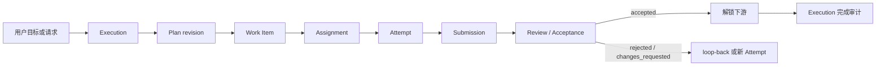
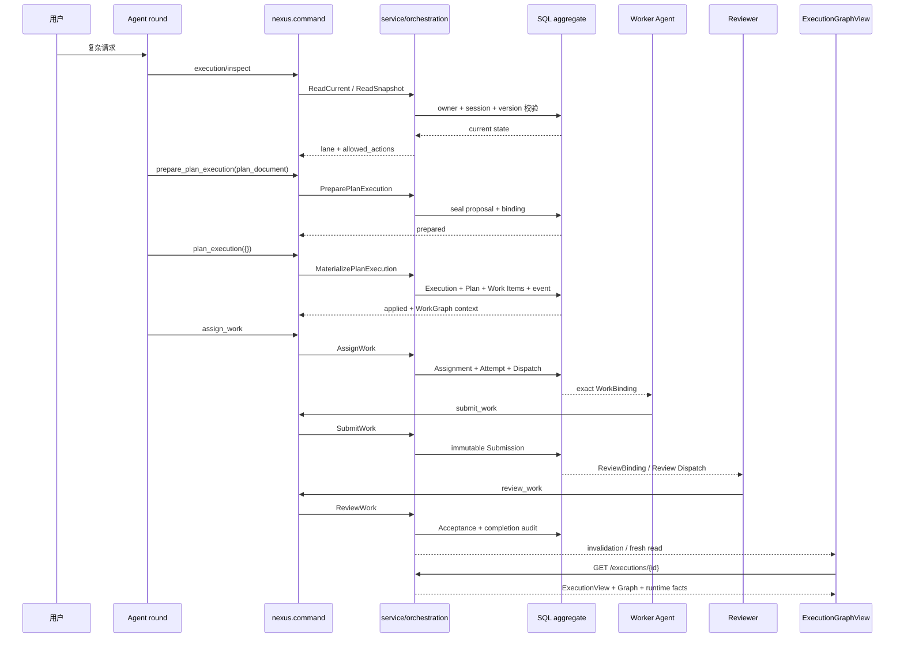

# Nexus WorkGraph：实现方案与使用说明

> 设计动机见[《WorkGraph：设计理念与问题定义》](./workgraph-design-principles.zh-CN.md)；包、表和关键函数的位置见[《代码解读与保护边界》](./workgraph-code-reading-report.zh-CN.md)。
>
> 合同以 [execution-orchestration-spec.md](../specs/execution-orchestration-spec.md)（责任编排、Goal 绑定、operation、事务与非目标）和 [execution-graph-spec.md](../specs/execution-graph-spec.md)（Runtime Graph、只读投影、命名工作图）为准；本文只讲运行路径与用法，代码与测试优先于本文。

## 1. 概览

WorkGraph 是 Nexus 保存复杂工作的**持久责任图**：把目标拆成带交付物和验收条件的 Work Item，记录依赖、负责人、尝试、交付、验收和失败后的继续方式。

两类信息分开保存：

| 层 | 回答的问题 | 组成 |
| --- | --- | --- |
| 责任层 | 应该完成什么、谁负责、何时可继续 | `Execution`、`Plan`、`Work Item`、`Assignment`、`Attempt`、`Submission`、`Review Dispatch`、`ReviewBinding`、`Acceptance` |
| 运行层 | Agent 实际运行时发生了什么 | Agent round、Subagent、Tool、Gate 的 Runtime Graph 事实 |

前端 `ExecutionGraphView` 只是两层的只读合并，不能创建任务、授予权限、触发重试或改写责任关系。类型见 [internal/protocol/execution.go](../../internal/protocol/execution.go) 与 [internal/protocol/execution_view.go](../../internal/protocol/execution_view.go)。

最小闭环如下；每个阶段都有持久身份和事务边界，模型不能用一条自然语言回复跳过：



## 2. 核心对象

字段、状态枚举和约束的权威定义见 orchestration spec §3（Durable aggregate）与 graph spec §4–§5；下表只给职责和代码入口。

| 对象 | 职责 | 代码 / 表 |
| --- | --- | --- |
| Goal | 跨轮最终目的：objective revision；`active`/`paused`/`complete`/`blocked` 与预算/用量限制等生命周期；continuation；用量累计与完成前 alignment；Goal-only 也能持续推进 | [internal/protocol/goal.go](../../internal/protocol/goal.go)、[internal/service/goal](../../internal/service/goal)；`session_goals`、`goal_events` |
| Execution | 一条受管编排历史的 durable aggregate：owner、session、DM/Room scope、coordinator、objective、completion criteria、Goal binding、状态、版本 | [internal/service/orchestration](../../internal/service/orchestration)、[internal/storage/orchestration](../../internal/storage/orchestration)；`executions` |
| Plan | Execution 的不可变 revision：Work Item 成员、position、parent、`required`/`terminal`、`hard`/`soft` 依赖、`exclusive`/`shared` 输出 claim | `execution_plan_*` |
| Work Item | 跨 revision 的业务责任身份；kind 为 `produce`/`review`/`verify`/`integrate` | `execution_work_items`、`execution_work_item_specs`、`execution_work_item_states` |
| Assignment | 当前责任归属；`assignment_strategy` 为 `self` 或 `room_member`，并记录 `assigned_by_agent_id`、`return_to_agent_id` 及 dispatch/takeover/release/completion 的版本和原因 | [command_assignment.go](../../internal/service/orchestration/command_assignment.go)；`execution_work_assignments` |
| Dispatch / WorkBinding | Dispatch 是先持久化再投递的 outbox；WorkBinding 是宿主签发的 exact `Execution → Plan → Work Item → Assignment → Attempt → Dispatch` 运行权限 | `execution_dispatches` |
| Attempt | 一次真实执行；重做产生新 Attempt，旧的不覆盖 | `execution_attempts` |
| Submission / Review Dispatch / ReviewBinding / Acceptance | append-only 交付声明 → 投递给 Reviewer → 只授权审这一条 Submission → `accepted`/`rejected`/`changes_requested` 决策 | [command_submission.go](../../internal/service/orchestration/command_submission.go)、[command_review.go](../../internal/service/orchestration/command_review.go)、[storage/.../submission.go](../../internal/storage/orchestration/submission.go) |
| Runtime Graph | 已发生的 Agent/Subagent/Tool/Gate 运行事实；不把 Goal、Plan、Work Item 或 Message 当成 runtime node | [service/.../runtime_graph.go](../../internal/service/orchestration/runtime_graph.go)、[storage/.../runtime_graph.go](../../internal/storage/orchestration/runtime_graph.go) |
| ExecutionGraphView | 责任图与 Runtime Graph 在一次安全读取中的只读合并 | `execution_view.go` |

使用时需要记住的几条：

- **Goal 不负责**：保存 Work Item；代替 Assignment 或 WorkBinding；根据人数、`@member` 或某次 Tool 调用推断"已进入 WorkGraph"；把旧 Plan 的责任搬到新 Plan 或 successor Execution。
- **没有 active Plan 或 Work Item 的 Execution** 只是 bootstrap/reconciliation 状态，公共读取接口不把它当工作图返回。
- **Plan revision**：一个 Execution 同时最多一个 active Plan；replan 写入新 revision，旧 revision 保留为历史。
- **Plan 写入两步走**：模型提交 `nexus_plan: 1` YAML，`prepare_plan_execution` 解析、校验并封存 proposal；`plan_execution` 用宿主持有的 proposal identity 在事务中创建 Execution、Plan 和 Work Item。见 [plan_proposal.go](../../internal/service/orchestration/plan_proposal.go)、[plan_materialization.go](../../internal/service/orchestration/plan_materialization.go)、[operation/plan.go](../../internal/mcp/command/execution/operation/plan.go)。Plan Mode 只设计和校验，不改变责任、不启动 Agent。
- **Work Item 状态**：只持久化 `open`/`waiting_input`/`cancelled`/`superseded`；`ready`、`assigned`、`running`、`submitted`、`accepted` 由当前 Plan、依赖和责任记录推导。Agent 的局部 Task 只是行动，不是 Work Item。
- **解锁规则**：hard dependency 只在上游 Submission 被判定为 `accepted` 后解除。Attempt 成功、Submission 写入或 Agent 说"完成了"都不能解锁下游。
- **一个 owner**：一个 Work Item 同时最多一个 current Assignment。接管先释放/中断旧责任链，再创建新 Assignment 和 Attempt。
- **授权凭证**：Room membership、coordinator 身份、图上头像、`<assigned_work>` 文本都不能代替 WorkBinding。Reviewer 用独立 ReviewBinding，不因评审获得 worker Assignment。
- **Attempt 身份**：根 Attempt 保存 runtime session、runtime round、Agent round、executor agent；Subagent Attempt 另存 parent Attempt、child session、SDK task 和 Tool use identity。同一物理 round 串行承担多个 Work Item 时，按 exact assignment/attempt 区间分责，不按头像、时间邻近或自然语言猜。约束见迁移 `00061`、`00067_execution_attempt_root_round_identity.sql`、`00100_execution_attempt_assignment_round_identity.sql`。
- **Acceptance 结果**：`accepted` → 解除硬依赖，写入或唤醒 completion audit receipt，当前 coordinator round 重读 Execution/Goal state 判断是否完成。`rejected`/`changes_requested` → 原 Submission 与 Gate 保留，形成 loop-back 或 fresh Attempt，下游继续锁定。
- **Runtime 边**：`retry` 只表示 Agent 已有 exact previous identity 并发起了新 Run，不是服务端自动重试授权。
- **画布**：未开始的 Work Item 显示为 planned placeholder；每个 root Attempt 是独立 Agent 轮次节点，每个 child Attempt 是独立 Subagent 节点，每条 Submission 有自己的 review Gate；Tool/Subagent/Gate 只按 exact identity 归属；超出投影上限（graph spec §4.5）时用 `total`/`truncated` 明示。`ExecutionWorkGraphCanvas`、布局、检查器、运行历史和 Artifact 打开动作只消费该 read model，不能回写 Plan，也不提供"点击节点即分配/重试"。

## 3. Goal 与 WorkGraph 的复用

三种产品模式（Goal-only、WorkGraph-only、Goal + WorkGraph）与五种绑定解析状态（`standalone`/`reserved`/`pending`/`confirmed`/`conflict`）见 orchestration spec §2.1–§2.2。要点：只有 `confirmed` 才启用 Goal/WorkGraph 联动；Goal-only 的 continuation 不需要绑定；`pending`/`conflict` fail closed。

### 3.1 Goal 进入 WorkGraph 的顺序

1. Goal service 创建或更新 Goal，得到 exact Goal ID 和 objective revision；
2. 本轮以 `goal_binding=current` 把 exact Goal authority 带入 Plan proposal；
3. `prepare_plan_execution` 封存 proposal；
4. `plan_execution` 在同一责任边界内 materialize Execution/Plan/Work Items；
5. Goal 侧写 pending confirmation，Execution 侧完成 authoritative mutation；
6. 反向确认成功后才是 `confirmed` 双向绑定。

模型不能在同一意图里并行 create Goal 和 prepare Plan：Plan 依赖服务端已确认的 Goal identity/revision。

先有 transient WorkGraph、后出现明确 Goal 意图时，走 `promote_execution_to_goal`：保留原 Execution、Plan 和历史，不另建第二张图。见 [promotion.go](../../internal/service/orchestration/promotion.go)、[internal/service/goalexecution](../../internal/service/goalexecution)。

### 3.2 复用与不复用

| WorkGraph 复用 Goal 的 | WorkGraph 不复用 / 不替代的 |
| --- | --- |
| owner、objective revision、completion criteria、生命周期校验 | Goal 不承担 Work Item、Assignment、Attempt、Submission |
| continuation 的 durable receipt、lease、claim、settle/retry 恢复 | 不从 transcript、旧 Plan 或聊天正文重建 Goal objective |
| `goal/runtimeusage` 的用量转换、累计、最终结算 | Goal retarget 不把 predecessor 的 Assignment/Attempt/ReviewBinding 搬到 successor |
| 完成前 alignment 审计 | `audit_execution_alignment` 不替代 Goal 的 `audit_objective_alignment` |
| DM/Room 的 owner、lead、scope、session 认证与持久身份 | 依赖和 Acceptance 不会被 continuation 的"有回复"或"工具成功"替代 |

### 3.3 Plan 的三层含义

- **Plan Document**：模型提交的输入格式。
- **ExecutionPlanRevision**：服务端持久化的权威版本。
- **ExecutionGraphView**：前端读取的投影。

一句话：Goal 决定"为什么做、做到什么算完成"；Plan 决定"这一次经过哪些责任节点"；WorkGraph 是 Plan materialize 后可分配、可交付、可验收的责任图。

## 4. 执行流程

以"研究、实现、验证、交付"为例。各 operation 的原子语义见 orchestration spec §6；lane 与入口见 §5。

### 阶段 A：选择执行结构

`execution-orchestrator` Skill 先判断任务是否需要 WorkGraph，需要时区分：

- `/workgraph <request>`：只为当前请求启用一次，不保存命名模板；
- `/<saved-slash> <request>`：读取内置或 owner 保存的模板，每次创建 fresh Execution/Plan/Work Item identity；
- Goal + WorkGraph：先创建或更新 Goal，再用 `goal_binding=current` materialize；
- Room：coordinator 分配；成员获得 exact WorkBinding 后才能提交。

入口见 [skills/execution-orchestrator/SKILL.md](../../skills/execution-orchestrator/SKILL.md) 与 [structure-selection.md](../../skills/execution-orchestrator/references/structure-selection.md)。

### 阶段 B：读取当前 Execution

Agent 先用 `nexus.command` 的 `execution/inspect`（代码中 `get_execution` 是 inspect 语义，不是可任意 invoke 的普通操作）读取可信 scope。结果包含：

- 当前 lane：coordinator、worker、reviewer 或 observation；
- `allowed_actions`；
- 当前 WorkBinding/ReviewBinding 支持的责任范围；
- ready、assigned、running、review、blocker 等上下文。

Room 普通成员只获得共享图观察，不因 inspect 获得写权限。当前 coordinator 的 inspect 建立本 physical round 的临时 coordination scope，durable authority 仍由后端重新校验。

### 阶段 C：准备并 materialize Plan

Agent 读取 fresh `prepare_plan_execution` contract，提交完整 YAML（字段边界见 orchestration spec §4）：

```yaml
nexus_plan: 1
operation: create
goal_binding: none
objective: "交付一份可验证的结果"
completion_criteria:
  - "最终交付满足约定验收条件"
items:
  - logical_key: scope
    kind: produce
    subject: "界定范围"
    objective: "明确边界和验收条件"
    deliverable: "范围简报"
    required: true
  - logical_key: implement
    kind: produce
    subject: "实现方案"
    objective: "根据范围完成主要实现"
    deliverable: "可运行的实现"
    depends_on:
      - key: scope
        kind: hard
    required: true
  - logical_key: validate
    kind: verify
    subject: "验证结果"
    objective: "按验收标准验证交付"
    deliverable: "验证记录"
    depends_on:
      - key: implement
        kind: hard
    required: true
  - logical_key: deliver
    kind: integrate
    subject: "整合并交付"
    objective: "生成最终交付物"
    deliverable: "最终交付"
    depends_on:
      - key: validate
        kind: hard
    required: true
    terminal: true
```

proposal ID 和 digest 由宿主持有。`plan_execution` 通常用空 input，由宿主选择 exact proposal；模型不能拿别人的 proposal ID。

### 阶段 D：分配与派发

Plan materialize 后才能 `assign_work`。后端按依赖、输出 claim、当前责任状态和 owner 权限判断是否 ready。

- `self` assignment 可由 coordinator/Agent 在 DM 中承担；
- `room_member` assignment 产生 durable dispatch；
- Subagent 只有在父 WorkBinding 下启动才是 managed child Attempt；
- 裸 `@member` 是通信，不是 Assignment；
- assignment 不能绕过未验收的 hard dependency。

Room dispatch 是 SQL 状态加 Room 投递 outbox，不能被 UI optimistic 状态替代。投递未知时保留可对账身份，不凭超时复制副作用。

### 阶段 E：Agent/Subagent 运行

每个 physical round 建立一个 round-scoped `nexus` MCP server，宿主把 owner、Agent、Session、Round、Goal authority、WorkBinding、ReviewBinding 和 Plan Mode 固定进 context（装配细节见代码解读 §2）。模型只提交：

```json
{
  "domain": "execution",
  "action": "invoke",
  "operation": "submit_work",
  "request_id": "stable-request-id",
  "input": {}
}
```

- `owner_user_id`、`agent_id`、`session_key`、`round_id` 和 Execution/Assignment/Attempt identity 不由模型输入提供。
- 每次 mutation 前读取 fresh contract；同语义重试复用 request identity；结果未知先 inspect/对账，不因没收到响应就提交新副作用。
- Subagent 使用同一 schema 的 `subagent` domain，底层复用 Agent/TaskOutput/TaskStop lifecycle。只有父 round 有 exact WorkBinding 时 child Attempt 才进入 managed WorkGraph；runtime-only child 不能满足交付或评审 Gate。

### 阶段 F：交付、评审、返工

Worker 成功后必须 `submit_work`。服务端确认：

- Assignment 仍 active 且 owner 正确；
- Attempt 属于同一 Execution/Plan/Work Item/Assignment 链；
- Attempt 状态为 succeeded；
- 当前 Work Item 没有未审 Submission；
- request/assignment/execution version 未过期。

随后 review dispatch 把 Submission 交给 reviewer；`review_work` 由 ReviewBinding 锁定 immutable Submission。Acceptance 后才解锁下游；changes requested 时保留原 Gate，返工生成新的 root Attempt 和新的 Submission/Gate。

### 阶段 G：完成与 Goal 收口

- 最后一个 required/terminal Work Item accepted 后，后端先写 completion audit receipt，再重读当前 Plan、blocker、Assignment 和 Goal binding，用 CAS 尝试完成。Execution completion 是独立的 authoritative transition，不能凭 UI"看起来都完成"结束。
- Execution 与 Goal `confirmed` 绑定时，当前物理 round 还要调用 Goal `audit_objective_alignment`，再由 Goal authority 调用 `update_goal` 完成 Goal。
- Goal-only 不要求 WorkGraph Gate；WorkGraph-only 不会因同 session 有普通 Goal 而自动绑定。

### 代码级时序



## 5. Agent 的视角

### 5.1 能看到什么

普通 mutation 返回有界的 `execution_context`：当前 responsibility、review、action、blocker 和下一步建议。成功 Tool 的历史不会自动回放进模型上下文；需要恢复时通过 `get_execution`/inspect 读取。这样上下文不会逐轮膨胀，模型也不会把"上次工具成功"当成"当前 Assignment 仍有效"。画布上的运行事实不会自动进入 prompt。

### 5.2 各 lane 能做什么

| lane | 允许的事情 |
| --- | --- |
| coordinator | inspect、prepare/materialize Plan、assign、takeover、review dispatch、协调当前 Execution |
| worker | 在 exact WorkBinding 下执行一个 Work Item、启动受管 child、submit、block/resume |
| reviewer | 在 exact ReviewBinding 下评审一条 immutable Submission |
| Room observation member | 读取有限共享图；不能因成员身份写 Plan、Assignment、Submission 或 Acceptance |
| runtime-only Subagent | 对话协助和运行观察；不能满足交付 Gate |
| hidden editor Agent | 只修改/选择 Draft revision，不执行草图中的业务任务 |

UI 的"负责人""当前节点""头像"和 `<assigned_work>` 都是投影或提示。后端每次 mutation 都重新验证 exact binding 和 SQL state。

### 5.3 控制命令与执行工具

Bash、Read、Grep、WebSearch、浏览器等是执行工具；WorkGraph operation 是控制平面命令，在运行图中分层展示（规则见 graph spec §6）：

- `assign_work`、`submit_work`、`review_work` 等控制 transport 通常只留作 owner detail 审计；
- 真实失败、取消、中断、带 Artifact 的用户可观察动作可提升到画布；
- Review Gate 由 durable Submission/Acceptance 表达，不把 `submit_work` 调用画成业务节点；
- `MEMORY.md`/`memory/` 维护、普通成功读取和工具发现不占主图节点配额。

### 5.4 HTTP 与 Web

HTTP 只读取投影、处理 Draft/命名图的确认保存；owner 来自认证 context，不能由正文指定。画布、检查器和编辑器只读；分配、提交、评审、重试和改图都走当前 Agent round 的 `nexus.command`。即：**HTTP/Web 展示服务端事实，Agent command 才能改变责任状态。** 路由与前端文件见代码解读 §1。

## 6. 命名 WorkGraph

执行中的 WorkGraph 和可复用命名图是两个 aggregate：前者含运行身份和历史，后者只保存重新创建 Work Item 所需的语义契约。HTTP 与保存合同见 graph spec §7.2；提炼入口条件、模型输入和宿主校验见代码解读 §4。

### 6.1 提炼

- 来源必须是 exact owner/session/execution 的 `completed` Execution，且 active Plan 含 Work Item；同一 source 已有 Draft 时直接复用，不重复调用模型。
- 模型只看到抽象所需的责任节点结构，看不到 Tool I/O、凭证、结果正文、Artifact 内容或 Assignment/Attempt/Submission/Review/Acceptance 事实。
- 分工：模型负责语义抽象（把具体主题、项目名、路径改写成可复用阶段职责，并选 `key` 或 `collaboration` 角色）；宿主负责结构保真与 fail closed（不得增删、合并、拆分或虚构节点）。

### 6.2 Draft 版本与保存

- 首次提炼产生 revision 1 的 durable Draft。
- 每次完整修改追加不可变 version。选择旧版本只改 `selected_revision`，不删除更新版本；下次修改仍以 `head_revision` 做 CAS。
- 保存时服务端读取 selected preview，核对 owner、source session、revision、命名冲突和完整图，再把命名图 aggregate 与 Draft 保存标记在同一事务提交。
- UI 保存不启动隐藏模型 round；普通对话保存走 `save_workgraph_preview`。两条入口最终调用相同的 `SavePreview`/`ConfirmSave` 事务边界。

### 6.3 隐藏编辑 DM

编辑器是 owner 的 Nexus 主 Agent 承载的隐藏、可恢复、不进入普通会话目录的临时 DM（用途 `workgraph_editor`）。该 Session：

- 不继承来源 DM/Room 的 transcript、Connector、workspace 或权限；
- 只允许 `execution-orchestrator` Skill、`AskUserQuestion` 和受限 `mcp__nexus__command`；
- 只暴露 `revise_workgraph_preview` 和 `select_workgraph_preview_revision`；
- 每次修改提交完整草图，不提交 diff；
- revision 冲突、DAG/父子环、缺 key path 或缺 terminal delivery 时失败；
- 关闭页面不删除，只有显式 close 才删除。

### 6.4 复用时创建什么

- 命名图或内置模板只提供：抽象后的 objective/completion criteria；Work Item kind、subject、objective、deliverable、acceptance criteria；parent 结构；hard/soft 依赖模板。
- 每次 `/<command> <request>` 都新建 Execution、Plan revision、Work Item identity、Assignment/Attempt/Submission/Acceptance 和 Runtime Graph identity。
- 不复制源图的 Agent、Assignment、Attempt、状态、结果、Artifact 或审核结论。
- 内置模板只读加载，不写 owner 数据库。

## 7. 失败处理

事务、幂等与对账的合同见 orchestration spec §8；取消与接管的代码路径见代码解读 §3。

| 情况 | 处理 |
| --- | --- |
| Plan proposal 不合法（schema、字段、依赖、输出范围、Goal binding） | 不 materialize；模型收到带 `document_contract` 的结构化拒绝，应重新生成完整文档，不逐字段猜补 |
| Assignment/Attempt 过期（他人 takeover、Execution superseded、Plan revision 变化、Goal retarget 产生 successor） | 旧 round mutation 返回 `superseded` 或 binding conflict；不能用旧身份写新图，也不自动重放 |
| Submission 结果未知（断网、进程消失） | "没收到结果"不等于"没执行"。先用原 request identity 和 exact Execution/Attempt 对账；只有服务端证明未提交，新 round 才决定是否新建 Attempt |
| Reviewer 驳回 | 旧 Submission/Acceptance/Gate 保留，新 Attempt 和 Submission 使用新 identity；`retry`/`loop_back` 只在有 exact previous run/return identity 时出现 |
| Completion audit 中断 | Review transaction 先写 `execution_completion_audits` receipt；重启或断连后后台按 receipt 重读 Plan 和 blocker，再用 CAS 完成；不凭最后一条消息标记 completed |

不变量与非目标的完整清单见 orchestration spec §9–§10 与 graph spec §9–§10。

## 8. 对外介绍（30 秒版）

"Nexus 的 WorkGraph 是一张可恢复的责任图。它把复杂目标拆成有交付物和验收条件的 Work Item，用依赖控制并行和顺序，用 Assignment/Attempt 记录谁在做、做了几次，用 Submission/Acceptance 区分完成和真正验收。前端看到的是责任事实和运行事实的只读合并，失败、返工和多 Agent 协作都保留完整历史。"

## 9. 验收范围

当前测试覆盖本地包、协议、HTTP、消息投影和前端行为。signed desktop、外部 Provider、多副本恢复、生产规模性能和安全红队仍需单独验收。
