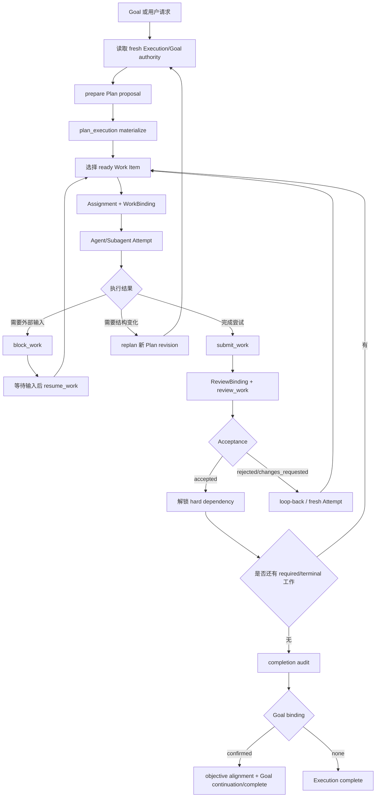

# Nexus WorkGraph：设计理念与问题定义

> 本文回答“为什么要这样设计 WorkGraph”。重点是长程任务的失稳问题、WorkGraph 与普通任务图的区别，以及 Goal、Task、Subagent 如何在同一套理念下协作。
>
> 代码结论以 `internal/`、`db/migrations/`、`skills/execution-orchestrator/` 和 `docs/specs/` 为准。设计目标、评估方法和未验收部分会单独标出。

## 摘要

公开评测反复暴露出几类问题：Agent 会偏离目标，丢掉中间状态，记不住跨会话信息，无法稳定使用外部工具，多 Agent 之间也难以确认责任和完成条件。短任务里，这些问题不明显；任务一长，任何一环出错都可能让后续工作失去依据。

WorkGraph 把长期任务拆成两条线：一条保存责任和验收，一条记录实际运行。它和普通 planner 的区别是，图上的节点不只是“下一步做什么”，还记录谁负责、做过哪次尝试、提交了什么、是否通过验收。它和 runtime trace 的区别是，责任图能决定哪些工作可以解锁，哪些结果还不能算完成。

对象关系可以先记成一条链：`Goal → Execution → Plan → Work Item → Assignment → Attempt → Submission → Acceptance`。Runtime Graph 记录实际运行，Draft/Workflow 保存可复用的责任结构；具体字段和代码路径放在后文实现说明与代码报告中。

长程稳定性来自持久责任、明确身份、追加历史、有限重试、投递对账和 Goal continuation。Agent 负责理解问题、选择工具、拆分工作和决定返工；宿主负责身份、权限、状态转换、幂等、验收和恢复。

## 1. 基础问题：长程任务最先丢失的不是能力，而是三个事实

长程任务不稳定，表面上可能表现为“Agent 做偏了”“中途忘了”“压缩后质量下降”“Subagent 结果找不到”或“重启后不知道从哪里继续”。这些现象可以归并为三个更基础的问题：

1. **目标偏移（goal drift）**：系统仍在行动，但行动逐步偏离用户真正要达成的目标、完成标准或当前目标版本。
2. **中间过程丢失（process loss）**：系统知道最终目标，却丢失了已经完成什么、谁负责什么、哪些结果有效、哪些依赖尚未解除。
3. **上下文压缩导致的信息损失（context loss）**：模型上下文被截断、摘要化或跨 round 重建后，仍需做正确决策，但原始对话不能无限携带。

这三个问题比“如何调用更多 Agent”更基础。多 Agent、Subagent、Goal、Tool、Room 和 UI 都只是执行环境；如果这三类事实失真，增加更多 Agent 只会让偏移、丢失和压缩后的不一致传播得更快。

### 1.1 外部研究显示：长程失败不止是“记忆不够”

公开评测集中暴露了以下问题。它们说明长程任务会在哪里失败，不代表 Nexus 已经通过了这些评测。

| 问题类别 | 外部研究 | 对系统的要求 | WorkGraph 对应机制 |
| --- | --- | --- | --- |
| 目标和约束会漂移 | [AgentBench](https://arxiv.org/abs/2308.03688) 把长期推理、决策和指令遵循列为主要障碍；[WebArena](https://arxiv.org/abs/2307.13854) 的真实网站任务端到端成功率远低于人工 | 每轮重新核对目标、版本、约束和完成标准 | Goal objective/revision、completion criteria、alignment、Goal authority |
| 中间状态和环境会变化 | [OSWorld](https://arxiv.org/abs/2404.07972) 暴露跨应用操作和 GUI grounding 问题；[SWE-bench](https://arxiv.org/abs/2310.06770) 要求跨文件处理真实 issue | 保存责任、依赖、工作区状态和验证结果；环境变化后允许重规划 | Execution、Plan revision、Work Item、Attempt、Runtime Graph、replan |
| 上下文和长期记忆不可靠 | [LongMemEval](https://arxiv.org/abs/2410.10813) 测试多会话、时间更新和拒答；[MemGPT](https://arxiv.org/abs/2310.08560) 采用分层记忆 | 关键状态不能只放 transcript；压缩后仍能恢复 | 持久快照、`RenderExecutionContext`、已接受事实和版本栅栏 |
| 多 Agent 的责任难以确认 | [多智能体综述](https://arxiv.org/abs/2402.01680) 将角色、通信和一致性列为独立问题；[AutoGen](https://arxiv.org/abs/2308.08155) 提供可配置对话编排 | 结果必须能追溯到负责人、父任务和评审者 | Assignment、parent/child Attempt、Subagent admission、WorkBinding、ReviewBinding |
| 工具副作用和权限可能失控 | [τ-bench](https://arxiv.org/abs/2406.12045) 按最终数据库状态评估工具行为；[AgentDojo](https://arxiv.org/abs/2406.13352) 展示工具数据中的提示注入风险 | 区分已应用、未应用和未知；授权不能从普通文本或工具结果中产生 | request identity、receipt、outbox、unknown、reconciliation、capability fence |
| 失败后的验收、成本和终止不可靠 | [Reflexion](https://arxiv.org/abs/2303.11366) 保存失败反馈；[METR](https://arxiv.org/abs/2503.14499) 用时间跨度衡量长任务可靠性 | 失败要能返工，完成要有证据，loop 要有预算和终止条件 | Submission/Review/Acceptance、completion audit、usage、deadline、lease、no-progress |

公开研究说明，长程任务的问题不止是记忆长度。任务越长，目标、过程、环境、协作、外部副作用和验收越容易同时出错。下面先讲其中最基础的三个事实，再说明 WorkGraph 如何补上权责、外部状态和验收这些控制条件。

### 1.2 基础问题一：目标偏移

目标偏移不只来自模型理解错误。长程任务中至少有四种偏移：

- **局部优化偏移**：Agent 完成了眼前 Work Item，却没有回到整体完成标准。
- **目标版本偏移**：用户已经 retarget 或修改 objective，旧 round 仍按旧 objective 继续。
- **协作边界偏移**：Subagent 或 Room 成员把局部产出当成最终交付，越过了 coordinator/reviewer 的责任边界。
- **完成判定偏移**：工具成功、Attempt 成功或有一条回复，被错误当成 Goal 已完成。

所以长程系统不能只把 objective 放进 prompt。它还要保存可核对的目标事实：Goal ID、objective revision、completion criteria、confirmed Goal/Execution binding，以及当前 round 可使用的 Goal authority。

代码中的对应机制是：

- `internal/service/goal/alignment.go`：完成前的 objective alignment；
- `internal/runtime/goal_authority.go`、`responsibility_authority.go`：当前 physical round 的 Goal/责任 authority；
- `internal/service/orchestration/goal_binding.go`、`goal_confirmation_recovery.go`：Goal/Execution 双向绑定和确认恢复；
- `internal/service/orchestration/execution_transition.go`：禁止旧 Plan revision 改写既有 objective 或 completion criteria；
- `internal/service/goal/objective_transition.go`：Goal retarget 时推进 objective revision，并封住旧责任边界。

### 1.3 基础问题二：中间过程丢失

中间过程丢失不在于日志少，而在于已经发生的业务事实没有稳定身份。没有稳定身份，系统无法区分：

- 这项工作尚未开始，还是已经运行但 ACK 丢失；
- Subagent 结果属于哪个父 Attempt；
- 一个 Submission 是否已经被 Review；
- 下游依赖等待的是 Attempt 成功，还是 Acceptance；
- 当前负责人是仍然 active，还是已经 release/takeover；
- 重启后应该恢复原 Attempt，还是创建新 Attempt。

WorkGraph 的做法是把中间过程提升为责任链：

```text
Execution
  → Plan revision
    → Work Item
      → Assignment
        → Attempt
          → Submission
            → Review / Acceptance
```

每个阶段都有自己的持久身份和状态边界。运行日志、聊天消息和 Tool output 可以作为证据，但不能代替这条责任链。

代码中的对应机制是：

- `internal/protocol/execution.go`：责任对象和状态类型；
- `internal/service/orchestration/command_assignment.go`：Assignment/Attempt；
- `command_submission.go`、`command_review.go`：Submission/Acceptance；
- `internal/service/orchestration/work_binding.go`：精确执行授权；
- `internal/service/orchestration/completion_audit_recovery.go`：完成审计中断后的恢复；
- `internal/service/orchestration/background_coordinator.go`：Room、Review、Cancellation、Subagent 和 saga recovery 的后台回路。

### 1.4 基础问题三：上下文压缩导致的信息损失

上下文压缩有两种不同情况：

1. **表达层压缩**：原始对话太长，需要摘要或只保留局部历史。
2. **生命周期切换**：当前 physical round 结束，新的 round、Subagent 或 Goal continuation 重新开始，原始上下文不再直接可用。

如果系统只依赖 transcript，就会把“上下文摘要”误当作“业务状态”。摘要可能丢掉依赖、版本、阻塞原因、验收结果、权限和未知副作用。反过来，如果每轮都回放全部历史，模型上下文会膨胀，重要事实反而被淹没。

WorkGraph 采用第三种方式：**把需要跨上下文保留的内容写成结构化持久状态，在每个 round 重新生成有界的权威执行上下文。**

`internal/service/orchestration/context.go` 的 `RenderExecutionContext` 会根据当前 actor 和 snapshot 投影：

- canonical objective 和 completion criteria；
- 当前 lane、allowed actions、WorkBinding/ReviewBinding；
- 当前 Assignment、Attempt、blocker 和可恢复动作；
- 已接受的依赖解锁，而不是未验收的结果正文；
- 有界 Runtime Graph observed facts；
- Subagent admission、terminal evidence 和当前协调上下文。

`internal/service/orchestration/runtime_context_facts.go` 明确把 runtime facts 标记为 observed facts，不让它们自动产生路线、重试或工具建议。这样，压缩损失的是表达冗余，而不是责任、版本和验收事实。

这条原则也解释了为什么系统不把所有成功 Tool 都回放给模型：模型需要的是当前可行动事实，而不是一份无法核对的历史流水账。

### 1.5 三个问题之间的因果关系

三个问题会互相影响，常见链路是：

```text
上下文压缩
   ↓ 丢失目标版本、责任、依赖和验收事实
中间过程丢失
   ↓ 无法知道当前真正完成到哪里
目标偏移
   ↓ Agent 继续做局部正确但整体错误的事情
```

也可能沿反方向发生：目标已经发生变化，但没有 objective revision fence，旧过程继续运行，最后在上下文压缩时把错误的旧状态摘要成“当前事实”。

设计还要回答：

- 当前目标的权威版本是什么？
- 当前责任事实是什么？
- 当前 round 需要恢复哪些最小信息？
- 哪些事实可以被压缩，哪些事实必须原样保留？
- 一个不确定结果如何被确认，而不是被猜测？

### 1.6 三个事实的覆盖边界

这三个事实是长程任务的基础层，但不是全部控制问题。它们回答的是：**跨 round、跨上下文和跨进程之后，系统还必须记住什么。** 如果把所有问题都压缩成这三个事实，反而会掩盖四类不能被简单归并的控制事实：

| 不能被三个事实完全吸收的控制事实 | 它回答的问题 | WorkGraph 的独立机制 |
| --- | --- | --- |
| 权责事实 | 谁可以代表谁行动？哪个 Agent 对哪个交付负责？ | owner/Agent/role、Assignment、WorkBinding、ReviewBinding、Subagent admission |
| 外部世界事实 | 工具或第三方系统到底发生了什么？请求是已应用、未应用还是未知？ | request identity、receipt、outbox、unknown、reconciliation |
| 交付证据事实 | “做过”为什么算完成？谁独立确认？下游何时可以解锁？ | Submission、Review、Acceptance、completion audit、hard dependency gate |
| 资源与安全事实 | 是否应该继续运行？预算、期限、权限和风险是否仍允许？ | usage、deadline、lease、no-progress、suppression、capability fence |

三个基础事实和控制事实分工不同，两层合在一起，任务才有可能稳定运行：

```text
要记住的事实：方向、过程和可恢复信息
                       ↓
要证明的事实：权责、外部状态、交付证据和资源/安全
                       ↓
              下一轮可安全行动
```

这一区分也决定论文的严谨表述：**目标偏移、过程丢失、上下文损失是长程任务最先失真的三个基础事实；它们足以解释为什么系统会失去方向和连续性，但不足以单独证明权限正确、外部副作用已对账、交付已验收或任务应该继续。**

### 1.7 从问题到设计要求

外部研究和代码问题可以归并为十条要求。前四条保证事实连续，后六条保证任务能安全推进：

1. **方向稳定**：每轮都能核对 Goal objective、completion criteria 和 revision。
2. **过程连续**：Execution、Plan、Work Item、Assignment、Attempt、Submission 和 Acceptance 有稳定身份。
3. **上下文可恢复**：压缩、round 结束或进程退出后，仍能取回责任、版本、验收和恢复句柄。
4. **环境可适应**：外部状态变化后可以重新观察、阻塞、重规划或接管。
5. **协作可归属**：每个 Subagent 结果都能反查父 Attempt；每个交付都有负责人和评审者。
6. **副作用可对账**：外部工具、Room 投递和文件交付区分 applied、not_applied、unknown。
7. **交付可证明**：Attempt 成功或工具成功不能代替 Review、Acceptance 和 completion audit。
8. **成本和终止可控**：usage、deadline、lease 和 no-progress 防止 loop 无限运行。
9. **权限可收敛**：模型指令、观察数据、宿主授权和副作用写入分别受控。
10. **状态可观察、可接管**：长历史要标记 partial/truncated/stale；等待人工或外部资源时进入 blocker。

这些要求共同解释了为什么系统需要 Goal、责任图、Runtime Graph、结构化上下文、绑定、版本检查、outbox、回执、lease 和验收门。

### 1.8 非目标

WorkGraph 不试图：

- 把所有聊天消息都变成图节点；
- 把每次 Bash、Read 或搜索都持久化成业务责任；
- 把 UI 画布变成可直接编辑的白板；
- 用 WorkGraph 替代 Goal 的长期生命周期；
- 用输出 claim 代替操作系统文件锁；
- 让服务端按照超时自动重放未知副作用；
- 用一次摘要或一次模型回复证明长程任务已经完成；
- 证明所有外部 Provider、桌面打包和生产多副本环境都已验收。

## 2. Related work：已有方法解决到哪一步

已有方法各自解决了一部分问题。它们关注推理、记忆、协作、计划或运行观察，保存的对象和保证的结果并不相同。下面只比较与 WorkGraph 直接相关的部分。

### 2.1 推理和反思方法：擅长选择下一步

ReAct 让模型在思考和行动之间循环；Plan-and-Execute 把整体计划和局部执行分开；Reflexion 把失败反馈带到下一次尝试。这些方法改善了策略，但不能单独回答四个运行问题：副作用是否已生效，谁对交付负责，结果是否已被接受，重启后该从哪次尝试继续。

WorkGraph 把这些运行事实写进 `Plan revision`、`Assignment`、`Attempt`、`Submission` 和 `Acceptance`，再用 request identity、CAS、receipt 和 reconciliation 处理恢复。

### 2.2 长期记忆：解决信息取回，不解决责任验收

MemGPT 把上下文分成不同层级；LongMemEval 则分别测试索引、检索、时间更新和拒答。这些工作说明，完整 transcript 不能承担长期状态。它们主要回答“模型应该想起什么”，没有直接解决“谁负责、是否交付、下游何时解锁、未知副作用如何对账”。

WorkGraph 只为执行控制面保存必要快照：目标版本、责任、依赖、阻塞、验收和恢复句柄。普通 transcript 和个人长期记忆仍是独立系统。

### 2.3 多 Agent 编排：解决消息协作，不解决责任归属

AutoGen 把 Agent、工具和人类介入组合成可配置的对话。它适合探索协作方式，但自由对话会留下几个空白：重复劳动、结果覆盖、子 Agent 找不到父任务、协调者直接宣布完成，以及没有稳定的终止条件。多智能体综述也把通信、角色和一致性列为独立问题。

WorkGraph 增加一层责任归属：Subagent 挂在父 Attempt 下；Worker 持有 WorkBinding；Reviewer 持有 ReviewBinding；Acceptance 解锁依赖；Room 消息只提供上下文。

### 2.4 DAG 和运行追踪：解决结构或观察

静态 DAG 适合表示先后关系，运行追踪适合记录调用链，画布适合展示状态。它们的节点含义不同：DAG 通常没有 Submission/Acceptance 历史，运行追踪通常没有业务责任和授权，画布也不应直接成为写权限。

WorkGraph 同时维护三种相关事实：Plan revision 表示计划结构，责任图表示归属和验收，Runtime Graph 表示实际运行。图的作用是让这三类事实共享稳定身份，能够恢复、对账和复用。

### 2.5 WorkGraph 补上的一层

| 路线 | 主要解决 | 仍缺的长程控制事实 | WorkGraph 的补充 |
| --- | --- | --- | --- |
| ReAct / Plan-and-Execute | 推理与局部行动策略 | 跨 round 的责任、验收、未知状态 | 持久责任链与状态门 |
| Reflexion / 记忆增强 | 从反馈中改进下一次行动 | 反馈是否已落到某个 Attempt，是否可作为交付证据 | Attempt/Review/Acceptance 历史 |
| MemGPT / 长期记忆 | 在有限 context 下索引和读取信息 | 业务状态、授权和副作用的证明 | 结构化 snapshot 与 authority fence |
| AutoGen / 多 Agent 对话 | Agent、工具、人类的协作拓扑 | 归属、接管、冲突、信用、终止 | parent-child admission、Binding、Outbox |
| 静态 DAG / 运行追踪 | 计划结构或调用观察 | 计划变化、结果验收、恢复和复用 | immutable Plan + Runtime Graph + Recovery Loop |

WorkGraph 把 Goal、Task、Subagent、计划、运行、验收和恢复放到同一条可追溯的执行链上，同时让 Agent 自己选择策略。

## 3. 动机：为什么需要一条统一的责任控制回路

只保存目标，系统会丢掉过程；只保存过程，压缩后仍可能读错状态；只保存记忆，工具成功也可能被误当成任务完成。WorkGraph 因此同时记录目标、责任、协作归属、验收和恢复状态。

设计可以归纳成一句话：

> **Agent 的自主性可以保留在“下一步做什么”这一决策层；长程稳定性必须由宿主把“谁对什么负责、什么被接受、什么可以继续、未知结果如何对账”提升为持久责任状态。**

这带来一个重要的分工：

| 问题 | Agent 自主决策 | 宿主权威控制 |
| --- | --- | --- |
| 如何理解用户意图 | 是 | 校验输入边界 |
| 如何拆解当前工作 | 是 | 解析并校验 Plan Document |
| 具体使用什么工具 | 是 | 记录 verified runtime facts |
| 是否启动 Subagent | 是 | 校验 parent authority 和 admission |
| 谁可以执行哪个 Work Item | 提议/请求 | 由 Assignment + WorkBinding 决定 |
| 是否可以提交 | 请求 | 校验 Attempt、Assignment 和版本 |
| 是否真正通过 | 不能自行决定 | Reviewer + Acceptance 决定 |
| 是否继续 Goal | 提议下一步 | Goal continuation 状态机和 receipt 决定 |
| 失败后是否重放副作用 | 不能自行猜测 | 先按 exact identity 对账 |

模型仍然负责理解问题、选择结构和行动策略。平台只把语言难以可靠表达的部分落到持久对象、版本检查、回执和能力边界上。

## 4. 设计方法：用一条持久责任回路支撑长程协作

前面的研究和问题定义说明了长程任务为什么会失稳。本章集中说明我们的设计方法：把目标、计划、责任、运行、交付和验收放进同一条可恢复的回路。

### 4.1 统一执行回路：Task、Subagent、Goal 如何协同

#### Goal：长程目标和 continuation 控制器

`Goal` 负责：

- objective 和 objective revision；
- completion criteria；
- active/paused/complete/blocked 等生命周期；
- continuation 的 scheduled/claimed/started/settled 以及恢复；
- 用量累计、预算和 objective alignment；
- 没有 WorkGraph 时的 Goal-only 推进。

Goal 不负责 Work Item 的分配、Attempt 的生命周期和 Submission 的验收。这样 Goal 能保持“跨轮目的”的语义，不会被某一轮的局部执行细节污染。

代码入口是 `internal/service/goal/`、`internal/protocol/goal.go`、`internal/storage/goal/continuation_plan.go`。Goal 与 Execution 的联动通过 `internal/service/goalexecution/` 和 orchestration 的 binding/confirmation receipt 完成。

#### Execution：一次受管运行历史

`Execution` 是一次实际编排的持久容器，保存 owner、Session/Room scope、coordinator、objective、completion criteria、Goal binding、状态、版本以及恢复/替换关系。

Execution 不是“当前上下文”。当前上下文可能来自一个 physical round，而 Execution 要在多个 round 之间保持稳定。

#### Plan revision：当前责任结构的不可变版本

模型可以提出 Plan，但不能直接写权威图。实现分成两步：

1. `prepare_plan_execution`：解析完整 Plan Document，校验 schema、DAG、依赖和 output claim，封存持久但非权威的 proposal；
2. `plan_execution`：宿主选择 exact sealed proposal，在事务中 materialize Execution、Plan revision 和 Work Items。

Plan revision 一经创建不再修改。replan 产生新 revision，旧 revision 保留。这样可以回答“当时计划是什么”，也能拒绝旧 round 用旧 revision 写入新状态。

#### Work Item：把 Task 从临时行动提升为持久责任

运行时的 Task 可以短暂存在，但只有进入 WorkGraph 的 Work Item 才是跨 round、可交付、可验收的业务责任。

一个 Work Item 至少包含：

- stable logical key；
- kind：produce/review/verify/integrate；
- immutable spec：subject、objective、deliverable、acceptance criteria、input refs；
- required/terminal 和 parent/position；
- hard/soft dependency；
- output scope claim。

`ready`、`assigned`、`running`、`submitted`、`accepted` 不被重复存成 Work Item 的第二套生命周期，而是从当前 Plan、Assignment、Attempt、Submission 和 Acceptance 推导。这样可以避免 UI 状态与责任事实漂移。

#### Assignment 和 Attempt：从“谁在做”到“这一次做了什么”

Assignment 表示当前责任归属，一个 Work Item 同时最多有一个 current Assignment。接管、释放和取消都保留历史。

Attempt 表示该 Assignment 的一次实际尝试。它保存 Agent/Subagent、runtime Session、runtime round、Agent round、父子关系和 SDK task 等精确身份。失败和返工产生新 Attempt，旧 Attempt 不被覆盖。

这一区分解决了一个常见错误：同一个 Agent round 里连续承担两个 Work Item 时，不能只按 Agent ID 或时间邻近推断工具属于哪个任务；必须用 exact Assignment/Attempt identity 归属。

#### Subagent：受管的子执行，而不是自由漂浮的模型调用

Subagent 可以帮助父 Agent，但只有在父责任链下获得 admission，才进入 managed WorkGraph：

```text
父 Agent round
  └─ parent Attempt
       └─ child Session / SDK task
            └─ child Attempt
                 └─ Tool / result / terminal reconciliation
```

Subagent admission 需要：

- 父 Attempt 仍然有效；
- 当前 Execution/Plan/Work Item/Assignment authority 没有过期；
- child identity、parent identity 和 SDK task identity 唯一；
- 父退出后有 deadline 和 reconciliation；
- 进程重启后 orphan child 不能凭猜测自动算成功。

因此 Subagent 可以拥有自主运行空间，但不能通过独立结果直接满足 WorkGraph 的交付 Gate。父 Agent 或宿主仍需把结果提交为 Submission，并经过 Review/Acceptance。

#### Submission、Review、Acceptance：把“做过”与“交付有效”分开

Worker 成功后提交 Submission。Reviewer 通过 exact ReviewBinding 审阅 immutable Submission。Acceptance 可以是 accepted、rejected 或 changes_requested。

只有 accepted 才能解除 hard dependency。这样：

- Tool 成功不等于 Work Item 成功；
- Attempt succeeded 不等于交付被接受；
- Submission 存在不等于下游可以运行；
- Reviewer 的意见不会覆盖原 Submission，而是追加新的 Gate 事实。

### 4.2 双层图模型：责任图与运行图

#### 责任图回答“应该完成什么”

责任图的主链是：

```text
Goal（为什么做）
  ↓ 可选 confirmed binding
Execution（哪一次受管推进）
  ↓
Plan revision（本次结构）
  ↓
Work Item（责任与交付契约）
  ↓
Assignment（当前负责人）
  ↓
Attempt（一次执行尝试）
  ↓
Submission（交付声明）
  ↓
Review / Acceptance（是否通过）
  ↓
下游解锁 / Execution completion audit / Goal 收口
```

#### Runtime Graph 回答“实际发生了什么”

Runtime Graph 记录 Agent、Subagent、Tool、Gate 的运行观察事实。它可以表示 invoke、spawn、guard、loop_back 和显式 retry，但不能凭运行节点自动创造业务责任。

这种分离很关键：

- 责任图不会被成功工具调用淹没；
- 运行图可以展示失败、取消、中断和 Artifact；
- 一个 Work Item 可以有多个 Attempt；
- 一个 Agent round 可以串行承担多个 Work Item；
- UI 可以把两者按 exact identity 合并，而不把投影当作写权限。

#### ExecutionGraphView 是安全投影

`ExecutionGraphView` 在一次受约束读取中合并：

- active Plan 中的 planned Work Items；
- root/child Attempt；
- Submission 和对应 Review Gate；
- Runtime NodeRun/EdgeRun；
- Artifact 和运行历史。

前端画布不能通过拖拽节点修改 Plan、重试 Attempt 或授予 Assignment。所有 mutation 必须回到 `nexus.command` 和后端 authority fence。

### 4.3 持续执行机制：长程 Loop 如何运行而不失控

#### 主 Loop

WorkGraph 的主执行回路可以表示为：



#### Loop 的三种不同含义

不能把所有“再来一次”都叫 retry。实现中至少有三种不同语义：

1. **Retry**：Agent 明确选择使用新的运行身份重新执行，并且有 exact previous identity。它不是服务端自动重放。
2. **Loop-back**：Reviewer 或验证结果指出当前责任没有通过，需要回到上游责任或追加下一轮节点。旧 Submission/Gate 保留。
3. **Continuation**：Goal 完成一轮后仍未达到最终目标，由 Goal continuation receipt 启动新的 physical round。它受 Goal revision、lease、usage 和 no-progress policy 约束。

这三种 loop 都会创建新身份，保留旧事实，并记录明确的回边；旧节点不会被覆盖。

#### Block/Resume 是等待，不是失败重试

`block_work` 表示需要外部输入、权限、资源或其他前置条件。`resume_work` 表示 blocker 已解决，但不自动复活旧 Attempt；下一次执行必须重新读取 current state，并决定是否创建新 Attempt。

这样可以避免把“等待用户”误算成“Agent 失败”，也避免旧 Attempt 在长期等待后继续写入已变化的 Plan。

#### Goal continuation 是长程 Loop 的外层

Execution 解决一次图内的责任闭环；Goal continuation 解决跨 execution/round 的持续推进。Goal continuation 的持久状态包括：

```text
scheduled → claimed → started → settled
                    ↘ retry/release/cancel
```

它通过 lease、CAS、exact Goal revision、previous round、runtime registration 和 terminal callback 恢复。没有收到 ACK 时，系统先对账；不会把“没有响应”直接当成“没有运行”。

连续没有产生有效 Goal/WorkGraph mutation 时，系统可以进入 recovery 或 suppression，而不是无限空转。普通读操作、消息发送、Task bookkeeping、被拒绝 mutation 和未绑定 WorkGraph mutation 不能伪造 progress。

#### 取消、替换和过期是独立的收口路径

长程任务不只有“成功”和“失败”。用户可能改变目标，Plan 可能被替换，负责人可能接管，或者系统在发现风险后需要停止当前 Attempt。此时必须先在控制面写入取消/过期栅栏，再尝试中断物理运行；不能因为 provider 没有返回中断确认，就声称旧 Agent 已经停止。

WorkGraph 将这两件事分开处理：

- `abandon_execution`、Goal retarget、Execution replacement 和 `take_over_work` 原子释放或 supersede 旧责任链，并保留 predecessor 的历史；
- `cancellation_dispatch` 以 exact Attempt/runtime identity 写入持久 outbox，后台按 lease 投递到 Room slot 或 runtime round；
- provider/session 拓扑不允许安全中断时，记录 `unsupported`/`not_required` 等诚实结果，控制面 terminal fence 仍拒绝迟到输出；
- 旧 round 收到 `superseded` 后必须停止继续写入并等待新的 Assignment/Execution，而不是把该结果当作失败 Submission 或 Goal progress。

取消同时涉及安全和一致性，不能只当作 retry 的反向操作。评估时要看目标变化、接管或停止后，系统是否能阻止新的副作用，并保留旧事实。

### 4.4 图的持久化：让图成为系统事实

#### 持久化图承担什么工作

持久化图的作用是把下一次决策所需的事实从模型上下文中取出来：

- 当前 Plan 是哪一个 revision；
- 哪些 Work Item 已经被接受；
- 当前 Assignment 是否仍有效；
- 哪个 Attempt 的结果未知；
- 哪些依赖被 hard Gate 锁住；
- 哪个 Goal objective revision 仍然有效；
- 哪些 outbox 还需要投递或恢复。

#### 四类持久化事实

| 类别 | 主要表/对象 | 作用 |
| --- | --- | --- |
| 责任事实 | `executions`、`execution_plan_revisions`、`execution_work_items`、`execution_plan_items`、`execution_plan_dependencies` | 描述工作结构和责任 |
| 执行事实 | `execution_work_assignments`、`execution_attempts`、`execution_submissions`、`execution_acceptances` | 描述谁做过什么、提交了什么、是否通过 |
| 运行/恢复事实 | `runtime_graph_node_runs`、`runtime_graph_edge_runs`、dispatch/review/cancellation outbox、completion audit、Goal confirmation receipts | 描述实际运行和未完成的恢复边界 |
| 复用事实 | `workgraph_workflows`、`workgraph_workflow_nodes`、`workgraph_workflow_dependencies`、Draft/versions | 保存抽象结构，不复制旧运行身份 |

#### 不可变与可变的分工

不可变事实包括：

- Plan revision 内容；
- Work Item spec；
- Submission；
- Acceptance 历史；
- Draft version；
- Runtime NodeRun 的历史身份。

可变事实包括：

- Execution 当前状态和 version；
- Work Item 的有限状态；
- current Assignment；
- Draft 的 head/selected/save binding；
- outbox lease 和 retry deadline；
- Goal continuation receipt 状态。

可变状态通过 CAS、版本和 exact identity 更新；不可变事实通过追加新版本表达变化。

#### “未知”是合法状态

长程系统必须承认三态，而不是二态：

```text
applied / not_applied / unknown
```

当网络断开、进程退出或外部投递返回不明确时，系统只能知道“结果未知”。此时恢复路径是：

1. 使用原 request identity、Execution/Attempt/round identity 对账；
2. 读取持久 receipt、Submission、outbox 或 terminal callback；
3. 只有服务端证明未应用，才由新 round 决定是否创建新 Attempt；
4. 不自动重放副作用。

这条规则是长程稳定性的核心，因为重复执行往往比丢一次 UI 响应更危险。

### 4.5 自主性边界：平台负责什么，Agent 决定什么

#### round-scoped `nexus.command`

每个 physical round 装配一个 Nexus MCP server，宿主把 owner、Agent、Session、round、Goal authority、Execution authority、WorkBinding 和 ReviewBinding 固定进去。

模型看到的是结构化 command surface，例如：

- `get_execution`
- `prepare_plan_execution`
- `plan_execution`
- `assign_work`
- `submit_work`
- `review_work`
- `block_work`
- `resume_work`
- `take_over_work`
- `audit_execution_alignment`
- `promote_execution_to_goal`

模型不提交 owner、Agent、Session、Assignment 或 Attempt 作为授权来源。command adapter 使用 closed schema、长度/枚举边界、stable request identity 和 fresh snapshot。

#### 自主性保留在哪里

Agent 仍然可以：

- 判断当前请求是否值得使用 WorkGraph；
- 选择单 Agent、并行 Agent、Subagent 或 Room member；
- 设计 Plan 的节点、依赖、交付物和验收标准；
- 选择何时 block、resume、replan、takeover 或提交；
- 依据工具结果和用户反馈决定下一步策略；
- 在同一 Execution 内追加必要的下一轮工作。

宿主不允许的是：

- 伪造 owner 或 binding；
- 绕过 Plan materialize 直接写 Work Item；
- 用普通文本代替 WorkBinding；
- 把“完成”当作 Acceptance；
- 把未知副作用自动重放；
- 用旧 revision 写新责任；
- 从头像、时间邻近或聊天内容猜测归属。

#### 平台控制与 Agent 自主性

如果身份、交付和验收也交给模型自由表达，系统无法在重启和并发场景中恢复事实；如果所有具体行动都由平台预编排，Agent 又失去适应环境的能力。

WorkGraph 的边界选择是：

- **控制平面确定事实和权限**；
- **模型决定策略和行动**；
- **运行平面记录实际发生**；
- **验收平面决定结果是否可进入下游**。

这使自主性和可恢复性不再是二选一。

### 4.6 多智能体协作：从“多人聊天”到“可归属交付”

#### Coordinator、Worker、Reviewer 和观察者

| 角色 | 责任 | 能力边界 |
| --- | --- | --- |
| Coordinator | 读取图、准备/物化 Plan、分配、接管、协调完成 | 不因协调身份自动获得任意 Work Item 的 worker binding |
| Worker | 执行一个 exact Work Item 并提交 | 必须持有 WorkBinding |
| Reviewer | 对 immutable Submission 做独立判断 | 必须持有 ReviewBinding，不能借评审权修改 worker 责任 |
| Room observation member | 查看有限共享图 | 不能因成员身份写 Plan、Assignment、Submission 或 Acceptance |
| Managed Subagent | 在父 Attempt 下协助执行 | 受 parent admission、deadline 和 reconciliation 约束 |
| Runtime-only Subagent | 当前对话协助 | 不能满足 WorkGraph delivery Gate |

#### Room 中的派发与投递

Room assignment 会先写入持久 Dispatch，再由后台 coordinator 领取、投递、记录结果并恢复。投递结果未知时保留精确身份，不凭超时复制副作用。

Room membership、`@member`、头像、公共消息和 `<assigned_work>` 只能提供协作上下文，不能替代宿主签发的 WorkBinding。

#### 为什么需要独立 ReviewBinding

Reviewer 需要看到 Submission 和验收标准，但不应因此拥有：

- 修改 Plan 的能力；
- 接管 Worker Assignment 的能力；
- 代表另一位 Agent 提交工作；
- 把自己的评审结果伪装成 worker execution。

ReviewBinding 将“判断交付”与“产生交付”分开，这是多 Agent 长程质量控制的关键。

### 4.7 结构复用：把成功经验沉淀成模板

一次已完成的 Execution 可以提炼成 Draft，再由用户确认保存为命名 Workflow。提炼输入包含完整责任结构：logical key、kind、父子关系、依赖、required、terminal、交付语义和粗粒度协作信号；它不包含凭证、Tool input/output、完整 Artifact、Assignment identity、Attempt identity、Submission、Review 或 Acceptance 运行事实。

抽取过程采用“模型抽象、宿主校验”：

- 模型删除具体课题、路径、项目名和一次性语义；
- 宿主检查 logical key 子集、must-preserve、key 主路径、terminal、DAG、角色和 Slash 名称；
- Draft 追加完整版本并通过 head/selected CAS；
- 用户确认后，Workflow 与 Draft 保存标记同事务提交。

复用命名 Workflow 时只重建：

```text
新的 Execution
  → 新 Plan revision
    → 新 Work Item identity
      → 新 Assignment / Attempt / Submission / Acceptance
```

复用的是责任结构经验；旧 Agent 的运行结果不会进入下一次执行。

## 5. 代码实现映射

| 论文概念 | 当前代码 |
| --- | --- |
| Goal / continuation | `internal/service/goal/`、`internal/service/goalexecution/`、`internal/storage/goal/` |
| Execution / Plan / Work Item | `internal/protocol/execution.go`、`internal/service/orchestration/` |
| Plan parser/proposal/materialization | `plan_document.go`、`plan_document_contract.go`、`plan_proposal.go`、`plan_materialization.go` |
| Assignment / Attempt / binding | `command_assignment.go`、`work_binding.go`、`subagent_admission.go` |
| Submission / Review / Acceptance | `command_submission.go`、`command_review.go`、`review_dispatch.go` |
| Completion and Goal confirmation recovery | `completion_audit_recovery.go`、`goal_confirmation_recovery.go` |
| Outbox and recovery loop | `dispatch.go`、`cancellation_dispatch.go`、`background_coordinator.go`、`internal/infra/duework/` |
| Runtime Graph | `runtime_graph*.go`、`runtime_graph_view.go`、`execution_view.go` |
| Agent command boundary | `internal/mcp/command/execution/`、`internal/app/runtime/command.go` |
| Workflow/Draft reuse | `internal/service/workgraphworkflow/`、`internal/storage/workgraphworkflow/` |
| HTTP/Web surface | `internal/handler/execution/`、`web/src/features/conversation/shared/execution/` |
| Durable schema | `db/migrations/sqlite/00061_execution_orchestration.sql`、`00064_runtime_execution_graph.sql`、`00116_workgraph_workflows.sql`、`00119_workgraph_workflow_drafts.sql`、`00134_workgraph_draft_saved_origins.sql`，以及对应 PostgreSQL 迁移 |

## 6. 稳定性如何评估

这套设计不能只看模型回答是否流畅。建议使用五组指标：

### 6.1 持久性指标

- 进程重启后，Execution/Plan/Assignment/Attempt/Submission/Acceptance 是否仍可读取；
- Goal continuation receipt 是否能从 scheduled/started 恢复；
- Draft head/selected/editor 是否能跨窗口和重启恢复；
- 旧 Plan、旧 Attempt 和旧 Gate 是否保持可追溯。

### 6.2 一致性指标

- 同一 request identity 重试是否只产生一个 durable mutation；
- 并发 Plan、Assignment、Draft save 是否正确返回 revision conflict；
- 迟到 round 是否被 superseded/authority fence 拒绝；
- Submission 未知时是否不会盲目重放。

### 6.3 多 Agent 指标

- 每个 accepted Submission 是否可以反查到 exact Work Item/Attempt；
- Room dispatch、Review dispatch 和 cancellation 是否可恢复；
- Subagent child 是否能反查 parent Attempt；
- Reviewer 是否无法获得 worker authority；
- 两个并行 Agent 是否不会合法地同时持有冲突 exclusive output claim。

### 6.4 长程 Loop 指标

- Goal continuation 在上下文边界后是否仍能读取当前 objective/criteria；
- blocker、replan、review rejection 是否能回到正确责任边界；
- 连续 no-progress 是否进入 recovery/suppression 而不是无限空转；
- 长历史投影是否保持主责任节点、Attempt 和 Acceptance Gate。

### 6.5 自主性指标

- Agent 是否能在没有预定义具体步骤时生成有效 Plan；
- Agent 是否能根据工具和评审结果选择 block、replan、takeover 或 loop-back；
- 宿主是否只拒绝越权/非法状态，而不是过度规定具体工具路径；
- runtime-only 协助是否不会被误当作交付完成。

这些指标是评估框架；当前仓库已有大量包测试和脚本测试，但外部 Provider、真实多节点部署、signed desktop 和生产规模性能仍需单独验收。

## 7. 当前实现状态与边界

### 7.1 已形成代码闭环

当前代码已经形成以下核心闭环：

- Plan Document → proposal → materialized Execution/Plan/Work Item；
- Assignment → WorkBinding → Attempt；
- Attempt → Submission → ReviewBinding → Acceptance；
- accepted Gate → dependency unlock → completion audit；
- Goal ↔ Execution confirmed binding 与 continuation；
- Subagent admission、parent/child Attempt、deadline reconciliation；
- Room/review/cancellation durable outbox 与后台恢复；
- Runtime Graph 与 ExecutionGraphView 只读投影；
- completed Execution → Draft → confirmed Workflow → fresh execution prompt；
- HTTP、MCP、Web 和 server lifecycle 装配。

### 7.2 仍然是条件性能力

- `/workgraph` 和命名 Slash 只展开 runtime prompt；只有 Agent 加载 Skill 并调用 command，才会 materialize。
- output claim 是编排合同，不是 OS 级文件锁。
- 后台恢复依赖 server lifecycle 启动 coordinator；只构造 service 不会启动 worker。
- Workflow 抽取依赖 owner 默认 Provider/Model，外部模型错误会 fail closed。
- Runtime Graph 是观察投影，不是责任授权。

### 7.3 尚未由本地测试证明

以下属于部署或外部集成验收，不应在论文中写成已经证明：

- signed desktop/clean-host 发布；
- 真实外部 Provider 的长时调用与限流；
- PostgreSQL 真实实例上的迁移和并发事务；
- 多副本部署的 worker 竞争与消息顺序；
- 真实 Room 多端断线、重复投递和重启恢复；
- 生产数据规模下的图投影性能和长历史压缩。

## 8. 贡献点与结论

WorkGraph 要解决的问题是：

> **当多个 Agent 跨多个 round 工作时，系统怎样持续知道目标、责任、已交付结果、未知结果和下一步权限，同时让 Agent 自己决定具体做法。**

实现分成四部分：

- Goal 提供跨轮目的和 continuation；
- WorkGraph 提供持久责任与依赖；
- Runtime Graph 提供实际运行观察；
- Recovery/Outbox/CAS 提供在失败和不确定性中的恢复边界。

稳定性来自持久责任和恢复机制；自主性来自模型对策略和行动的选择；可靠性来自宿主对身份、状态、验收和未知结果的约束。Goal、Task 和 Subagent 通过同一条“目标—责任—执行—交付—验收—继续”链路协作。


本文的贡献有六点：

1. **问题贡献**：把公开研究中分散的长程失败归并为方向性、连续性、可恢复性、环境可靠性、协作归属、可证伪交付、成本和安全八类问题，并说明目标偏移、过程丢失和上下文损失是前三个基础事实。
2. **结构模型贡献**：提出以 `Goal → Execution → Plan revision → Work Item → Assignment → Attempt → Submission → Review/Acceptance` 为核心的持久责任链，并把 `Runtime Graph` 明确限定为观察投影。
3. **系统贡献**：把 CAS、幂等 request、outbox、receipt、lease、unknown 和 reconciliation 组合成一条跨 round、重启和外部不确定性的恢复回路。
4. **协作贡献**：用 parent-child admission、WorkBinding 和 ReviewBinding 连接 Task、Subagent、Room 和 Reviewer，保留模型对拆分、工具、重规划和返工的自主选择。
5. **复用贡献**：把完成后的责任结构抽取成 Draft/Workflow，只复用抽象结构并重建新的运行身份，避免复制旧结果、权限和执行历史。
6. **验证贡献**：给出从持久性、一致性、多 Agent 归属、长程 Loop、自主性到外部集成的分层验收方法，并明确当前本地测试不能证明的部署边界。


## 附录 A：外部研究来源与阅读边界

- [AgentBench: Evaluating LLMs as Agents](https://arxiv.org/abs/2308.03688)
- [WebArena: A Realistic Web Environment for Building Autonomous Agents](https://arxiv.org/abs/2307.13854)
- [OSWorld: Benchmarking Multimodal Agents for Open-Ended Tasks in Real Computer Environments](https://arxiv.org/abs/2404.07972)
- [SWE-bench: Can Language Models Resolve Real-World GitHub Issues?](https://arxiv.org/abs/2310.06770)
- [LongMemEval: Benchmarking Chat Assistants on Long-Term Interactive Memory](https://arxiv.org/abs/2410.10813)
- [MemGPT: Towards LLMs as Operating Systems](https://arxiv.org/abs/2310.08560)
- [τ-bench: A Benchmark for Tool-Agent-User Interaction in Real-World Domains](https://arxiv.org/abs/2406.12045)
- [AgentDojo: A Dynamic Environment to Evaluate Prompt Injection Attacks and Defenses for LLM Agents](https://arxiv.org/abs/2406.13352)
- [Reflexion: Language Agents with Verbal Reinforcement Learning](https://arxiv.org/abs/2303.11366)
- [Voyager: An Open-Ended Embodied Agent with Large Language Models](https://arxiv.org/abs/2305.16291)
- [AutoGen: Enabling Next-Gen LLM Applications via Multi-Agent Conversation](https://arxiv.org/abs/2308.08155)
- [Large Language Model based Multi-Agents: A Survey of Progress and Challenges](https://arxiv.org/abs/2402.01680)
- [Measuring AI Ability to Complete Long Software Tasks](https://arxiv.org/abs/2503.14499)
