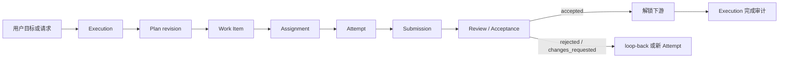
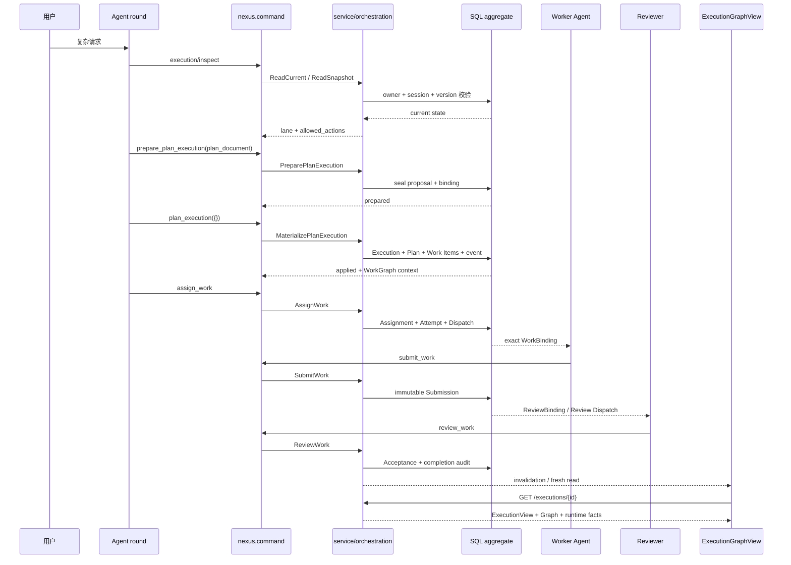

# Nexus WorkGraph：实现方案与使用说明

> 如果想先了解 WorkGraph 为什么这样设计，先看[《WorkGraph：设计理念与问题定义》](./workgraph-design-principles.zh-CN.md)。

> 本文说明 WorkGraph 在系统中如何运行：有哪些对象、执行经过哪些阶段、数据存在哪里、Agent 如何调用，以及失败如何恢复。内容以当前默认分支的 Go/React 实现、协议和数据库迁移为准。

## 1. 先用一句话说明 WorkGraph 是什么

WorkGraph 是 Nexus 保存复杂工作的一张**持久责任图**。它把目标拆成带交付物和验收条件的 Work Item，记录依赖、负责人、尝试、交付和验收，也记录失败后如何继续。

系统把两类信息分开保存：

1. **责任层**说明“应该完成什么、谁对什么负责、什么条件下可以继续”。它由 `Execution`、`Plan`、`Work Item`、`Assignment`、`Attempt`、`Submission`、`Review Dispatch`、`ReviewBinding` 和 `Acceptance` 构成。
2. **运行层**说明“Agent 实际运行时发生了什么”。它由 Agent round、Subagent、Tool、Gate 的 Runtime Graph 事实构成。

前端的 `ExecutionGraphView` 只是两类信息的只读合并，不能创建任务、授予权限、触发重试或改写责任关系。

相关定义见 [execution-graph-spec.md](../specs/execution-graph-spec.md)、[execution-orchestration-spec.md](../specs/execution-orchestration-spec.md)、[internal/protocol/execution.go](../../internal/protocol/execution.go) 和 [internal/protocol/execution_view.go](../../internal/protocol/execution_view.go)。

## 2. WorkGraph 解决的实际问题

普通对话可以让 Agent 直接完成一次任务，但复杂工作通常还需要四种能力：

- 把工作拆成可追踪的责任，而不是依赖聊天上下文记忆“下一步是什么”。
- 让并行工作有明确的输入、输出和依赖，防止一个 Agent 读到另一个 Agent 尚未验收的中间结果。
- 把“做完一次”与“交付被接受”分开。工具成功、Attempt 成功和 Submission 都不自动代表最终通过。
- 发生失败、驳回、变更要求、接管或重规划时保留历史，而不是覆盖掉原来的事实。

WorkGraph 的最小闭环是：



每个阶段都有持久身份和事务边界，模型不能用一条自然语言回复跳过它们。

## 3. 核心对象：哪些概念分别负责什么

### 3.1 Goal：跨轮次的最终目的

`Goal` 保存用户希望最终得到的结果、完成条件、生命周期、预算和长程 continuation。Goal 的代码真相源是 [internal/protocol/goal.go](../../internal/protocol/goal.go) 和 [internal/service/goal](../../internal/service/goal)。数据库主表是 `session_goals`，事件表是 `goal_events`。

Goal 负责：

- objective 和 objective revision；
- `active`、`paused`、`complete`、`blocked`、预算/用量限制等生命周期；
- Goal continuation 的 `scheduled → claimed → started → settled` 恢复链；
- Goal 用量累计和完成前的 objective alignment；
- Goal-only 场景，即没有 WorkGraph 也能持续推进。

Goal 不负责：

- 直接保存每一个 Work Item；
- 代替 Assignment 或 WorkBinding；
- 根据聊天里出现的人数、`@member` 或某次 Tool 调用推断“已经进入 WorkGraph”；
- 把一个旧 Plan 的责任自动搬到新的 Plan 或 successor Execution。

### 3.2 Execution：一次受管编排历史的容器

`Execution` 是一条受管编排历史的 durable aggregate。它保存 owner、session、DM/Room scope、coordinator、objective、completion criteria、Goal binding、当前状态和版本。

实现位置：

- 类型：[internal/protocol/execution.go](../../internal/protocol/execution.go) 的 `Execution`；
- 服务：[internal/service/orchestration](../../internal/service/orchestration)；
- 存储：[internal/storage/orchestration](../../internal/storage/orchestration)；
- 创建与当前执行表：`db/migrations/sqlite/00061_execution_orchestration.sql` 的 `executions`。

一个没有 active Plan 或没有 Work Item 的 Execution 只是 bootstrap/reconciliation 状态，不会被公共 WorkGraph 读取接口当成完整工作图返回。

### 3.3 Plan：不可变的工作图版本

Plan 是某个 Execution 的不可变 revision。一个 Execution 同时最多有一个 active Plan；replan 不修改旧 Plan，而是写入新的 revision，旧 revision 保留为历史事实。

Plan 规定：

- 本轮有哪些 Work Item；
- Work Item 的 stable position 和 parent；
- `required`、`terminal`；
- 显式依赖边及其 `hard`/`soft` 类型；
- 输出范围 claim，以及 `exclusive`/`shared` 冲突策略。

Plan 的写入必须经过两步。模型先提交 `nexus_plan: 1` YAML，`prepare_plan_execution` 解析、校验并封存 proposal；`plan_execution` 再使用宿主持有的 proposal identity，在事务中创建 Execution、Plan 和 Work Item。

对应实现是 [internal/service/orchestration/plan_proposal.go](../../internal/service/orchestration/plan_proposal.go)、[internal/service/orchestration/plan_materialization.go](../../internal/service/orchestration/plan_materialization.go) 和 [internal/mcp/command/execution/operation/plan.go](../../internal/mcp/command/execution/operation/plan.go)。Plan Mode 只负责设计和校验，不能在这个阶段改变责任或启动 Agent。

### 3.4 Work Item：持久化的业务责任

Work Item 是跨 Plan revision 可追踪的业务责任身份。Agent 的局部 Task 只是执行过程中的行动。类型在 `execution.go` 中定义，当前 kind 为：

- `produce`：生产内容或实现；
- `review`：独立评审；
- `verify`：验证、检查或 Gate 判断；
- `integrate`：整合、汇总或最终交付。

Work Item 的 immutable spec 包含 `subject`、`objective`、`deliverable`、`acceptance_criteria`、`input_refs` 和 output scopes。它的 mutable 状态只有 `open`、`waiting_input`、`cancelled`、`superseded`；`ready`、`assigned`、`running`、`submitted`、`accepted` 等状态由当前 Plan、依赖和责任记录推导，避免出现第二套会漂移的生命周期。

关键规则是：

> hard dependency 只有在上游 Submission 被 Acceptance 判定为 `accepted` 后才解除。

一次 Attempt 成功、一次 Submission 写入，甚至一个 Agent 说“完成了”，都不能解锁下游。

### 3.5 Assignment：当前责任归属

Assignment 把一个 ready Work Item 交给一个当前 owner Agent。一个 Work Item 同时最多有一个 current Assignment。接管时先释放/中断旧责任链，再创建新的 Assignment 和 Attempt，不把两个 owner 合并成一个“当前负责人”。

Assignment 还记录：

- `assignment_strategy`：`self` 或 `room_member`；
- `assigned_by_agent_id`、`return_to_agent_id`；
- dispatch、takeover、release、completion 的版本和原因。

对应代码是 [internal/service/orchestration/command_assignment.go](../../internal/service/orchestration/command_assignment.go) 和 `execution_work_assignments` 表。

### 3.6 Dispatch 与 WorkBinding：交付和权限不是一回事

Room 成员或 Subagent 被唤起时，系统先持久化 Dispatch outbox，再投递消息。运行时收到的是宿主签发的 `WorkBinding`，其中带有 exact：

```text
Execution → Plan → Work Item → Assignment → Attempt → Dispatch
```

Room membership、coordinator 身份、图上的头像、`<assigned_work>` 文本都不能代替 WorkBinding。Review 使用独立的 `ReviewBinding`，Reviewer 不会因为评审一个 Submission 而获得 worker Assignment。

### 3.7 Attempt：一次真实执行尝试

Attempt 表示某个 Agent 或受管 Subagent 对 Assignment 的一次真实执行。一次失败后重新执行会产生新 Attempt；旧 Attempt 不被覆盖。

根 Attempt 保存 runtime session、runtime round、Agent round、executor agent 等身份；Subagent Attempt 还保存 parent Attempt、child session、SDK task 和 Tool use identity。这样同一个物理 Agent round 串行承担多个 Work Item 时，后端仍可按 exact assignment/attempt 区间区分责任，不按头像、时间邻近或自然语言猜归属。

数据库中的 `execution_attempts` 约束了 parent/child identity、root uniqueness、SDK task uniqueness 和 runtime round uniqueness，见 `00061_execution_orchestration.sql`、`00067_execution_attempt_root_round_identity.sql` 与 `00100_execution_attempt_assignment_round_identity.sql`。

### 3.8 Submission、Review Dispatch、ReviewBinding、Acceptance

Submission 是 worker 对 immutable Work Item spec 的交付声明，带有结果摘要、引用和证据。它是 append-only 的。

Review Dispatch 负责把一个 Submission 交给 Reviewer。ReviewBinding 精确授权 Reviewer 只能审这一条 immutable Submission。Acceptance 保存 `accepted`、`rejected` 或 `changes_requested`、criteria results、feedback 和 reviewer identity。

当 Acceptance 为 `accepted` 时：

1. 上游 Work Item 的硬依赖可以解除；
2. 后端写入或唤醒 Execution completion audit receipt；
3. 当前 coordinator round 重新读取最新 Execution/Goal state，判断是否可以完成。

当 Acceptance 为 `rejected` 或 `changes_requested` 时：

1. 原 Submission 和 Gate 保留；
2. 形成 loop-back 或 fresh Attempt；
3. 下游依赖继续锁定。

实现可从 [internal/storage/orchestration/submission.go](../../internal/storage/orchestration/submission.go)、[internal/service/orchestration/command_submission.go](../../internal/service/orchestration/command_submission.go)、[internal/service/orchestration/command_review.go](../../internal/service/orchestration/command_review.go) 和 `execution_submissions`/`execution_acceptances` 表追踪。

### 3.9 Runtime Graph：运行事实

Runtime Graph 记录真实发生过的 Agent、Subagent、Tool、Gate lifecycle。当前 NodeRun kind 是 `agent`、`subagent`、`tool`、`gate`；状态是 `running`、`succeeded`、`failed`、`cancelled`、`interrupted`。

它能表达 `invoke`、`spawn`、`guard`、`loop_back` 和有 exact previous identity 的 `retry`。`retry` 表示 Agent 已经选择并发起了新的 Run，不是服务端自动重试授权。

运行图表由 [internal/service/orchestration/runtime_graph.go](../../internal/service/orchestration/runtime_graph.go)、[internal/storage/orchestration/runtime_graph.go](../../internal/storage/orchestration/runtime_graph.go) 和 `runtime_graph_node_runs`/`runtime_graph_edge_runs` 保存。运行图不会把 Goal、Plan、Work Item 或 Message 当成 runtime node。

### 3.10 ExecutionGraphView：前端只读图

`ExecutionGraphView` 由责任图和 Runtime Graph 在一次安全读取中合并产生：

- 未开始的 Work Item 可以作为 planned placeholder；
- 每个 root Attempt 是独立 Agent 轮次节点；
- 每个 child Attempt 是独立 Subagent 节点；
- 每条 immutable Submission 有自己的 review Gate；
- Tool、Subagent 和 Gate 只按 exact identity 归属；
- 运行窗口受 256 个主图节点、512 条主图边、每个 Tool 16 个 Artifact 的上限约束，超出时通过 `total/truncated` 明示部分投影。

前端的 `ExecutionWorkGraphCanvas`、布局、检查器、运行历史和 Artifact 打开动作都只消费这个 read model。前端不能把图回写成 Plan，也不能提供“点击节点就分配/重试”的隐式路线。

## 4. Goal 与 WorkGraph 到底怎么复用

### 4.1 三种合法产品模式

代码明确支持三种模式：

| 模式 | 持久状态 | 说明 |
| --- | --- | --- |
| Goal-only | Goal，无 confirmed managed WorkGraph binding | 适合跨轮目标、继续执行、阻塞和完成，但不需要责任图。 |
| WorkGraph-only | Execution + active Plan + Work Items，无 Goal fence | 适合一次受管编排，当前 session 的 ambient Goal 不会自动参与。 |
| Goal + WorkGraph | Goal 与 Execution 的 exact confirmed bilateral binding | Goal 的 objective revision、completion criteria、continuation 和 alignment 约束这张工作图。 |

绑定有 `standalone`、`reserved`、`pending`、`confirmed`、`conflict` 五种解析状态。只有 `confirmed` 才能启用 Goal 与 WorkGraph 联动的完成审计和 continuation；Goal-only 的 continuation 不需要这条 binding。`pending` 与 `conflict` 必须 fail closed。

### 4.2 Goal 是如何进入 WorkGraph 的

Goal 与 WorkGraph 的创建是串行的：

1. Goal service 先创建或更新 Goal，得到 exact Goal ID 和 objective revision；
2. 本轮读取 `goal_binding=current`，并把 exact Goal authority 带入 Plan proposal；
3. `prepare_plan_execution` 封存 proposal；
4. `plan_execution` 在同一责任边界内 materialize Execution/Plan/Work Items；
5. Goal side 写 pending confirmation，Execution side 完成 authoritative mutation；
6. 反向确认成功后才是 `confirmed` bilateral binding。

模型不能在同一个用户意图里并行 create Goal 和 prepare Plan，因为 Plan 必须依赖服务端已经确认的 Goal identity/revision。

如果先有一张 transient WorkGraph，之后用户才表达明确 Goal 意图，系统走 `promote_execution_to_goal`，保留原 Execution、Plan 和历史，不再创建第二张图然后猜测绑定。实现见 [internal/service/orchestration/promotion.go](../../internal/service/orchestration/promotion.go) 和 [internal/service/goalexecution](../../internal/service/goalexecution)。

### 4.3 Goal 复用了什么，WorkGraph 没有复用什么

**复用的部分：**

- Goal 的 owner、objective revision、completion criteria 和生命周期校验；
- Goal continuation 的 durable receipt、lease、claim、settle/retry 恢复；
- `goal/runtimeusage` 的 provider usage 转换、累计和最终结算；
- Goal completion 前的 alignment 审计；
- DM/Room 对 owner、lead、scope、session 的认证和持久身份。

**不复用的部分：**

- Goal 不承担 Work Item、Assignment、Attempt 或 Submission；
- WorkGraph 不把 Goal objective 从 transcript、旧 Plan 或聊天正文重新构造；
- Goal retarget 不会把 predecessor Execution 的 Assignment/Attempt/ReviewBinding 搬到 successor；
- WorkGraph 的 `audit_execution_alignment` 不是 Goal 的 `audit_objective_alignment` 替代品；
- WorkGraph 的依赖和 Acceptance 不会被 Goal continuation 的“有回复”或“工具成功”替代。

### 4.4 Plan、Goal Plan 和 WorkGraph 的关系

产品介绍时可以这样说：

> Goal 决定“为什么做、做到什么算完成”；Plan 决定“这一次要经过哪些责任节点”；WorkGraph 是 Plan materialize 后可持续运行、可分配、可交付、可验收的责任图。

这里的 Plan 不是一个只存在于模型上下文中的计划文本。它有 immutable revision、Work Item membership、dependency、output claim 和状态边界。`Plan Document` 是模型提交的输入格式；`ExecutionPlanRevision` 是服务端持久化后的权威版本；`ExecutionGraphView` 是前端读取的投影。

## 5. WorkGraph 的完整执行流程

下面用一次“完成一项需要研究、实现、验证和交付的工作”说明代码路径。

### 阶段 A：选择执行结构

`execution-orchestrator` Skill 首先判断简单任务是否不需要 WorkGraph。如果需要，系统区分：

- `/workgraph <request>`：只为当前请求启用一次 WorkGraph，不保存命名模板；
- `/<saved-slash> <request>`：读取一个内置或 owner 保存的责任模板，但每次都创建 fresh Execution/Plan/Work Item identity；
- Goal + WorkGraph：先创建或更新 Goal，取得当前 objective revision，再用 `goal_binding=current` materialize；
- Room：由 coordinator 分配；成员只有获得 exact WorkBinding 后才能提交工作。

对应入口是 [skills/execution-orchestrator/SKILL.md](../../skills/execution-orchestrator/SKILL.md) 和 [skills/execution-orchestrator/references/structure-selection.md](../../skills/execution-orchestrator/references/structure-selection.md)。

### 阶段 B：读取当前 Execution

Agent 先用 `nexus.command` 的 `execution/inspect` 读取当前可信 scope。`get_execution` 在代码中是 inspect 语义，不是可任意 invoke 的普通操作。

读取结果不是一份只显示状态的摘要，它还包含：

- 当前 lane：coordinator、worker、reviewer 或 observation；
- `allowed_actions`；
- 当前 WorkBinding/ReviewBinding 所支持的责任范围；
- ready、assigned、running、review、blocker 等后续上下文。

Room 普通成员只能获得共享图观察，不能因为 inspect 获得 Plan mutation、Assignment、Submission 或 Review 权限。当前 coordinator 的 inspect 会建立本 physical round 的临时 coordination scope，但 durable authority 仍由后端重新校验。

### 阶段 C：准备并 materialize Plan

Agent 读取 fresh `prepare_plan_execution` contract，提交完整 YAML：

```yaml
nexus_plan: 1
operation: create
goal_binding: none
objective: "交付一份可验证的结果"
completion_criteria:
  - "最终交付满足约定验收条件"
items:
  - logical_key: scope
    kind: produce
    subject: "界定范围"
    objective: "明确边界和验收条件"
    deliverable: "范围简报"
    required: true
  - logical_key: implement
    kind: produce
    subject: "实现方案"
    objective: "根据范围完成主要实现"
    deliverable: "可运行的实现"
    depends_on:
      - key: scope
        kind: hard
    required: true
  - logical_key: validate
    kind: verify
    subject: "验证结果"
    objective: "按验收标准验证交付"
    deliverable: "验证记录"
    depends_on:
      - key: implement
        kind: hard
    required: true
  - logical_key: deliver
    kind: integrate
    subject: "整合并交付"
    objective: "生成最终交付物"
    deliverable: "最终交付"
    depends_on:
      - key: validate
        kind: hard
    required: true
    terminal: true
```

真实调用中，模型提交的是 closed structured input。proposal ID 和 digest 由宿主持有，`plan_execution` 通常使用空 input，让宿主选择 exact proposal；模型不能拿别人的 proposal ID 进行选择。

### 阶段 D：分配与派发

Plan materialize 后才能调用 `assign_work`。后端按依赖、输出 claim、当前责任状态和 owner 权限判断 Work Item 是否 ready。

- `self` assignment 可以由 coordinator/Agent 在 DM 中承担；
- `room_member` assignment 会产生 durable dispatch；
- Subagent 只有在父 WorkBinding 下启动时才是 managed child Attempt；
- 裸 `@member` 是通信，不是 Assignment；
- assignment 不能绕过未验收的 hard dependency。

Room dispatch 是 SQL 状态和 Room 投递 outbox 的组合，不能被 UI 的一个 optimistic 状态替代。投递未知时保留可对账身份，后台不会凭超时自动复制一份副作用。

### 阶段 E：Agent/Subagent 运行

每个 physical round 建立一个 round-scoped `nexus` MCP server。它由 [internal/app/runtime/command.go](../../internal/app/runtime/command.go) 装配，宿主把 owner、Agent、Session、Round、Goal authority、WorkBinding、ReviewBinding 和 Plan Mode 固定进 server context。

模型只提交：

```json
{
  "domain": "execution",
  "action": "invoke",
  "operation": "submit_work",
  "request_id": "stable-request-id",
  "input": {}
}
```

`owner_user_id`、`agent_id`、`session_key`、`round_id`、Execution/Assignment/Attempt identity 不由模型输入伪造。`internal/mcp/command/execution/contract/contract.go` 的 `Context` 和 `Actor()` 将这些可信字段投影到 `service/orchestration`。

`nexus.command` 通过 `internal/mcp/command/execution/operation/registry.go` 注册 12 个 Execution operation：

| operation | 作用 |
| --- | --- |
| `get_execution` | 读取当前或指定 Execution；当前 coordinator 读取可恢复协调权限。 |
| `prepare_plan_execution` | 解析、校验、封存非权威 Plan proposal。 |
| `plan_execution` | 原子 materialize create/replan/replace。 |
| `abandon_execution` | 结束 transient、未绑定的 Execution。 |
| `assign_work` | 创建当前 Assignment、root Attempt 和必要的 Dispatch。 |
| `submit_work` | 在 WorkBinding 下提交一次 immutable Submission。 |
| `review_work` | 在 ReviewBinding 下追加 Acceptance。 |
| `block_work` | 持久化外部输入或权限 blocker。 |
| `resume_work` | 记录 blocker 解决，回到 open；不自动复活旧 Attempt。 |
| `take_over_work` | 释放旧责任链并创建新 Assignment/Attempt。 |
| `audit_execution_alignment` | 可选的 Execution 对齐 Gate。 |
| `promote_execution_to_goal` | 把兼容 transient Execution 显式提升为 Goal-bound。 |

模型每次 mutation 前读取 fresh contract；相同语义重试复用 request identity，未知结果先 inspect/对账，不能因为没有收到响应就重新提交一个新副作用。

Subagent 使用同一 `nexus.command` schema 的 `subagent` domain，底层 bridge 复用 Agent/TaskOutput/TaskStop lifecycle。只有父 round 有 exact WorkBinding 时，child Attempt 才进入 managed WorkGraph；runtime-only child 可以帮助对话，但不能满足交付或评审 Gate。

### 阶段 F：交付、评审、返工

Worker 成功后必须 `submit_work`。服务端确认：

- Assignment 仍 active 且 owner 正确；
- Attempt 属于同一 Execution/Plan/Work Item/Assignment chain；
- Attempt 状态是 succeeded；
- 当前 Work Item 没有未审 Submission；
- request/assignment/execution version 没有过期。

提交成功后，review dispatch 可以把 Submission 交给 reviewer。Reviewer 调用 `review_work`，服务端用 ReviewBinding 锁定 immutable Submission。Acceptance 后才解锁下游；changes requested 时保留原 Gate，新的尝试会生成新的 root Attempt 和新的 Submission/Gate。

### 阶段 G：完成与 Goal 收口

最后一个 required/terminal Work Item 被 accepted 后，后端先写 completion audit receipt，再重新读取当前 Plan、blocker、Assignment 和 Goal binding。Execution completion 是独立的 authoritative transition；不能仅凭 UI 看到所有节点“像是完成”就结束。

如果 Execution 已与 Goal `confirmed` 绑定，当前物理 round 还要进入 Goal domain，调用 `audit_objective_alignment`，再由 Goal authority 调用 `update_goal` 完成 Goal。Goal-only 场景不会要求 WorkGraph Gate；WorkGraph-only 场景也不会因为同 session 有一个普通 Goal 就自动绑定。

## 6. 命名 WorkGraph：从一次完成图沉淀成可复用模板

执行中的 WorkGraph 和“可复用命名图”是两个不同 aggregate。执行图包含运行身份和历史；命名图只保存下一次重新创建 Work Item 所需的语义契约。

### 6.1 可提取的来源

当前 `PreviewFromExecution` 只接受：

- exact owner；
- exact source session；
- exact source execution；
- `Execution.Status == completed`；
- active Plan 存在且包含 Work Items。

代码入口是 [internal/service/workgraphworkflow/service.go](../../internal/service/workgraphworkflow/service.go) 的 `PreviewFromExecution`。同一个 source Execution 已有 Draft 时直接复用，不重复调用抽取模型。

### 6.2 抽取模型拿到什么

`buildSourceWorkflowGraph` 从 `ExecutionView.WorkItems` 构造抽取输入，包含：

- logical key、Work Item kind、subject/objective/deliverable；
- acceptance criteria、required、terminal；
- parent logical key 和 dependency logical keys；
- 是否 delegated 到 Room member；
- 是否存在独立 review；
- Attempt count 和当前状态的粗粒度信号。

抽取输入不包含 Tool input/output、Agent 凭证、完整运行结果、Artifact 内容、Assignment identity、Attempt identity、Submission、Review 或 Acceptance 事实。实现见 [internal/service/workgraphworkflow/abstraction.go](../../internal/service/workgraphworkflow/abstraction.go) 的 `AbstractionInput`。

### 6.3 模型做抽象，宿主做结构验证

默认模型由 `NewLLMAbstractor` 通过 owner 的默认 Provider/Model 调用，温度为 0，最多 16,384 tokens，超时 3 分钟。它负责把具体主题、项目名、路径和一次性任务改写成可复用的阶段职责，并选择 `key` 或 `collaboration` 角色。

宿主随后在 `applyAbstraction` 中强制检查：

- 输出 logical key 必须是源节点的非空子集；
- 不得新增、合并、拆分或虚构节点；
- `must_preserve` 节点必须保留；
- 至少有一条 key 主路径；
- 至少有一个 terminal 最终交付；
- 节点字段和角色必须完整；
- slash name 必须匹配 `^[a-z][a-z0-9-]{0,63}$`，并避让保留命令和 owner 已有命名图。

所以“模型提取”不是把原图 JSON 原样存起来，也不是让模型自由删节点。模型负责语义抽象，宿主负责结构保真和 fail closed。

### 6.4 Draft、版本和保存

首次提取会产生 revision 1 的 durable Draft。Draft 的关键字段是：

- `preview_id`；
- `source_execution_id`、`source_session_key`；
- `head_revision`：并发写入的 CAS 基线；
- `selected_revision`：用户当前选中的版本；
- `saved_workflow_id`、`saved_revision`；
- `editor_session_key`；
- `expires_at`。

每次完整修改追加不可变 Draft version。选择旧版本只改变 `selected_revision`，不会删除更新版本；下一次修改仍使用当前 `head_revision` 做 CAS。保存时服务端读取 selected preview，核对 owner、source session、revision、命名冲突和完整图内容，再把命名图 aggregate 与 Draft 保存标记放在同一数据库事务中提交。

UI 保存不再启动一个隐藏模型 round。普通对话保存才通过 `save_workgraph_preview`，但两条入口最终调用相同的 `SavePreview`/`ConfirmSave` 事务边界。

### 6.5 隐藏编辑 DM

编辑器由 owner 的 Nexus 主 Agent 承载一个隐藏、可恢复、不进入普通会话目录的临时 DM。创建入口是 [internal/app/workgraph/adapter.go](../../internal/app/workgraph/adapter.go) 的 `CreateWorkGraphEditorSession`，用途是 `workgraph_editor`。

该 Session：

- 不继承来源 DM/Room transcript、Connector、workspace 或权限；
- 只允许 `execution-orchestrator` Skill、`AskUserQuestion` 和受限 `mcp__nexus__command`；
- 只暴露 `revise_workgraph_preview` 和 `select_workgraph_preview_revision`；
- 每次修改提交完整草图，而不是 diff；
- revision 冲突、DAG/父子环、缺 key path 或缺 terminal delivery 时失败；
- 关闭页面不会自动删除，只有显式 close 才删除。

这条边界由 [internal/service/workgraphworkflow/metadata_editor.go](../../internal/service/workgraphworkflow/metadata_editor.go)、[internal/protocol/session_option.go](../../internal/protocol/session_option.go) 和 `BuildWorkGraphEditor` 实现。

### 6.6 复用命名图时创建什么

命名图或内置模板只提供：

- 抽象后的 objective/completion criteria；
- Work Item kind、subject、objective、deliverable、acceptance criteria；
- parent 结构；
- hard/soft dependency 模板。

每次 `/<command> <request>` 复用时，系统重新创建：

- 新 Execution；
- 新 Plan revision；
- 新 Work Item identity；
- 新 Assignment/Attempt/Submission/Acceptance；
- 新 Runtime Graph identity。

不会复制源图的 Agent、Assignment、Attempt、状态、结果、Artifact 或审核结论。内置模板在 [internal/service/workgraphworkflow/builtins.go](../../internal/service/workgraphworkflow/builtins.go) 只读加载，不写 owner 数据库。

## 7. 数据存在哪里

### 7.1 执行中的责任事实：Orchestration SQL aggregate

核心表由 SQLite/PostgreSQL 同步迁移维护，主要在 `db/migrations/sqlite/00061_execution_orchestration.sql` 和对应 PostgreSQL 文件：

| 表 | 负责的事实 |
| --- | --- |
| `executions` | Execution owner、session、scope、objective、Goal binding、状态、版本、root round。 |
| `execution_plan_revisions` | immutable Plan revision、active/superseded/cancelled 状态。 |
| `execution_work_items` | stable Work Item ID、logical key、kind。 |
| `execution_work_item_specs` | 每个 Work Item 的 immutable spec 版本。 |
| `execution_plan_items` | 某个 Plan revision 中的成员、parent、required、terminal、position。 |
| `execution_plan_dependencies` | hard/soft DAG 依赖。 |
| `execution_plan_output_claims` | file/dir/semantic output scope 及 exclusive/shared 模式。 |
| `execution_work_item_states` | open/waiting_input/cancelled/superseded 等有限 mutable state。 |
| `execution_work_assignments` | 当前和历史 owner/strategy/release/takeover。 |
| `execution_dispatches` | Room/Subagent durable outbox、lease、投递尝试。 |
| `execution_attempts` | Agent/Subagent 真实执行尝试及 runtime identity。 |
| `execution_submissions` | append-only 交付声明、结果引用和证据。 |
| `execution_review_dispatches` | Submission 到 reviewer 的独立投递。 |
| `execution_acceptances` | 每条 Submission 的验收决策和 criteria results。 |
| `execution_events` | append-only command/event audit 和跨实体引用。 |

`internal/storage/orchestration` 的 repository 在每次 mutation 中重新读取 aggregate，执行 version/CAS、owner、binding 和 terminal fence，然后在一个 SQL transaction 中提交状态与事件。

### 7.2 运行事实：Runtime Graph 表

`00064_runtime_execution_graph.sql` 建立：

- `runtime_graph_node_runs`：Agent/Subagent/Tool/Gate NodeRun；
- `runtime_graph_edge_runs`：invoke/spawn/guard/loop_back 等运行边。

Artifact 以 exact `agent_round_id + tool_use_id` 关联，在读取时回挂到 Tool NodeRun。运行图只读记录已发生的运行，不会单独授权或触发重试。

### 7.3 可复用命名图：Workflow aggregate

`00116_workgraph_workflows.sql` 建立：

- `workgraph_workflows`：owner、slash name、title、description、source provenance、objective、completion criteria、version；
- `workgraph_workflow_nodes`：logical key、role、kind、抽象后的语义字段、required/terminal、parent、position；
- `workgraph_workflow_dependencies`：模板内 hard/soft DAG。

命名图不保存 Runtime Graph、Tool input/output、Agent、Assignment、Attempt、Submission、Review、Acceptance 或执行状态。

### 7.4 可恢复草图：Draft aggregate

`00119_workgraph_workflow_drafts.sql` 和 `00134_workgraph_draft_saved_origins.sql` 建立：

- `workgraph_workflow_drafts`：source scope、revision head/selected、editor identity、save state、lease 和 `origin_workflow_id`；
- `workgraph_workflow_draft_versions`：每个 revision 的完整 `preview_json`。

同一个 owner/source Execution 的抽取 Draft 唯一复用；从不同历史命名 Workflow 恢复编辑时通过 `origin_workflow_id` 隔离，避免两个命名图共享同一份草稿。

### 7.5 内存里有什么

`workgraphworkflow.Service` 仍维护 `previews`、`editors`、`editorBySession` 等进程内 cache，用于当前进程的快速编辑状态和过期清理；但在配置了 `DraftRepository` 时，数据库 Draft 才是重启、跨窗口和恢复的真相源。`GetDraftByEditorID`、`RenewDraftLease`、`AppendDraftVersion` 等方法会从数据库重载并执行 CAS。

### 7.6 消息和前端快照

普通 DM/Room 中，成功的 authoring command 会被 [internal/message/workgraph_artifact.go](../../internal/message/workgraph_artifact.go) 投影成 `workgraph_artifact` assistant content block。它保存生成消息当时的完整草图/命名图快照，因此历史消息不会追随当前 Draft head 漂移。

这条消息快照不是责任真相；责任真相仍是 Orchestration SQL，草图真相是 Draft，命名图真相是 Workflow aggregate。

## 8. Agent 是怎么使用 WorkGraph 的

### 8.1 统一入口：round-scoped `nexus.command`

Goal、Execution、Automation、Subagent 和 WorkGraph authoring 共用一个 Nexus MCP server。宿主在每个 physical round 构建 server，代码入口是 [internal/app/runtime/command.go](../../internal/app/runtime/command.go) 的 `NewServerBuilder`。

命令面保持固定，服务端在每轮把真实 owner、Agent、Session、Goal/Execution authority 和 WorkBinding 注入 context。

命令 adapter 在 [internal/mcp/command/execution/operation/adapter.go](../../internal/mcp/command/execution/operation/adapter.go) 做这些事情：

1. 用 `DisallowUnknownFields` 解码 closed input；
2. 校验类型、枚举、长度和 collection bounds；
3. 从 SDK tool-use identity 或 canonical round identity 生成 stable command ID；
4. 读取最新 Snapshot，而不是依赖模型上一次看到的版本；
5. 调用 service/orchestration 的 typed mutation；
6. 返回 `applied`、`no_op`、`rejected`、`superseded`、`refresh_required` 等结构化结果。

模型看不到任意 SQL ID 选择器，也没有临时 `input.json`、shell shim、loopback broker 或额外 capability token。业务 input 直接通过 SDK stream-json MCP call 进入当前 round 的 server。

### 8.2 Agent 能看到什么

普通 mutation 返回一个有界的 `execution_context`，包括当前 responsibility、review、action、blocker 和下一步建议。成功 Tool 的历史不会每次自动回放到模型上下文；需要恢复时通过 `get_execution` / inspect 读取当前权威视图。

这能避免两个问题：

- 上下文每轮递归膨胀；
- 模型把“上一次工具成功”误认为“当前 Assignment 仍然有效”。

运行事实可能在 WorkGraph 画布上保留，但不会因为进入画布就自动进入模型 prompt。

### 8.3 Agent 能做什么、不能做什么

| Agent lane | 允许的事情 |
| --- | --- |
| coordinator | inspect、prepare/materialize Plan、assign、takeover、review dispatch、协调当前 Execution。 |
| worker | 在 exact WorkBinding 下执行一个 Work Item、启动受管 child、提交 Submission、block/resume。 |
| reviewer | 在 exact ReviewBinding 下评审一条 immutable Submission。 |
| Room observation member | 读取有限共享图；不能因为成员身份写 Plan、Assignment、Submission 或 Acceptance。 |
| runtime-only Subagent | 对话协助和运行观察；不能满足 WorkGraph 交付 Gate。 |
| hidden editor Agent | 只修改/选择 Draft revision，不执行草图中的业务任务。 |

UI 的“负责人”“当前节点”“头像”和 `<assigned_work>` 都是投影或提示，不是授权凭证。后端每次 mutation 都必须重新验证 exact binding 和 SQL state。

### 8.4 结构化命令和普通工具的关系

普通 Bash、Read、Grep、WebSearch、浏览器操作等是 Agent 的执行工具。WorkGraph mutation 是控制平面命令，两者在运行图里分层展示：

- `assign_work`、`submit_work`、`review_work` 等控制 transport 通常只保留为 owner 的 detail 审计；
- 真实失败、取消、中断、带 Artifact 的用户可观察动作可以提升到画布；
- 每个 Submission 的 Review Gate 用 durable Submission/Acceptance 事实表达，不把 `submit_work` 工具调用画成一个假的业务节点；
- `MEMORY.md`/`memory/` 维护、普通成功读取和工具发现不占用主图节点配额。

## 9. 前端和 HTTP 怎样接入

HTTP 负责读取投影和处理 Draft/命名图的确认保存。路由在 `internal/app/server/routes.go` 注册，handler 位于 `internal/handler/execution/handlers.go`。请求中的 owner 来自认证 context，不能由正文指定。

Web 通过 `web/src/lib/api/conversation/execution-api.ts` 读取 `ExecutionView`、运行历史、Draft 和命名图。画布、检查器和编辑器都只读；分配、提交、评审、重试和改图仍然走当前 Agent round 的 `nexus.command`。

因此可以记住一句话：**HTTP/Web 展示服务端事实，Agent command 才能改变责任状态。**

## 10. 一次完整请求的代码级时序



## 11. 一次失败如何处理

### 11.1 Plan proposal 失败

YAML schema、字段、依赖、输出范围或 Goal binding 不合法时，proposal 不会 materialize。模型收到带 `document_contract` 的结构化拒绝，应重新生成完整文档，而不是逐字段猜补。

### 11.2 Assignment/Attempt 过期

如果另一个 Agent 已经 takeover、Execution 已 superseded、Plan revision 已变化或 Goal retarget 创建 successor，旧 round 的 mutation 返回 `superseded` 或 binding conflict。它不能用旧身份写入新图，也不能自动重放。

### 11.3 Submission 未知

网络断开或进程消失时，不能把“没收到结果”解释成“没执行”。先用原 request identity 和 exact Execution/Attempt 对账；只有服务端证明没有提交，才由新 round 重新决定是否需要新的 Attempt。

### 11.4 Reviewer 驳回

旧 Submission/Acceptance/Gate 保留，新的 Attempt 和 Submission 使用新 identity。`retry` 与 `loop_back` 只有在存在 exact previous run/return identity 时才表达；它们不是服务端盲目重试。

### 11.5 Completion audit 中断

Review transaction 会先写 `execution_completion_audits` receipt。进程重启、前台请求消失或 UI 断连后，后台按 receipt 重新读取当前 Plan 和 blocker，再用 CAS 尝试完成。不会凭最后一条消息直接把 Execution 标记为 completed。

## 12. 设计中的关键不变量

1. Goal-only、WorkGraph-only、Goal + WorkGraph 三种模式独立有效。
2. 只有 exact `confirmed` bilateral binding 才启用集成 Goal/WorkGraph 行为。
3. 一个 Execution 最多一个 active Plan revision。
4. 一个 Work Item 最多一个 current Assignment owner。
5. 每个 managed mutation 必须匹配宿主注入的适用 authority：coordinator 的建图/分配操作使用 coordinator authority，worker 使用 exact WorkBinding，reviewer 使用 exact ReviewBinding。
6. hard dependency 只由 accepted Acceptance 解锁。
7. Assignment、Attempt、Submission、Acceptance 和 Plan revision 保留历史，不能覆盖事实。
8. proposal prepare 非权威；只有 materialize 才会产生受管图。
9. Runtime capability 不能替代 SQL state；SQL state 也不能伪造当前 runtime round authority。
10. Goal retarget 和 Plan revision 不静默携带旧责任链。
11. owner/session/execution identity 只能来自宿主认证和服务端读取，不能从标题、消息正文、头像或时间邻近推断。
12. 前端 Graph、消息 Artifact、Runtime context 都是投影，不得反向授权或写入责任图。

## 13. 现在明确不做什么

- 不把普通聊天、人数、`@member` 或 runtime-only Subagent 自动变成 WorkGraph evidence。
- 不把 WorkGraph 作为一个通用可写 `control_edge` 白板，所有控制变化必须通过 typed operation。
- 不把 Plan revision 中的 Assignment/Dispatch/Attempt/ReviewBinding 热迁移到新 revision。
- 不在 Workspace 层把 output claim 当成 OS 级文件锁；它是调度和评审合同。
- 不把 Goal 的三轮 blocker 行为政策冒充成后端可审计的硬存储规则。
- 不通过一个跨 SQL/Room 的大事务假装投递已经完成；SQL aggregate 加 durable outbox 后台对账。
- 不让 UI 点击节点直接启动、重试或修改 Agent 的责任。

## 14. 对外介绍时的推荐说法

### 30 秒版本

“Nexus 的 WorkGraph 是一张可恢复的责任图。它把复杂目标拆成有交付物和验收条件的 Work Item，用依赖控制并行和顺序，用 Assignment/Attempt 记录谁在做、做了几次，用 Submission/Acceptance 区分完成和真正验收。前端看到的是责任事实和运行事实的只读合并，所以失败、返工和多 Agent 协作都能保留完整历史。”

### 3 分钟版本

“Goal 管最终目标和跨轮 continuation，WorkGraph 管一次执行中的责任和交付。模型提交 Plan Document，后端先封存 proposal，再创建 Execution、Plan 和 Work Item。Agent 只能在宿主签发的 WorkBinding 下工作，完成后提交 Submission，由 Reviewer 做 Acceptance；只有 accepted 才会解锁下游。

运行中的 Agent、Subagent 和 Tool 记录在 Runtime Graph，前端把它和责任图合并展示。完成图可以保存成命名工作图，但下次复用只复制抽象结构，并创建新的 Execution 和运行身份。”

### 技术评审版本

“系统有两条主线和一个投影：责任编排保存不可变 Plan、Work Item、Assignment、Attempt、Submission、Acceptance，并负责版本检查和完成审计；Runtime Graph 只记录 Agent、Subagent 和 Tool 的运行；ExecutionGraphView 把两者按稳定身份合并。Goal 通过双向绑定参与目标版本、对齐检查和 continuation。Workflow/Draft 独立保存可复用结构，模型负责抽象，宿主负责检查节点、依赖、关键路径和范围。”

## 15. 四个容易混淆的边界

### 15.1 Plan Mode 不会直接创建 WorkGraph

Plan Mode 只准备和校验 proposal。只有 `plan_execution` 成功后，才会创建 Execution、Plan 和 Work Item。

### 15.2 命名图不是历史运行的恢复按钮

从 `/workgraph` 或命名图开始一次新任务时，系统会创建新的 Execution、Plan、Work Item 和运行身份。命名图只保存抽象结构，不带旧结果、权限或 Attempt。

### 15.3 画布是只读投影

`ExecutionGraphView` 合并责任图和 Runtime Graph，供查看节点、依赖、运行历史和 Artifact。点击画布不能分配、重试、改边或授予权限。

### 15.4 本地测试不等于生产验收

当前测试覆盖本地包、协议、HTTP、消息投影和前端行为。signed desktop、外部 Provider、多副本恢复、生产规模性能和安全红队仍需单独验收。详细代码入口和测试清单见[代码依据解读报告](./workgraph-code-reading-report.zh-CN.md)。

WorkGraph 从 Goal 的长期目标出发，补上一次执行中的责任链：`Plan → Work Item → Assignment → Attempt → Submission → Acceptance`。Runtime Graph 记录实际运行，Draft 保存可复用结构；每次复用都会创建新的 Execution，不沿用旧结果或权限。
