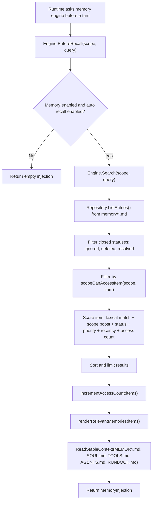
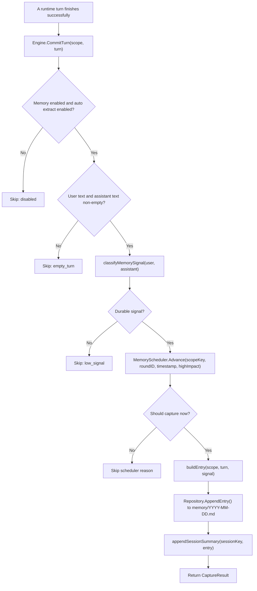
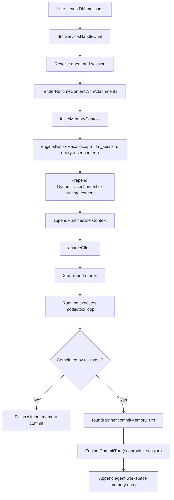
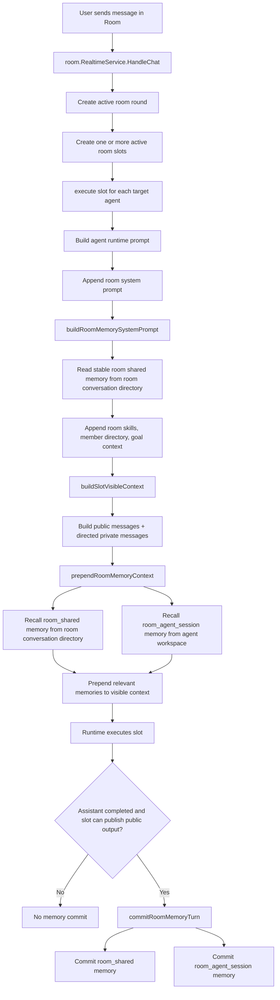
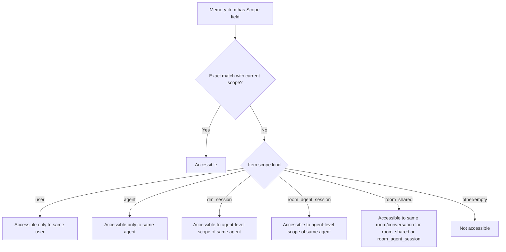
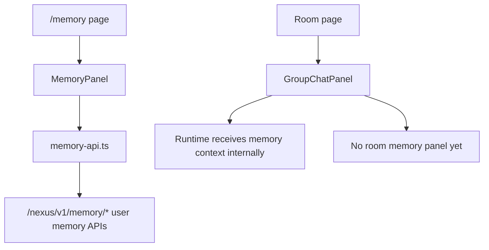
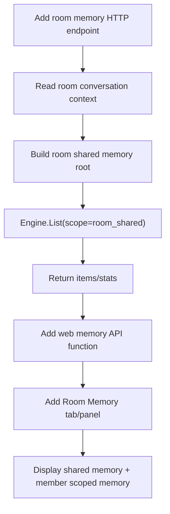

# Nexus Memory Current Flow

This note summarizes the current memory flow in Nexus, with emphasis on DM and Room conversations. It describes the existing implementation before any new room memory UI or behavior changes.

## 1. Core Concepts

Nexus already has a markdown-backed memory engine under `internal/workspace/memory`.

The important model is `MemoryScope`:

```text
user:{user_id}
agent:{agent_id}
dm_session:{agent_id}:{session_key}
room_shared:{room_id}:{conversation_id}
room_agent_session:{room_id}:{conversation_id}:{agent_id}
```

Current storage is workspace-local markdown:

```text
<workspace>/
  MEMORY.md
  SOUL.md
  TOOLS.md
  AGENTS.md
  RUNBOOK.md
  memory/
    2026-06-29.md
  sessions/
    ...
```

For Room shared memory, the workspace root is the room conversation directory, not an agent workspace.

## 2. Memory Engine Flow



The dynamic context is rendered as:

```text
<relevant-memories>
- [entry_id] title: content (status=..., scope=..., access_count=...)
</relevant-memories>
```

## 3. Memory Capture Flow



Current extraction is rule-based. It captures when the text contains durable signals such as:

```text
记住 / 以后 / 默认 / 偏好 / 规则
结论 / 决定 / 约定 / 共识 / 职责 / 验收
规范 / 目录结构 / 命名 / 发布流程 / 测试策略
待办 / 下一步 / 阻塞 / 风险 / 里程碑
根因 / 复现 / 回归 / schema / panic / deadlock
```

## 4. DM Memory Flow

DM memory is stored in the target agent workspace.



Relevant files:

```text
internal/service/dm/service_request.go
internal/service/dm/service_memory.go
internal/service/dm/service_round.go
```

## 5. Room Runtime Memory Flow

Room memory has two different scopes:

```text
room_shared:{room_id}:{conversation_id}
room_agent_session:{room_id}:{conversation_id}:{agent_id}
```

It also uses two different storage roots:

```text
room_shared         -> room conversation directory
room_agent_session  -> individual agent workspace
```



Relevant files:

```text
internal/service/room/service_memory.go
internal/service/room/execution.go
internal/service/room/public_context.go
```

## 6. Scope Access Rules

The search path is not purely "read everything". `scopeCanAccessItem` decides visibility.



This means Room shared memory can be recalled by agents participating in the same room conversation, while member-private room memory remains tied to that agent.

## 7. Current HTTP API Coverage

Existing memory HTTP APIs are agent/user oriented:

```text
GET    /nexus/v1/memory/items
GET    /nexus/v1/memory/search
POST   /nexus/v1/memory/recall
POST   /nexus/v1/memory/items
PATCH  /nexus/v1/memory/items/{entry_id}
DELETE /nexus/v1/memory/items/{entry_id}

GET    /nexus/v1/agents/{agent_id}/memory/items
GET    /nexus/v1/agents/{agent_id}/memory/search
POST   /nexus/v1/agents/{agent_id}/memory/recall
POST   /nexus/v1/agents/{agent_id}/memory/items
PATCH  /nexus/v1/agents/{agent_id}/memory/items/{entry_id}
DELETE /nexus/v1/agents/{agent_id}/memory/items/{entry_id}
```

Current gap:

```text
There is no dedicated HTTP API for room_shared memory.
```

The runtime can read and write room shared memory internally because it directly constructs the room conversation memory root. The front-end Memory page, however, currently goes through user/agent memory APIs, so it cannot naturally inspect room_shared memory yet.

## 8. Current Frontend Coverage



Existing frontend files:

```text
web/src/pages/memory/memory-page.tsx
web/src/features/memory/memory-panel.tsx
web/src/lib/api/memory-api.ts
web/src/features/conversation/room/group/chat/group-chat-panel.tsx
web/src/features/conversation/room/surface/room-surface-layout.tsx
```

## 9. Practical Reading Order

For understanding the current implementation, read in this order:

```text
1. internal/workspace/memory/model_engine.go
2. internal/workspace/memory/engine.go
3. internal/workspace/memory/repository.go
4. internal/service/dm/service_memory.go
5. internal/service/room/service_memory.go
6. internal/service/room/public_context.go
7. internal/service/room/execution.go
8. internal/handler/memory/handlers.go
9. web/src/lib/api/memory-api.ts
10. web/src/features/memory/memory-panel.tsx
```

## 10. Where The Next Feature Should Attach

The smallest useful next step is not to change capture or recall behavior. It is to expose current room memory through a dedicated API and then render it in Room UI.



## 11. Implemented Room Memory MVP

The first usable MVP exposes `room_shared` memory as a Room conversation resource and adds a Room-side memory panel.

HTTP API:

```text
GET    /nexus/v1/rooms/{room_id}/conversations/{conversation_id}/memory/items
POST   /nexus/v1/rooms/{room_id}/conversations/{conversation_id}/memory/items
PATCH  /nexus/v1/rooms/{room_id}/conversations/{conversation_id}/memory/items/{entry_id}
DELETE /nexus/v1/rooms/{room_id}/conversations/{conversation_id}/memory/items/{entry_id}
GET    /nexus/v1/rooms/{room_id}/conversations/{conversation_id}/memory/stats
```

Frontend:

```text
Room header -> Memory tab -> RoomMemorySurface
```

Current behavior:

```text
- List current conversation room_shared memory.
- Show total/candidate/access/checkpoint stats.
- Manually add room_shared memory.
- Edit title/content.
- Delete entries.
```

The MVP intentionally does not change automatic capture, recall scoring, or runtime prompt injection. It only makes the existing room memory layer visible and manually manageable.
