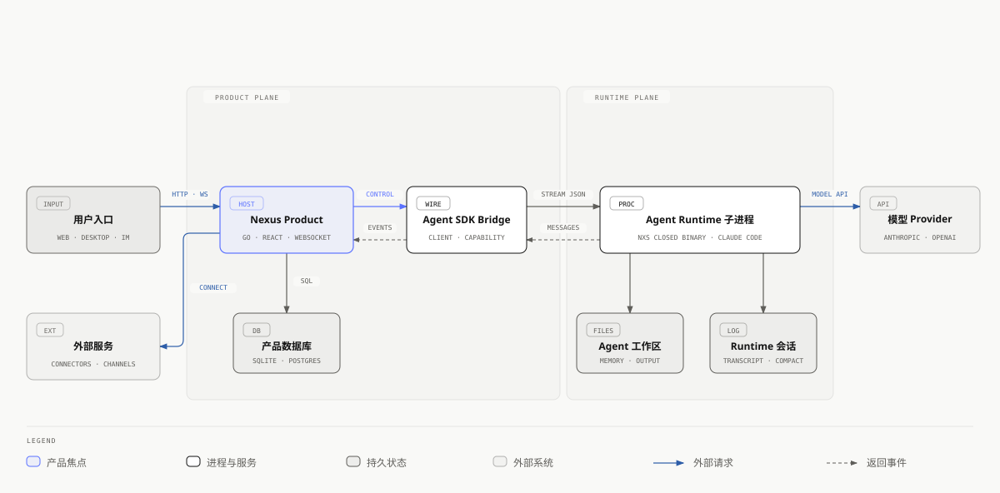
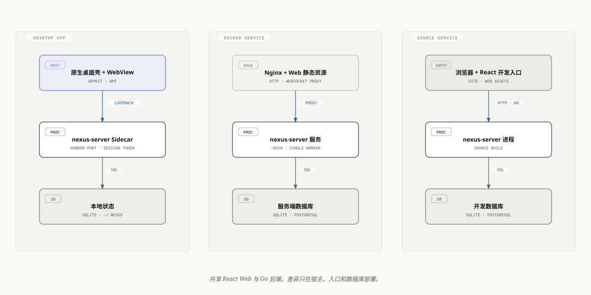
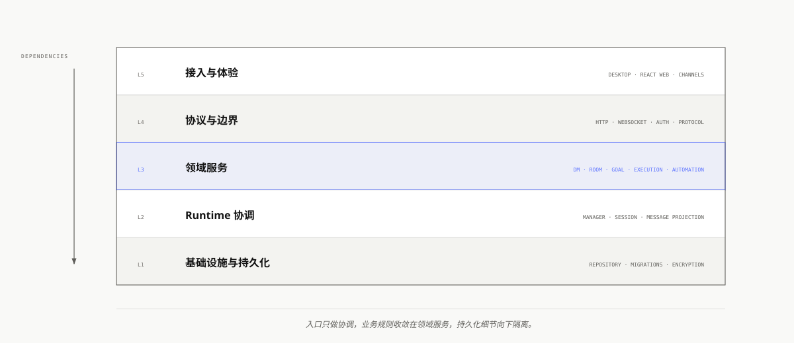
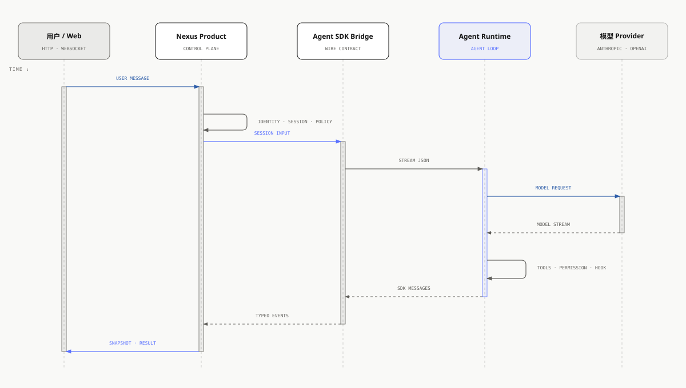
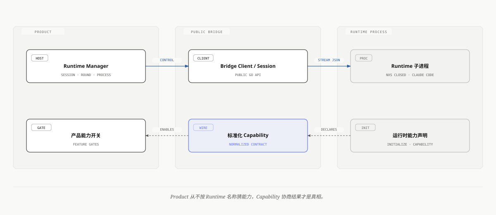
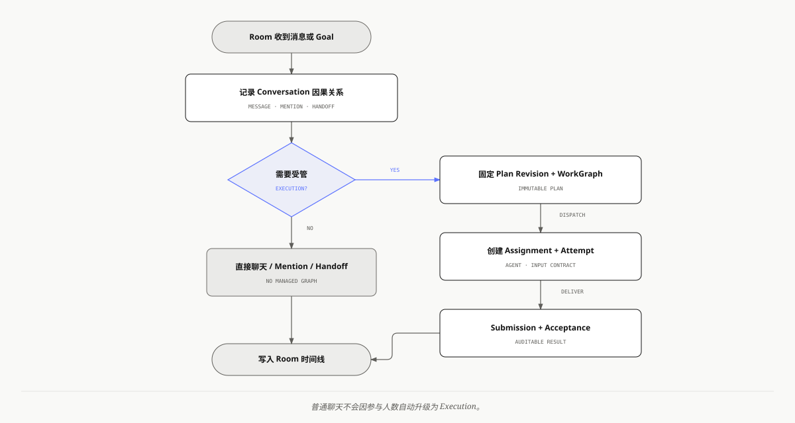
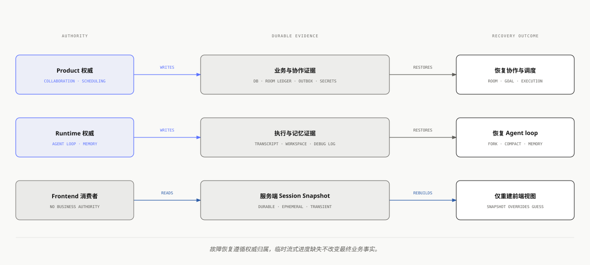
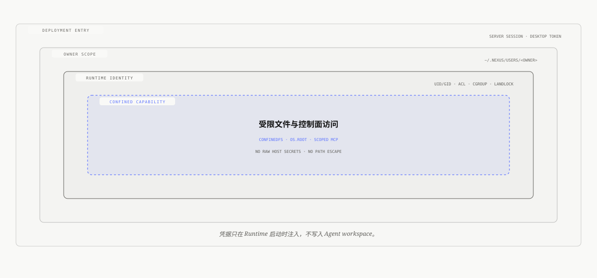
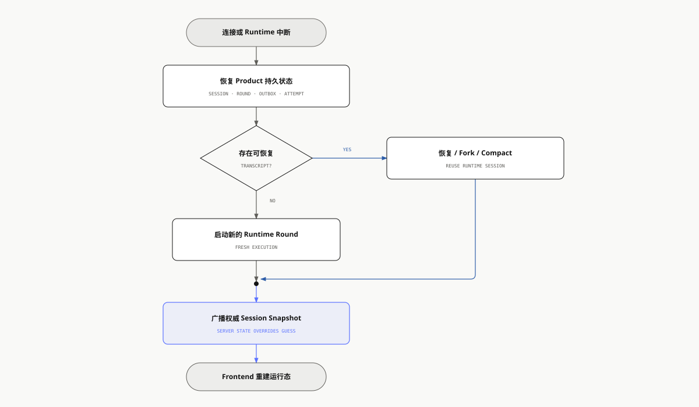

# Nexus 技术架构

| 项目 | 内容 |
| --- | --- |
| 文档状态 | 当前实现基线 |
| 核对日期 | 2026-10-09 |
| 覆盖范围 | Nexus Product、Agent SDK Bridge、Agent Runtime 边界 |
| 适用读者 | 架构师、后端与前端工程师、桌面端工程师、运维与安全评审人员 |

本文是架构总览，只给出边界、状态归属与部署形态；产品合同以各节链接的 `docs/specs/` 为唯一规范，接口字段以代码与公开协议为准。

## 架构结论

Nexus 由产品宿主（Product）和独立 Agent Runtime 组成，两者通过公开 Bridge 的行分隔 `stream-json` 协议通信。

- Product 持有身份、协作、调度、持久化和实时广播。
- Runtime 持有模型调用、工具循环、上下文压缩、Transcript 与记忆维护。

四条关键约束：

1. 依赖方向固定为 Product → Bridge → Runtime；Product 不直接依赖闭源 Runtime，`nxs` 及其内部 Go SDK 不进入本仓库源码或构建依赖。
2. Agent loop 运行在独立子进程（隔离依赖、故障和闭源实现），默认实现为 `nxs`，也可以使用 Claude Code。
3. 产品按 Runtime 声明的 Capability 使用能力，不根据 Runtime 名称推断行为。
4. 数据按权威归属拆分到产品数据库、Agent 工作区、Runtime Transcript 和宿主状态目录。

## 一、系统边界

用户经 Web、桌面或外部 IM 通道进入；模型请求由 Runtime 发往 Provider，外部服务授权与调用由 Connector 负责。



[HTML 版本](./architecture-html/nexus-architecture-diagram.html)（实线为请求或控制，虚线为 Runtime 返回的流式事件。）

| 组件 | 可见性 | 主要职责与边界 |
| --- | --- | --- |
| Nexus Product | 开源，本仓库 | Go 后端、React Web、桌面壳与部署资产；持有产品业务和 Runtime 编排，不实现 Agent loop |
| Agent SDK Bridge | 开源，独立仓库 | Go 客户端、进程协议、生命周期与 Capability 协商；持有公开契约，不持有产品业务状态 |
| `nxs` | 闭源 Runtime 发行物 | 执行 Agent loop、Provider 调用、工具、会话、压缩与记忆；只通过 Bridge 与 Product 通信 |
| Claude Code | 外部可选 Runtime | 通过 Bridge 兼容层接入，实际能力以运行时协商结果为准 |

## 二、运行形态

同一个 Go 后端和同一套 Web 前端支持桌面 App、Docker 服务和源码服务三种形态。



[HTML 版本](./architecture-html/nexus-deployment-topologies.html)

### 桌面 App

- macOS 使用 AppKit 与 WKWebView，Windows 使用 WPF 与 WebView2；原生壳负责窗口、文件选择、系统打开方式、更新和本机安全存储。
- Go `nexus-server` 作为 Sidecar 在回环地址随机端口启动，WebView 加载同包 Web 资产并访问该 Sidecar。
- 原生壳每次启动生成桌面会话 Token，写入 HTTP 请求或 WebView Cookie；Sidecar 校验本地 API 和 WebSocket 握手。
- 桌面端固定使用 SQLite，数据位于统一状态根 `~/.nexus`。
- 沙箱与进程恢复见 [desktop-sandbox-spec](./specs/desktop-sandbox-spec.md)。

### Docker 与源码服务

- Docker Compose 由 Nginx 提供静态资源和反向代理；`nexus-control` 管理 Web 用户、密码和 Session；Go 执行服务默认监听容器内 `8010`。
- Control 可用独立 SQLite 或 PostgreSQL 的 `control` schema；Nexus 业务数据独立选择 SQLite 或 PostgreSQL。
- 生产 TLS 由外层网关或负载均衡器终止。
- IM 通道维护进程内长连接或轮询连接；多副本共用数据库会重复消费，因此启用这类通道的默认部署只运行单个后端 Worker。横向扩展前须先为通道连接补充分布式租约与消费归属。

## 三、Product 内部结构

后端单向依赖：命令入口与桌面 Sidecar 启动 → `internal/app` 装配 → Handler（HTTP/WebSocket 边界）→ Service（领域规则）→ Storage/Repository（持久化）。`internal/protocol` 保存跨 HTTP、WebSocket、前端与运行时投影共享的协议模型。包边界与导入门禁见 [internal-boundaries](./specs/internal-boundaries.md)。



[HTML 版本](./architecture-html/nexus-product-layers.html)

| 领域 | 规范 |
| --- | --- |
| Agent、Session、主 Agent | [session-key](./specs/session-key-spec.md) · [main-agent](./specs/main-agent-spec.md) |
| DM、消息投影、历史 | [message-processing](./specs/message-processing-spec.md) |
| Echo 主动跟进 | [echo](./specs/echo-spec.md) |
| Room 成员、共享消息与实时调度 | [room](./specs/room-spec.md) · [room-collaboration](./specs/room-collaboration-spec.md) |
| Goal、Execution、WorkGraph | [execution-orchestration](./specs/execution-orchestration-spec.md) · [execution-graph](./specs/execution-graph-spec.md) |
| Runtime 交互与权限 | [permission-runtime](./specs/permission-runtime-spec.md) |
| Automation | [automation-permission-pipeline](./specs/automation-permission-pipeline-spec.md) · [failure-recovery](./specs/failure-recovery-spec.md) |
| Skill、Connector、Browser | [skill](./specs/skill-spec.md) · [connector-oauth](./specs/connector-oauth-spec.md) · [browser](./specs/browser-spec.md) |
| Provider 与模型 | [provider-model-guidance](./specs/provider-model-guidance-spec.md) · [openai-responses-runtime](./specs/openai-responses-runtime-spec.md) |
| 状态根、存储、文件边界 | [workspace-isolation](./specs/workspace-isolation-spec.md) |

### 前端

- 目录所有权与依赖方向见 [frontend-engineering](./specs/frontend-engineering-spec.md)。
- HTTP 负责资源查询与命令；WebSocket 负责流式消息、权限交互、Session 快照和失效事件。
- 断线重连后，共享通道重放 Session 绑定，并以服务端快照恢复权威运行状态。

## 四、Agent 回合流程

Product 先确定用户、Agent、Session 与策略，再把输入交给对应 Runtime Client；Runtime 完成模型请求和工具循环；Bridge 将流式消息返回 Product；Product 统一投影事件并向前端广播。



[HTML 版本](./architecture-html/nexus-agent-turn-sequence.html)

### 消息交付语义

- 产品协议区分 `durable`（跨重连保留）、`ephemeral`（随 Round 收口清理）和 `transient`（只在当前时间线展示）三类交付，定义见 [message-processing](./specs/message-processing-spec.md)。
- 流式进度不是业务事实；重连后不得重复制造交互卡片。
- 稳定的 Session ID、Round ID、Tool Use ID 和 Handoff ID 用于幂等接管既有节点。

## 五、Runtime 边界



[HTML 版本](./architecture-html/nexus-runtime-boundary.html)

### Bridge

- 公开契约层：一次性 Prompt、持久 Session、流式输入输出、控制请求、Hook、权限回调和进程内 MCP。
- 默认 Transport 启动本地 Runtime 进程，也支持宿主管理进程后的直接连接。
- 直接承载两种 Runtime 共用的 mixed-casing control wire，只在已确认的字段差异处声明兼容别名；不对工具输入、Provider payload 或控制消息做全局 snake/camel 转换。

### 默认 Runtime：nxs

Product 把 `nxs` 视为可替换的独立进程。`nxs` 持有：

- Runtime 初始化和 Turn 生命周期
- Anthropic Messages、OpenAI Chat Completions 与 OpenAI Responses 适配（见 [openai-responses-runtime](./specs/openai-responses-runtime-spec.md)）
- Provider 中立的流式事件
- 工具执行、权限、Hook、MCP 与沙箱
- Context Usage、Microcompact、完整 Compact 和恢复策略
- Transcript 持久化、Session Fork 与恢复
- Summary、AutoMemory 与 AutoDream

AutoDream 分工：Product 持有时钟、并发、重试和进程生命周期；Bridge 传递可取消的控制请求；`nxs` 判断执行资格并完成模型调用和记忆写入，使后台维护遵守同一套 Runtime 状态和文件锁规则。

### Claude Code

由 Bridge 启动和控制，使用同一 Product Session 与消息投影流程；Capability 集合可以不同，产品必须接受其返回的实际支持范围。

### 责任矩阵

| 能力 | Product | Bridge | Runtime |
| --- | --- | --- | --- |
| 用户、Agent、Room 和 Goal | 权威所有者 | 传输 | 消费受限上下文 |
| Session 到 Runtime Client 的映射 | 管理 | 提供 Client | 维护执行内会话 |
| 进程启动与协议收发 | 提供配置与生命周期策略 | 执行 | 响应 |
| 模型调用与工具循环 | 提供 Provider 配置和产品工具 | 传输回调 | 权威执行 |
| 权限 | 产品策略和用户决定 | 回调协议 | 调用前检查与恢复 |
| Transcript 与 Compact | 读取投影和关联元数据 | 传输控制 | 权威所有者 |
| 记忆维护 | 调度和展示结果 | 传输控制 | 资格判断和文件写入 |
| 实时 UI 事件 | 统一投影并广播 | 返回类型化消息 | 产生执行事件 |

## 六、Room、Goal 与 Execution



[HTML 版本](./architecture-html/nexus-collaboration-execution.html)

- Room 是共享协作容器，Conversation 是连续消息域，每个参与 Agent 以独立 Slot 运行；繁忙 Agent 的后续输入进入引导或持久队列，不并发写入同一 Session。
- Goal 提供目标、预算、完成条件和生命周期；需要受管分工时，Execution 将 Goal 物化为不可变 Plan Revision 与 WorkGraph。普通聊天和单纯 Mention 不会因人数被推断为受管 Execution。
- 分派、评审返回和取消通过持久 Outbox 恢复；取消绑定精确目标，区分 Provider 中断、本地 Context 取消、目标已结束和 Runtime 不支持。

## 七、数据与状态

- 统一状态根由 `NEXUS_STATE_ROOT` 指定，默认 `~/.nexus`；宿主数据与 owner 数据分开保存。
- Agent 工作区真实路径以数据库 `agents.workspace_path` 为准，诊断工具不从目录名猜测。
- 目录布局、迁移与隔离见 [workspace-isolation](./specs/workspace-isolation-spec.md)。



[HTML 版本](./architecture-html/nexus-state-ownership.html)

Agent 工作区内由产品使用的文件：

```text
<agent.workspace_path>/
├── MEMORY.md
├── memory/
├── .nexus/settings.json
└── .agents/sessions/<session>/
    ├── meta.json
    ├── overlay.jsonl
    └── input_queue.jsonl
```

| 数据 | 权威所有者 | 介质 | 说明 |
| --- | --- | --- | --- |
| User、Identity、密码、Web Session、Deployment | Nexus Control | SQLite 或 PostgreSQL `control` schema | 账号与部署权威，Nexus 不直接读取 |
| Agent、Room、Goal、Execution、Automation | Product | SQLite 或 PostgreSQL | 本地执行与业务实体 |
| Control 身份到本地 owner 的绑定与 `owner_profiles` 展示投影 | Product | SQLite 或 PostgreSQL | 不改原用户目录；只供本地 owner 关联和读模型，不是账号权威 |
| Agent 文件与长期记忆 | Agent Runtime 和受限宿主能力 | 文件系统 | 人和 Agent 都可检查 |
| 工作区 Session 投影 | Product | `meta.json` 与 JSONL | 关联 Session、Room、Round 和输入队列 |
| Runtime Transcript | Runtime | `runtime/projects` | Runtime 恢复、Fork 与 Compact 的权威记录 |
| Room Ledger | Product | `state/rooms` | 公开协作、Directed Message、Cursor 与 Handoff 证据 |
| Room 公共资产 | Product | `workspace/.rooms` | Runtime 可读取的共享附件与产物 |
| Provider 诊断日志 | `nxs` Runtime | `runtime/logs/debug` | 默认关闭，开启后供只读诊断 |
| Connector 凭据 | Product | 加密数据库载荷 | 加密密钥由部署环境或桌面安全存储提供 |

跨存储证据通过稳定 ID、幂等事件和持久 Outbox 关联。

## 八、安全与隔离



[HTML 版本](./architecture-html/nexus-security-boundaries.html)

### 身份和入口

服务端 Web（账号与在线 Team 见 [online-team](./specs/online-team-spec.md)）：

- 登录 Session 由 Nexus Control 签发，Control 只保存 Token 哈希。
- 浏览器的登录、登出、资料与密码写入直接进入同源 `/auth/v1`。
- Nexus 缓存短期签名 Principal，lease 有效期内本地验签；过期后若 Control 不可用则拒绝访问。
- Control 在身份写事务内追加持久失效事件，Nexus 副本按游标消费并撤销租约、连接或 runtime；各事件的处理与失败关闭规则见 [online-team](./specs/online-team-spec.md#账号组织与订阅)。

桌面与通用入口：

- 桌面端用每次启动生成的本地宿主 Token 保护本地 API 与 WebSocket；产品内只有固定 Local Principal，没有密码、账号 Session 或本地账号写栈。
- WebSocket 校验允许来源和用户作用域，Session 绑定按身份恢复。
- Connector 与 Channel 的敏感授权流程要求明确的人类交互证据。

### 文件边界

来自工作区、Runtime Artifact、Transcript 和用户 Skill 的相对路径先绑定到 `os.Root` 或目录文件描述符，由 `internal/infra/confinedfs` 负责遍历、读写、重命名和删除。业务层完成 owner 校验后也不能把未经约束的绝对路径交回普通 `os` API。

### Runtime 隔离

- Linux 服务端可通过 root-owned `nexus-runtime-launcher` 为 Runtime 分配不可登录 OS 用户、UID 与 GID、POSIX ACL、cgroup v2 和 Landlock 文件规则。
- Launcher 只接受受信任宿主配置，按 allowlist 构造环境，并移除宿主秘密和原始控制面能力。部署见 [runtime-isolation](./operations/runtime-isolation.md)。

Agent 可用的宿主能力都按 runtime round 签发，owner、Agent、DM/Room 和 workspace 由宿主锁定，Runtime Policy 拒绝作用域与 capability 覆盖：

- `nexuscfg` 与主 Agent 的 owner-scoped `nexusctl`：[conversational-configuration-control](./specs/conversational-configuration-control-spec.md)。
- 定时任务（内置 `automation` Skill，后台 run 只读且绑定 exact job/run）：[automation-permission-pipeline](./specs/automation-permission-pipeline-spec.md)。
- Echo 的单次 DM round message-only 策略：[echo](./specs/echo-spec.md)。

### 凭据

- Provider 凭据保留在 Product，启动 Runtime 时通过环境注入，不写入 Agent 工作区。
- Connector 凭据使用独立的 32 字节密钥加密；macOS 正式签名包优先用 Keychain 保存该密钥，Windows 使用系统保护能力，本地开发可回退到权限收紧的密钥文件。密钥来源规则见 [conversational-configuration-control](./specs/conversational-configuration-control-spec.md)，OAuth 见 [connector-oauth](./specs/connector-oauth-spec.md)。

## 九、可靠性与恢复



[HTML 版本](./architecture-html/nexus-recovery-flow.html)

- Runtime Manager 按 Session Key 管理 Client、Owner、活动 Round 和启动关闭栅栏。
- Client 换代、连接取消和闲置回收不持有全局锁，一个 Session 不阻塞其他会话。
- WebSocket 重连重放逻辑 Session 绑定，并以服务端 Snapshot 覆盖前端推测状态。
- Room 输入队列、Execution Outbox、Attempt 终态和 Acceptance 使用持久记录与幂等键。
- 中断绑定精确 Agent Round，完成事件和中断确认可以幂等竞合。
- Runtime Transcript 支持有界读取、Compact Boundary、Fork 和恢复，展示元数据不污染执行记录。
- 桌面 Sidecar 由原生壳监督，退出、异常和升级时统一回收子进程。
- 恢复遵循权威归属：Product 恢复协作与调度，Runtime 恢复 Transcript 和 Agent loop，前端只从 Snapshot 重建运行态；临时流式进度缺失不改变最终业务事实。

失败协议见 [failure-recovery](./specs/failure-recovery-spec.md)。

## 十、日志与诊断

- Product 日志覆盖 HTTP、WebSocket、调度、Runtime 生命周期和领域错误。
- `nxs` 本地生命周期诊断默认关闭，按需记录 Query、Tool、Provider、Compact、Memory 与 Hook 摘要；请求正文和响应正文各需独立开关。
- 并发 Provider 调用用 `diagnostic_call_id` 关联请求开始、响应头和完成事件。
- 诊断接口只返回白名单摘要，不暴露提示词、工具参数值、工具结果正文或 Hook 输出。

## 十一、协议与演进规则

| 协议 | 真相源 | 消费方 |
| --- | --- | --- |
| 产品 HTTP、WebSocket 和事件模型 | `internal/protocol` | Go Handler、Service、React 生成类型、Runtime 消息投影 |
| Product 与 Runtime 的进程协议 | [Agent SDK Bridge `protocol`](https://github.com/nexus-research-lab/nexus-agent-sdk-bridge/tree/main/protocol) | Product Runtime Client、`nxs`、Claude Code 兼容层 |

- 跨边界字段在真相源修改，并重新生成前端 TypeScript 类型。
- Service DTO、Repository Codec 和存储模型留在所属领域，不扩散成公共协议。
- Runtime 新能力先进入 Capability，再由 Product 按协商结果启用；`nxs` 与 Claude Code 可保持不同能力集，Runtime 升级顺序不影响产品判断。

## 十二、代码导航

| 需求 | 首要位置 |
| --- | --- |
| HTTP、WebSocket 或前端事件 | `internal/protocol`、`internal/handler`、`web/src/lib/api` |
| Product 共享依赖装配 / HTTP 启动 | `internal/app` / `internal/app/server` |
| DM 和 Room 行为 | `internal/chat`、`internal/service/room`、`internal/service/runtimehost` |
| Goal 与 Execution | `internal/service/goal`、`internal/service/orchestration`、`internal/service/goalexecution`、`internal/service/room/realtime` |
| Runtime Session 和 Round | `internal/runtime` |
| Runtime 消息到产品事件 | `internal/message` |
| Runtime Wire 和 Capability | [Agent SDK Bridge `client` 与 `protocol`](https://github.com/nexus-research-lab/nexus-agent-sdk-bridge) |
| 桌面 Sidecar 和 OS Bridge | `desktop/macos`、`desktop/windows` |

常规验证：

```bash
make check-go
make lint-web
make test-web
make typecheck-web
```

- 涉及 Runtime Wire 时还须分别验证 Bridge 和实际 Runtime。
- 涉及状态目录时必须同步检查 Product 迁移逻辑、工作区 Session 和 Runtime Transcript 布局。

## 参考实现

- [Nexus Product 说明](../README_zh.md)
- [Nexus 文档索引](./README.md)
- [Runtime 隔离部署](./operations/runtime-isolation.md)
- [Agent SDK Bridge](https://github.com/nexus-research-lab/nexus-agent-sdk-bridge)
