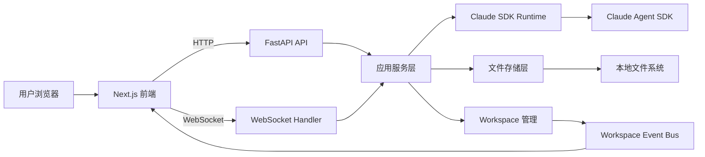
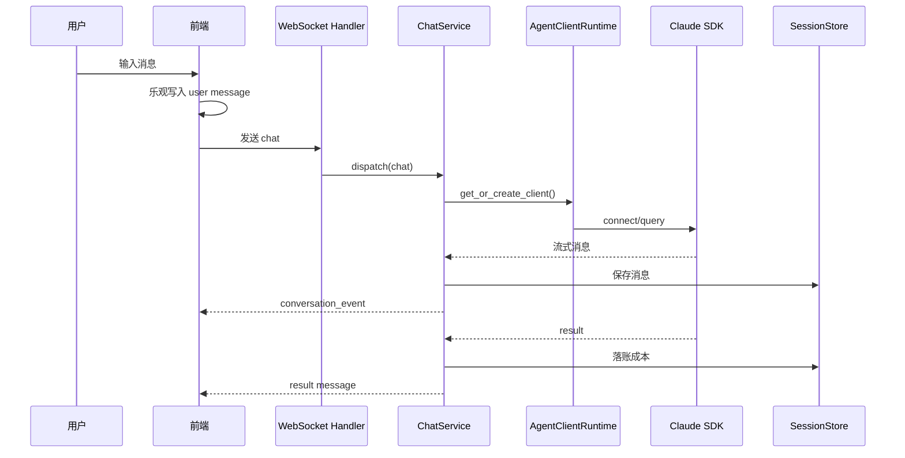
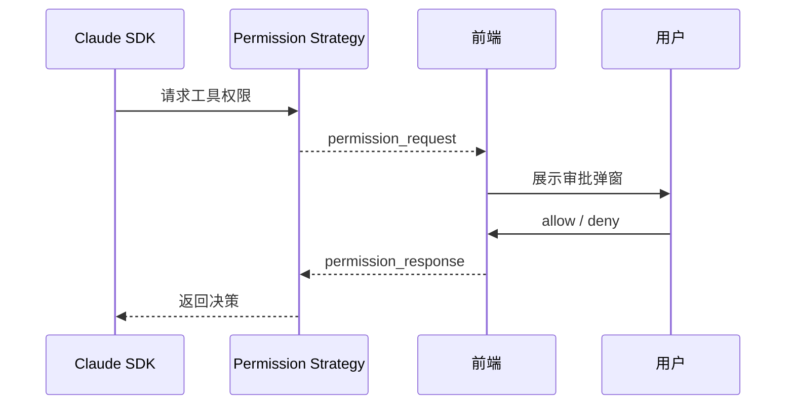
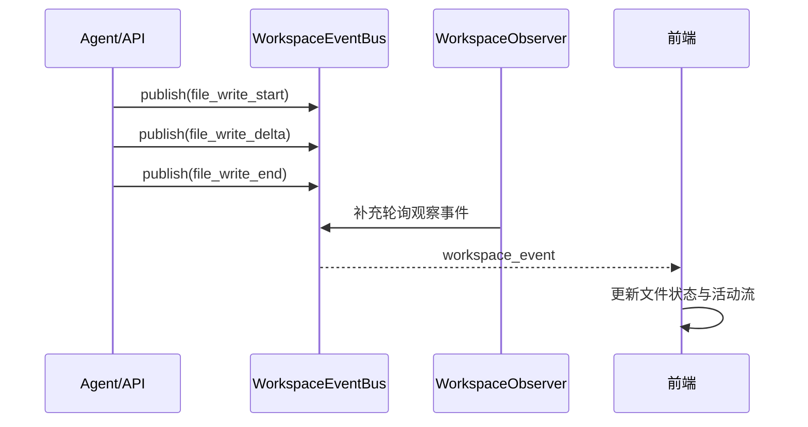
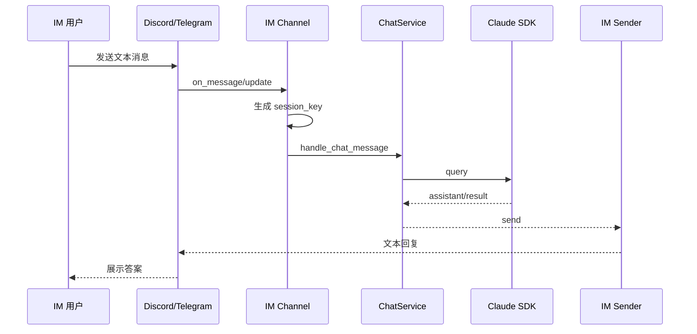
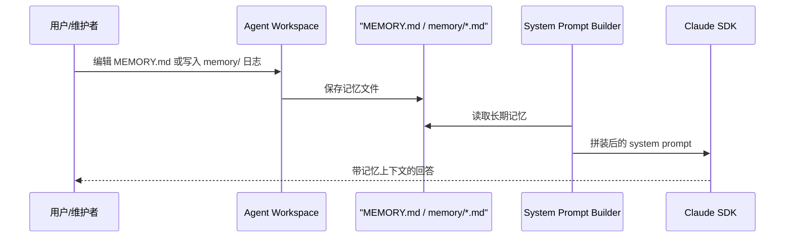

# Nexus Core 项目技术文档

## 1. 项目定位

Nexus Core 是一个面向多 Agent 工作台场景的 AI Agent 开发框架，核心目标不是做单一聊天界面，而是把以下能力整合成一个可运行的产品骨架：

- 多 Agent 管理：每个 Agent 都有独立配置和独立工作区。
- 会话持久化：会话、消息、成本账本全部落盘，支持恢复。
- 实时交互：前端通过 WebSocket 接收流式消息、权限请求和工作区事件。
- 工作区协同：Agent 写文件时，前端可以实时感知文件变化。
- 权限治理：执行工具前可插入交互式权限审批。

从当前实现看，这个项目更接近“Agent Runtime + Workspace Console”，而不是传统意义上的聊天机器人。

## 2. 业务抽象

项目围绕 4 个核心实体组织：

### 2.1 Agent

一个 Agent 对应一份独立配置和一个独立 workspace。

- 配置保存在 Agent 索引和各自 workspace 快照中。
- 运行时可配置模型、权限模式、工具白名单、最大轮次、MCP Server 等。
- Agent 的 workspace 路径由系统托管，默认位于 `~/.nexus-core/workspace/<agent_name_slug>`。

### 2.2 Session

Session 是一次持续对话的运行单元，使用结构化 `session_key` 进行路由。

格式：

```text
agent:<agentId>:<channel>:<chatType>:<ref>[:topic:<threadId>]
```

设计价值：

- 不依赖数据库自增主键即可完成路由。
- 同一协议可兼容 WebSocket、Discord、Telegram 等多通道。
- 会话归属 Agent 明确，便于隔离工作区与成本统计。

### 2.3 Message

后端内部统一使用 `AMessage` 模型承接 Claude SDK 消息，再通过 `ProtocolAdapter` 转换成前端可消费协议。

消息角色包含：

- `user`
- `assistant`
- `system`
- `result`
- `stream`（内部使用，用于流式增量）

### 2.4 Workspace

Workspace 是 Agent 的文件工作区，也是系统提示词拼装和文件事件分发的基础。

- 自动初始化 `AGENTS.md`、`USER.md`、`MEMORY.md`、`RUNBOOK.md`
- 自动拼装 system prompt
- 支持文件树读取、文本读写、重命名、删除
- 支持实时写入事件广播

### 2.5 Memory

Memory 是 Nexus Core 中显式建模的一层上下文资产，用来承接跨会话保留的信息，而不是把所有历史都隐式塞给模型。

当前分成两类：

- 长期记忆：保存在 `MEMORY.md`
- 短期记忆：保存在 `memory/YYYY-MM-DD.md` 一类按日期组织的文件中

设计价值：

- 把“需要长期保留的信息”从聊天历史中抽离出来
- 让 Agent 的 system prompt 能显式吸收稳定上下文
- 便于人工审阅、编辑和沉淀项目知识

## 3. 技术栈

### 3.1 后端

- Python 3.11+
- FastAPI
- Uvicorn / Gunicorn
- Pydantic v2
- `claude-agent-sdk`
- 文件系统持久化（JSON / JSONL）

### 3.2 前端

- Next.js 16
- React 19
- TypeScript 5
- Zustand
- Tailwind CSS 4
- Framer Motion

### 3.3 通信机制

- HTTP：用于 Agent / Session / Workspace CRUD
- WebSocket：用于对话流式输出、权限请求、工作区事件推送
- IM Channel：用于 Discord / Telegram 消息接入

## 4. 总体架构



分层理解：

- API 层负责暴露 HTTP / WebSocket 接口。
- Service 层负责编排业务用例。
- Channel 层负责接入不同消息入口并统一转交 Service。
- Infra 层负责 SDK Runtime、权限、存储、工作区。
- Schema 层负责领域模型与协议模型。
- Web 前端负责工作台 UI、会话状态、实时交互。

## 5. 后端架构设计

## 5.0 Channel 通道层

项目当前并不是只有 WebSocket 一种消息入口，而是存在一层独立的 Channel 抽象。

核心接口分成两类：

- `MessageChannel`：定义通道生命周期，统一 `start()` / `stop()`
- `MessageSender`：定义消息发送能力，统一 `send_message()` / `send_event()` / `send_error()`

这意味着系统把“从哪里收消息”和“往哪里发消息”都做成了可替换抽象。

### 5.0.1 `ChannelRegister`

`ChannelRegister` 是通道编排中心，职责是：

- 注册通道实例
- 在应用启动时批量启动通道
- 在应用关闭时批量停止通道

当前由 `agent.app` 的 lifespan 调用，因此 Discord / Telegram 是跟随后端服务一同启动的，而不是额外单独部署一套轮询进程。

## 5.1 应用启动

入口位于 `main.py`，通过 `agent.app:create_app()` 创建 FastAPI 应用。

启动关键点：

- 根据配置决定是否开启 Swagger。
- 在 lifespan 中注册消息通道。
- 支持 WebSocket、Discord、Telegram 三类消息入口。
- 应用级中间件、异常处理、请求钩子统一在启动时注册。

## 5.2 API 路由

统一前缀为：

```text
/agent/v1
```

当前主要路由分为三类：

- Agent API：管理 Agent 与 workspace 文件
- Session API：管理会话、历史消息、轮次删除、成本查询
- WebSocket API：处理实时消息流

### 5.2.1 Agent API

主要能力：

- 获取 Agent 列表
- 创建 / 更新 / 删除 Agent
- 校验 Agent 名称合法性与冲突
- 查询 Agent 下的 Session
- 获取 Agent 成本汇总
- 管理 workspace 文件与目录

### 5.2.2 Session API

主要能力：

- 获取所有 Session
- 创建 / 更新 / 删除 Session
- 获取历史消息
- 删除指定轮次
- 查询 Session 成本汇总

### 5.2.3 WebSocket API

WebSocket 入口为：

```text
/agent/v1/chat/ws
```

职责：

- 接收前端 `chat` / `interrupt` / `permission_response`
- 接收 `subscribe_workspace` / `unsubscribe_workspace`
- 向前端推送会话事件、权限事件、workspace 事件和错误事件

### 5.2.4 IM Channel

IM Channel 不通过 HTTP 路由暴露，而是在应用启动阶段按配置注册。

当前已实现两类 IM 通道：

- Discord Channel
- Telegram Channel

它们的共同职责是：

- 监听外部 IM 文本消息
- 将消息转换为内部 `session_key + content + round_id`
- 调用 `ChatService` 进入统一对话主链路
- 使用各自 Sender 将回答回推到外部 IM 平台

这部分设计的重点是“入口不同，核心对话编排相同”。

## 5.3 服务层职责

### 5.3.1 `AgentService`

负责 Agent 用例编排：

- Agent CRUD
- workspace 文件 CRUD
- workspace 变更后刷新活跃会话
- Agent 成本汇总查询

关键设计点：

- workspace 文件改动后，会调用 `session_manager.refresh_agent_sessions(agent_id)`，使活跃 Claude SDK session 失效重建，保证配置和 prompt 及时生效。

### 5.3.2 `SessionService`

负责 Session 用例编排：

- 前端会话键规范化
- Session CRUD
- 历史消息查询
- 轮次删除
- 成本汇总查询

关键设计点：

- 前端传入的简化 `session_key` 会被转换为内部结构化路由键。
- Session 删除时会同步清理运行中的 SDK session。

### 5.3.3 `ChatService`

负责单轮对话编排：

- 按 `session_key` 管理 chat task
- 创建或复用 Claude SDK client
- 调用 `client.query(content)`
- 消费 SDK 流式输出
- 通过 `ChatMessageProcessor` + `ProtocolAdapter` 转成前端协议

关键设计点：

- 同一 `session_key` 新消息到来时，会取消旧任务，避免并发串流污染。
- 使用 `session_manager.get_lock(session_key)` 保护同一会话的串行执行。

## 5.4 运行时与基础设施

## 5.4.0 IM Channel 实现细节

### 5.4.0.1 Discord Channel

`DiscordChannel` 基于 `discord.py` 实现，主要能力包括：

- 使用 `discord.Client` 启动 Bot
- 支持 Guild 白名单
- 支持触发词过滤
- 支持 DM 和群消息两种路由
- 群消息支持线程 ID 拼入 `session_key`

Discord 消息进入系统后的处理步骤：

1. 过滤 Bot 自身消息
2. 校验 Guild 白名单
3. 校验触发词
4. 生成 `session_key`
5. 使用 `DiscordSender` 和 `ChatService` 处理消息

对应的 Session 路由规则：

- 私聊：`channel="dg", chat_type="dm", ref=<user_id>`
- 群聊：`channel="dg", chat_type="group", ref=<guild_id>:<channel_id>`
- 线程：额外附加 `thread_id`

### 5.4.0.2 Telegram Channel

`TelegramChannel` 基于 `python-telegram-bot` 实现，主要能力包括：

- 使用 `Application` 启动 polling
- 支持用户白名单
- 支持私聊、群聊、Topic 路由
- 在消息处理前发送 typing 状态

对应的 Session 路由规则：

- 私聊：`channel="tg", chat_type="dm", ref=<user_id>`
- 群聊：`channel="tg", chat_type="group", ref=<chat_id>`
- Topic：额外附加 `message_thread_id`

### 5.4.0.3 IM Sender 设计

项目为不同 IM 平台提供了独立 Sender：

- `DiscordSender`
- `TelegramSender`

它们负责把内部 `AMessage` 转成平台可读文本，并处理平台消息长度限制：

- Discord 单条上限 2000 字符
- Telegram 单条上限 4096 字符

当前策略比较克制：

- `stream` 消息不直接推到 IM
- `system` 消息不推到 IM
- 事件消息不推到 IM
- 主要发送 assistant 文本消息

这说明 IM 通道当前更偏“外部问答入口”，而不是完整工作台体验。

## 5.4.1 SessionManager

`SessionManager` 维护内存中的活跃 `ClaudeSDKClient`：

- `_sessions`：`session_key -> client`
- `_locks`：`session_key -> asyncio.Lock`
- `_key_sdk_map`：内部会话键与 SDK 会话 ID 的映射

它解决的问题：

- 会话复用
- 配置刷新
- 历史 session 恢复
- 中断与资源清理

## 5.4.2 AgentClientRuntime

职责：

- 根据 Agent 配置和 workspace 拼装 SDK options
- 根据历史 session 决定是否 `resume`
- 注入 `can_use_tool` 权限回调

配置合并顺序：

1. workspace 层：`cwd` + `system_prompt`
2. agent 层：模型、工具、权限等选项

这意味着：

- 工作区文件是 prompt 的一部分
- Agent 配置是执行策略的主要来源

## 5.4.3 权限系统

权限链路由 `InteractivePermissionStrategy` 和 `permission_runtime.py` 提供支撑。

核心能力：

- 识别工具请求
- 生成待审批请求
- 计算风险等级
- 将 SDK 的权限建议序列化给前端
- 接收前端审批结果并恢复执行

风险分类：

- 只读工具：低风险
- 写入工具：中风险
- 执行工具：高风险
- 交互工具：中风险

这套设计把“工具是否可执行”从静态配置变成了运行时决策。

## 5.4.4 Workspace 管理

`AgentWorkspace` 是工作区抽象的核心对象，职责包括：

- 初始化工作区目录
- 种子化模板文件
- 读取与写入相对路径文件
- 防止路径逃逸
- 构建 system prompt
- 保存记忆文件
- 生成 diff 摘要
- 触发 workspace 实时事件

安全策略：

- 禁止直接操作 `.agent/`
- 通过相对路径解析 + `resolve()` 校验，防止越界访问
- 过滤 `.git`、`__pycache__`、`.agent` 等隐藏运行目录

### 5.4.4.1 Memory 组织方式

基于当前实现，workspace 中的记忆分层如下：

- `MEMORY.md`：长期记忆，承接稳定偏好、约束和关键决策
- `memory/README.md`：短期记忆目录说明
- `memory/*.md`：按日期沉淀的短期摘要或阶段性记录

默认模板里已经约定了 Memory 的语义边界：

- `MEMORY.md` 记录长期稳定信息
- `memory/` 记录短期上下文和阶段性记忆

这比单纯依赖会话历史更适合做项目型 Agent。

### 5.4.4.2 Memory 与 Prompt 的关系

当前 `AgentWorkspace.build_system_prompt()` 会按固定顺序拼装工作区上下文：

1. 基础 `SYSTEM_PROMPT.md` 或外部配置的基础 prompt
2. `AGENTS.md`
3. `USER.md`
4. `MEMORY.md`
5. `RUNBOOK.md`

这意味着 `MEMORY.md` 并不是附属文件，而是直接进入 system prompt 的一部分。

换句话说，Memory 在当前架构里承担的是“可编辑、可审计、可持久化的显式记忆层”。

### 5.4.4.3 Memory 写入能力

`AgentWorkspace` 已经提供 `save_memory(filename, content)` 能力，用于把摘要或记忆写入 `memory/` 目录。

虽然当前主链路还没有做自动总结调度，但基础能力已经具备：

- 可以由 Agent 或后端流程显式写入短期记忆文件
- 可以由人工直接编辑 `MEMORY.md`
- 可以把短期记忆整理回长期记忆

## 5.4.5 Workspace 实时同步

项目同时提供两条文件事件链路：

1. 显式事件链路：API 或 Agent 主动写文件时直接发布事件
2. 轮询观察链路：`WorkspaceObserver` 定时扫描文件变化并推断写入开始 / 增量 / 结束

事件类型：

- `file_write_start`
- `file_write_delta`
- `file_write_end`

价值：

- 前端无需主动刷新文件树
- 可以展示“正在写入”状态
- 未来可扩展为更细粒度的协同编辑体验

## 5.5 存储设计

当前项目使用文件系统而不是数据库作为主存储。

### 5.5.1 存储特点

- 部署简单
- 本地开发体验好
- 天然贴近 workspace 语义
- 便于按 Agent 维度隔离

### 5.5.2 存储内容

基于当前代码，可归纳出如下布局：

```text
~/.nexus-core/workspace/
└── <agent_name_slug>/
    ├── AGENTS.md
    ├── USER.md
    ├── MEMORY.md
    ├── RUNBOOK.md
    ├── memory/
    │   ├── README.md
    │   └── 2026-03-05.md
    ├── .claude/
    └── .agent/
        └── runtime/
            └── sessions/
                └── <session_hash>/
                    ├── meta.json
                    ├── messages.jsonl
                    ├── telemetry_cost.jsonl
                    └── telemetry_cost_summary.json
```

### 5.5.3 Agent 存储

- `agents_index_path` 保存全量 Agent 索引
- 每个 Agent workspace 下会保存一份 Agent 快照
- 默认环境下会自动引导一个 `main` Agent

### 5.5.4 Session 存储

Session 元信息保存在 `meta.json`，消息保存在 `messages.jsonl`。

消息存储策略：

- 以追加写 JSONL 为主
- 读取时按 `message_id` 压缩成最新快照
- 能兼容流式消息和中断后的不完整轮次

### 5.5.5 Memory 存储

Memory 没有单独做数据库表或专门索引，而是直接作为 workspace 文件体系的一部分。

这种设计的优点是：

- 记忆内容天然和 Agent 工作区绑定
- 便于人工编辑与版本管理
- 可以直接复用 workspace 文件读写、展示和同步能力

当前可以把 Memory 理解为“文件化的上下文层”。

### 5.5.6 成本账本

`result` 消息会被抽取成独立成本账本：

- Session 维度汇总
- Agent 维度汇总

统计项包括：

- 输入 / 输出 token
- cache token
- 总成本
- 成功 / 失败轮次
- 最近一次运行耗时与成本

这使项目具备了“运行可观测性”的基础能力。

## 6. 前端架构设计

## 6.1 页面结构

首页采用 `Agent Directory -> Agent Space` 的工作台模式，而不是单列聊天布局。

主要区域：

- 左侧：Agent 列表 / 工作区文件树
- 中间：会话区与对话流
- 右侧：Agent Inspector / 任务视图 / 成本视图

这一布局更符合“开发控制台”而非“消费型聊天产品”的定位。

## 6.2 状态管理

前端主要通过 Zustand 管理状态：

- `useAgentStore`：Agent 列表、当前 Agent、服务端同步
- `useSessionStore`：Session 列表、当前 Session、持久化恢复
- `useWorkspaceFilesStore`：当前 workspace 文件快照
- `useWorkspaceLiveStore`：实时文件事件与文件写入状态

设计特点：

- `persist` 持久化 Agent / Session 选择状态
- 实时事件与静态文件树状态拆开，避免相互污染

## 6.3 对话 Hook

`useAgentSession` 是前端对话链路核心，负责：

- 建立 WebSocket 连接
- 发送 chat / interrupt / permission_response
- 接收 conversation_event / permission_request / workspace_event
- 维护 messages、toolCalls、pendingPermission、loading 状态
- 处理历史消息加载、重新生成、删除轮次

关键设计点：

- 使用 `activeSessionKeyRef` 严格过滤非当前会话事件，避免串流错乱。
- 用户消息先乐观写入 UI，再发送给后端。
- 收到 `result` 消息后结束 loading 状态。

## 6.4 消息协议

前端消费的协议分两类：

### 6.4.1 会话事件

统一封装为：

```json
{
  "event_type": "conversation_event",
  "agent_id": "agent:main:ws:dm:xxx",
  "data": {
    "event_id": "...",
    "seq": 1,
    "turn_id": "...",
    "kind": "message_upsert | message_delta"
  }
}
```

### 6.4.2 工作区事件

统一封装为：

```json
{
  "event_type": "workspace_event",
  "agent_id": "<agent_id>",
  "data": {
    "type": "file_write_start | file_write_delta | file_write_end",
    "path": "src/app.py",
    "version": 3
  }
}
```

后端通过 `ProtocolAdapter` 统一输出，前端因此不需要感知 Claude SDK 原始消息细节。

## 7. 关键链路说明

## 7.1 链路一：用户发送消息



核心价值：

- 支持流式输出
- 支持会话恢复
- 支持消息持久化
- 支持成本统计

## 7.2 链路二：权限审批



核心价值：

- 将危险工具执行前置到用户可见的审批面板
- 支持附带权限建议，便于一次性调整策略

## 7.3 链路三：Workspace 文件实时同步



核心价值：

- 文件写入对用户可见
- 工作区变化不再是黑箱
- 为后续审计、协作和回放打基础

## 7.4 链路四：IM 消息接入



这条链路的重要性在于：

- 外部 IM 平台可以复用统一 Agent 运行时
- Session 路由规则在多通道下保持一致
- Web 控制台和 IM 入口可以共享同一套会话 / 存储模型

但它和 WebSocket 工作台有明显边界：

- 当前 IM 通道默认使用自动放行权限策略
- 不承载前端式权限审批面板
- 不推送 workspace 实时事件
- 不展示完整流式中间态

## 7.5 链路五：Memory 沉淀与消费



这条链路说明了一个关键事实：

- Memory 不是聊天记录备份
- Memory 是被主动组织和消费的高价值上下文
- 它通过 system prompt 参与后续推理，而不是只做存档

## 8. 当前项目的设计亮点

## 8.1 Agent 与 Workspace 强绑定

这不是“一个模型配很多会话”的简单聊天架构，而是把 Agent 视为“配置 + 文件上下文 + 会话集合”的业务单元，利于做多项目并行。

## 8.2 文件存储优先

项目没有先上数据库，而是优先做 workspace 语义和本地可用性，这种路线对 Agent 开发平台是合理的，因为：

- 很多上下文本身就是文件
- 部署和迁移成本低
- 便于调试与回溯

## 8.3 协议适配层清晰

`ProtocolAdapter` 把 SDK 消息和前端协议解耦，避免前端直接依赖 SDK 结构，是非常关键的一层。

## 8.4 权限治理不是附属功能

权限系统已经进入主链路，而不是“后续再补”的周边模块，这对真正落地的 Agent 平台很重要。

## 8.5 多通道接入模型清晰

项目把 WebSocket、Discord、Telegram 放在统一 Channel 抽象下，使“入口扩展”不需要改动核心对话编排，这一点是工程结构上的亮点。

## 8.6 Memory 采用显式文件化设计

项目没有把“记忆”做成黑箱向量层或隐藏状态，而是先采用 `MEMORY.md + memory/` 的显式文件模型，这对工程可控性、可解释性和人工干预都更友好。

## 8.7 成本统计进入产品骨架

项目已经具备 Session / Agent 级成本汇总，为后续做配额、告警、运营分析留下了明确接口。

## 9. 当前不足与后续演进建议

基于当前实现，后续可以重点加强以下方向：

### 9.1 存储一致性

- 当前以文件系统为主，适合单机或轻量部署。
- 如果未来进入多实例部署，需要引入集中式元数据存储和分布式锁。

### 9.2 观察机制效率

- `WorkspaceObserver` 通过轮询推断变化，简单可靠，但效率一般。
- 后续可切换为文件系统监听方案，提高实时性并降低扫描开销。

### 9.3 IM 能力补齐

- 当前 IM Channel 已完成接入，但更偏纯问答入口。
- 如果后续要做企业内协作机器人，需要补充权限回执、富文本卡片、线程上下文管理和更细的消息去重策略。

### 9.4 Memory 自动化能力

- 当前 Memory 的文件模型已经就位，但自动沉淀链路还比较弱。
- 后续可以增加“轮次总结 -> memory 日志 -> 长期记忆归档”的自动流程。
- 还可以增加记忆筛选规则，避免把噪音直接写入长期记忆。

### 9.5 会话并发与隔离

- 当前已通过 `session_key` 锁保证单会话串行。
- 如果后续需要批量任务和后台运行，需要进一步区分“前台交互会话”和“后台作业会话”。

### 9.6 文档与测试体系

- 项目代码抽象已经比较完整，但系统级技术文档此前缺失。
- 建议补充典型链路测试、协议测试和 workspace 事件测试。

## 10. 启动与验证方式

常用命令：

```bash
make install
make dev
make run-backend
make run-web
cd web && npm run lint
cd web && npx tsc --noEmit
python -m py_compile agent/**/*.py
```

默认端口：

- 后端：`8010`
- 前端：Next.js 默认开发端口

关键环境变量：

- `ANTHROPIC_AUTH_TOKEN`
- `ANTHROPIC_BASE_URL`
- `ANTHROPIC_MODEL`
- `WORKSPACE_PATH`
- `DEFAULT_AGENT_ID`
- `BASE_SYSTEM_PROMPT`
- `BASE_SYSTEM_PROMPT_FILE`

## 11. 面向技术交流的分享提纲

如果做两场交流，建议拆成两个角度。

### 11.1 第一场：产品化 Agent Runtime 设计

建议结构：

1. 为什么传统聊天 UI 不够支撑 Agent 产品
2. Nexus Core 的核心抽象：Agent / Session / Workspace / Memory / Permission / Channel
3. 文件工作区如何成为 prompt 与执行上下文的一部分
4. `MEMORY.md` 如何承担显式记忆层
5. Claude SDK 如何被封装成可恢复、可治理的运行时
6. Web、Discord、Telegram 如何复用统一 Agent 主链路
7. 权限审批与成本账本如何进入主链路

### 11.2 第二场：实时协同与工程实现

建议结构：

1. 前端三栏工作台为什么这样设计
2. WebSocket 协议如何统一消息流、权限流、文件流
3. IM Channel 如何复用统一 Session 路由与 ChatService
4. Memory 文件如何进入 system prompt
5. `ProtocolAdapter` 如何做协议收口
6. workspace 实时事件如何从后端传到前端
7. 当前方案的边界与下一步演进方向

## 12. 一句话总结

Nexus Core 的核心价值，在于把 Agent 从“调用一次模型”提升为“带工作区、带状态、带治理、可持续运行的工程对象”。
