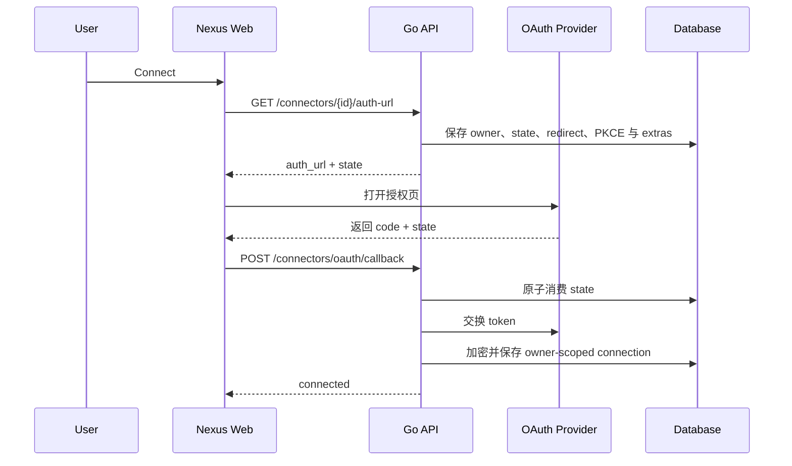

# Connector OAuth 规范

## 1. 范围与真相源

本文定义 Connector 的浏览器 OAuth、Device Flow、owner-scoped OAuth 应用配置和
Agent 发起授权的安全边界。当前 Provider、scope、端点和可用状态以
`internal/service/connectors/catalog.go` 与 `internal/connectors/providers/` 为准；
本文不复制易漂移的 Provider 清单。

## 2. 浏览器 Authorization Code



支持 PKCE 的 Provider 由后端生成 verifier 和 S256 challenge。回调必须命中创建
state 的同一 owner 和 redirect URI；state 在 token 交换前即被消费，失败后也不能
重放。

## 3. Device Flow

支持 Device Flow 的 Connector 共用以下入口：

```text
POST /nexus/v1/connectors/{connector_id}/device/start
POST /nexus/v1/connectors/{connector_id}/device/poll
```

GitHub 桌面端只需要公开 Client ID，不在应用包中携带 Client Secret。飞书云文档
支持两种显式模式：

- `official_qr`：先由官方应用注册流程选择或创建应用，再进入用户 Device
  Authorization。
- `manual_credentials`：用户保存自己的 App ID / App Secret 后直接进入用户授权。

飞书官方流程返回的用户授权 URL 直接交给系统浏览器打开，不再重新编码成二维码。
取消、断开或终态失败会清理该连接对应的临时状态；删除 owner-scoped OAuth 应用时
同时断开依赖它的连接。

## 4. OAuth 应用配置

OAuth 凭据有三种来源：

1. Provider 声明支持用户 OAuth 应用时，使用当前 owner 保存的 Client ID / Secret。
2. 其他浏览器 OAuth Provider 使用部署级 `CONNECTOR_*_CLIENT_ID` 与
   `CONNECTOR_*_CLIENT_SECRET`。
3. GitHub 桌面 Device Flow 使用包内公开 Client ID。

Web 的 Connector 详情页支持保存、重新配置和删除 owner-scoped OAuth 应用。API
只返回 Client ID 与 `oauth_client_configured`，永远不返回 Client Secret。声明
`AutoOAuthClient` 的 Provider 可以在没有预存应用凭据时启动官方引导。

## 5. 安全不变量

- OAuth state 使用随机值，默认 600 秒过期，并通过 `DELETE ... RETURNING` 一次性消费。
- redirect URI 必须与 `CONNECTOR_OAUTH_ALLOWED_ORIGINS` 的 scheme、host 和 path
  前缀匹配；回调提供 redirect 时还必须与 state 中保存的值一致。
- Provider 需要 PKCE 时，verifier 只保存在服务端 state 中。
- Connector token 与 owner-scoped OAuth Client Secret 必须使用
  `CONNECTOR_CREDENTIALS_KEY` 加密；缺少有效的 32 字节 base64 key 时拒绝保存。
- token、Client Secret、PKCE verifier、device code 和 OAuth state 不返回给 Agent，
  也不得进入日志或公开错误。
- 配置和连接都按 `owner_user_id + connector_id` 隔离；每次变更推进配置版本，受控
  Agent 授权还会绑定启动版本，拒绝覆盖较新的用户变更。
- 桌面安装包只能携带公开 Client ID，不能嵌入 OAuth Client Secret。

## 6. Agent 发起授权

Agent 只能通过 `nexus` MCP 中的 Connector 授权工具发起 OAuth 或 Device Flow。启动动作
必须来自当前 owner 主智能体的 WebSocket 私有 DM，并绑定真实的人工批准、认证
principal、runtime session、round、Connector 和配置版本。

公开给 Agent 的 flow 只包含 opaque `flow_id`、状态、授权 URL、用户码、验证地址和
轮询时间。完成、查询与取消都会重新校验 owner、主智能体身份、原始 round lease 和
配置版本；Room、普通 Agent、过期批准或已结束 round 均不能复用该授权。

## 7. 显式挂载 Connector 的运行时能力

只有 Agent 默认或当前 Session 显式选中的 Connector，才向当前 owner 的 Agent runtime
挂载能力。支持原生 MCP 的 Provider 直接挂载各自 MCP server；飞书云文档通过独立的
`nexus_feishu_docx` MCP 暴露带固定 schema 的语义工具。宿主不向模型暴露连接列表，也不提供
可传入任意 method、path 和 body 的通用 REST 代理。

选中后的工具 schema 不随短暂连接状态消失；未连接、凭据过期或刷新失败会在真实调用时
显式返回错误。显式取消 Session/Agent 选择才会在下一轮卸载该 Connector 工具面。

## 8. 排障

- `OAuth state 无效或已过期`：授权已使用、已过期或不属于当前 owner，重新连接。
- `redirect URI 不在允许列表中`：检查 `CONNECTOR_OAUTH_ALLOWED_ORIGINS` 与 Provider
  控制台登记值。
- `redirect URI 不匹配`：回调必须使用创建 state 时保存的同一 URI。
- `CONNECTOR_CREDENTIALS_KEY 未配置或无效`：生成 32 字节 base64 key 后重启服务。
- `shop 参数缺失`：Shopify 授权前提供 `myshopify.com` 子域。
