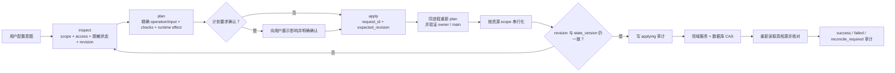

# Nexus 对话配置控制面

## 目标与原则

Nexus 的配置真相源并不只是一份 JSON。Provider、Agent、Room、Channel、Connector、Automation 等状态在数据库中，用户偏好和 WebSearch 凭据在用户配置目录，主机启动参数来自部署环境，桌面状态根由原生宿主离线迁移。因此，通过对话配置 Nexus 指的是让智能体安全操作真实配置能力，而不是允许模型随意读写文件、执行 SQL，或维护一份会与数据库漂移的影子 JSON。

本控制面把这些异构真相源投影成一棵可发现、可脱敏读取、可计划、可审计的虚拟配置树。每个写操作仍调用对应领域服务，让 Web UI、HTTP API 与对话入口复用同一套校验、级联、加密和 runtime reconcile 规则。它遵守五项原则：

1. 身份和作用域由可信 runtime 上下文绑定，并在每次调用时从数据库重验。
2. `inspect`、`plan` 和 `apply` 使用同一套字段级与操作级授权，不存在“能看到就能改”的推断。
3. 计划绑定身份、作用域、输入和资源版本；旧计划不能覆盖新状态，也不能换目标重放。
4. 写入后重新读取真相源；成功、失败和需要 reconcile 的部分变更都留下脱敏审计。
5. 生效时机是配置契约的一部分；系统明确区分立即、下一轮、下一会话和重启生效。

## 配置域与真相源

| Domain | 真相源 | 对话入口 | Runtime 生效 |
|---|---|---|---|
| `preferences` | 用户 preferences JSON + 独立 WebSearch 凭据 | `nexuscfg` | WebSearch 立即同步；其他默认值用于后续执行 |
| `providers` | 数据库 | `nexuscfg` | 目录与检查立即；模型运行配置下一轮 |
| `agents` | 数据库 + 派生 workspace settings | `nexuscfg` | 资料/UI 立即；权限即时同步；其他 runtime 设置下一轮 |
| `emotion` | 当前 Agent workspace 的版本化 `.agents/emotion.json` | `nexuscfg` | 基础/上下文情绪下一轮投影；fatigue 只读 |
| `channels` | 数据库 + 加密凭据 | `nexuscfg`；扫码/验证码走 `nexus_channel_authorization` | 版本 CAS 后热重载，失败条件回滚 |
| `connectors` | 数据库 + 加密凭据 | 直接凭据走 `nexuscfg`；OAuth/Device 走 `nexus_connector_auth` | 下一会话或重新授权 |
| `skills` | 数据库 + 用户 Skill 库 + owner catalog version + 目标 Agent `runtime_version` | `nexuscfg` | 来源、目录和导入结果立即；Agent 在下一轮加载 Skill 内容与安装选择 |
| `host` | 部署环境 + 原生桌面宿主 | `nexuscfg` 脱敏检查；变更走对应人类控制面 | 外部变更后重启 |
| `sessions` | owner-confined Agent workspace session meta + owner lifecycle ledger | `nexuscfg` | 标题/目录立即；删除先持久封锁再关闭精确热态，启动和周期恢复未完成清理 |
| `rooms` | 数据库 + Room runtime | `nexuscfg` | 资料、成员参与闸门和权限即时；提示与路由见 Room 热重载矩阵 |
| `automation` | 数据库 + scheduler runtime | Agent task 走内置 Skill + round-scoped `nexus automation`；script task 仅人类控制面 | CLI inspect/plan/apply，后台 run 只读 |
| `workspaces` | workspace 文件系统 | 主智能体通过 `nexus-manager` Skill 调用 owner-scoped `nexusctl`；当前 Agent 使用原生文件工具 | 当前 workspace 文件写入立即 |
| `goals` | 数据库 + Goal runtime | `nexus_goal` | 专用 Goal 生命周期 |

部署环境和桌面状态根属于宿主控制面。智能体可以读取脱敏状态、运行确定性检查并解释正确操作方法，但不能把一次文件或数据库写入伪装成已经改变当前进程。服务器 workspace 根只能由部署环境配置；桌面端只迁移完整状态根，并在 sidecar 退出后离线切换和重启。

`nexus_manager` 和 `nexus_config` MCP 都不再挂载。主智能体通过内置
`nexus-manager` Skill 调用宿主注入且 owner-scoped 的 `nexusctl`；所有交互 Agent
通过内置 `nexus-configuration` Skill 调用宿主按 runtime round 签发的 `nexuscfg`。
这些 CLI 都调用既有领域服务，不允许模型直接读写数据库。`nexuscfg` 能执行的操作
由当前可信 DM/Room 身份决定，普通 Agent 只获得自身或当前 Room 范围的配置能力。
Goal 保留自己的生命周期工具；Automation 使用内置 Skill 与 round-scoped
`nexus automation` CLI，因为两者都不是普通配置 patch。当前 Agent workspace 仍使用
自己的文件工具。

Goal 的创建、读取、明确改写目标和模型终态继续由 `nexus_goal` 完成。当前自动批准的
`nexus_goal` family 只承载这些模型侧安全操作；暂停、恢复、预算和清除会触发 usage
结算、continuation 与当前 round 中断，不属于对话工具，只保留给当前认证的人类界面，
也不得伪装成 `nexuscfg` 普通字段更新。

浏览器主题、界面语言以及 onboarding/tour 的完成、忽略和重置同样不是
owner/Agent/Room 配置。它们只存在于当前浏览器 `localStorage` 或桌面本地持久状态，
由当前人类客户端设置，不向 Room、其他客户端或后台 Agent 传播。

## 可信身份与权限边界

### 身份来源

`nexuscfg` 不接受模型声称的 owner、Agent、Room、session 或 scope。宿主向每个可信
交互 runtime round 注入 `NEXUSCFG_COMMAND_PATH`、loopback broker 地址和随机 capability；
broker 只在对应 round 仍运行且身份唯一时，把 capability 还原为当前 Agent/DM/Room
Actor，再交给 configuration 服务重验。显式覆盖作用域或 capability 环境会失败。
`NEXUSCTL_USER_ID` 和 owner scope 仍只注入主智能体。

### 内置 Skill 与渐进披露

只保留系统内置 `nexus-configuration` Skill，并为所有 Agent 启用。Skill 说明
inspect/plan/apply 流程、角色矩阵、秘密边界和按需 reference，不承担授权。
broker 与 configuration 服务每次执行都重验 round、Actor 和资源权限；apply 在同一
服务流程重新 plan 并执行 revision CAS。Room 成员同样使用该 Skill，但只能获得当前
Room 和自身上下文允许的操作。

### 字段和操作边界

主智能体可管理 owner 范围内的 Provider、Agent、偏好、Channel、
Connector、Skill、Session 和 Room，但 `host` 始终只读。它不能通过配置域修改
用户、订阅、部署环境、项目 ACL 或其他 human-only 控制面。普通 Agent 可修改自己的
profile、runtime、Skill、情绪与当前私聊标题，并只读可用 Provider 目录；Room 群主可
管理当前 Room，普通成员只读当前 Room，二者都只能修改当前 Agent 自己的上下文情绪。

Sessions 域只包含 owner workspace 中的普通 Agent session。主智能体可重命名或删除
任意自有 Agent session；Room conversation 仍完全由 `rooms` 域管理。
删除当前正在执行配置命令的 session 被
拒绝；其他 session 先在 owner state 写入 deleting tombstone
并安装精确 runtime admission fence，再关闭 runtime、以 `configuration_version` CAS
提交 meta 删除并清理 transcript。配置 inspect 是纯读投影，不会为了刷新 active 状态
推进版本；返回值也不包含 SDK `session_id`、resume 标识或 runtime options。

历史 session 目录名编码不是单射，因此所有读写先核对 `meta.session_key` 与请求值，
并按真实物理目录加同一把锁；碰撞时 fail closed，不能借别名读取、覆盖或删除另一个
session。提交后的持久 `deleted` tombstone 永久阻止同一物理身份的晚到 writer 或
新 runtime 复活，Agent workspace 文件不能删除或伪造它。transcript 清理引用只保存在
该私有 ledger，清理成功后才移除；清理失败返回 `reconcile_required`。宿主在启动时
fail-closed 扫描，并周期 reconcile 残留的 deleting、目录提交和 transcript 清理，
不会丢失重试凭据或把已经提交的删除伪装成失败回滚。

Rooms 域允许主智能体对 owner 范围内的 Room 执行：

- `update_profile`：名称、描述、头像；
- `set_collaboration_policy`：Room Skill、群主默认接管、私域消息开关；
- `add_member`、`remove_member`；
- `set_member_participation`：暂停或恢复指定成员的 Room 调度；
- `transfer_host`；
- `create_conversation`、`update_conversation`、`delete_conversation`。

服务端会重新校验 Room 归属、成员关系和资源版本，不使用聊天文本中的身份声称。

Automation 使用自己的 round-scoped CLI command service，但投递权限不能绕开上述配置边界。普通 Agent
只能把结果投递到自己的 session/inbox；Room 中只能投递到 runtime 绑定的当前
conversation，且执行或重试前重新读取最新 task、Room 归属和当前成员关系；外部
Channel 投递必须精确匹配这次可信对话已授予的目标。只有主智能体自己的认证 WebSocket
私有 DM 可以签发 owner 级私有投递，旧 task 或历史成功记录都不能替代当前授权事实。
对话入口只允许创建或管理 `execution_kind=agent` 的任务；宿主
`execution_kind=script` 任务始终属于 human-only 控制面，即使 `owner_main` 也不能在
对话中创建、修改、删除、运行或修复。

## 有效配置的继承与覆盖

运行时有效配置按以下层次解释，持久写入只能修改调用者有权拥有的那一层：

```text
owner defaults
  -> Agent base
    -> current Room policy
      -> current member relationship
        -> round transient context
```

- owner defaults 为新 Agent 和未显式设置的 Agent 字段提供默认值。
- Agent base 保存该 Agent 的模型、运行上限、工具、Skill 和 MCP 选择。
- Room policy 只覆盖 Room 拥有的协作、安全和路由规则，不反向改写 Agent 持久记录。
- member relationship 决定当前 Agent 是否仍是成员、是否暂停参与，以及能否进入 Room、读取上下文和产生输出。
- round transient context 只对当前执行生效，不能被持久化成更高层权限。

合并必须满足以下单调安全规则：

- 身份、owner、主智能体标记和 host 身份不参与模型可控的继承或覆盖。
- deny/revoke 取并集；下层不能删除上层拒绝。
- allow 范围取交集；Room 或 round 只能收紧，不能扩权。
- 数值上限取更严格值；下层不能超过 owner 或 Agent 上限。
- 显式值只在该字段所属层内覆盖默认值，Room 不能借同名字段改 Agent 全局配置。
- Secret 不隐式继承到其他 Agent、Room 或 round；使用凭据必须经过显式 owner 配置和对应能力授权。

这套规则允许数据库、用户配置文件和 runtime 选项保持各自真相源，同时让 `inspect` 投影出的有效状态可解释、可核对。

## 稳定写入协议



完整流程是 `inspect → plan → revision → confirm → 同进程重新 plan → CAS apply → verify + audit/reconcile`：

1. `inspect` 返回调用者可见的域、操作、当前 scope、authority、脱敏状态、确定性 checks、domain revision 和资源 `state_version`。
2. `plan` 重新鉴权并验证 exact operation、target 与 input。未知字段直接拒绝，不会静默忽略。
3. `plan_digest` 由配置服务在进程内绑定 owner、Agent、scope、domain、operation、target、规范化 input、revision 和 state version。CLI 不接受外部 digest，避免跨进程重放。
4. 对删除、权限变化、成员变化和群主转让等高风险操作，主智能体必须先向用户展示 plan 风险并取得明确同意，才能在 apply 中使用 `--confirm`。
5. `apply` 可携带 `request_id` 和先前的 `expected_revision`；CLI 在同一进程内重新 plan，然后在同一 scope 内串行执行。旧 revision 或不同输入会在写入前失败。
6. Agent 使用 `runtime_version`，Provider、Room、Channel、Connector 和 Session 使用各自单调版本，Preferences 使用持久化 `version` 执行资源 CAS。任何有版本的 update/delete 缺少 `state_version` 都直接失败。Web/API 与 CLI 写入共用 owner 锁和领域版本，任一并发功能写都会使旧 plan 失效。
7. 写入后重新读取真相源和 checks。若领域服务产生了部分外部效果但最终核对失败，记录 `reconcile_required`，不会谎报成“什么都没发生”。

`request_id` 是审计唯一键。每次新 CLI 执行使用新 ID 或由命令自动生成；结果不确定时先查询 history 并按 reconcile 流程处理，不用旧 ID 发起新进程。

CLI 作用域由宿主环境和当前 owner 的主智能体共同绑定。审计记录保留 owner、Agent、scope、request ID 和脱敏 intent digest，不依赖模型提供运行时身份。

Provider 把主记录、模型卡、默认模型和最近测试状态视为同一个配置聚合。更新、模型同步、模型 patch、默认切换、测试结果和删除都先以 plan 中的 `configuration_version` CAS，再在同一数据库事务内完成；每次目标写入只推进一次版本。对话 merge patch 在未脱敏的最新持久化记录上合并，未声明字段不会被 plan 阶段的旧快照覆盖。切换跨 Provider 默认模型时，失去默认项的 Provider 也推进自己的版本，使其旧计划立即失效。

Provider 强制删除会统计所有状态（包括已归档）仍引用它的 Agent，但保留这些显式 Provider/model 绑定，不改写 Agent 记录或推进 `runtime_version`。从下一轮开始，运行时发现绑定 Provider 不可用时动态采用当前 owner 默认模型；若同名 Provider 后续恢复，原显式绑定可自动恢复。删除前必须已经存在不指向目标 Provider 的有效默认模型，Provider 删除与受影响计数在同一事务中提交。Provider/model 的外部连通请求发生在短事务之前；如果请求期间版本已变化，远端请求可能已经发生，但 CAS 会拒绝任何过期结果落库。

## 热重载与撤权

每个活跃 Nexus Session 先按不随轮次变化的拓扑和显式选择确定 MCP 工具面。用户输入、内部唤醒、私域回传、Room host/member 角色、WorkBinding/ReviewBinding、Goal authority 和通讯开关只改变当轮执行权限，不卸载工具 schema。无权轮次不签发可信 `ContextID`、human principal 或执行绑定，真实工具调用仍在 service 真相源上 fail closed。

正常工具面只在用户显式修改 Agent 的 MCP/Connector 默认或当前 Session 的 Connector 选择后，从下一轮热更新。对于不能在已恢复会话中可靠替换全局工具基线的 Kimi K3 DM runtime，宿主比较当前模型可见工具面的脱敏指纹；旧会话缺少指纹或指纹变化时，必须先关闭同一 Nexus Session 的 warm client、保留旧 transcript lineage 并清除底层 resume，再让 fresh SDK Session 从首轮采用当前工具面。Nexus Session key、标题和可见历史保持连续，旧/新非复制 transcript 由统一读模型合并；模型上下文在这次兼容换代中冷启动。新 SDK identity 与工具面指纹必须在 transcript 可恢复后一起提交，失败后不得退回不兼容的旧 client。后台 Automation run 是独立的受限执行 profile，不借用交互 Session 的 mutation authority。`ToolSearch` 默认关闭；即使开启也只是 schema 传递优化，不作为 MCP 挂载或鉴权机制。

“热重载”不是一个模糊布尔值。不同配置按安全要求和 runtime 生命周期分级：

| 变更 | 持久化后生效 | 活跃执行处理 |
|---|---|---|
| 初始化 owner / 启用服务端认证 | admission gate 完成撤销后原子提交；后续启动按 `NEXUS_RUNTIME_ISOLATION_MODE` 选择隔离模式 | 阻断新启动，取消并排空在途 DM/Room/AutoDream admission，关闭 system owner 的既有 session/round；任一步失败都不提交认证 |
| Agent 名称、头像、描述、标签 | UI/目录立即；prompt 下一轮 | 当前输出保持本轮身份快照 |
| Agent `permission_mode` | 当前 DM 与 Room runtime 立即同步 | 后续工具授权立刻使用新模式 |
| Agent Provider/model、运行上限、tools、Skills、MCP | 下一轮重建 client options；显式 MCP 修改才更新 Session 工具面 | 不在半轮中替换模型或工具表 |
| Provider 主配置、模型卡、默认选择、测试状态 | Provider 目录和检查立即；引用它的 Agent 下一轮重建 client options | 当前 round 保持已捕获的 Provider 配置；写后要求聚合版本精确 `+1` |
| 强制删除使用中的 Provider | 保留显式绑定并使不可用选择动态回退 | 当前 round 不切换；下一轮采用 owner 默认模型，Provider 恢复后可自动切回 |
| WebSearch 凭据/设置 | 活跃 nxs runtime 立即同步 | 同步失败仅在 version 仍等于本次写入时回滚；若已有后续写入则保留新状态并报告 reconcile |
| Channel 配置、账号 | 候选 Channel runtime 热重载 | 删除或禁用后新入口立即拒绝；候选启动失败保留旧 runtime |
| Channel pairing | 数据库 CAS 后由下一条 ingress 重新查询生效 | 不替换 Channel runtime；停用或删除后下一条外部消息即被拒绝或重新进入配对流程 |
| Channel QR/验证码授权 | 启动版本 CAS 后发布候选 runtime | QR/验证码只进入绑定的认证 UI；候选失败保留旧 runtime，旧 generation 不能迟到覆盖 |
| Connector 凭据/连接 | 下一会话或重新授权 | 不把旧会话伪装成已换凭据 |
| Connector OAuth/Device 授权 | 完成时按启动配置版本 CAS | OAuth URL 由受保护的 `flow_id` 跳转恢复；跨 owner/session、过期或并发变更拒绝 |
| Skill 来源、导入、更新和安装选择 | 私有来源增删改、搜索、目录和导入结果立即；目标 Agent 下一轮加载内容与选择 | 所有 Settings/API/CLI 功能写共用 owner catalog CAS，Bearer 仅通过 Settings 或人工 CLI secret slot 输入；发布失败原子恢复旧目录或进入明确 reconcile |
| Scheduled Agent task / Heartbeat | scheduler 读取持久新版本；wake 不改变配置版本 | 更新/删除用版本 CAS 并重读；同 `request_id` 创建只重放同一意图；script task 不开放对话写入 |
| Agent session 标题 | 目录/UI 立即 | 同一 session 资源锁内单调推进版本；写后重读标题 |
| 删除 Agent session | owner lifecycle ledger 先封锁，meta 删除后保持 tombstone | admission fence 阻止新启动和晚到写回；关闭失败撤销未提交栅栏，提交后 transcript 清理失败保留私有重试引用，由启动/周期 recovery 继续 reconcile |
| Agent 基础/上下文情绪 | 下一轮稳定投影 | 版本 CAS；只改变当前 Agent 自有状态，不动态改写半轮 prompt |
| Room 名称、标题、头像、描述 | Room UI/目录立即；稳定 prompt 下一轮 | 当前 round 使用已捕获的展示快照 |
| Room Skill | 下一轮稳定 prompt | 不在半轮中替换协作规则文本 |
| `host_auto_reply_enabled` | 下一条输入路由 | 当前已派发 slot 不改目标 |
| `private_messages_enabled=false` | 服务层立即撤销，工具 schema 保留 | 每次私域工具调用重新读库，旧 prompt 也无法绕过 |
| `private_messages_enabled=true` | 服务层立即允许，工具 schema 不变 | 当前 client 不动态改工具表 |
| 添加 Room 成员 | 成员目录与后续路由立即 | 新成员从后续输入开始获得 slot |
| 移除 Room 成员 | 权限立即撤销并中断活跃任务 | 最终输出前再验成员关系，旧 runtime 在途结果不能落库 |
| 暂停/恢复 Room 成员参与 | Room CAS 与 authority epoch 立即推进；暂停中断活跃任务，恢复重启待办调度 | 最终输出前同时复核 epoch、成员关系和 participation gate |
| 转让 Room host | authority 立即变化；下一条输入使用新 host 路由 | 旧 host 的 inspect/plan/apply 在下一次调用时失败 |
| 创建/更新 conversation | Room 版本推进；目录立即 | 后续输入/下一轮读取新标题和上下文 |
| 删除 conversation / Room | 数据库先提交删除与版本边界 | 随后关闭精确 runtime、清理 artifact/Goal；清理失败记录 reconcile，不伪装成未删除 |
| 删除 Agent | Agent tombstone/CAS 先提交 | 阻止新连接和重配，撤销该 Agent 的 DM/Room runtime，再清理 Channel 引用；部分清理进入 reconcile |
| Host deployment/native state | 对话只读检查；在人类控制面变更后重启 | 不存在可由 Agent 写入的 shadow runtime settings |

Channel 热重载以 `owner_user_id + channel_type` 为串行边界。配置、账号、扫码登录落库、删除和 runtime 替换不能互相越过；新候选必须先成功 `Start`，再以单调 generation 发布，旧 generation 的迟到完成不能覆盖当前实例。启动失败保留旧 runtime，但回滚不会把版本写回旧值：失败写入 `N+1` 后以新版本 `N+2` 发布旧内容，所以失败前后的旧 plan 都不能重新命中。error 同时返回配置调用方和 runtime 状态，使 apply 进入可见的 reconcile/failed 路径。Pairing 不参与 runtime 替换：人工更新只 patch 明确字段，和 ingress 的 `last_message_at` writer 共用 owner 锁；每条新 ingress 都重新查询数据库，所以修改从下一条外部消息生效。配置、账号和 pairing 删除还会直接查询各自持久化记录证明目标不存在。

安全和身份撤销永远先于 prompt 重建。换句话说，即使旧 runtime 仍持有上一轮文本，它也无法通过服务层继续私域发送、修改 Room，或在被移除后提交最终输出。

每次 apply 返回结构化 `reload_status`，指出已经同步的 runtime、下一轮/下一会话动作以及是否需要重启；调用方必须把这个状态和写后 checks 一起告诉用户。

## Secret 与自定义 MCP 边界

命令输出、snapshot、plan、checks、revision 投影、审计 request/result 共用递归脱敏规则。token、secret、password、API key、认证 header、数据库 URL、私钥、内部 system prompt、Provider options 与 `mcp_servers` 只暴露 `configured`/redacted 状态，不回显原值。

模型永远不能把秘密明文放进 `nexuscfg --input`。敏感字段只能提交
`{"$secret":"opaque_slot_id"}`；slot 进入 plan digest。真实值只能由用户在 Settings
中填写，或在自己的终端手工通过 `--secrets-stdin` 提供；Agent 不得使用该参数。
直接明文、未知 slot 和重放都会被拒绝；终态输出、transcript、日志和审计只保留
slot/`configured` 状态。Channel catalog 中标记为 secret 的字段还会
被普通 config JSON 拒绝，公开视图也会过滤历史脏数据中的同名字段。

Channel 和 Connector 凭据使用既有加密仓储。Provider `auth_token`、私有 Skill 来源
Token 与 Agent 自定义 MCP 中的秘密仍沿用各自现有存储模型，尚未进入统一加密存储；
控制面协议不得返回这些明文，也不能把 hash 当作可恢复值。

### 真人授权与 human-only 管理面

对话可以发起授权，但不能代替人类完成授权。两条专用链都只注入主智能体自己的
WebSocket 私有 DM，并绑定 owner、主 Agent、业务 session/root round、真实 runtime
lease、当前认证 principal/session、启动资源版本和过期时间：

- `nexus_connector_auth` 的启动工具必须先经过当前 permission 卡的真实 `allow`。OAuth
  工具结果只返回 Nexus 本地受保护路径；浏览器请求仅携带 opaque `flow_id`，服务端从
  durable flow 恢复全部身份并再次验证认证 session，再 303 到 provider。Provider
  state、PKCE、device code、auth code 和 token 不进入模型。Device Flow 只返回 provider
  明确定义为公开的人类 user code / verification URI。
- `nexus_channel_authorization` 的模型结果只含 flow 状态。QR payload、verification URL
  和验证码输入只通过与原始业务 session、同一 principal 绑定的原生 WebSocket 卡片
  展示/提交；验证码会在 wire map 中立即移除，不进入 transcript、MCP 参数、数据库或
  审计。重连、跨 sender、跨 lease、过期 token 和旧进程 generation 均拒绝。

以下项目故意不进入 `nexuscfg` 写入面：用户/密码/角色、订阅与公共 Provider、
项目 ACL、部署环境和认证开关、Automation script task、Goal 暂停/恢复/预算/清除、
当前客户端的主题/语言/onboarding/tour 状态、当前 Composer 发起的 Session 级模型/权限/Connector 覆盖、
任意本地路径或上传式 Skill 导入、其他 Agent workspace 写入和直接 SQL。它们继续遵循各自已有的原生、宿主或认证管理面，
不能因为对话配置能力而获得一条绕过所有权、真人确认或秘密输入边界的通路。

主智能体按宿主控制面契约获得 owner-scoped `nexusctl`；所有交互 Agent 获得只在当前
runtime round 生效的 `nexuscfg` capability。owner、Agent、DM/Room 与 scope 都由宿主
固定，Hook 拒绝环境变量、capability 或命令行作用域覆盖。普通 Agent 不能调用
`nexusctl`，也不能把 `nexuscfg` 扩大为其他 Agent、Room 或 owner 全局权限。

自定义 Agent MCP 已实际接入 DM 和 Room runtime 的 client options，不是只保存未生效的 JSON：

- 仅 `owner_main` 可以通过 Agent `update` 管理自由格式 `mcp_servers`。
- `agent_self` 不能编辑 MCP server、header、OAuth 或凭据。
- stdio、HTTP 和 SSE 配置在进入 runtime 前严格解析；未知类型、SDK 内部 server、`nexus_*` 保留名和内置 server 冲突会被拒绝。
- 修改后的 MCP 配置从下一轮生效，当前半轮不会动态替换工具集合。

应用市场 Connector 不写入自由格式 `mcp_servers`。Agent 的 `connector_ids` 只保存默认挂载选择，默认值为空；Composer 可以为当前 Session 显式覆盖，未设置时继承 Agent、空数组表示全部关闭。显式选择决定对应 Provider MCP 的 Session 工具面；飞书云文档使用独立的 `nexus_feishu_docx` MCP。短暂未连接或凭据不可用时，宿主管理的固定工具面保留定义并在真实调用返回“未连接”或具体认证错误；需要凭据才能构造的第三方远程 MCP 只在授权快照可用时建立连接。未选择的 Connector 不注入任何工具定义，也不存在通用 Connector 调用入口可绕过这条边界。

## CLI 与审计

- `nexuscfg inspect`：发现可见域，读取脱敏状态、access、scope、revision、state version 和 checks。
- `nexuscfg plan`：验证精确 operation/target/input，返回风险、确认要求和 runtime effect，不写入。
- `nexuscfg apply`：在同一进程重新 plan，执行 revision CAS，并返回写后 snapshot、checks 与 reload status。
- `nexuscfg history`：查询当前 Actor 有权查看范围内的脱敏审计和 reconcile 状态。

审计读取沿用同一作用域：

- 主智能体只查看宿主绑定 owner 的私有记录。
- Host 与公共管理记录仍要求 local single-user 或真实 owner/admin。

Provider 连通测试可能产生费用或外部流量，因此普通 `verify=true` 不发网络请求；必须显式 plan/apply `test_provider` 或 `test_model`。更新输入采用 merge-patch 语义：未提供字段保持原值，显式数组替换数组，可清除字段按契约清除。Provider 目标计划公开的是单调 `configuration_version` 而不是凭据内容；apply 后必须重新读取并证明版本从 plan 值精确推进一次，删除则直接证明目标不存在。

## 当前存储限制

- Provider `auth_token`、私有 Skill 来源 Token 与 Agent `mcp_servers` 中的用户秘密尚未使用统一加密存储。
- 包含外部副作用的秘密变更、OAuth 与 Channel 连接不承诺一键回滚；失败后使用重新授权、显式重配或 `reconcile_required` 收口。
- 这些限制不改变服务端身份绑定、资源 CAS、幂等 apply、写后核对、输出栅栏和全链路脱敏要求。
