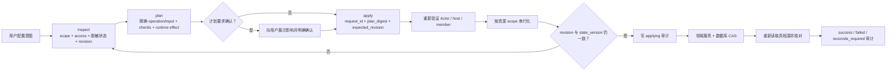

# Nexus 对话配置控制面

## 目标与原则

Nexus 的配置真相源并不只是一份 JSON。Provider、Agent、Room、Channel、Connector、Automation 等状态在数据库中，用户偏好和 WebSearch 凭据在用户配置目录，主机启动参数来自部署环境，桌面状态根由原生宿主离线迁移。因此，通过对话配置 Nexus 指的是让智能体安全操作真实配置能力，而不是允许模型随意读写文件、执行 SQL，或维护一份会与数据库漂移的影子 JSON。

本控制面把这些异构真相源投影成一棵可发现、可脱敏读取、可计划、可审计的虚拟配置树。每个写操作仍调用对应领域服务，让 Web UI、HTTP API 与对话入口复用同一套校验、级联、加密和 runtime reconcile 规则。它遵守五项原则：

1. 身份和作用域由可信 runtime 上下文绑定，并在每次调用时从数据库重验。
2. `inspect`、`plan` 和 `apply` 使用同一套字段级与操作级授权，不存在“能看到就能改”的推断。
3. 计划绑定身份、作用域、输入和资源版本；旧计划不能覆盖新状态，也不能换目标重放。
4. 写入后重新读取真相源；成功、失败和需要 reconcile 的部分变更都留下脱敏审计。
5. 生效时机是配置契约的一部分；系统明确区分立即、下一轮、下一会话和重启生效。

## 配置域与真相源

| Domain | 真相源 | 对话入口 | Runtime 生效 |
|---|---|---|---|
| `preferences` | 用户 preferences JSON + 独立 WebSearch 凭据 | `nexus_config` | WebSearch 立即同步；其他默认值用于后续执行 |
| `providers` | 数据库 | `nexus_config` | 目录与检查立即；模型运行配置下一轮 |
| `agents` | 数据库 + 派生 workspace settings | `nexus_config` | 资料/UI 立即；权限即时同步；其他 runtime 设置下一轮 |
| `emotion` | 当前 Agent workspace 的版本化 `.agents/emotion.json` | `nexus_config` | 基础/上下文情绪下一轮投影；fatigue 只读 |
| `channels` | 数据库 + 加密凭据 | `nexus_config`；扫码/验证码走 `nexus_channel_authorization` | 版本 CAS 后热重载，失败条件回滚 |
| `connectors` | 数据库 + 加密凭据 | 直接凭据走 `nexus_config`；OAuth/Device 走 `nexus_connector_auth` | 下一会话或重新授权 |
| `skills` | 数据库 + 用户 Skill 库 + owner catalog version + 目标 Agent `runtime_version` | `nexus_config` | 来源、目录和导入结果立即；Agent 在下一轮加载 Skill 内容与安装选择 |
| `host` | 部署环境 + 原生桌面宿主 | `nexus_config` 脱敏检查；变更走对应人类控制面 | 外部变更后重启 |
| `sessions` | owner-confined Agent workspace session meta + runtime 不可写的 host-only owner lifecycle ledger | `nexus_config` | 标题/目录立即；删除先持久封锁再关闭精确热态，启动和周期恢复未完成清理 |
| `rooms` | 数据库 + Room runtime | `nexus_config` | 资料、成员参与闸门和权限即时；提示与路由见 Room 热重载矩阵 |
| `automation` | 数据库 + scheduler runtime | Agent task 走 `nexus_automation`；script task 仅人类控制面 | 专用工具创建、检查和核对 |
| `workspaces` | workspace 文件系统 | `nexus_manager` 只读检查 + 当前 Agent 原生文件工具 | 当前 workspace 文件写入立即 |
| `goals` | 数据库 + Goal runtime | `nexus_goal` | 专用 Goal 生命周期 |

部署环境和桌面状态根属于宿主控制面。智能体可以读取脱敏状态、运行确定性检查并解释正确操作方法，但不能把一次文件或数据库写入伪装成已经改变当前进程。服务器 workspace 根只能由部署环境配置；桌面端只迁移完整状态根，并在 sidecar 退出后离线切换和重启。

`nexus_manager` 只提供脱敏结构查询和 workspace 只读检查。Agent、Room 与
conversation 的创建、更新和受控删除全部走 `nexus_config`，因此生命周期操作也具备
权限复验、人工确认、版本 CAS、写后重读和 reconcile 审计，不能回退到 raw CLI。
Goal、Automation 与当前 Agent workspace 保留各自的专用工具，因为它们的执行生命周期
不是普通配置 patch。

Goal 的创建、读取、明确改写目标和模型终态继续由 `nexus_goal` 完成。当前自动批准的
`nexus_goal` family 只承载这些模型侧安全操作；暂停、恢复、预算和清除会触发 usage
结算、continuation 与当前 round 中断，不属于对话工具，只保留给当前认证的人类界面，
也不得伪装成 `nexus_config` 普通字段更新。

浏览器主题、界面语言以及 onboarding/tour 的完成、忽略和重置同样不是
owner/Agent/Room 配置。它们只存在于当前浏览器 `localStorage` 或桌面本地持久状态，
由当前人类客户端设置，不向 Room、其他客户端或后台 Agent 传播。

## 可信身份与权限边界

### 身份来源

`owner_user_id`、`agent_id`、上下文类型、当前 `room_id` 和 `conversation_id` 都由 runtime builder 注入。服务端随后重新读取 Agent、owner、Room 和成员关系，忽略模型声称的 `is_main`、host 身份或任意目标 ID。

只有可信交互上下文会得到配置工具：

- 主智能体自己的私有 DM；
- 普通 Agent 自己的私有 DM；
- 当前 Room 的直接交互 round。

内部维护、Automation、外部回调、Agent 产生的 public mention/directed message
队列和其他后台来源不会因为复用了某个 Agent runtime 就继承配置权。模型、自定义
Skill、用户消息或工具参数也不能把普通上下文升级成主智能体或群主上下文。唯一允许
跨 durable queue 保留配置能力的是已经由认证 WebSocket 受理的直接用户输入，并且必须
通过下述宿主 DB admission 重新证明来源。

### 队列来源的信任连续性

DM 与 Room 的输入队列 JSONL 位于 Agent 可写 workspace，只是待派发 payload，不能作为
权限信任根。直接用户输入因为活跃 round 而排队时，服务端在宿主数据库中另写一条
一次性 admission，绑定 `owner_user_id`、scope、队列项 ID、物理 Agent、物理
session、Room/conversation、源消息、完整目标集合、规范化 payload digest 和原始人工
principal。改写 JSONL 中的 `source` 或其他字段、伪造 queue execution origin 都不会
制造这条记录。

派发端在 DM 派发锁或 Room conversation 派发闸门内重新读取当前状态，核对 Agent owner、
结构化 WebSocket session、Room owner、当前成员集合和全部目标，再以当前 JSONL payload
重新计算 digest 并原子 claim admission。只有 claim 成功的这一轮才恢复直接用户配置
上下文；记录缺失按普通不可信队列执行，payload 或绑定漂移会永久 revoke，启动失败只
允许持有同一 claim token 的派发者 release，成功启动后 consume，用户删除队列项也先
revoke。因此一条 admission 不能重放到另一个 session、Agent、Room、目标或 payload。

Room 中该信任只从排队的用户触发 scaffold 传递到首个实际运行 round。这个 round 后续
产生的 Agent-to-Agent handoff、public wake 或 directed message 不继承 admission；
Automation、Channel、internal wake 与 Agent 自写 JSONL 同样只能得到不可信配置上下文。
配置工具调用时仍须通过当前 runtime session/round lease 和最新 host/member 权限复验，
所以 admission 只证明“这轮来自直接用户”，并不冻结或扩大群主权限。

### 权威身份矩阵

| 权威身份 | 成立条件 | 可读 | 可写 | 明确禁止 |
|---|---|---|---|---|
| `owner_main` | 当前 Agent 是数据库中的主智能体，正在匹配 owner principal 的活跃私有 DM | owner 下私有配置域和自有资源；Host 仅 local single-user 或真实 owner/admin 可读 | owner 私有配置、任意自有 Agent、任意自有 Agent session、任意自有 Room/conversation | 对话写入 Host/公共管理面；member 角色读取 Host；在 Room、后台任务或伪造上下文中使用 owner 权限 |
| `agent_self` | 普通 Agent 正在自己的私有 DM | 自己的 Agent 资料/runtime、可用 Provider 模型目录、Skill、情绪和当前 session | profile/runtime/Skill、自有基础/当前 DM 情绪、当前可信 DM 标题 | 删除 session、其他 Agent、全局偏好、Provider 凭据、权限模式、工具策略、自由格式 MCP、Channel、Connector、Host、Room |
| `room_host` | 当前 Agent 是当前 Room 成员，且数据库中的 `host_agent_id` 指向它 | 当前 Room；当前 Agent 在本 conversation 的情绪 | 当前 Room 的资料、协作策略、成员、群主转让和 conversation 生命周期；自己的上下文情绪 | 删除整个 Room、其他 Room、任何 Agent 基础配置、其他成员情绪、owner 全局配置 |
| `room_member` | 当前 Agent 是当前 Room 普通成员 | 当前 Room 资料、成员和策略；当前 Agent 在本 conversation 的情绪 | 只可设置/清除自己的 conversation 情绪；没有任何 Room 配置写权限 | Room 持久配置、其他成员情绪、任何 owner/Agent 全局配置 |

`room_host` 是 Room 中一个普通 Agent 成员，不是 `owner_user_id`，也不是主智能体。主智能体不能成为 Group Room 成员；它只能在自己的私有 DM 中以 owner 身份管理自有 Room。

数据库中的主智能体标记本身不授予 `owner_main`：服务端还必须绑定匹配 owner 的认证
principal、可信 WebSocket 私有 DM 和活跃 runtime lease。普通 member 的主智能体仍可
管理该用户自己的私有配置，但不能因此修改 Host 或公共管理面；这两类能力只对 local
single-user control plane 或真实 owner/admin 开放。模型提示词和历史计划不能补足任何
条件，工具返回的最新 `access` 才是当前调用的权限真相。

### 角色 Skill 与渐进披露

权限规则不常驻堆进系统提示词，也不依赖一个万能 Skill。宿主按本轮数据库身份只启用
一个独立角色 Skill，并显式禁用其余三个：

- 主智能体私有 DM：`nexus-owner-configuration`；
- 普通 Agent 私有 DM：`nexus-agent-self-configuration`；
- Room 中当前 host Agent：`nexus-room-host-configuration`；
- Room 中普通成员 Agent：`nexus-room-member-configuration`。

每个 Skill 自含该角色的工作流、拒绝边界和按需 reference；只有配置意图触发时才加载
正文，需要精确域或热重载细节时再读 reference。Skill 只负责模型行为和上下文效率，
不能授予权限：`inspect`、`plan`、`apply`、history、authorization flow 和最终输出仍在
服务端逐次重验真实角色、scope、round lease 与资源版本。host 转让或成员撤销后，旧
Skill、旧计划和旧批准都不能延续能力，下一次调用立即按新角色失败或降权。

Goal lead 与 Room host 是两个独立角色：

- Goal lead 决定某个 Goal 的继续执行与工作分配。
- Room host 决定当前 Room 的持久配置权限和无 `@` 输入的默认接管。

成为 Goal lead 不会获得 Room 配置写权限；转让 Room host 也不会暗中改写 Goal lead。每次 `inspect`、`plan`、`apply` 和审计查询都会重新验证当前 host/member 状态，因此旧群主在转让后不能继续使用已有计划。

### 字段和操作边界

普通 Agent 的 self runtime 只允许选择 owner 已启用的 Provider/model，并调整 `max_turns`、`max_thinking_tokens` 等运行上限。它不能自行切换 `permission_mode`、扩大 allowed tools、缩小安全 deny、编辑 `mcp_servers`、修改默认 Connector 或改变其他 Agent。

情绪域归当前 Agent 自己所有，不归 Room 所有。普通成员和群主都可以在当前可信
conversation 设置或清除“自己”的上下文情绪，但不能修改别的成员，也不能借此改变
Room 策略；基础情绪只允许在该 Agent 私有 DM 修改，`fatigue` 始终由 runtime 维护。
conversation 情绪的配置变更和审计归当前 Agent scope，而不是 Room scope；因此 Room
历史不会暴露成员自己的情绪记录，更不会暴露其他成员情绪。调用者应核对 apply 的写后
snapshot/checks，并在该 Agent 自己的私有 DM 中查看 Agent-scope 历史。

Sessions 域只包含 owner workspace 中的普通 Agent session。主智能体可重命名或删除
任意自有 Agent session；普通 Agent 只能重命名正在交互的当前 WebSocket 私有 DM。
Room conversation 仍完全由 `rooms` 域管理。删除当前正在执行配置工具的 session 被
拒绝；其他 session 先在 runtime 不可写的 host-only owner state 写入 deleting tombstone
并安装精确 runtime admission fence，再关闭 runtime、以 `configuration_version` CAS
提交 meta 删除并清理 transcript。配置 inspect 是纯读投影，不会为了刷新 active 状态
推进版本；返回值也不包含 SDK `session_id`、resume 标识或 runtime options。

历史 session 目录名编码不是单射，因此所有读写先核对 `meta.session_key` 与请求值，
并按真实物理目录加同一把锁；碰撞时 fail closed，不能借别名读取、覆盖或删除另一个
session。提交后的 host-only `deleted` tombstone 永久阻止同一物理身份的晚到 writer 或
新 runtime 复活，Agent workspace 文件不能删除或伪造它。transcript 清理引用只保存在
该私有 ledger，清理成功后才移除；清理失败返回 `reconcile_required`。宿主在启动时
fail-closed 扫描，并周期 reconcile 残留的 deleting、目录提交和 transcript 清理，
不会丢失重试凭据或把已经提交的删除伪装成失败回滚。

Room host 只能对当前 Room 执行：

- `update_profile`：名称、描述、头像；
- `set_collaboration_policy`：Room Skill、群主默认接管、私域消息开关；
- `add_member`、`remove_member`；
- `set_member_participation`：暂停或恢复指定成员的 Room 调度；
- `transfer_host`；
- `create_conversation`、`update_conversation`、`delete_conversation`。

host 调用时省略 target 或只能使用当前 `room_id`。即使模型传入另一个 Room ID，服务也会拒绝切换作用域。创建或删除整个 Room 仍仅允许 `owner_main`。普通 Room member 对 Room 持久配置只有 inspect 权，可另行设置或清除自己的当前 conversation 情绪；它只能查看 Room-scope 审计，自己的情绪审计仍归 Agent scope。

Automation 使用自己的专用对话工具，但投递权限不能绕开上述配置边界。普通 Agent
只能把结果投递到自己的 session/inbox；Room 中只能投递到 runtime 绑定的当前
conversation，且执行或重试前重新读取最新 task、Room 归属和当前成员关系；外部
Channel 投递必须精确匹配这次可信对话已授予的目标。只有主智能体自己的认证 WebSocket
私有 DM 可以签发 owner 级私有投递，旧 task 或历史成功记录都不能替代当前授权事实。
对话入口只允许创建或管理 `execution_kind=agent` 的任务；宿主
`execution_kind=script` 任务始终属于 human-only 控制面，即使 `owner_main` 也不能在
对话中创建、修改、删除、运行或修复。

## 有效配置的继承与覆盖

运行时有效配置按以下层次解释，持久写入只能修改调用者有权拥有的那一层：

```text
owner defaults
  -> Agent base
    -> current Room policy
      -> current member relationship
        -> round transient context
```

- owner defaults 为新 Agent 和未显式设置的 Agent 字段提供默认值。
- Agent base 保存该 Agent 的模型、运行上限、工具、Skill 和 MCP 选择。
- Room policy 只覆盖 Room 拥有的协作、安全和路由规则，不反向改写 Agent 持久记录。
- member relationship 决定当前 Agent 是否仍是成员、是否暂停参与，以及能否进入 Room、读取上下文和产生输出。
- round transient context 只对当前执行生效，不能被持久化成更高层权限。

合并必须满足以下单调安全规则：

- 身份、owner、主智能体标记和 host 身份不参与模型可控的继承或覆盖。
- deny/revoke 取并集；下层不能删除上层拒绝。
- allow 范围取交集；Room 或 round 只能收紧，不能扩权。
- 数值上限取更严格值；下层不能超过 owner 或 Agent 上限。
- 显式值只在该字段所属层内覆盖默认值，Room 不能借同名字段改 Agent 全局配置。
- Secret 不隐式继承到其他 Agent、Room 或 round；使用凭据必须经过显式 owner 配置和对应能力授权。

这套规则允许数据库、用户配置文件和 runtime 选项保持各自真相源，同时让 `inspect` 投影出的有效状态可解释、可核对。

## 稳定写入协议



完整流程是 `inspect → plan → digest + revision → confirm → CAS apply → verify + audit/reconcile`：

1. `inspect` 返回调用者可见的域、操作、当前 scope、authority、脱敏状态、确定性 checks、domain revision 和资源 `state_version`。
2. `plan` 重新鉴权并验证 exact operation、target 与 input。未知字段直接拒绝，不会静默忽略。
3. `plan_digest` 确定性绑定 owner、Agent、authority、交互上下文、业务 session/round、真实 runtime lease、资源 scope、domain、operation、target、规范化 input、revision 和 state version。改变其中任何一项都必须重新 plan。
4. 对删除、权限变化、成员变化、群主转让、自我资料和秘密写入等操作，必须先向用户展示 plan 风险。批准由 Nexus 原生 permission 卡签发一次性 human approval；模型不能用 `confirm=true`、提示词或工具参数自我确认。
5. `apply` 要求新的 `request_id`、原 plan 返回的 `plan_digest` 和 `expected_revision`；同一 scope 内串行，并在写入前再次解析 Actor。人工批准还绑定当前认证 principal/session、业务 session/root round、真实 runtime lease、domain/operation/target、digest、revision 和 secret slot，且该 auth-session lease 一直持有到领域写入、reload、写后核验和终态审计结束。
6. Agent 使用 `runtime_version`，Provider、Room、Channel、Connector、Session 和 Automation 使用各自单调版本，Preferences 使用持久化单调 `version` 执行资源 CAS。任何有版本的 update/delete 分派缺少 `state_version` 都直接失败，不能降级调用无 CAS API。Preferences 的 Web/API 与对话写入都在同一个 owner 锁内读取最新值并合并；对话 apply 必须携带 plan 的 state version，不能用 plan 前的全量快照覆盖其间的 UI 修改。Skills 安装/卸载即使由 `owner_main` 发起，也锁定 `input.agent_id` 对应的 Agent scope，并把该 Agent 的 `runtime_version`、目标 Skill 的可见性、来源和 `installed` 状态同时写入 revision；写后还会直接核对 install 得到 `installed=true`、uninstall 得到 `installed=false`。私有 Skill 来源的创建、更新、删除和导入与设置页/API 共用同一个 owner catalog version：远端 URL、认证和索引先在短事务外验证，提交时再以 plan 版本执行 CAS，并在同一事务推进一次 version；因此任一入口的并发功能写都会使旧对话计划失效。inspect 只返回 `auth_type`、`credential_configured` 等安全元数据，Bearer 值只从原生 secret slot 进入，写后重读精确来源状态或导入结果。健康检查元数据不改变功能 revision。批量更新从一个 owner catalog version 开始逐项推进，任意并发写或发布不确定会停止并进入 `reconcile_required`，不会把部分完成当作普通失败或全量成功。Room host/member/participation 变化还推进 authority epoch，使旧权限和暂停前输出立即过期。
7. 写入后重新读取真相源和 checks。若领域服务产生了部分外部效果但最终核对失败，记录 `reconcile_required`，不会谎报成“什么都没发生”。

`request_id` 是幂等键。同一意图的网络重试只重放原结果；拿同一个 request ID 换输入、target 或计划会被拒绝。

配置调用同时携带两组不可由模型覆盖的标识。DM 中业务 session/round 与 runtime lease 相同；Room 中业务标识保持共享 conversation session 与 root round，lease 则固定为当前 Agent slot 的 runtime session 与 Agent round。每次 inspect、plan、apply 和 history 调用都用 lease 重新查询 runtime Manager，结束或被替换的 slot 立即失效；plan digest、一次性人工批准和持久审计同时绑定两组标识，因此计划或批准不能转移到同 Room 的另一个 Agent slot、另一个 root，或后续 round。

Provider 把主记录、模型卡、默认模型和最近测试状态视为同一个配置聚合。更新、模型同步、模型 patch、默认切换、测试结果和删除都先以 plan 中的 `configuration_version` CAS，再在同一数据库事务内完成；每次目标写入只推进一次版本。对话 merge patch 在未脱敏的最新持久化记录上合并，未声明字段不会被 plan 阶段的旧快照覆盖。切换跨 Provider 默认模型时，失去默认项的 Provider 也推进自己的版本，使其旧计划立即失效。

Provider 强制删除会统计所有状态（包括已归档）仍引用它的 Agent，但保留这些显式 Provider/model 绑定，不改写 Agent 记录或推进 `runtime_version`。从下一轮开始，运行时发现绑定 Provider 不可用时动态采用当前 owner 默认模型；若同名 Provider 后续恢复，原显式绑定可自动恢复。删除前必须已经存在不指向目标 Provider 的有效默认模型，Provider 删除与受影响计数在同一事务中提交。Provider/model 的外部连通请求发生在短事务之前；如果请求期间版本已变化，远端请求可能已经发生，但 CAS 会拒绝任何过期结果落库。

## 热重载与撤权

每个活跃 Nexus Session 先按不随轮次变化的拓扑和显式选择确定 MCP 工具面。用户输入、内部唤醒、私域回传、Room host/member 角色、WorkBinding/ReviewBinding、Goal authority 和通讯开关只改变当轮执行权限，不卸载工具 schema。无权轮次不签发可信 `ContextID`、human principal 或执行绑定，真实工具调用仍在 service 真相源上 fail closed。

正常工具面只在用户显式修改 Agent 的 MCP/Connector 默认或当前 Session 的 Connector 选择后，从下一轮热更新。后台 Automation run 是独立的受限执行 profile，不借用交互 Session 的 mutation authority。`ToolSearch` 默认关闭；即使开启也只是 schema 传递优化，不作为 MCP 挂载或鉴权机制。

“热重载”不是一个模糊布尔值。不同配置按安全要求和 runtime 生命周期分级：

| 变更 | 持久化后生效 | 活跃执行处理 |
|---|---|---|
| 初始化 owner / 启用服务端认证 | admission gate 完成撤销后原子提交；后续启动按 `NEXUS_RUNTIME_ISOLATION_MODE` 选择隔离模式 | 阻断新启动，取消并排空在途 DM/Room/AutoDream admission，关闭 system owner 的既有 session/round；任一步失败都不提交认证 |
| Agent 名称、头像、描述、标签 | UI/目录立即；prompt 下一轮 | 当前输出保持本轮身份快照 |
| Agent `permission_mode` | 当前 DM 与 Room runtime 立即同步 | 后续工具授权立刻使用新模式 |
| Agent Provider/model、运行上限、tools、Skills、MCP | 下一轮重建 client options；显式 MCP 修改才更新 Session 工具面 | 不在半轮中替换模型或工具表 |
| Provider 主配置、模型卡、默认选择、测试状态 | Provider 目录和检查立即；引用它的 Agent 下一轮重建 client options | 当前 round 保持已捕获的 Provider 配置；写后要求聚合版本精确 `+1` |
| 强制删除使用中的 Provider | 保留显式绑定并使不可用选择动态回退 | 当前 round 不切换；下一轮采用 owner 默认模型，Provider 恢复后可自动切回 |
| WebSearch 凭据/设置 | 活跃 nxs runtime 立即同步 | 同步失败仅在 version 仍等于本次写入时回滚；若已有后续写入则保留新状态并报告 reconcile |
| Channel 配置、账号 | 候选 Channel runtime 热重载 | 删除或禁用后新入口立即拒绝；候选启动失败保留旧 runtime |
| Channel pairing | 数据库 CAS 后由下一条 ingress 重新查询生效 | 不替换 Channel runtime；停用或删除后下一条外部消息即被拒绝或重新进入配对流程 |
| Channel QR/验证码授权 | 启动版本 CAS 后发布候选 runtime | QR/验证码只进入绑定的认证 UI；候选失败保留旧 runtime，旧 generation 不能迟到覆盖 |
| Connector 凭据/连接 | 下一会话或重新授权 | 不把旧会话伪装成已换凭据 |
| Connector OAuth/Device 授权 | 完成时按启动配置版本 CAS | OAuth URL 由受保护的 `flow_id` 跳转恢复；跨 owner/session、过期或并发变更拒绝 |
| Skill 来源、导入、更新和安装选择 | 私有来源增删改、搜索、目录和导入结果立即；目标 Agent 下一轮加载内容与选择 | 所有设置页/API/对话功能写共用 owner catalog CAS，Bearer 仅走原生 secret slot；发布失败原子恢复旧目录或进入明确 reconcile |
| Scheduled Agent task / Heartbeat | scheduler 读取持久新版本；wake 不改变配置版本 | 更新/删除用版本 CAS 并重读；同 `request_id` 创建只重放同一意图；script task 不开放对话写入 |
| Agent session 标题 | 目录/UI 立即 | 同一 session 资源锁内单调推进版本；写后重读标题 |
| 删除 Agent session | host-only lifecycle ledger 先封锁，meta 删除后保持 tombstone | admission fence 阻止新启动和晚到写回；关闭失败撤销未提交栅栏，提交后 transcript 清理失败保留私有重试引用，由启动/周期 recovery 继续 reconcile |
| Agent 基础/上下文情绪 | 下一轮稳定投影 | 版本 CAS；只改变当前 Agent 自有状态，不动态改写半轮 prompt |
| Room 名称、标题、头像、描述 | Room UI/目录立即；稳定 prompt 下一轮 | 当前 round 使用已捕获的展示快照 |
| Room Skill | 下一轮稳定 prompt | 不在半轮中替换协作规则文本 |
| `host_auto_reply_enabled` | 下一条输入路由 | 当前已派发 slot 不改目标 |
| `private_messages_enabled=false` | 服务层立即撤销，工具 schema 保留 | 每次私域工具调用重新读库，旧 prompt 也无法绕过 |
| `private_messages_enabled=true` | 服务层立即允许，工具 schema 不变 | 当前 client 不动态改工具表 |
| 添加 Room 成员 | 成员目录与后续路由立即 | 新成员从后续输入开始获得 slot |
| 移除 Room 成员 | 权限立即撤销并中断活跃任务 | 最终输出前再验成员关系，旧 runtime 在途结果不能落库 |
| 暂停/恢复 Room 成员参与 | Room CAS 与 authority epoch 立即推进；暂停中断活跃任务，恢复重启待办调度 | 最终输出前同时复核 epoch、成员关系和 participation gate |
| 转让 Room host | authority 立即变化；下一条输入使用新 host 路由 | 旧 host 的 inspect/plan/apply 在下一次调用时失败 |
| 创建/更新 conversation | Room 版本推进；目录立即 | 后续输入/下一轮读取新标题和上下文 |
| 删除 conversation / Room | 数据库先提交删除与版本边界 | 随后关闭精确 runtime、清理 artifact/Goal；清理失败记录 reconcile，不伪装成未删除 |
| 删除 Agent | Agent tombstone/CAS 先提交 | 阻止新连接和重配，撤销该 Agent 的 DM/Room runtime，再清理 Channel 引用；部分清理进入 reconcile |
| Host deployment/native state | 对话只读检查；在人类控制面变更后重启 | 不存在可由 Agent 写入的 shadow runtime settings |

Channel 热重载以 `owner_user_id + channel_type` 为串行边界。配置、账号、扫码登录落库、删除和 runtime 替换不能互相越过；新候选必须先成功 `Start`，再以单调 generation 发布，旧 generation 的迟到完成不能覆盖当前实例。启动失败保留旧 runtime，但回滚不会把版本写回旧值：失败写入 `N+1` 后以新版本 `N+2` 发布旧内容，所以失败前后的旧 plan 都不能重新命中。error 同时返回配置调用方和 runtime 状态，使 apply 进入可见的 reconcile/failed 路径。Pairing 不参与 runtime 替换：人工更新只 patch 明确字段，和 ingress 的 `last_message_at` writer 共用 owner 锁；每条新 ingress 都重新查询数据库，所以修改从下一条外部消息生效。配置、账号和 pairing 删除还会直接查询各自持久化记录证明目标不存在。

安全和身份撤销永远先于 prompt 重建。换句话说，即使旧 runtime 仍持有上一轮文本，它也无法通过服务层继续私域发送、修改 Room，或在被移除后提交最终输出。

每次 apply 返回结构化 `reload_status`，指出已经同步的 runtime、下一轮/下一会话动作以及是否需要重启；调用方必须把这个状态和写后 checks 一起告诉用户。

## Secret 与自定义 MCP 边界

工具结果、snapshot、plan、checks、revision 投影、审计 request/result 共用递归脱敏规则。token、secret、password、API key、认证 header、数据库 URL、私钥、内部 system prompt、Provider options 与 `mcp_servers` 只暴露 `configured`/redacted 状态，不回显原值。

模型永远不能把秘密明文放进 `nexus_config` 参数。敏感字段只能提交
`{"$secret":"opaque_slot_id"}`；slot 进入 plan digest，真实值由当前认证的人类在 Nexus
原生批准卡中输入，服务端只在一次性批准租约内物化写入 payload。直接明文、未知 slot、
重复使用、跨 principal/session/round/lease 重放都会被拒绝；终态工具结果、transcript、
日志和审计只保留 slot/`configured` 状态。Channel catalog 中标记为 secret 的字段还会
被普通 config JSON 拒绝，公开视图也会过滤历史脏数据中的同名字段。

Channel 和 Connector 凭据使用既有加密仓储。Provider `auth_token`、私有 Skill 来源
Token 与 Agent 自定义 MCP 中的秘密仍沿用各自现有存储模型，尚未进入统一加密存储；
控制面协议不得返回这些明文，也不能把 hash 当作可恢复值。

### 真人授权与 human-only 管理面

对话可以发起授权，但不能代替人类完成授权。两条专用链都只注入主智能体自己的
WebSocket 私有 DM，并绑定 owner、主 Agent、业务 session/root round、真实 runtime
lease、当前认证 principal/session、启动资源版本和过期时间：

- `nexus_connector_auth` 的启动工具必须先经过当前 permission 卡的真实 `allow`。OAuth
  工具结果只返回 Nexus 本地受保护路径；浏览器请求仅携带 opaque `flow_id`，服务端从
  durable flow 恢复全部身份并再次验证认证 session，再 303 到 provider。Provider
  state、PKCE、device code、auth code 和 token 不进入模型。Device Flow 只返回 provider
  明确定义为公开的人类 user code / verification URI。
- `nexus_channel_authorization` 的模型结果只含 flow 状态。QR payload、verification URL
  和验证码输入只通过与原始业务 session、同一 principal 绑定的原生 WebSocket 卡片
  展示/提交；验证码会在 wire map 中立即移除，不进入 transcript、MCP 参数、数据库或
  审计。重连、跨 sender、跨 lease、过期 token 和旧进程 generation 均拒绝。

以下项目故意不进入通用 configuration MCP 写入面：用户/密码/角色、订阅与公共 Provider、
项目 ACL、部署环境和认证开关、Automation script task、Goal 暂停/恢复/预算/清除、
当前客户端的主题/语言/onboarding/tour 状态、当前 Composer 发起的 Session 级模型/权限/Connector 覆盖、
任意本地路径或上传式 Skill 导入、其他 Agent workspace 写入和直接 SQL。它们继续遵循各自已有的原生、宿主或认证管理面，
不能因为对话配置能力而获得一条绕过所有权、真人确认或秘密输入边界的通路。

主智能体仍按宿主控制面契约保留注入的 owner-scoped `nexusctl` 兼容能力，但 owner、
workspace 与 scope mode 都由宿主固定，Hook 拒绝环境变量或命令行作用域覆盖；普通 Agent
在所有隔离模式都不能调用原始 `nexusctl`。这条兼容路径不把部署/原生宿主状态伪装成
数据库配置，也不改变 configuration MCP 自身的审批、CAS、审计和 secret-slot 语义。

自定义 Agent MCP 已实际接入 DM 和 Room runtime 的 client options，不是只保存未生效的 JSON：

- 仅 `owner_main` 可以通过 Agent `update` 管理自由格式 `mcp_servers`。
- `agent_self` 不能编辑 MCP server、header、OAuth 或凭据。
- stdio、HTTP 和 SSE 配置在进入 runtime 前严格解析；未知类型、SDK 内部 server、`nexus_*` 保留名和内置 server 冲突会被拒绝。
- 修改后的 MCP 配置从下一轮生效，当前半轮不会动态替换工具集合。

应用市场 Connector 不写入自由格式 `mcp_servers`。Agent 的 `connector_ids` 只保存默认挂载选择，默认值为空；Composer 可以为当前 Session 显式覆盖，未设置时继承 Agent、空数组表示全部关闭。显式选择决定 `nexus_connectors` 的 Session 工具面；短暂未连接或凭据不可用时保留工具定义，真实调用返回“未连接”或具体认证错误。未选择的 Connector 不注入工具定义，也不能被通用 Connector 调用入口绕过；需要凭据才能构造的第三方远程 MCP 仍只在授权快照可用时建立连接。

## 工具与审计

- `inspect_nexus_configuration`：发现调用者可见域，读取脱敏状态、access、scope、revision、state version 和 checks。
- `plan_nexus_configuration_change`：验证精确 operation/target/input，返回风险、确认要求、`plan_digest` 和 runtime effect。
- `apply_nexus_configuration_change`：携带 digest、revision 和 request ID；需要真人批准时由 Nexus permission 卡提供绑定批准和 secret slot 值，随后执行 CAS 写入并返回写后 snapshot、checks 与 reload status。
- `list_nexus_configuration_changes`：查询当前权限范围内的脱敏审计和 reconcile 状态。

审计读取沿用同一作用域：

- `owner_main` 在匹配 owner principal 的主智能体私有 DM 查看 owner 私有记录；Host/公共管理记录仍要求 local single-user 或真实 owner/admin；
- `agent_self` 只查看自己的 Agent scope；
- `room_host` 和 `room_member` 只查看当前 Room scope；它们在 Room 中设置的自有
  conversation 情绪仍记为 Agent scope，不会出现在 Room 历史中。

Provider 连通测试可能产生费用或外部流量，因此普通 `verify=true` 不发网络请求；必须显式 plan/apply `test_provider` 或 `test_model`。更新输入采用 merge-patch 语义：未提供字段保持原值，显式数组替换数组，可清除字段按契约清除。Provider 目标计划公开的是单调 `configuration_version` 而不是凭据内容；apply 后必须重新读取并证明版本从 plan 值精确推进一次，删除则直接证明目标不存在。

## 当前存储限制

- Provider `auth_token`、私有 Skill 来源 Token 与 Agent `mcp_servers` 中的用户秘密尚未使用统一加密存储。
- 包含外部副作用的秘密变更、OAuth 与 Channel 连接不承诺一键回滚；失败后使用重新授权、显式重配或 `reconcile_required` 收口。
- 这些限制不改变服务端身份绑定、资源 CAS、幂等 apply、写后核对、输出栅栏和全链路脱敏要求。
