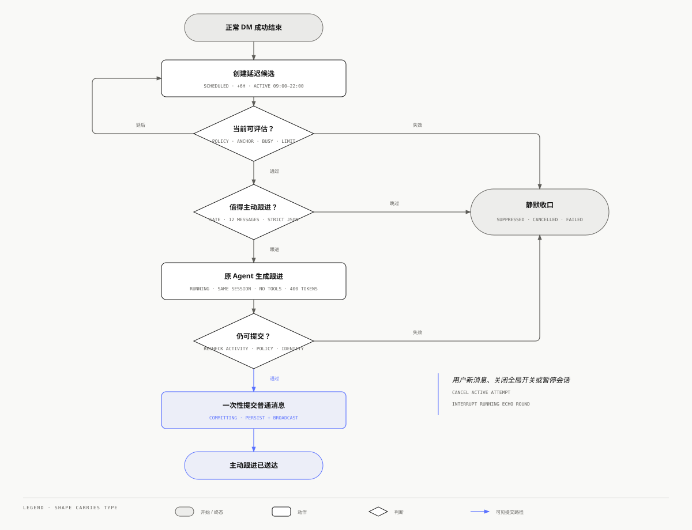

# Nexus 主动跟进（Echo）模块设计规范

> 状态：**Implemented / DM opt-in**
>
> 产品名：中文 **主动跟进**，英文 **Echo**
>
> 产品定义：**Agent 会在合适的时候主动跟进值得继续的对话。**
>
> 首期范围：Nexus WebSocket DM；Room 仅保留群主阶段设计。

本文记录主动跟进（内部模块名 `echo`）当前的产品与工程合同。首期实现只覆盖 Nexus WebSocket DM；Room、外部 IM 和工具型主动工作不在当前范围内。

## 1. 产品语义

Echo 不是提醒器，也不是让 Agent 定时找话说。它表达的是：一段对话虽然暂时停下，但其中仍有明确、具体且有价值的未完成语境，Agent 可以在不打扰用户的前提下，把这段语境接回来。

“值得继续”必须同时满足：

1. 跟进与当前对话直接相关；
2. 存在尚未闭合的问题、承诺、决定或用户明确要求的后续；
3. 现在跟进比保持沉默更有价值；
4. 跟进不会只是复述、寒暄、催促或制造参与感；
5. Agent 可以只靠当前对话安全地完成这次表达。

默认行为是保持沉默。Echo 的成功标准不是发送更多消息，而是在真正需要时出现，并让用户觉得“这件事确实值得被接起来”。

## 2. 目标与非目标

### 2.1 目标

- 让同一个 Agent 在同一个 DM 中自然延续未完成语境；
- 把“是否值得说”与“具体说什么”分开，降低误触发和人格漂移；
- 为主动消息提供全局显式开关、内部活跃时段与限频和可恢复执行状态；
- 用户产生新输入时立即让路，绝不与用户争夺对话；
- 在服务重启、超时和重复调度下保持最多一次可见投递；
- 为后续 Room 群主主动参与保留同一领域模型，但不提前引入多人路由复杂度。

### 2.2 非目标

- 不替代 Automation、日历提醒、监控任务或事件触发工作流；
- 不替代 Goal continuation，不负责让未完成 Goal 自动继续执行；
- 不做 Agent 的后台记忆整理或人格自我更新；
- 不以提高活跃度为目标发送泛化问候、情绪陪伴或“还需要帮助吗”；
- v1 不调用工具、不访问 Connector、不产生外部副作用；
- v1 不支持外部 IM、Room、多 Agent 自选发言或随机成员唤醒；
- 不保存或展示模型的思维链、内部独白或完整 gate prompt。

## 3. 与现有能力的边界

| 能力 | 触发来源 | 执行上下文 | 主要产物 |
| --- | --- | --- | --- |
| Echo | 对话结束后的安静窗口，由系统判断是否值得继续 | 原 DM 的同一 Agent、同一 Session | 一条可见跟进消息，或保持沉默 |
| Automation | 用户明确配置的时间、周期或监控条件 | 任务绑定或隔离 Session，持有任务权限快照 | 任务结果、通知或经批准的工具行为 |
| Goal continuation | 已存在 Goal 的受控延续条件 | 绑定 Goal authority 的内部 round | Goal/Execution 推进 |

因此 Echo 不复用 Automation 的主会话后台队列，也不把一次主动跟进伪装成定时任务。它只复用已有的后台调度基础设施和 DM 内部输入能力。旧 Heartbeat 不再作为用户可见、可配置的产品模块；定时任务仍可使用内部主会话事件调度。

## 4. 核心不变量

1. **用户明确开启**：全局默认关闭；产品可以在引导时询问，但不得静默开启。
2. **同一身份**：最终消息必须由原 Agent 在原 DM Session 中生成，不能由 gate 模型直接代写。
3. **同一语境**：Echo 不创建合成收件箱、匿名 main session 或新的用户对话。
4. **默认静默**：任一判断不确定、上下文不完整或基础设施异常都不产生可见消息。
5. **用户优先**：任何非 Echo 新输入都会立即取消该 Session 的 pending/running Echo；Echo 不进入普通用户输入队列。
6. **没有伪造输入**：隐藏 wake 只作为 synthetic round marker 保存，不作为可见用户消息，也不让用户看起来说过未说过的话。
7. **没有工具**：v1 round 使用 message-only 策略；模型要求工具时，本次直接静默。
8. **最多一次**：同一 Session、trigger 和 anchor 最多产生一条可见 Echo 消息。
9. **投递前复核**：Agent 生成完成不代表可以发送；最终提交前必须再次验证没有新活动、策略仍开启且 attempt 仍拥有提交权。
10. **不存内部思维**：数据库与日志只保存结构化决定，不保存完整 gate 输入、模型思维链或隐藏 prompt。

## 5. 首期用户故事

### 5.1 应该跟进

- Agent 问了一个完成当前事情所必需的明确问题，用户暂时没有回答；
- Agent 明确承诺稍后回来确认，而对话中存在可验证的待确认点；
- 用户明确邀请一次没有指定时间、周期或外部条件的对话跟进，例如“如果我没回，可以之后再问我一次”；
- 一项对话内决定仍卡在清晰选项上，简短跟进能够帮助用户继续。

带明确时间、周期、监控条件或外部状态的请求仍应创建 Automation，不进入 Echo。

### 5.2 应该保持沉默

- 对话已经自然结束，最后一句只是致谢、确认或告别；
- Agent 只能重复上一条回复，或者发送“还需要帮助吗”；
- 需要联网、调用工具或读取新外部状态才能产生价值；
- 对话涉及高风险医疗、法律、财务、危机干预或敏感关系建议，且用户没有明确要求后续；
- 用户已经开始新 round、删除 Session、暂停 Echo，或 Agent 正在处理其他工作；
- 只能根据模糊语气猜测用户可能希望被联系。

## 6. 领域模型

### 6.1 名词

| 名词 | 含义 |
| --- | --- |
| Settings | 当前用户共享的 Echo 全局开关 |
| Policy | 系统内部维护的时段与限频策略 |
| Signal | 可能产生 Echo 的可信系统事件；v1 只有 `conversation_idle` |
| Anchor | 产生候选的原始成功 round 和最后一条可见 assistant message |
| Attempt | 一次从等待、判断到投递或静默的持久记录 |
| Gate | 只决定是否值得跟进及 focus 的后台小模型调用 |
| Echo round | 原 Agent 在原 Session 中收到的隐藏、无工具、延迟提交 round |

### 6.2 整体链路



[打开独立 HTML 版本](../architecture-html/nexus-echo-flow.html)

图中的“静默收口”合并 `suppressed / cancelled / failed` 三类无可见投递的终态；具体状态语义见下一节。

### 6.3 Attempt 状态

```text
scheduled ──claim──> evaluating ──follow_up──> running ──commit──> delivered
    │                    │                         │
    │                    └──skip──────────────────> suppressed
    │                                              │
    ├──new activity / disabled / expired──────────> cancelled
    └──infrastructure failure / restart───────────> failed
```

- `scheduled`：等待 `due_at`；
- `evaluating`：worker 已通过数据库原子状态迁移领取，正在执行确定性检查或 gate；
- `running`：稳定 Echo round ID 已写入，原 Agent 正在生成；
- `delivered`：可见 assistant message 已提交；
- `suppressed`：gate 或 Agent 明确选择静默；
- `cancelled`：新活动、配置变化、资源删除或过期使候选失效；
- `failed`：基础设施错误或进程重启使本次尝试安全终止，且没有可见投递。

`delivered / suppressed / cancelled / failed` 是终态。终态 attempt 不复活。

## 7. 持久化设计

### 7.1 用户 Preferences

全局开关复用用户级 `.settings/preferences.json`，字段为 `echo_enabled`，默认 `false`。它与情绪系统、浏览器权限等用户偏好共享同一份带版本的原子持久化，不另建 Echo 设置表。

时区、活跃时段、安静等待、cooldown 与每日上限属于产品内部策略，不从用户 API 读取，也不按用户持久化。时区依次使用服务端 `DefaultTimezone` 与 `Asia/Shanghai`，其余默认值见第 17 节。

### 7.2 `echo_attempts`

| 字段 | 说明 |
| --- | --- |
| `attempt_id` | 不透明稳定 ID |
| `owner_user_id` / `agent_id` / `session_key` | 完整租户与投递边界 |
| `trigger_kind` | v1 固定 `conversation_idle` |
| `anchor_round_id` / `anchor_message_id` | 候选事实来源 |
| `due_at` / `expires_at` | 下次可判断时间与硬过期时间 |
| `status` | Attempt 状态 |
| `decision_reason` / `focus` | 受控 gate reason code 与最多 160 字符的内部关注点 |
| `runtime_round_id` / `delivered_message_id` | Echo round 与最终提交消息身份 |
| `error_code` | 受控错误码，不保存 Provider 原始响应 |
| `started_at` / `created_at` / `finished_at` | UTC |

唯一约束：

```text
(owner_user_id, session_key, trigger_kind, anchor_round_id)
```

不保存对话正文、gate prompt、完整模型响应或思维链。`error_code` 只能使用受控枚举，不写 Provider 原始响应。

## 8. 产生候选

DM 成功终态是 v1 唯一 Signal。DM service 通过可选生命周期回调通知 Echo service，不能直接写 Echo repository：

```go
type EchoLifecycleHooks struct {
    OnUserActivity func(context.Context, string, string) ([]string, error)
    OnTerminal     func(context.Context, EchoTerminalRound)
}
```

`EchoTerminalRound` 只包含 owner、Agent、Session、round/message ID 和终态时间，不复制正文；DM service 在调用前完成内部输入、execution origin 与成功终态过滤。

Observer 在成功 DM 已经收口后以后台任务调用。创建 candidate 失败只记录受控错误，不得把已经成功的用户 round 改成失败；Echo 是可选增强，丢失一次候选优于影响主对话。出现第二个真实消费者前不抽象成通用 observer interface 或事件总线。

只有同时满足以下条件才创建 `scheduled` attempt：

- Echo 对该 Agent 与 Session 有效开启；
- `chat_type=dm` 且 `channel=ws`；
- round 来自可见用户输入，成功产生可见 assistant 终态；
- `Internal=false` 且 `ExecutionOrigin` 为空；
- 当前没有同 anchor attempt；
- Session 仍可读取。

内部 Goal、Automation、queue、Echo、recovery round 不能递归产生 Echo。

初始 `due_at` 为 anchor 最后活动时间加 `idle_delay_seconds`；落在活跃时段外时顺延至下一个活跃窗口。`expires_at` 默认是 anchor 后 7 天。

## 9. 调度与确定性预检

Echo service 复用 [`internal/infra/duework`](../../internal/infra/duework/loop.go) 的 coalesced wake、精确 deadline timer 和有界错误退避。Echo 不启用周期 audit：服务启动时立即 reconcile，候选写入后主动 `Notify`，后续只按 repository 返回的 `NextDueAt` 唤醒。Echo repository 负责 durable claim、幂等和 fail-closed 恢复；不新增固定 ticker。

worker claim 到期 attempt 后，先按固定顺序执行不耗模型的检查：

1. 用户级全局 policy 仍有效开启；
2. Agent、Session 和 anchor 仍存在；
3. `expires_at` 尚未到达；
4. 当前位于活跃时段；否则只更新 `due_at`，不调用 gate；
5. anchor 后没有任何非 Echo 新 round 或可见消息；
6. Session 和 Agent 没有其他 running round；用户 input 在受理时已主动取消本候选，忙碌时短暂延后；
7. 同一 Session 未命中 cooldown；
8. Agent 当日本地时区 delivered 数未达到 `daily_limit`；
9. attempt 仍处于当前 worker 可以推进的状态。

新用户输入和全局关闭 Echo 会主动取消对应 attempt；Session 删除或其他 round 改变可见 anchor 时，最终检查保持静默并关闭 attempt。

## 10. Gate 合同

### 10.1 输入

Gate 使用当前配置的后台快速模型，不新增 Provider 配置。输入只包含：

- anchor 前最近最多 12 条可见消息；
- 最多 24,000 个 Unicode 字符；
- 受控产品规则与敏感场景边界。

上下文按当前 Session 历史读取，不从 attempt 表恢复正文。Gate 只消费已有可见文本，不读取附件、其他 Session、Connector 或 workspace。

### 10.2 输出

Gate 只允许严格 JSON：

```json
{
  "decision": "follow_up",
  "reason_code": "awaiting_answer",
  "focus": "询问用户是否已经确定部署窗口"
}
```

`decision` 只有 `follow_up` 和 `skip`。

允许的正向 reason：

- `awaiting_answer`：Agent 已提出完成当前事情所需的明确问题；
- `promised_followup`：Agent 在对话中作出明确后续承诺；
- `unfinished_decision`：清晰决定或选项尚未闭合；
- `requested_check_in`：用户明确要求稍后回来跟进。

允许的静默 reason：

- `concluded`；
- `no_new_value`；
- `would_repeat`；
- `social_only`；
- `too_ambiguous`；
- `sensitive_context`；
- `needs_tool`；
- `invalid_output` 和 `gate_unavailable` 由宿主在解析失败或 Gate 不可用时写入，不是模型可返回值。

`requested_check_in` 仅表示用户邀请一次无明确时间条件的对话跟进。出现具体时间、周期、监控条件或外部状态时，gate 必须返回 `needs_tool`，由正常对话引导用户使用 Automation。

Gate 依次衡量相关性、信息缺口、预期价值、时机、重复风险和用户负担。只有存在一个具体 follow-up focus，且正向价值明显高于打扰成本时才返回 `follow_up`；不确定时必须 `skip`。

### 10.3 故障语义

严格解析失败会以 `invalid_output` 静默结束；超时、配额不足或模型不可用会以 `gate_unavailable` 失败并保持静默。首期不自动重放失败 Gate，避免后台故障扩大为重复主动消息。

## 11. Echo round

### 11.1 派发

Gate 通过后，service 先持久化稳定 `runtime_round_id`，再调用 DM service；最终消息 ID 在提交闸门中锁定。请求语义为：

```go
dm.Request{
    SessionKey:           originalSessionKey,
    RoundID:              echoRoundID,
    Internal:             true,
    ExecutionOrigin:      "echo",
    InputOptions: sdkprotocol.OutboundMessageOptions{
        HiddenFromUser:  true,
        Synthetic:       true,
        Purpose:         "echo_followup",
        ToolAccess:      "none",
        MaxOutputTokens: 400,
        Metadata: map[string]string{
            "echo_attempt_id": attemptID,
            "echo_anchor_round_id": anchorRoundID,
        },
    },
}
```

隐藏输入告诉 Agent：这是一次由系统触发的 Echo 候选，不是用户新消息，也不是对上一条消息的即时回答。Agent 应像真正记得前文的人自然重新开口，先用贴合语境的轻量寒暄、回想或过渡承接上文，再主动带来一个具体的新价值，例如更清楚的判断、可执行的小建议、能推动决定的问题或对先前承诺的兑现。开头可以参考“对了……”“顺着刚才那件事……”“我又想了一下……”的语感，但不得固定套用模板。

跟进应保持原 Agent 的人物性格和会话语言，通常只写 2 到 5 句，不使用无必要的标题、清单或总结腔。不得说“你还没回复”、责备用户、制造紧迫感、泛泛询问“还需要帮助吗”，也不得虚构等待时长、新事实或用户意图。Gate 的 `focus` 只是内部方向，不能照抄或当作用户事实。如果重新阅读后无法自然增加价值、只能生硬重复问题或已经不值得发送，返回专用控制标记 `<nexus_echo_no_reply/>`。

最终措辞由原 Agent runtime 生成，保留 persona、模型、上下文和正常 Markdown 能力；Gate 只负责是否发送与确定内部方向，不代写可见消息。

### 11.2 Message-only policy

Echo round：

- 不挂载 MCP、Connector、communication、Goal、Execution 或 Automation 工具；
- 不允许权限申请；
- 最多一个 Agent turn；
- 不允许 subagent；
- 不允许写 workspace、记忆或配置；
- 需要任何工具才能产生价值时返回 no-reply。

runtime 使用不超过 400 completion tokens 的输出预算。宿主不截断 Markdown；超出预算或没有形成完整 final 时按 no-reply 收口。`<nexus_echo_no_reply/>` 只有在 trim 后与完整输出精确相等时才是控制标记，正文中偶然出现该字符串不能吞掉正常消息。

不要通过复制 Agent 当前 allow/deny 列表来实现。应由宿主签发一个不可扩大的专用 message-only policy。

普通工具白名单的非 nil 空切片只表示“快照中没有规则”，不等于禁用全部工具，因此不能拿它充当 deny-all。Bridge 与 runtime 通过协商后的 `message_execution_policy_v1` 执行 `tool_access=none` 和 `max_output_tokens`；runtime 在构造工具目录前禁用内置工具和 MCP，并跳过 Stop Hook、记忆召回/维护、自动压缩和续写。无法确认支持该能力的 runtime 必须拒绝 Echo round。

### 11.3 延迟发布与最终提交闸门

Echo assistant 输出不能边生成边显示。DM runtime 应捕获本 round 的候选 final，直到以下条件在提交闸门中再次成立：

- attempt 仍为 `running` 且没有被新输入取消；
- 用户级全局 policy 仍开启；
- anchor 后没有新的非 Echo 活动；
- 当前 Echo round 仍拥有稳定提交身份；
- 内容非空、不是 no-reply，且通过正常输出安全检查。

提交闸门成功后，宿主一次性持久化并广播 assistant message；失败则丢弃候选输出并把 attempt 置为 `cancelled` 或 `suppressed`。这一机制必须是 DM service 的 host-only deferred assistant admission，不能暴露给 HTTP/WS 调用者。

普通用户输入进入 DM 时，先持久取消该 Session 的 active Echo attempt，再按正常 delivery policy 处理。若 Echo runtime 已启动，应以 `echo_superseded_by_user` 原因中断。这样用户输入总是优先，且不会看到半条 Echo stream。

### 11.4 可见消息

成功消息仍是普通 assistant message，额外携带受信 metadata：

```json
{
  "metadata": {
    "source": "echo",
    "echo_attempt_id": "echo_...",
    "echo_anchor_round_id": "round_..."
  }
}
```

中文界面只显示一个轻量“主动跟进”标识，英文界面显示 `Echo`。隐藏 prompt、gate reason、focus 和内部 attempt 状态不进入对话正文。

### 11.5 Transcript 与后续上下文

`HiddenFromUser` 只控制 Nexus 的可见历史投影，不代表该轮是无状态的。DM service 会先持久化隐藏 round marker，runtime 再把隐藏 user turn 与生成的 assistant turn 写入原 Session transcript。成功投递后的真实角色顺序是 `... U-A-U_echo-A_echo-U_next-A_next ...`；界面隐藏 `U_echo`，所以用户看到的是 `... U-A-A_echo-U_next-A_next ...`。后续 turn 会继续携带这组 runtime 历史。

DM service 为隐藏输入指定稳定 runtime UUID，并记录该 round 流出的全部消息 UUID。最终准入成功时保留完整 `U_echo-A_echo`；`suppressed / cancelled / failed` 则在派发下一条输入前通过 runtime control 同时删除隐藏输入及其输出。因此 no-reply、生成后被新活动取消和 assistant 产生前中断都不会进入后续模型上下文。不能只删除 Nexus overlay marker，也不能依赖相邻角色归一化掩盖语义污染。

## 12. 幂等、恢复与删除

### 12.1 进程恢复

启动 reconcile 会把重启前处于 `evaluating / running / committing` 的尝试标为 `failed`，不自动重放；仍为 `scheduled` 的尝试继续由 deadline loop 处理。可见消息提交前先把 attempt 原子迁移为 `committing`，失败和重启都不会复活该 attempt。重复可见投递是最高优先级故障，恢复路径保持 fail closed。

### 12.2 资源生命周期

- 关闭全局 Echo：取消当前用户的所有非终态 attempt，保留历史；
- 删除 Session：attempt 保留最小审计字段，到期检查时安全关闭，正文仍不复制；
- 删除 Agent：全局 policy 不变，attempt 保留 agent ID 快照并在后续检查时安全关闭；
- 删除 owner：按现有 owner 数据生命周期级联删除全部 Echo 数据。

## 13. HTTP 与协议面

当前路由：

| 方法与路径 | 用途 |
| --- | --- |
| `GET /nexus/v1/settings/echo` | 读取用户级全局开关 `{ enabled }` |
| `PUT /nexus/v1/settings/echo` | 更新用户级全局开关 `{ enabled }` |

所有路由只操作当前 owner 的设置。内部时间策略使用 IANA timezone 和 `HH:mm`，跨午夜窗口有明确测试。v1 不提供“立即运行 Echo”接口，手动运行会混淆主动判断与普通消息发送。

领域与 wire 校验集中在 `internal/echo`，HTTP handler 只做 owner-scoped 适配。Attempt 只服务于内部调度、幂等和恢复，不提供用户读取接口。

## 14. 前端体验

### 14.1 全局设置

常规设置中只提供一个对当前用户所有 Agent 生效的“主动跟进”开关，英文名为 `Echo`，并固定说明：`Agent 会在合适的时候主动跟进值得继续的对话。`。开关即时保存；失败时原位回滚并在同一行显示 Nexus 风格错误，不改变布局高度。

### 14.2 DM 展现

用户不需要理解 attempt、gate 或内部调度。关闭全局开关后立即消失的是未来跟进资格，不删除已经发送的正常消息。

主动跟进不提供“最近记录”界面。已经投递的消息是原 Agent Session 中带轻量“主动跟进”标识的普通 assistant message；未投递的内部判断状态没有独立用户价值。

## 15. Room 群主阶段

Room 不进入 v1。后续阶段复用 Signal、Gate、Attempt 和 duework，但增加以下硬约束：

1. 只有当前 `RoomRecord.HostAgentID` 可以成为 Echo actor；
2. Room 必须有独立的 `echo_enabled` 明确开关，不能复用 `HostAutoReplyEnabled`；
3. host 变更、Room 配置 revision 变化或任何新公区消息都会取消旧候选；
4. 每个 public anchor 只能有一个 host attempt，不能随机挑成员，也不能 fanout；
5. Echo 消息是普通公区表达，但不得产生 actionable `@mention`、directed message、Goal continuation、Assignment 或 Execution；
6. host Echo 同样 message-only、延迟发布、无 stream；
7. Room 菜单文案为 `允许群主主动参与`，说明仍使用产品定义句；
8. 用户关闭 root conversation 或停止相关工作时，派生 Echo 必须一并取消。

第 5 条必须由宿主提交策略保证：Room Echo message 携带受信的“禁止 handoff”语义，mention parser 只做展示，不创建 handoff。不能只在 prompt 中要求 Agent 不写 `@`。

Room 的最终提交还要校验 host identity、Room authority epoch、public cursor 和 configuration version。只有这些边界在 DM 阶段稳定后才实现 Room。

## 16. 安全、隐私与可观测性

### 16.1 安全与隐私

- gate 输入视为当前 Session 数据，只发送给用户已配置的后台模型 Provider；
- 不把其他 Session、Room 私域、Connector 数据或 workspace 文件拼进 gate；
- 日志不记录对话正文、focus、隐藏 prompt 或 Provider 原始响应；
- `focus` 只存数据库，按 owner scope 读取，并受长度限制；
- Echo metadata 由宿主生成，runtime 同名字段必须清除；
- 外部 IM 支持前必须重新设计 active pairing、通知权限和 transport 级 opt-in。

### 16.2 可观测性

当前以 owner-scoped attempt 状态、受控 reason/error code 和服务日志完成最小审计，不采集对话正文、focus 或 Provider 原始响应。聚合产品指标在出现实际 dogfood 校准需求后再增加。

## 17. 默认值

| 配置 | v1 默认值 |
| --- | --- |
| 全局 Echo | 关闭 |
| 安静等待 | 6 小时 |
| 活跃时段 | 09:00–22:00，policy timezone |
| 同 Session cooldown | 24 小时 |
| 全局每日上限 | 2 |
| anchor 最大年龄 | 7 天 |
| gate 故障 | fail closed，不自动重放 |
| runtime 工具 | 全部禁用 |
| 输出方式 | 最终一次性提交，不流式展示 |

这些值只在内部 dogfood 中校准，公开配置仅保留全局开关，不暴露调度参数或模型阈值。

## 18. 实现边界

当前目录：

```text
internal/echo/                  policy、attempt 与受控枚举
internal/storage/echo/          policy、attempt、claim 与恢复
internal/service/echo/          候选、gate、调度、派发与收口
internal/handler/echo/          owner-scoped HTTP
web/src/features/settings/general/sections/settings-general-behavior-section.tsx
```

这是一个跨 product / bridge / runtime 的窄合同：product 负责 Echo 领域、调度和 DM 提交闸门；`nexus-agent-sdk-bridge` 负责传递明确的消息执行策略；默认 Go runtime 负责在工具目录构造前落实无工具和输出预算。三层合同必须同时上线，不能只在 product 中声明“无工具”。

复用而不重写：

- `internal/infra/duework`：后台 wake 与精确 deadline timer；
- `internal/service/dm`：同 Session runtime、隐藏内部输入、用户输入路由；
- `internal/service/session`：Session 解析与历史读取；
- `internal/service/llm`：后台快速模型调用；
- 现有认证、owner principal、全局设置布局和协议生成链路。

需要新增的跨模块契约只有两个：

1. DM terminal observer，把成功终态事实通知 Echo；
2. host-only deferred assistant admission，在可见提交前执行 Echo 最终闸门。

不要新增独立 scheduler 框架、事件总线、第二套 Session、通用主动性 DSL 或可插拔 gate interface。出现第二种真实 Signal 后，再把 `conversation_idle` 的固定分支抽成多 Signal 注册机制。

## 19. 当前交付边界

当前交付为 Nexus WebSocket DM opt-in：message-only、延迟提交、用户输入抢占和常规设置全局开关已经接通。投递结果直接保留在原 Agent Session，不提供重复的运行记录页面。Room 群主、外部 IM、事件型 Signal 和工具型主动工作仍不支持；它们分别需要 Room authority、transport 授权或 Automation 权限设计，不能由 DM 开关隐式扩大。

## 20. 验收标准

### 20.1 功能

- 开启 Echo 后，符合条件的成功 DM round 只创建一个 candidate；
- gate `skip`、no-reply 和异常都不会出现空消息或用户气泡；
- delivered 消息来自原 Agent、原 Session，并显示一个 `Echo` 标识；
- delivered 消息先自然承接原会话，再提供一个具体新价值，不表现为催办、客服回访或突兀追问；
- 关闭全局 Echo、删除 Session 后不再投递；
- 活跃时段、cooldown、每日上限和跨午夜窗口行为确定；
- Echo 不调用任何工具，也不会产生权限请求。

### 20.2 并发与恢复

- 新用户消息在 gate、runtime 生成和最终提交三个阶段都能取消 Echo；
- Echo 生成期间用户输入不会看到半条 stream；
- 两个 worker 同时 claim 只会有一个进入 gate；
- gate 超时、DM 调用超时、进程重启和消息广播失败均不产生重复可见消息；
- 重启前在途 attempt 失败关闭且不自动重放，不产生重复可见消息。

### 20.3 安全与隔离

- owner A 无法读取或修改 owner B 的设置和 attempt；
- runtime 无法覆盖宿主写入的 Echo source 或 attempt metadata；
- gate 输入不包含其他 Session 或 Room 私域内容；
- 数据库与常规日志没有隐藏 prompt、对话副本和思维链；
- 外部 IM 和 Room 在 v1 请求中 fail closed。

## 21. 明确拒绝的方案

- **直接复用 heartbeat**：它使用不同 Session 和后台语义，无法保证原对话身份；
- **固定周期扫描所有 DM**：成本高、难去重，也没有清晰 anchor；
- **让小模型直接写最终消息**：会绕过原 Agent persona、runtime 与真实历史；
- **classifier 出错就唤醒主 Agent**：主动打扰不是关键任务，应保持沉默；
- **一开始开放工具**：会把一条消息型跟进升级成权限和副作用系统；
- **流式展示 Echo**：用户新输入无法安全抢占，容易出现半条主动消息；
- **保存内部 thoughts**：增加隐私负担且不是 v1 产品价值所必需；
- **Room 随机选 Agent**：身份不可预测，容易重复发言；后续只能由当前群主承担；
- **用 prompt 约束代替 durable fence**：限频、去重、取消和权限必须由宿主与存储保证。
