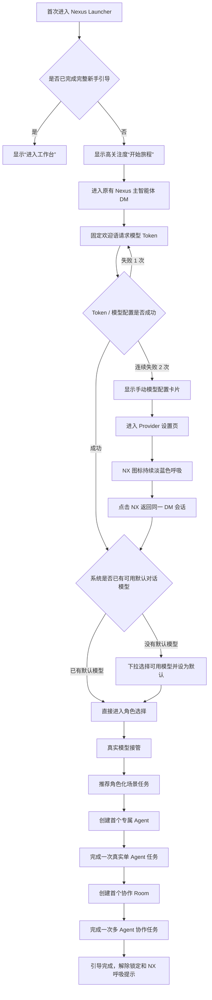
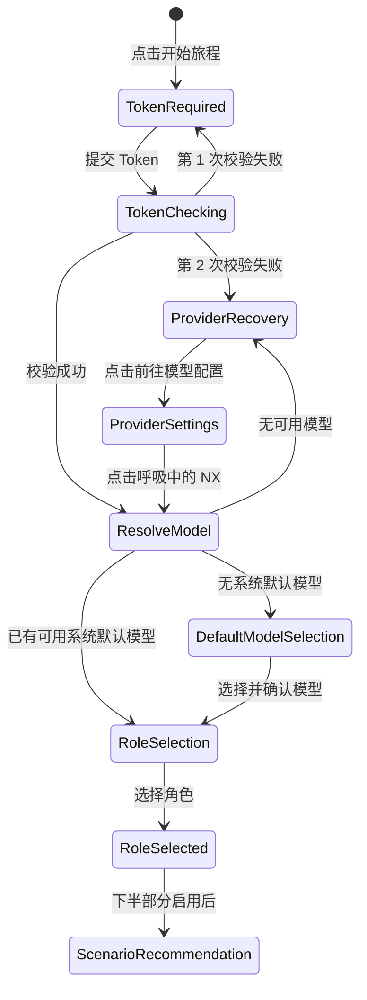
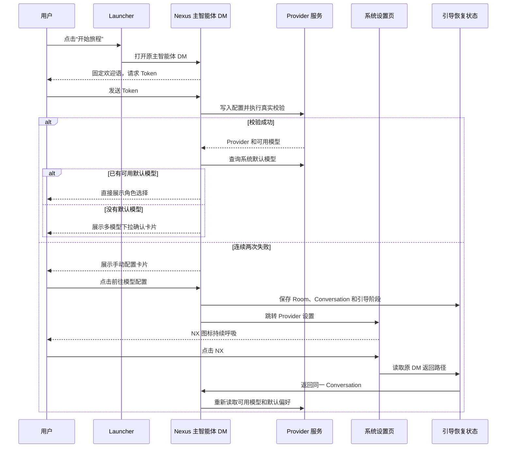
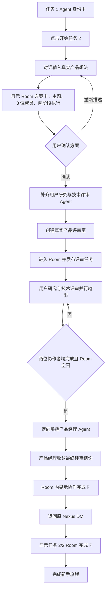
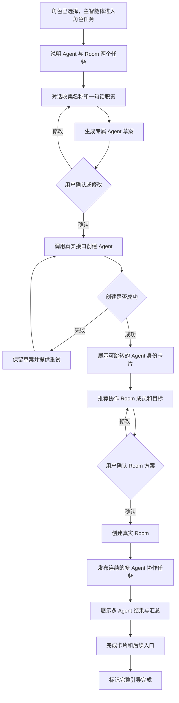
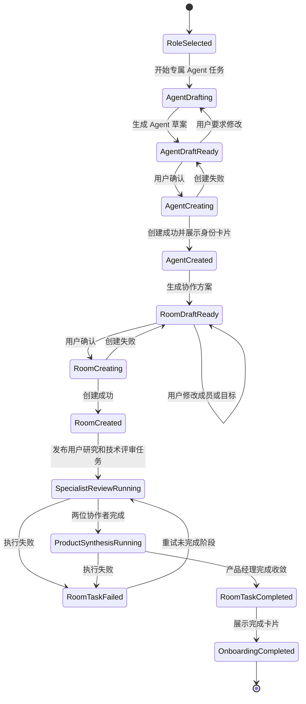

# Nexus 主智能体沉浸式新手引导 PRD

## 0. 文档信息

| 项目 | 内容 |
| --- | --- |
| 文档状态 | Draft v1.1 |
| 产品范围 | Nexus Launcher、Nexus 主智能体 DM、模型设置、角色化场景任务 |
| 上半部分 | 模型接入、跨页面恢复、默认模型确认、角色选择；当前已实现 |
| 下半部分 | 专属 Agent 创建已实现；产品经理“产品评审室”任务已实现；其余角色任务待评审后扩展 |
| 核心原则 | 使用 Nexus 原有主智能体和原有 DM 消息流，不创建独立 Home Agent 或独立会话协议 |

## 1. 一句话定义

将 Nexus 主智能体从一个“用户感知弱的聊天入口”升级为首页超级入口和首次使用向导：用户在同一条主智能体 DM 消息流里完成模型配置、角色识别、能力体验和首个真实任务，从而理解“遇到系统配置、操作指引或通用任务，都可以先找 Nexus 主智能体”。

## 2. 需求背景

### 2.1 痛点一：用户对 Nexus 主智能体的感知弱

Nexus 登录后的首页原本已经提供输入框。用户从该输入框发送消息后，会进入 Nexus 主智能体的标准 DM 页面。这个主智能体理论上可以承接：

- 系统配置问题；
- Nexus 操作与功能指引；
- Agent、Room、Provider 等平台对象的创建和管理；
- 通用知识工作和任务编排。

但现有体验没有清晰传达这项能力。用户进入首页后，注意力更容易被“进入工作台”吸引，通常直接进入工作台，不会在首页停留，也不知道首页输入框背后是一个能够处理系统级问题的 Nexus 主智能体。

结果是：

- 用户把 Nexus 主智能体理解成普通聊天框，而不是系统超级入口；
- 遇到配置问题时，用户倾向于自己寻找设置页面；
- 用户没有建立“有问题先问 Nexus”的产品心智；
- 首页没有承担产品能力发现和用户激活的职责。

### 2.2 痛点二：首次使用缺乏沉浸式、连续的引导动线

新用户要正常使用 Nexus，至少需要完成模型 Provider、Token、可用模型和默认对话模型等配置。原有配置路径存在以下问题：

- 配置步骤多，页面切换和点击次数多；
- 新用户不理解 Provider、模型启用和默认模型之间的关系；
- 页面级卡片导览只能介绍区域，不能帮助用户真正完成任务；
- 配置失败后缺少恢复路径；
- 从设置页返回后容易丢失上下文或进入新的 DM 会话；
- 引导与真实产品操作分离，完成引导后用户依然不知道如何使用主智能体。

结果是首次使用成本高、配置中断率高、时间到价值较长。

## 3. 上下文复盘与关键产品决策

本需求经过多轮体验校准，形成了以下稳定决策：

1. **不新建 Home Agent。** 引导必须嵌入 Nexus 原有主智能体 DM，继续使用标准 Room、Conversation 和 Session 语义。
2. **首页是入口，DM 是主流程。** 首次进入时，首页上半部分的“进入工作台”替换为“开始旅程”；点击后进入原有 Nexus 主智能体 DM。
3. **无模型阶段使用固定话术。** Token 校验通过前不能依赖尚未配置的模型，欢迎语、连接中、失败提示和恢复提示使用本地固定消息。
4. **模型可用后由真实模型接管。** 默认模型确认完成并进入角色阶段后，普通输入交给真实模型推理和执行。
5. **引导必须沉浸。** 引导过程中，除对话区域外的页面模糊并拦截点击，避免用户跳出流程。
6. **动效只服务当前焦点。** 仅最新一条 Agent DM 文本使用呼吸和浮动效果；当卡片是最新内容时，上一条文本停止呼吸。
7. **Token 消息必须按时间顺序显示。** 欢迎语在上，用户脱敏 Token 在下，校验结果随后出现。
8. **两次校验失败后提供人工恢复路径。** 第二次失败后展示模型配置说明卡片，并可跳转到 LLM Provider 设置页。
9. **跨页面不结束引导。** 前往设置页只暂停 DM 引导；NX 图标持续淡蓝色呼吸，点击后返回同一个 Room、Conversation 和引导阶段。
10. **系统默认模型优先。** 如果用户已在系统设置中选好可用的默认对话模型，返回 DM 后直接进入角色选择，不重复确认。
11. **没有系统默认时必须让用户选具体模型。** 一个 Provider 可能有多个可用模型，例如 DeepSeek Flash 和 Pro，因此确认卡片需要模型下拉框。
12. **产品文案不暴露固定厂商假设。** 开场文案不宣称自动接入某一个指定模型厂商。
13. **角色任务先设计、后实现。** 当前上半部分停在角色选择和真实模型接管；后续任务内容需先完成方案评审。

## 4. 产品目标

### 4.1 用户目标

- 在不理解 Nexus 配置结构的情况下完成可用模型接入；
- 知道 Nexus 主智能体能够处理系统配置和产品操作问题；
- 在一个连续的消息流中完成配置、选择角色并开始首个真实任务；
- 配置失败或跨页面操作后，能够无损恢复；
- 通过一次有结果的场景任务理解 Agent 和 Room 的价值。

### 4.2 业务目标

- 提升首次登录到“模型可用”的转化率；
- 降低模型配置的中断率和平均耗时；
- 提升 Nexus 主智能体入口的认知度和后续使用频率；
- 提升首次 Agent 创建率、首次 Room 创建率和首个任务完成率；
- 建立可扩展的角色化激活框架，为后续行业模板和场景推荐提供基础。

### 4.3 非目标

- 本期不重构 Provider 设置页本身；
- 不创建一套独立于 Nexus 主智能体的对话协议；
- 不在 Token 校验前调用真实模型；
- 不在 PRD 未评审前实现下半部分的具体角色任务；
- 不将所有系统设置都塞进同一张引导卡片；
- 不让模型自行决定关键状态迁移、配置写入和完成条件。

## 5. 需求价值

| 价值对象 | 价值 |
| --- | --- |
| 新用户 | 少理解概念、少找入口、少切页面，快速完成首次可用配置 |
| Nexus 主智能体 | 从弱感知聊天入口升级为系统级超级入口 |
| 产品体验 | 将“功能介绍”转化为“带用户完成真实任务” |
| 配置成功率 | 通过自动校验、明确错误和设置页恢复降低中断 |
| 长期留存 | 通过角色化任务更快形成与用户工作相关的价值感知 |
| 产品扩展性 | 角色、任务模板和完成里程碑可持续扩展，而无需重做入口 |

## 6. 整体用户旅程

## 7. 核心体验原则

### 7.1 Conversation First

所有引导反馈都优先表现为 Nexus 主智能体 DM 中的消息。卡片只用于有明确选项、确认或跳转的步骤，不把整个流程重新做成覆盖式表单。

### 7.2 固定状态机 + 模型生成

- 状态迁移、校验、配置写入、路由恢复、对象创建和完成条件由产品状态机控制；
- 解释、推荐、提问、任务内容和结果总结由真实模型生成；
- 模型不能仅凭自然语言声明“已经配置成功”或“已经创建对象”，必须以真实 API 结果为准。

### 7.3 原会话连续性

无论中间跳转多少设置页面，返回时都必须是原来的主智能体 Room、Conversation 和引导上下文，禁止默认创建新 Session。

### 7.4 单一视觉焦点

- 引导阶段只允许操作对话区域；
- 最新 Agent 消息可以呼吸；
- 最新内容是卡片时，卡片成为焦点，上一条文本停止呼吸；
- 同一时间不叠加多种高强度动效。

### 7.5 最小输入

每一步只询问完成当前任务必须的信息。角色化任务优先提供推荐值和可编辑草案，不要求用户在首次体验中填写完整配置表。

## 8. 上半部分：模型接入与角色识别

### 8.1 范围与实现状态

| 模块 | 状态 |
| --- | --- |
| Launcher “开始旅程”入口 | 已实现 |
| 进入原有 Nexus 主智能体 DM | 已实现 |
| 对话外区域模糊和点击拦截 | 已实现 |
| 固定欢迎语和 Token 输入 | 已实现 |
| Token 脱敏展示和顺序修正 | 已实现 |
| Token 连通性校验和模型启用 | 已实现 |
| 第二次失败后的 Provider 设置卡片 | 已实现 |
| 设置页 NX 呼吸提示 | 已实现 |
| 返回原 DM Conversation | 已实现 |
| 系统默认模型检测 | 已实现 |
| 多模型下拉选择 | 已实现 |
| 角色选择卡片 | 已实现 |
| 角色阶段后真实模型接管 | 已实现 |
| 角色化场景任务 | 未实现，见第 9 章 |

### 8.2 入口规则

#### FR-U-01 首次入口替换

- 当完整引导未完成时，Launcher 上半部分显示“开始旅程”；
- 按钮使用渐变、扫光、文字渐变和呼吸效果；
- 当完整引导完成后恢复普通“进入工作台”；
- 点击“开始旅程”进入 Nexus 原有主智能体 DM。

#### FR-U-02 原主智能体 DM

- 必须通过服务端下发的主智能体身份寻找目标；
- 必须进入标准 DM Room 和 Conversation；
- 不允许创建名为 Home Agent 的新对象；
- 不允许引入新会话协议。

### 8.3 沉浸式专注模式

#### FR-U-03 页面锁定

- 进入引导后，对话区域之外增加模糊遮罩；
- 遮罩必须拦截鼠标和触摸点击；
- 对话 Feed、引导卡片和 Composer 保持可用；
- 设置页作为必要的配置分支，不受 DM 遮罩覆盖。

#### FR-U-04 动效

- 只对最新一条 Agent DM 消息增加呼吸、轻浮动和光晕；
- 用户消息、历史 Agent 消息不持续动画；
- 如果 Provider 恢复卡片、默认模型卡片或角色卡片处于显示状态，上一条 Agent 文本不再呼吸；
- 遵循 `prefers-reduced-motion`，减少动态时关闭循环动画；
- 未完成引导时，左上角 NX 显示明显的淡蓝色呼吸效果。

### 8.4 Token 对话与校验

#### FR-U-05 固定欢迎语

无模型时由本地固定消息发出：

> 欢迎来到 Nexus。在开始旅程之前，请提供模型的 token。它会保存到你的 Nexus 模型配置中，用来完成后续的主页引导。

前台文案不得承诺接入某个指定模型厂商。

#### FR-U-06 Token 安全展示

- Token 用户消息必须出现在欢迎语之后；
- Feed 中只显示脱敏值，最多保留末尾四位；
- 原始 Token 不进入消息历史；
- 原始 Token 不进入埋点、控制台日志或错误文案；
- Token 仅用于 Provider 配置写入和连通性校验。

#### FR-U-07 校验过程

用户发送 Token 后：

1. 显示脱敏用户消息；
2. Agent 固定回复“正在验证、连接并启用模型”；
3. 创建或更新可管理的私有 LLM Provider；
4. 执行真实连通性测试；
5. 确认至少一个可用模型；
6. 启用 Provider 和可用模型；
7. 根据校验结果进入下一状态。

### 8.5 失败与手动恢复

#### FR-U-08 第一次失败

- 固定回复 Token 无法连接，请检查后重新发送；
- 用户仍停留在同一 Composer；
- 不跳转设置页；
- 清除失败配置中的原始 Token。

#### FR-U-09 第二次失败

第二次失败后在消息流底部显示卡片，卡片包括：

- 标题：连续两次校验未通过；
- 说明：可以前往 Nexus 模型配置页手动完成接入；
- 三步操作说明：
  1. 选择或新建 LLM Provider；
  2. 填写 API Token 和接口地址并保存；
  3. 同步并启用至少一个模型，再执行连通性测试；
- 主按钮：前往模型配置。

卡片显示时，上一条 Agent 文本停止呼吸。

### 8.6 跨页面恢复

#### FR-U-10 保存恢复点

跳转设置页前保存：

- 当前 Room ID；
- 当前 Conversation ID 或 Session Key；
- 引导阶段；
- 返回路径；
- 已选择的角色；
- 不保存原始 Token。

#### FR-U-11 NX 返回入口

- 引导未完成时，NX 图标在设置页持续淡蓝色呼吸；
- 点击 NX 优先读取引导返回路径；
- 返回原 Room 和原 Conversation；
- 不调用“创建新 DM Session”；
- 刷新同一 DM 路由后仍能恢复引导。

### 8.7 默认对话模型分支

#### FR-U-12 已有系统默认模型

系统同时读取：

- 当前可用 Provider / Model 列表；
- 用户偏好中的默认对话 Provider 和 Model。

如果默认 Provider 和 Model 均存在，且仍在可用模型列表中：

- 不展示“设为默认对话模型”确认卡片；
- Agent 回复“系统中已经有默认对话模型。下一步我们选择一下你的角色”；
- 直接进入角色卡片。

#### FR-U-13 没有系统默认模型

如果不存在可用的系统默认对话模型：

- 显示默认模型确认卡片；
- 卡片通过下拉框列出全部可用的 Provider / Model 组合；
- 选项显示格式为“Provider 展示名 / 模型展示名”；
- 一个 Provider 的多个模型必须分别显示，例如 DeepSeek Flash、DeepSeek Pro；
- 系统可预选 Provider 默认模型或第一个可用模型，但不能替用户直接写入偏好；
- 用户确认后才更新默认对话模型。

#### FR-U-14 没有可用模型

- Agent 明确回复尚未检测到可用模型；
- 保留或重新展示 Provider 设置卡片；
- 用户完成设置后再次点击 NX 重试；
- 不允许进入角色阶段。

### 8.8 角色选择

#### FR-U-15 角色卡片

默认模型就绪后，Agent 回复：

> 下一步我们选择一下你的角色。

角色选项：

- 学生；
- 产品经理；
- 研发；
- 运营；
- 解决方案及售前。

角色选择结果需持久化，用于后续任务推荐。

#### FR-U-16 模型接管

- 从角色阶段开始，普通对话输入由真实模型承接；
- 角色卡片和关键状态写入仍由产品状态机控制；
- 当前版本选择角色后只回复“已记录你的角色，具体引导任务将在方案确认后开始”；
- 当前版本不自动启动场景任务。

### 8.9 上半部分状态机

### 8.10 跨页面交互时序

### 8.11 上半部分异常处理

| 异常 | 产品行为 |
| --- | --- |
| Token 为空 | 不发送消息，不触发校验 |
| Token 格式明显异常 | 脱敏展示后返回固定错误 |
| Provider 创建失败 | 返回固定错误并允许重试 |
| 连通性测试失败 | 清除失败 Token，计入失败次数 |
| 模型同步为空 | 视为校验失败 |
| 设置页未启用模型 | 返回 DM 后提示仍未检测到可用模型 |
| 默认偏好指向已删除模型 | 视为“没有可用默认模型”，显示下拉卡片 |
| 设置默认模型 API 失败 | 卡片保留，Agent 提示稍后重试 |
| 返回路径丢失 | 回退到已有主智能体 DM，不创建重复主智能体 |
| 页面刷新 | 根据持久化恢复点恢复相同引导阶段 |
| 用户启用减少动态效果 | 停止循环呼吸和浮动动画 |

## 9. 下半部分：按角色进入场景任务

### 9.1 产品定位

下半部分不再是“告诉用户按钮在哪里”，而是让用户在主智能体陪伴下完成两个真实里程碑：

1. 通过主智能体的对话引导创建一个与自身角色相关的专属 Agent；
2. 创建一个与自身角色相关的协作 Room，并完成一次多 Agent 协作。

完成这两个里程碑后，用户应理解：

- 主智能体可以帮助配置和操作 Nexus；
- Agent 是可复用的专业执行者；
- Room 是多 Agent 协作空间；
- 首页和主智能体是后续任务的统一入口。

### 9.2 方案原则

#### 9.2.1 状态机控制里程碑

产品控制以下事实：

- 用户选择了哪个角色和场景；
- Agent 是否真实创建成功；
- 任务是否真实执行并返回结果；
- Room 是否真实创建成功；
- Room 成员是否加入；
- 协作任务是否完成；
- 引导是否可标记为完成。

#### 9.2.2 模型负责内容适配

模型负责：

- 根据角色解释推荐原因；
- 生成 Agent 名称、简介、指令和首个任务草案；
- 根据用户输入调整草案；
- 生成 Room 目标和协作任务；
- 对真实执行结果进行总结；
- 给出下一步可继续尝试的建议。

#### 9.2.3 卡片负责有限选择

卡片用于：

- 选择推荐场景；
- 确认或编辑 Agent 草案；
- 确认创建 Agent；
- 确认 Room 成员和目标；
- 确认启动任务；
- 展示完成里程碑。

开放式需求和补充信息继续通过 Composer 对话完成。

### 9.3 角色任务矩阵

| 角色 | 推荐场景 | 首个专属 Agent | 首个协作 Room | 多 Agent 示例任务 | 核心价值感知 |
| --- | --- | --- | --- | --- | --- |
| 学生 | 课程学习与资料整理 | 课程学习助教 | 小组作业协作室 | 研究、写作、审校 Agent 协作生成小组作业提纲 | 信息整理、学习规划、协作写作 |
| 产品经理 | 需求分析与产品评审 | 需求分析助手 | 产品评审室 | 用户研究、产品、研发视角共同评审 PRD 草案 | 需求结构化、跨角色评审 |
| 研发 | 代码理解与问题排查 | 代码分析助手 | Bug 排查战情室 | 开发、测试、运维 Agent 共同生成定位方案和回归清单 | 技术分析、多角色排障 |
| 运营 | 活动策划与内容生产 | 活动运营助手 | 活动作战室 | 内容、数据、用户运营 Agent 协作形成执行计划 | 内容生产、节奏规划、复盘 |
| 解决方案及售前 | 客户调研与方案输出 | 解决方案助手 | 客户方案评审室 | 行业研究、解决方案、交付 Agent 协作生成方案提纲和风险清单 | 需求洞察、方案协同、交付预判 |

### 9.3.1 产品经理角色：产品评审室（已实现）

产品经理的第二个任务不是演示性对话，而是围绕用户自己的产品想法完成一次真实的跨角色评审。

#### 最少输入

用户只需在 Nexus 主智能体 DM 中用 1～3 句话描述待评审的产品想法。输入至少应包含目标用户、待解决问题或设想能力中的一项；过短输入需要继续追问。

#### 固定协作阵容

| 成员 | 来源 | 职责 |
| --- | --- | --- |
| 产品经理 Agent | 任务 1 中由用户创建 | 读取两方意见，收敛范围、优先级、风险和验收标准 |
| 用户研究顾问 | 用户确认 Room 方案后自动补齐；已有同名 Agent 时复用 | 从目标用户、场景、痛点证据和待验证假设出发评审 |
| 技术可行性顾问 | 用户确认 Room 方案后自动补齐；已有同名 Agent 时复用 | 从可行性、依赖、成本和交付风险出发评审 |

选择固定阵容的原因是首次使用时用户通常只有任务 1 创建的一个 Agent。若要求用户先手动创建足够成员，会再次引入高配置成本。自动补齐只发生在用户确认 Room 方案之后，且创建的 Agent 和 Room 都是 Nexus 中可继续复用的真实对象。

#### 两阶段执行

1. **并行评审阶段**：系统在新 Room 中将同一产品想法明确投递给用户研究顾问和技术可行性顾问，两位 Agent 分别给出结论、关键风险和下一步建议；
2. **产品收敛阶段**：系统确认两位协作者均已完成且 Room 进入空闲态后，自动定向唤醒任务 1 创建的产品经理 Agent；
3. 产品经理 Agent 必须读取 Room 中已产生的两份意见，并按“用户问题与目标、需求范围、暂不纳入项、风险与验证、优先级与下一步、验收标准”输出最终结论；
4. 产品经理回复完成后，Room 消息流末尾展示“协作执行完成”卡片；
5. 用户点击卡片返回原 Nexus 主智能体 DM，看到“任务 2/2 已完成”的 Room 身份卡片；
6. 用户点击“完成新手旅程”后才解除页面锁定、NX 呼吸提示和引导恢复优先级。

#### 产品经理 Room 流程

### 9.4 推荐的统一任务结构

每个角色虽然内容不同，但使用相同的产品骨架：

#### 阶段 A：场景推荐

1. 模型读取角色；
2. 展示一个主推荐场景和最多两个备选场景；
3. 每个场景说明“你将完成什么”和“会学会 Nexus 的什么能力”；
4. 用户选择后进入最少信息收集。

#### 阶段 B：创建专属 Agent

1. 主智能体在原 DM 中逐步收集 Agent 名称和一句话核心职责；
2. 根据用户角色展示 2 至 3 个有限工作风格选项，并转换为身份标签；
3. 模型使用当前默认对话模型，权限沿用 Nexus 新建 Agent 的安全默认值，避免要求新手理解高级配置；
4. 汇总 Agent 草案：
   - 名称；
   - 一句话职责；
   - 工作风格标签；
   - 当前默认模型；
   - 默认权限；
5. 用户可确认创建，也可选择重新填写；
6. 状态机调用与联系人页相同的真实 Agent 创建接口；
7. 创建成功后，在原 DM 中展示“任务 1/2 已完成”的 Agent 身份卡片；
8. 整张身份卡片可点击，并跳转到 `/contacts?agent=<agent_id>` 对应的真实 Agent 身份页。

#### 阶段 C：创建协作 Room

1. 模型根据角色和已完成任务推荐 2 至 3 个协作成员；
2. 卡片展示成员、分工和 Room 目标；
3. 用户确认后调用真实 Room 创建接口；
4. 新建 Room 必须可在正常工作台中继续使用；
5. 不创建一次性演示假 Room。

#### 阶段 D：完成多 Agent 协作

1. 主智能体生成一个与前一步结果连续的协作任务；
2. 将任务发布到新 Room；
3. 各 Agent 按真实 Room 机制执行；
4. 用户看到多视角输出和最终汇总；
5. 记录“首个 Room 协作完成”里程碑。

#### 阶段 E：完成与交接

完成卡片包括：

- 已连接的默认模型；
- 已选择的角色；
- 已创建的 Agent；
- 已创建的 Room；
- 两次任务的结果入口；
- “回到首页继续提问”；
- “进入工作台”。

只有到达此阶段，才写入完整引导完成状态，并关闭：

- Launcher “开始旅程”；
- NX 呼吸提示；
- DM 外区域锁定；
- 自动恢复到引导会话的导航优先级。

### 9.5 下半部分流程图

### 9.6 下半部分状态机

### 9.7 模型 Prompt 契约建议

下半部分模型 Prompt 应包含结构化上下文：

- 当前引导阶段；
- 用户角色；
- 已选择场景；
- 已确认信息；
- 当前可调用的 Nexus 能力；
- 已创建对象的真实 ID；
- 本阶段允许和禁止的动作；
- 期望返回的结构化 UI 意图。

模型不得：

- 虚构 Agent 或 Room 已经创建；
- 在用户确认前创建对象；
- 自行跳过失败状态；
- 输出或复述 Token；
- 在完成条件未满足时声明引导完成；
- 未经状态机授权启动下一阶段。

### 9.8 下半部分异常与恢复

| 异常 | 恢复策略 |
| --- | --- |
| 模型回复失败 | 保留阶段和用户输入，允许原地重试 |
| Agent 创建失败 | 保留 Agent 草案，不重新提问 |
| Room 创建失败 | 保留成员和目标选择 |
| 某个推荐 Agent 不可用 | 状态机移除并让模型提供替代成员 |
| 用户刷新页面 | 从最近成功里程碑恢复 |
| 用户返回设置页 | NX 继续提示，返回原 Conversation |
| 真实任务执行时间较长 | 展示运行状态，不重复创建任务 |
| 用户输入偏离当前任务 | 模型先回答必要问题，再明确提示继续当前步骤 |

## 10. 完整引导状态与数据模型

### 10.1 建议状态字段

| 字段 | 说明 |
| --- | --- |
| `onboarding_version` | 引导版本，用于升级和兼容 |
| `stage` | 当前状态机阶段 |
| `room_id` | 主智能体 DM Room |
| `conversation_id` | 原 DM Conversation |
| `return_path` | 设置页返回路径 |
| `validation_failure_count` | Token 校验失败次数 |
| `selected_provider` | 已选默认 Provider |
| `selected_model` | 已选默认模型 |
| `role` | 用户角色 |
| `scenario_id` | 已选角色场景 |
| `created_agent_id` | 引导创建的 Agent |
| `agent_task_round_id` | 首个单 Agent 任务 |
| `created_room_id` | 引导创建的协作 Room |
| `room_task_round_id` | 首个 Room 协作任务 |
| `completed_milestones` | 已完成里程碑集合 |
| `completed_at` | 完整引导完成时间 |

### 10.2 持久化原则

- Token 不进入前端引导状态；
- Token 只进入受保护的 Provider 配置；
- 前端本地状态只保存阶段、返回路径、角色和必要恢复信息；
- Agent、Room、任务和完成状态应逐步迁移到服务端持久化，避免跨设备丢失；
- 状态迁移必须幂等，刷新或重复点击不能创建重复对象。

## 11. 文案规范

### 11.1 语气

- 像一个正在陪用户完成任务的系统助手；
- 简洁、明确、一步一问；
- 不堆叠 Provider、Runtime 等技术术语；
- 错误文案说明下一步动作，不只说明失败；
- 不向用户承诺未经校验的具体模型厂商。

### 11.2 关键固定文案

| 场景 | 文案 |
| --- | --- |
| 欢迎 | 欢迎来到 Nexus。在开始旅程之前，请提供模型的 token。它会保存到你的 Nexus 模型配置中，用来完成后续的主页引导。 |
| 校验中 | 收到，我正在验证 token、连接模型并启用可用模型，请稍等一下。 |
| 校验失败 | 这个 token 暂时无法连接模型。请检查后重新发送，我会继续帮你完成配置。 |
| 已有默认模型 | 系统中已经有默认对话模型。下一步我们选择一下你的角色。 |
| 设置默认模型成功 | 模型已设为默认对话模型。下一步我们选择一下你的角色。 |
| 无可用模型 | 我还没有检测到可用模型。请完成模型配置后，点击左上角 NX 回到这里。 |

## 12. 数据埋点与成功指标

### 12.1 核心漏斗

1. 首次展示“开始旅程”；
2. 点击“开始旅程”；
3. 到达主智能体 DM；
4. 首次提交 Token；
5. 模型接入成功；
6. 进入手动配置；
7. 从设置页成功返回；
8. 默认模型就绪；
9. 角色选择完成；
10. 场景选择完成；
11. Agent 创建完成；
12. 首个 Agent 任务完成；
13. Room 创建完成；
14. 首个 Room 任务完成；
15. 完整引导完成。

### 12.2 建议事件

| 事件 | 关键属性 |
| --- | --- |
| `onboarding_entry_viewed` | onboarding_version |
| `onboarding_started` | source |
| `onboarding_token_submitted` | attempt_index；不得包含 Token |
| `onboarding_token_validation_result` | success、error_category、duration_ms |
| `onboarding_provider_recovery_opened` | failure_count |
| `onboarding_returned_from_settings` | model_count、has_default_model |
| `onboarding_default_model_selected` | provider、model |
| `onboarding_role_selected` | role |
| `onboarding_scenario_selected` | role、scenario_id |
| `onboarding_agent_created` | role、scenario_id、success |
| `onboarding_agent_task_completed` | scenario_id、duration_ms、success |
| `onboarding_room_created` | scenario_id、member_count、success |
| `onboarding_room_task_completed` | scenario_id、duration_ms、success |
| `onboarding_completed` | total_duration_ms、manual_provider_recovery |

### 12.3 指标

- “开始旅程”点击率；
- 模型接入成功率；
- 自动接入与手动恢复占比；
- 设置页返回成功率；
- 平均模型配置耗时；
- 默认模型就绪率；
- 角色选择率；
- Agent 创建率；
- 首个真实任务完成率；
- Room 创建率；
- 完整引导完成率；
- 引导完成后 7 日内主智能体 DM 使用率。

具体数值目标需在获得现有基线后确定，PRD 不直接假设无数据支持的目标值。

## 13. 验收标准

### 13.1 上半部分

1. 首次用户看到“开始旅程”，完成用户看到“进入工作台”；
2. 点击后进入原 Nexus 主智能体 DM；
3. 欢迎语、脱敏 Token、校验结果顺序正确；
4. 引导过程中对话区域外不可点击；
5. 只有最新 Agent 文本呼吸，卡片显示时上一条文本不呼吸；
6. 连续两次失败后显示手动配置卡片；
7. 设置页 NX 明显呼吸；
8. 点击 NX 返回原 Room 和 Conversation；
9. 已有可用默认对话模型时跳过确认；
10. 没有默认模型时下拉框列出全部可用模型；
11. 选择模型并确认后真实更新用户默认偏好；
12. 角色卡片包含五个指定角色；
13. 角色阶段后普通输入由真实模型处理；
14. Token 不出现在消息历史、日志和埋点中；
15. 刷新后可以恢复当前引导阶段。

### 13.2 下半部分

1. 每个角色至少有一个经过评审的推荐场景；
2. 模型只收集 1 至 3 个必要输入；
3. Agent 和 Room 必须通过真实接口创建；
4. 重试不能重复创建同一对象；
5. 单 Agent 和 Room 任务必须返回真实结果；
6. 失败后保留草案和最近成功里程碑；
7. 两个真实任务完成前不得标记完整引导完成；
8. 完成后 NX 呼吸、页面锁定和恢复优先级全部解除；
9. 完成卡片中的 Agent、Room 和结果入口均可访问；
10. 后续从 Launcher 或主智能体 DM 可继续发起普通任务。

## 14. 风险与应对

| 风险 | 影响 | 应对 |
| --- | --- | --- |
| 前台文案厂商无关，但自动适配能力不足 | 用户提交不兼容 Token 时失败 | 快速失败、明确错误、第二次失败进入手动配置；后续增加 Provider 识别策略 |
| 强制沉浸导致用户受困 | 用户无法完成配置时挫败 | 所有失败状态必须提供可行动的恢复路径，恢复点可刷新重试 |
| 模型生成不可控 | 跳步、虚构创建结果 | 状态机掌握真实写操作和完成条件 |
| 跨页面状态只存本地 | 跨设备无法恢复 | 下半部分前迁移为服务端 Onboarding Session |
| 多模型选择复杂 | 用户不理解 Flash / Pro 差异 | 下拉项后续增加简短模型说明和推荐标记 |
| 示例任务太重 | 首次体验时间过长 | 单 Agent 任务限制为可在短时间内完成的最小成果 |
| Room 任务等待时间长 | 用户误以为卡死 | 展示真实运行状态、超时恢复和后台完成提示 |

## 15. 迭代计划

### Phase 1：配置与角色识别

当前已实现：

- Launcher 入口；
- 主智能体 DM 固定引导；
- 模型配置、失败恢复和跨页面返回；
- 默认模型分支；
- 角色选择；
- 真实模型接管。

### Phase 2：角色任务方案评审

本 PRD 建议先完成：

- 五类角色的场景文案；
- 每个场景的必要输入；
- Agent 模板；
- Room 成员模板；
- 单 Agent 和 Room 任务完成标准；
- 模型 Prompt 契约；
- 是否允许暂停或跳过的产品规则。

### Phase 3：首个专属 Agent

- 实现场景推荐；
- Agent 草案卡片；
- 真实 Agent 创建；
- 首个任务执行；
- 里程碑恢复。

### Phase 4：首个协作 Room

- 产品经理 Room 草案卡片、成员和目标确认、真实 Room 创建、两阶段多 Agent 评审、完成卡片和完整引导交接已实现；
- 学生、研发、运营、解决方案及售前继续复用同一状态骨架，待各自任务内容评审后扩展。

## 16. 待确认事项

以下决策应在下半部分开发前完成产品评审：

1. 五个角色的主推荐场景是否采用第 9.3 节方案；
2. 每个角色是否提供一个主场景，还是一个主场景加两个备选；
3. 用户选择角色后是否允许重新选择；
4. Agent 草案允许编辑哪些字段；
5. 其他角色的 Room 成员是否沿用产品经理方案的“首次固定推荐、确认后自动补齐”；
6. 首个任务是否允许上传文件或读取工作区；
7. 引导是否允许“稍后继续”，以及入口放在何处；
8. 完整引导的最低完成条件是否必须同时包含 Agent 和 Room；
9. 角色和场景是否同步到服务端用户画像；
10. 多模型下拉框是否需要价格、速度、上下文窗口和推荐标签。

## 17. 推荐的下一步评审顺序

1. 先确认五类角色各自的主推荐场景；
2. 再确认每个场景的首个 Agent、首个任务和首个 Room；
3. 定义每一步最少需要用户提供的信息；
4. 确认模型 Prompt 和状态机边界；
5. 评审卡片交互和固定文案；
6. 最后进入下半部分实现。
